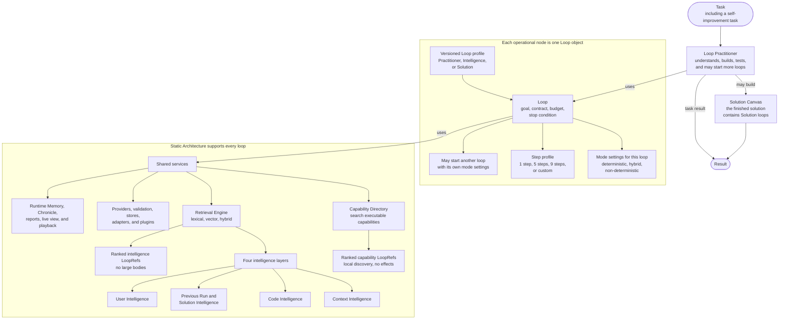

# Building with Loops

Loop Engine turns a task into an inspectable solution built and run by loops.
Everything that performs work is a loop. Each loop is a node with its own goal,
mode settings, step profile, budget, contract, and stop condition.

## System at a glance



The diagram has five architectural parts:

| Part | Responsibility |
|---|---|
| Loop | Runs one bounded operational node. |
| Loop Practitioner | Uses loops to understand, build, test, and improve work. |
| Solution Canvas | Describes the Solution loops that run a finished solution. |
| Static Architecture | Provides shared search, providers, adapters, stores, validation, history, and viewing tools. |
| Intelligence Library | Organizes reusable context, code, prior work, solutions, and user guidance in four layers. |

Self-improvement is not a sixth architectural part. It is a task given to the
Loop Practitioner. The Practitioner reviews history and intelligence, then
stages proposed changes for a separate review.

A Loop profile classifies the work performed by one Loop object. The top
profile branches are Practitioner, Intelligence, and Solution. Intelligence
profiles govern loops that search, serve, frame, load, replay, or compare an
intelligence item. They do not replace the four intelligence layers.

The profile purpose, step profile, run mode, effort, and model thinking power
remain separate settings. Read the
[versioned Loop profile ontology](docs/components/loop-object/LOOP-PROFILE-ONTOLOGY.md).

## Each loop has its own mode settings

| Mode | Meaning |
|---|---|
| Deterministic | Uses code, rules, calculations, and search. It does not call a language model. |
| Hybrid | Uses code first and may call a language model for a specific unresolved step. |
| Non-deterministic | A language model leads the step while the loop controls tools, limits, logging, and verification. |

Mode belongs to the loop that performs the work. It is not copied from the
loop that started it.

- A deterministic loop can start a non-deterministic research loop.
- A non-deterministic planning loop can start a deterministic validation loop.
- A hybrid loop can start deterministic, hybrid, and non-deterministic loops.

Operating policy still controls which modes a loop may delegate. A mode change
does not grant new network, secret, file-write, model, or spending permission.

Read [The Loop object and step profiles](docs/components/loop-object/) for the
configuration fields and examples.

## Loop Practitioner and Solution Canvas

The Loop Practitioner shows how work is built. It can start research, review,
tool, repair, and verification loops. Its run history forms a loop tree.

The Solution Canvas shows what runs for a new input. Each Canvas component is a
Solution loop with a declared operation, mode, contract, and fallback.

The current in-process Canvas runner executes components through deterministic
loops. Separate hybrid and non-deterministic Canvas adapters are not shipped.

The Practitioner tree and Solution Canvas answer different questions:

```text
Practitioner tree: How did we build and test this?
Solution Canvas:   What runs now?
```

- [Loop Practitioner](docs/components/practitioner/)
- [Solution Canvas](docs/components/solution-canvas/)
- [Self-improvement as a Practitioner task](docs/components/self-improvement/)

## Four intelligence layers

| Layer | What belongs here |
|---|---|
| Context Intelligence | Questions, methods, role perspectives, checklists, prompt patterns, examples, warnings, and output contracts. |
| Code Intelligence | Functions, packages, repositories, tools, services, workflows, notebooks, datasets, and large systems. |
| Previous Run and Solution Intelligence | Saved runs, loop trees, decisions, failures, repairs, measurements, comparisons, and reusable solutions. |
| User Intelligence | Advice, corrections, sources, package suggestions, priorities, constraints, approvals, and vetoes supplied by a person. |

Each layer has a dedicated guide:

- [Context Intelligence ontology](docs/components/intelligence-layers/CONTEXT-HIERARCHY.md)
- [Code Intelligence templates](docs/components/intelligence-layers/CODE-INTELLIGENCE-TEMPLATES.md)
- [Previous Run and Solution Intelligence](docs/components/intelligence-layers/PREVIOUS-RUN-AND-SOLUTION-INTELLIGENCE.md)
- [User Intelligence](docs/components/intelligence-layers/USER-INTELLIGENCE.md)

Runtime Memory is separate. It holds temporary notes for the current run and
does not automatically become persistent intelligence.

## Search returns loops

The Retrieval Engine searches the four intelligence layers. The Capability
Directory searches local Static Architecture handshake cards.

```text
need
  -> search loop
  -> ranked LoopRefs without large bodies
  -> select one reference
  -> materialization loop verifies the locator and digest
  -> optional execution or model-reframing loop
  -> return to the parent loop
```

Discovery does not load a repository, read a secret, or make a network call.
Effects begin only after a loop selects and invokes a reference.

Read [Intelligence is returned through loops](docs/components/intelligence-layers/INTELLIGENCE-AS-LOOPS.md).

## Static Architecture and provider status

Static Architecture contains shared services that loops call instead of
rebuilding them for each task.

| Area | Current extension path |
|---|---|
| Model providers | Ollama Cloud, Mistral, OpenRouter, and registered custom OpenAI-compatible or Ollama endpoints. |
| Executable capabilities | Typed `CapabilityHandshake` and `Endpoint` registration. |
| Retrieval | Selectable SQLite FTS5, LanceDB, deterministic hash, and model2vec backends. |
| External search | Manually registered Brave Web Search plugin example. |
| Loop step profiles | Registered and validated Loop Templates. |
| Storage and viewing | Store adapters, Chronicle, reports, live event stream, and Studio playback. |

`ModelGateway` is the common invocation path for strict reasoning, configured
advice, legacy model resolvers, and provider-pinned calls. It supports ordered
failover and provider-specific comparison arms. Every physical provider attempt
runs as its own model loop.

- [Static Architecture and extensions](docs/components/static-architecture/)
- [Providers and keys](docs/guides/providers-and-keys.md)
- [Runtime settings and model tiers](docs/guides/settings.md)
- [Model gateway and provider configuration](docs/components/static-architecture/MODEL-GATEWAY.md)
- [Custom endpoints](docs/guides/custom-endpoints.md)
- [Search and storage choices](docs/components/static-architecture/SEARCH-AND-STORAGE.md)
- [Brave Search plugin](docs/components/static-architecture/BRAVE-SEARCH-PLUGIN.md)

## Install from GitHub

```bash
python -m pip install "git+https://github.com/alisonjieli-png/loop-engine.git"
```

Python 3.10 or newer is required. One install includes the runtime and every
supported adapter.

## Run useful examples

Installed examples:

```bash
loop-engine --example support-queue
loop-engine --example intelligence-layers
loop-engine --example context-seed
```

Repository examples:

```bash
python3 examples/01_prioritize_support_queue/run.py
python3 examples/09_search_the_intelligence_layers/run.py
python3 examples/12_wrap_a_large_codebase/run.py
python3 examples/13_brave_search_plugin/run.py
```

The repository contains fifteen numbered example folders. Every folder has a
`README.md` and runnable `run.py`.

[Browse the examples](examples/README.md).

## Watch and play back a run

Run a fixed local demonstration and save its Chronicle:

```bash
loop-engine --live-demo --port 8770 --runs-dir "$HOME/.loop-engine/runs"
```

Open `http://127.0.0.1:8770` while it runs. Then start Studio on the same run
directory:

```bash
loop-engine --studio --port 8765 --runs-dir "$HOME/.loop-engine/runs"
```

Studio shows the loop tree, event playback, model calls, intelligence, solution
records, and staged improvements at `http://127.0.0.1:8765/app`.

The CLI also provides a five-problem campaign:

```bash
loop-engine campaign plan
loop-engine campaign run --modes deterministic --watch
```

Provider-backed arms require explicit model-call authorization and a physical
call ceiling. Read [Five-problem campaign](docs/guides/campaigns.md).

The [benchmark candidate registry](docs/benchmarks/) catalogs 144 potential
tracks across ten task families. They have not been run. Each track must pass
source, license, evaluator, cost, and contamination checks before comparison.

Create one optional YAML settings file for loop defaults, search backends,
providers, model thinking power, bounded escalation, and saved run history:

```bash
loop-engine settings init
loop-engine settings check
```

## Documentation

1. [Component guide](docs/components/)
2. [Getting started](docs/getting-started.md)
3. [Loops and modes](docs/guides/loops-and-modes.md)
4. [Runtime settings and model tiers](docs/guides/settings.md)
5. [Reports, live viewing, and playback](docs/guides/reports.md)
6. [Architecture](docs/architecture/)
7. [Reference](docs/reference/)

## Verify the installation

```bash
python -m loop_engine --self-test
python -m loop_engine --conformance
python -m loop_engine --map
loop-engine --profiles
```

Loop Engine is alpha software. One successful task is not a general success
rate. MIT license. See [LICENSE](LICENSE).
