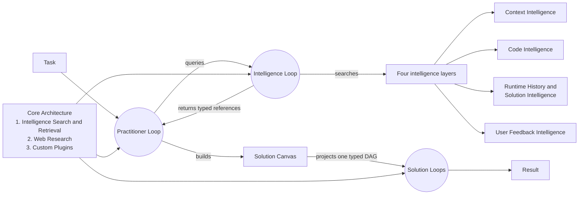

# Building with Loops

Loop Engine turns a task into a typed graph of loops. Every executable graph
vertex is a `Loop`. Practitioner, Intelligence, and Solution describe what a
Loop does. They do not create separate runtimes.

Each Loop carries an immutable `LoopDefinition` with a semantic version and a
content digest. The definition binds the role profile, mode support, typed
input and output roles, step profile, loop condition, exit condition,
permissions, effects, and required capabilities.

## Get started in five minutes

Install the current main branch, verify the package, and run the deterministic
no-key demonstration:

```bash
python -m pip install "git+https://github.com/alisonjieli-png/loop-engine.git@main"
loop-engine doctor
loop-engine --demo five-step --runs-dir ./loop-engine-runs
loop-engine --studio --runs-dir ./loop-engine-runs
```

The demonstration preserves and compiles a structured task, executes and
verifies a real deterministic Solution graph, saves Run History, and stages a
learning candidate. Staging is not promotion. Independent review and a
separate promotion decision are still required.

Inspect configured model routes without making a provider call:

```bash
loop-engine models inventory
```

### Optional model-provider setup

Choose one provider. Keep the key in your shell environment; Loop Engine
stores only the environment-variable name in settings.

```bash
# Ollama Cloud
export OLLAMA_API_KEY="your-key"

# Or OpenRouter
export OPENROUTER_API_KEY="your-key"

loop-engine settings init --settings-file ./loop-engine.yaml
loop-engine settings check --settings-file ./loop-engine.yaml
loop-engine models inventory --settings-file ./loop-engine.yaml
```

Ollama Cloud is not a local Ollama server. Local Ollama, vLLM, SGLang, LM
Studio, llama.cpp, and similar servers use a custom endpoint entry. See
[Providers and keys](docs/guides/providers-and-keys.md) and the checked-in
[`loop-engine.settings.example.yaml`](loop-engine.settings.example.yaml).

OpenCode CLI credentials are configured in OpenCode itself. Run OpenCode,
enter `/connect`, select OpenCode Go, OpenCode Zen, OpenRouter, or another
provider, and paste the provider key. OpenCode stores that connection in its
own credential file. Loop Engine does not define or serialize an
`OPENCODE_API_KEY`. Its optional OpenCode harness adapter launches the already
configured CLI. See [OpenCode provider setup](https://opencode.ai/docs/providers/).

### Compile the flagship modeling request

Use this command to inspect how Loop Engine understands a larger request:

```bash
loop-engine task compile --text \
  "Download an authorized public dataset. Train a linear model, tree model, boosted-tree model, and MLP on identical validation folds to predict the target variable. Compare them honestly and produce verified PDF and HTML reports."
```

This command compiles the request. It does not run the modeling job.

The compiler preserves the original text and binds it to the registered
tabular model-comparison template. The request deliberately leaves the dataset
and target open. Loop Engine records both as delegated choices, with explicit
source, license, access, dataset, and target constraints. It does not invent a
dataset name or ask an unnecessary question.

Loop Engine does not yet download the dataset, train the models, compare them,
or render the reports. That full workflow remains an acceptance target. Its
Orient step must search approved candidates, apply the recorded constraints,
and save a typed resolution decision. If no candidate passes, the Loop must
ask for more information or abstain. A model suggestion by itself is not an
accepted selection.

Use autonomous interaction mode when the run must not pause for questions:

```bash
loop-engine task compile --interaction-mode autonomous --text \
  "Train and compare several supervised prediction models."
```

Autonomous mode uses a registered delegated-choice policy where one exists. A
non-delegable missing fact returns `abstain_required` instead of waiting or
inventing a value. This mode does not grant network access, model access,
spending, or permission for external effects.

Feedback is optional. Supply a registered slot only when you care about that
choice:

```bash
loop-engine task compile --interaction-mode autonomous \
  --task-feedback task.preference.dataset_source=openml:61 \
  --text "Train and compare several supervised prediction models."
```

Without that feedback, the dataset remains a constrained delegated choice. See
[five text-only compilation examples](examples/20_compile_text_tasks/) for
ready, clarification, and terminal-abstention behavior.

## System at a glance



Self-improvement uses the same Practitioner role. A self-improvement task
reviews a bounded set of saved runs and intelligence, then stages candidates
for independent review. It is not a separate architecture system and cannot
approve its own candidates.

## One Loop contract

```text
Loop
├── LoopDefinition
│   ├── definition ID, semantic version, and content digest
│   ├── exact registered role profile and version
│   ├── typed input and output roles
│   ├── supported modes and installed mode executors
│   ├── step profile
│   ├── loop condition and exit condition
│   ├── configuration facts
│   └── permissions, effects, and required capabilities
├── LoopRuntimeContext
│   ├── Intelligence Search and Retrieval port
│   ├── Web Research port
│   ├── Custom Plugins port
│   └── internal runtime mechanics
├── one relationship to the active graph
└── ordered Run History events
```

`LoopStartRequest` supplies the goal, complete definition, relationship,
least-authority runtime context, and event log in one object. A Loop refuses
to start when its definition is invalid, its digest changed, its profile is
not registered, or its required capabilities, permissions, or executors are
missing.

## Roles, profiles, and relationships

Role, profile, relationship, and mode are independent fields.

```text
Registered role profiles
├── Practitioner
│   ├── practitioner.reference_nine_step
│   ├── practitioner.compact_five_step
│   ├── practitioner.research
│   ├── practitioner.solver
│   ├── practitioner.verifier
│   ├── practitioner.self_improvement
│   └── practitioner.code_execution
├── Intelligence
│   ├── intelligence.search
│   ├── intelligence.materialize
│   ├── Context Intelligence
│   │   ├── intelligence.context.serve
│   │   ├── intelligence.context.search
│   │   └── intelligence.context.frame
│   ├── Code Intelligence
│   │   ├── intelligence.code.resolve
│   │   ├── intelligence.code.invoke
│   │   └── intelligence.code.package
│   ├── Runtime History and Solution Intelligence
│   │   ├── intelligence.runtime_history_solution.search
│   │   ├── intelligence.runtime_history_solution.replay
│   │   └── intelligence.runtime_history_solution.compare
│   └── User Feedback Intelligence
│       ├── intelligence.user_feedback.serve
│       ├── intelligence.user_feedback.scope
│       └── intelligence.user_feedback.interpret
└── Solution
    ├── solution.atomic_component
    ├── solution.pipeline
    ├── solution.router_fallback
    ├── solution.ensemble
    └── solution.validator
```

The active relationship says how a Loop entered a graph:

- `STARTING`: no incoming Loop relationship.
- `SPAWNED_BY`: another Loop created bounded work dynamically.
- `QUERIED_BY`: another Loop sent an Intelligence query.
- `RETRIEVED_BY`: an Intelligence query selected this item.
- `CONNECTED_FROM`: a typed DAG edge supplied input from another Loop.

A deterministic Practitioner may spawn a non-deterministic Practitioner. A
non-deterministic Practitioner may spawn a deterministic verifier. Each Loop
selects its own permitted mode and receives its own restricted runtime context.

## Three run modes

| Mode | How the Loop runs |
|---|---|
| `deterministic` | Code, rules, calculations, retrieval, or execution lead the work. No language model is called. |
| `hybrid` | Code leads. A language model may resolve a bounded semantic step. |
| `non_deterministic` | A language model leads the semantic work. Loop Engine still controls tools, permissions, budgets, event logging, and verification. |

A mode label is not enough. The selected mode must have an installed executor.
The runtime fails before work when that executor is missing. Mode never grants
file, network, secret, model, spending, or external-effect permission.

## One authoritative graph

`LoopGraphDefinition` is the authoritative static DAG contract. It contains
versioned `LoopDefinition` references, explicit vertices, typed edges, graph
inputs and outputs, groups, and a graph digest. Validation rejects cycles,
unresolved definitions, digest changes, incompatible ports, undeclared
adapters, invalid relationships, and unsupported modes.

Practitioner work also forms a graph. That graph is dynamic: Run History
records Starting, Spawned by, Queried by, and Retrieved by relationships as
the work happens. A reusable Solution graph is static and validated before it
runs. Both views contain Loops as their only executable vertices.

`SolutionSpec` and `Canvas` are builders and projections. They do not define a
second runtime or a second graph authority. Every selected Canvas candidate
resolves to a complete Solution `LoopDefinition` before execution.

The in-process Solution runner uses the shared deterministic, hybrid, and
non-deterministic mode contract. Model-using leaves require an installed
gateway-backed executor and explicit model-call authority. Missing authority or
an unavailable executor produces a typed failure and never changes mode
silently.

## Intelligence is loop work

The four persistent layers are:

1. Context Intelligence
2. Code Intelligence
3. Runtime History and Solution Intelligence
4. User Feedback Intelligence

Searching, selecting, materializing, framing, invoking, replaying, comparing,
and interpreting intelligence all run through registered Intelligence Loop
profiles. Search returns small typed `LoopRef` objects. A selected item is
loaded only after its reference, digest, contract, and permissions pass.

Runtime Memory is temporary and belongs to one run. Markdown, skills,
repositories, packages, transcripts, and vector rows are source formats, not
new intelligence layers. Imported or generated items remain candidates until
an independent review accepts them.

## Core Architecture

Core Architecture exposes exactly three public capability groups:

| Group | Purpose |
|---|---|
| Intelligence Search and Retrieval | Search, rank, select, and materialize records from the four intelligence layers. |
| Web Research | Discover, fetch, inspect, and verify permitted external sources. |
| Custom Plugins | Discover and invoke registered capabilities through typed handshakes. |

Providers, model routing, settings, workspaces, approvals, stores, Runtime
Memory, event storage, reports, playback, MCP adapters, skill adapters, and
OpenTelemetry export are internal runtime mechanics. They support Loop work.
They are not extra public architecture groups or executable graph vertices.

## Install and run

Install directly from GitHub:

```bash
python -m pip install "git+https://github.com/alisonjieli-png/loop-engine.git"
```

Python 3.10 or newer is required.

Run useful installed examples:

```bash
loop-engine --example support-queue
loop-engine --example intelligence-layers
loop-engine --example context-seed
```

Run repository examples:

```bash
python3 examples/01_prioritize_support_queue/run.py
python3 examples/09_search_the_intelligence_layers/run.py
python3 examples/10_validate_customer_import/run.py
python3 examples/12_wrap_a_large_codebase/run.py
```

 [Browse all examples](examples/README.md). Each numbered folder contains a
runnable `run.py` and a short `README.md`.

## The five-step product demo

After installation, one command demonstrates configuration readback, compile,
solve, verification, saved history, and candidate staging:

```bash
loop-engine --demo five-step --runs-dir ./loop-engine-runs
```

Or run each step separately:

```bash
loop-engine --self-test                      # 1. verify the install
loop-engine setup                            # 2. configure settings
loop-engine --task-compile --text "..."      # 3. compile text into a typed task
loop-engine --solve --text "..."             # 4. solve it through a Loop
loop-engine learn --lesson "state the evidence-bounded reusable lesson" \
  --runs-dir ./loop-engine-runs              # 5. stage one candidate
loop-engine --candidates                     # list staged candidates
loop-engine --templates                      # list registered task templates
```

Every candidate stays staged until an independent review promotes it.

## View a run

Save and watch a local run:

```bash
loop-engine --live-demo --port 8770 --runs-dir "$HOME/.loop-engine/runs"
```

Open `http://127.0.0.1:8770`. Start the playback interface against the same
directory:

```bash
loop-engine --studio --port 8765 --runs-dir "$HOME/.loop-engine/runs"
```

The interface shows the Loop graph, ordered events, model calls,
intelligence use, Solution records, and staged improvement candidates.

## Examples, case studies, and showcase

- [Architecture showcase](showcase/)
- [Case study index](case-studies/)
- [OpenML-CC18 three-task run](case-studies/openml-cc18-three-task-run.md)
- [DS-1000 four-task recorded-output correction](case-studies/ds1000-four-task-recorded-output-correction.md)
- [Benchmark registry](docs/benchmarks/)
- [Published harness evidence](docs/research/PUBLISHED-HARNESS-BENCHMARKS.md)
- [Exact Loop Engine and published-harness matching](examples/16_compare_complex_harnesses/)

The saved benchmark populations are small. They do not establish a general
success rate. The exact matcher currently finds zero fair Loop
Engine-to-harness comparisons because no published result uses the same
population, model, effort, evaluator, metric, and environment.

## Documentation

- [Contract index](docs/contracts/)
- [Taxonomy, ontology, and class map](docs/architecture/TAXONOMY-ONTOLOGY-AND-CLASS-MAP.md)
- [Architecture drift audit](docs/architecture/LOOP-ENGINE-ARCHITECTURE-DRIFT-AUDIT-2026-08-25.md)
- [Loop object](docs/components/loop-object/)
- [Loop Practitioner](docs/components/practitioner/)
- [Four intelligence layers](docs/components/intelligence-layers/)
- [Solution Canvas](docs/components/solution-canvas/)
- [Core Architecture](docs/components/core-architecture/)
- [Reports and playback](docs/guides/reports.md)
- [Semantic identity dictionary](docs/architecture/SEMANTIC-IDENTITY-DICTIONARY.md)
- [Semantic decision rules](docs/architecture/SEMANTIC-DECISION-RULES.md)
- [Ambiguity register](docs/architecture/AMBIGUITY-REGISTER.md)

## Current limits

- Typed role names are enforced at graph connections. Full value-schema
  validation for units, shapes, encodings, and field constraints is not yet
  available at every port.
- Live provider and local-model quality remain unproven unless a saved run is
  explicitly labeled `REAL PROVIDER RUN` or `LOCAL MODEL RUN`.
- Some established constructor paths still compose a complete definition and
  restricted runtime context through an observable compatibility path.
- `LoopLedger` is the current internal event-log class name. A public rename is
  deferred to a versioned migration.

## Verify the installation

```bash
python -m loop_engine --self-test
python -m loop_engine --conformance
python -m loop_engine --map
loop-engine --profiles
```

Loop Engine is alpha software. MIT license. See [LICENSE](LICENSE).
