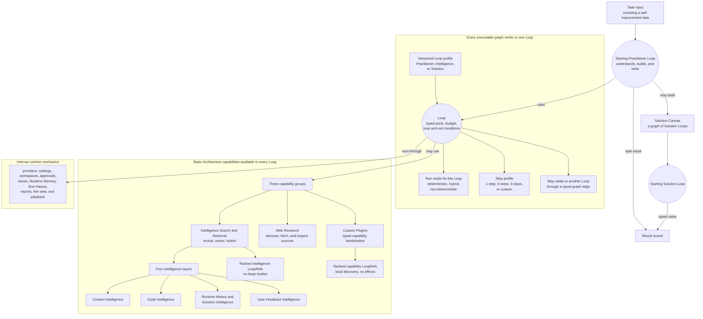

# Building with Loops

Loop Engine turns a task into an inspectable solution built and run by loops.
Every executable graph vertex is a Loop. Each Loop has its own role, profile,
run mode, typed ports, loop condition, exit condition, budget, permissions, and
Run History.

## System at a glance



This diagram is the architecture contract. The
[taxonomy and class map](docs/architecture/TAXONOMY-ONTOLOGY-AND-CLASS-MAP.md)
marks which parts are implemented and which parts still need consolidation.

## Loop roles and relationships

Every operational object uses the same Loop runtime. Relationship, role, and
profile answer separate questions.

```text
Loop identity
├── Operational relationship
│   ├── Starting: no incoming Loop relationship
│   ├── Spawned by: dynamic delegated work with one spawning Loop ID
│   ├── Queried by: an Intelligence Query Loop receives a query
│   ├── Retrieved by: an Intelligence Item Loop is selected
│   └── Connected from: a typed Solution connection carries a value
└── Role profile
    ├── Practitioner
    ├── Intelligence
    └── Solution
```

The same roles participate in different relationships:

```text
Universal Loop runtime
├── Practitioner
│   ├── Starting Practitioner
│   └── Spawned Practitioner subproblem
├── Intelligence
│   ├── Intelligence Query Loop, queried by a Practitioner
│   └── Intelligence Item Loop, retrieved by the Query Loop
└── Solution
    ├── Starting Solution
    ├── Connected Solution pipeline steps
    └── Spawned Solution only for a dynamic branch, fallback, repair,
        or ensemble member
```

Relationship describes how a Loop entered the structure. Practitioner,
Intelligence, and Solution describe purpose. A profile supplies versioned
behavior. A Spawned Practitioner is not a second runtime class. It is a Loop
with a Practitioner profile and one spawning Loop ID.

The Loop is the only executable graph vertex. Each Loop carries its role and
exact profile, its own mode, typed input and output ports, loop condition, exit
condition, and graph relationships. A passive record, service, port, slot, or
edge is not a second kind of graph vertex. A Canvas or pipeline does not have
one execution mode. It may only restrict which modes its member Loops may use.

The role of a spawning Loop does not constrain the roles of the Loops it
spawns:

```text
Starting Practitioner
├── spawns a Practitioner subproblem Loop
└── queries an Intelligence Query Loop
    └── retrieves Intelligence Item Loops

Starting Solution
├── connects to deterministic Solution pipeline Loops
└── may spawn a dynamic Solution branch when the contract calls for one
```

`LoopRoleIdentity` carries the role and exact profile version.
`LoopRelationship` records how the Loop entered the graph: `STARTING`,
`SPAWNED_BY`, `QUERIED_BY`, `RETRIEVED_BY`, or `CONNECTED_FROM`. Run History and
Solution graph records use the same relationship vocabulary. Older saved
records may contain retired topology fields. A compatibility reader may read
those immutable records, but new records do not emit the retired fields.

Each role then has more specific profiles:

```text
Loop role profiles
├── Practitioner
│   ├── researcher
│   ├── solver
│   ├── experimenter
│   ├── builder
│   ├── reviewer
│   ├── verifier
│   ├── repairer
│   ├── code executor
│   └── self-improvement task
├── Intelligence
│   ├── search and rank
│   ├── select
│   ├── materialize
│   ├── frame for the current task
│   ├── invoke Code Intelligence
│   ├── replay or compare prior work
│   └── interpret User Feedback Intelligence
└── Solution
    ├── component
    ├── pipeline
    ├── validator
    ├── router
    ├── fallback
    ├── ensemble member
    └── output formatter
```

These aliases are relationship-neutral profile selectors. A profile does not
say whether the Loop was started, spawned, queried, retrieved, or connected.

Every Loop declares its own mode, step profile, typed contract, loop condition,
exit condition, budget, permissions, and version. Read the
[Loop object](docs/components/loop-object/),
[Loop Practitioner](docs/components/practitioner/),
[Intelligence layers](docs/components/intelligence-layers/), and
[Solution Canvas](docs/components/solution-canvas/) guides.

The full classification of one Loop is:

```text
Operational runtime type
└── Loop
    ├── Operational relationship
    │   ├── Starting or Spawned by
    │   ├── Queried by or Retrieved by
    │   └── Connected from
    ├── Role: Practitioner, Intelligence, or Solution
    ├── Versioned role profile
    ├── Purpose and domain categories
    ├── Mode: deterministic, hybrid, or non-deterministic
    ├── Step profile: atomic, compact, reference nine-step, or custom
    ├── Typed input and output contract
    ├── Loop condition and exit condition
    ├── Graph relationships
    ├── Budget, permissions, workspace, and effect settings
    ├── Model and thinking-power settings when model use is allowed
    └── Run History events
```

Runtime type, relationship, role, profile, category, mode, step profile, and
settings are separate fields. A category helps organize and search work. It
does not create another runtime class. Thinking power configures permitted
model use. It is not a fourth mode.

The diagram has five architectural parts:

| Part | Responsibility |
|---|---|
| Loop | Runs one bounded executable graph vertex. |
| Loop Practitioner | Uses loops to understand, build, test, and improve work. |
| Solution Canvas | Describes the Solution loops that run a finished solution. |
| Static Architecture | Provides Intelligence Search and Retrieval, Web Research, and Custom Plugins. |
| Intelligence Library | Organizes reusable context, code, prior work, solutions, and user guidance in four layers. |

Self-improvement is not a sixth architectural part. It is a task given to the
Loop Practitioner. The Practitioner reviews history and intelligence, then
stages proposed changes for a separate review.

A Loop profile classifies the work performed by one Loop object. The top
profile branches are Practitioner, Intelligence, and Solution. Intelligence
profiles govern loops that search, serve, frame, load, replay, or compare an
intelligence item. They do not replace the four intelligence layers.

The profile purpose, step profile, run mode, effort, and model thinking power
remain separate settings. Read the
[versioned Loop profile ontology](docs/components/loop-object/LOOP-PROFILE-ONTOLOGY.md).

## Each Loop has its own run mode

| Mode | Meaning |
|---|---|
| Deterministic | Uses code, rules, calculations, and search. It does not call a language model. |
| Hybrid | Uses code first and may call a language model for a specific unresolved step. |
| Non-deterministic | A language model leads the step while the loop controls tools, limits, logging, and verification. |

Mode belongs to the Loop that performs the work. A graph relationship does not
copy mode from one Loop to another.

- A deterministic Practitioner Loop can spawn a non-deterministic research
  Loop.
- A non-deterministic Practitioner Loop can spawn a deterministic validation
  Loop.
- A hybrid Loop can spawn Loops in any permitted mode.

Operating policy still controls which modes a loop may delegate. A mode change
does not grant new network, secret, file-write, model, or spending permission.

Read [The Loop object and step profiles](docs/components/loop-object/) for the
configuration fields and examples.

## Loop Practitioner and Solution Canvas

The Loop Practitioner shows how work is built. It can spawn research, review,
tool, repair, and verification Loops. Its run history forms a Loop graph.

The Solution Canvas shows what runs for a new input. Each executable Canvas
component is a Solution Loop with a declared operation, mode, contract, loop
condition, and exit condition.

The current in-process Canvas runner executes components through deterministic
loops. Separate hybrid and non-deterministic Canvas adapters are not shipped.

The Practitioner graph and Solution Canvas answer different questions:

```text
Practitioner graph: How did we build and test this?
Solution Canvas:   What runs now?
```

- [Loop Practitioner](docs/components/practitioner/)
- [Solution Canvas](docs/components/solution-canvas/)
- [Self-improvement as a Practitioner task](docs/components/self-improvement/)

## Four intelligence layers

| Layer | What belongs here |
|---|---|
| Context Intelligence | Questions, methods, role perspectives, checklists, prompt patterns, examples, warnings, and output contracts. |
| Code Intelligence | Functions, packages, repositories, tools, services, workflows, notebooks, datasets, and large systems. |
| Runtime History and Solution Intelligence | Saved runs, Loop graphs, decisions, failures, repairs, measurements, comparisons, and reusable solutions. |
| User Feedback Intelligence | Advice, corrections, sources, package suggestions, priorities, constraints, approvals, and vetoes supplied by a person. |

Each layer has a dedicated guide:

- [Context Intelligence ontology](docs/components/intelligence-layers/CONTEXT-HIERARCHY.md)
- [Code Intelligence templates](docs/components/intelligence-layers/CODE-INTELLIGENCE-TEMPLATES.md)
- [Runtime History and Solution Intelligence](docs/components/intelligence-layers/RUNTIME-HISTORY-AND-SOLUTION-INTELLIGENCE.md)
- [User Feedback Intelligence](docs/components/intelligence-layers/USER-FEEDBACK-INTELLIGENCE.md)

Runtime Memory is separate. It holds temporary notes for the current run and
does not automatically become persistent intelligence.

A skill, Markdown file, chat transcript, checkpoint, or vector-store row is a
source format. It is not an intelligence layer by itself. Loop Engine assigns
each imported item to one of the four layers, records where it came from, and
keeps it at candidate status until a separate review accepts it. Large bodies
stay behind references instead of being copied into every search result.

Read [Import files and history from another harness](docs/components/intelligence-layers/EXTERNAL-HARNESS-IMPORTS.md).

## Search returns loops

The Retrieval Engine searches the four intelligence layers. The Capability
Directory searches local Custom Plugin handshake cards.

```text
need
  -> Intelligence Query Loop
  -> ranked LoopRefs without large bodies
  -> select one reference
  -> retrieved Intelligence Item Loop verifies the locator and digest
  -> optional framing or Code Intelligence invocation Loop
  -> return to the querying Loop
```

Discovery does not load a repository, read a secret, or make a network call.
Effects begin only after a loop selects and invokes a reference.

Read [Intelligence is returned through loops](docs/components/intelligence-layers/INTELLIGENCE-AS-LOOPS.md).

## Static Architecture

Static Architecture has three public capability groups. Every Loop may use
them when its contract and permissions allow the operation.

| Capability group | Current path |
|---|---|
| Intelligence Search and Retrieval | Searches the four intelligence layers through selectable lexical, vector, and hybrid backends. |
| Web Research | Discovers, fetches, and inspects external sources through permitted research capabilities. |
| Custom Plugins | Registers typed capability handshakes and invokes only the selected, permitted capability. |

Providers, settings, workspaces, approvals, stores, Runtime Memory, Run
History, reports, live viewing, and playback are internal runtime mechanics.
They support Loops, but they are not peer Static Architecture capability
groups.

Current limitation: selected handlers receive selected capabilities. The
runtime does not yet inject one standard permission-limited capability context
into every Loop.

- [Static Architecture](docs/components/static-architecture/)
- [Providers and keys](docs/guides/providers-and-keys.md)
- [Runtime settings and model tiers](docs/guides/settings.md)
- [Model gateway and provider configuration](docs/components/static-architecture/MODEL-GATEWAY.md)
- [Custom endpoints](docs/guides/custom-endpoints.md)
- [Search and storage choices](docs/components/static-architecture/SEARCH-AND-STORAGE.md)
- [Brave Search plugin](docs/components/static-architecture/BRAVE-SEARCH-PLUGIN.md)

## Install from GitHub

```bash
python -m pip install "git+https://github.com/alisonjieli-png/loop-engine.git"
```

Python 3.10 or newer is required. One install includes the runtime and every
supported adapter.

## Run useful examples

Installed examples:

```bash
loop-engine --example support-queue
loop-engine --example intelligence-layers
loop-engine --example context-seed
```

Repository examples:

```bash
python3 examples/01_prioritize_support_queue/run.py
python3 examples/09_search_the_intelligence_layers/run.py
python3 examples/12_wrap_a_large_codebase/run.py
python3 examples/13_brave_search_plugin/run.py
```

The repository contains seventeen numbered example folders. Every folder has a
`README.md` and runnable `run.py`.

[Browse the examples](examples/README.md).

## Watch and play back a run

Run a fixed local demonstration and save its Run History:

```bash
loop-engine --live-demo --port 8770 --runs-dir "$HOME/.loop-engine/runs"
```

Open `http://127.0.0.1:8770` while it runs. Then start Studio on the same run
directory:

```bash
loop-engine --studio --port 8765 --runs-dir "$HOME/.loop-engine/runs"
```

Studio shows the Loop graph, event playback, model calls, intelligence, solution
records, and staged improvements at `http://127.0.0.1:8765/app`.

The CLI also provides a five-problem campaign:

```bash
loop-engine campaign plan
loop-engine campaign run --modes deterministic --watch
```

Provider-backed arms require explicit model-call authorization and a physical
call ceiling. Read [Five-problem campaign](docs/guides/campaigns.md).

The [benchmark candidate registry](docs/benchmarks/) catalogs 144 potential
tracks across ten task families. No registry entry has been promoted for
comparison. Separate frozen smoke populations have run on three OpenML-CC18
tasks and four DS-1000 tasks. Those small runs do not silently promote the
broader registry entries. Each future comparison still needs source, license,
evaluator, cost, and contamination checks.

## Evidence and case studies

Case studies are completed full-system runs. Each one must show the Loop graph,
its relationship types, selected intelligence, physical model calls, Solution Canvas,
independent evaluator, Run History, playback, result, time, token use, cost state,
and limitations. A component probe or incomplete run cannot become a case
study.

- [Case study index](case-studies/)
- [OpenML-CC18 three-task run](case-studies/openml-cc18-three-task-run.md)
- [DS-1000 four-task run and correction](case-studies/ds1000-four-task-recorded-output-correction.md)
- [Architecture showcase](showcase/)
- [Architecture video in MP4](showcase/assets/loop-engine-architecture.mp4)
- [Architecture video in WebM](showcase/assets/loop-engine-architecture.webm)
- [Published harness benchmark comparison](docs/research/PUBLISHED-HARNESS-BENCHMARKS.md)
- [First full-run benchmark portfolio](docs/benchmarks/FIRST-LOOP-ENGINE-PORTFOLIO-SOURCE-REVIEW.md)

The selected Loop Engine benchmark runs are non-deterministic Practitioner
runs. Deterministic Spawned Loops may retrieve, execute, and grade work, but a
deterministic subsystem result is not selected benchmark evidence.

Create one optional YAML settings file for loop defaults, search backends,
providers, model thinking power, bounded escalation, and saved run history:

```bash
loop-engine settings init
loop-engine settings check
```

## Documentation

1. [Repository organization](docs/REPOSITORY-ORGANIZATION.md)
2. [Contract index](docs/contracts/)
3. [Taxonomy, ontology, and class map](docs/architecture/TAXONOMY-ONTOLOGY-AND-CLASS-MAP.md)
4. [Component guide](docs/components/)
5. [Getting started](docs/getting-started.md)
6. [Loops and modes](docs/guides/loops-and-modes.md)
7. [Runtime settings and model tiers](docs/guides/settings.md)
8. [Reports, live viewing, and playback](docs/guides/reports.md)
9. [Architecture](docs/architecture/)
10. [Reference](docs/reference/)

## Verify the installation

```bash
python -m loop_engine --self-test
python -m loop_engine --conformance
python -m loop_engine --map
loop-engine --profiles
```

`--self-test` prints a concise count and any failures. Use
`--self-test-verbose` when you need module demo output and the full JSON report.

Loop Engine is alpha software. One successful task is not a general success
rate. MIT license. See [LICENSE](LICENSE).
