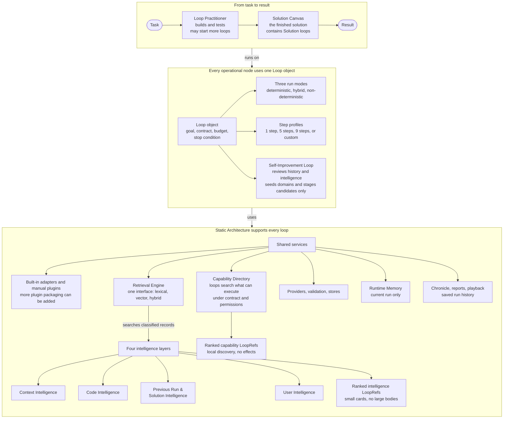
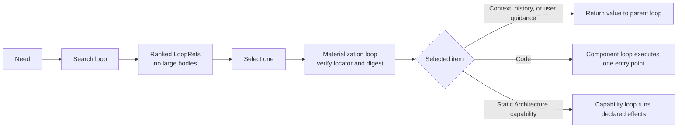

# Building with Loops

Loop Engine turns a task into an inspectable finished solution built and run by
loops. Everything that runs is a loop. Each loop is a node with three run
modes: deterministic, hybrid, and non-deterministic.

The `Loop` runtime object has three main roles:

- **Practitioner loops** understand a task, decide what to do, build, and verify.
- **Solution loops** run the finished solution represented by a Solution Canvas.
- **Self-Improvement loops** review run history and intelligence, find useful
  changes, seed new domains, and stage candidates for independent review.

Static Architecture supports all three roles. It provides the four intelligence
layers, extension points, built-in adapters, Runtime Memory, provider access,
stores, reporting, and the Chronicle.

## Bird's-eye view



The diagram separates how a solution is built from what eventually runs. The
Loop Practitioner is the builder. The Solution Canvas is the finished
arrangement. Self-improvement is a separate task role. All three use the same
Loop object and the same mode language.

| Part | Responsibility |
|---|---|
| Loop object | Runs one bounded node with a mode, step profile, budget, and stop condition. |
| Loop Practitioner | Starts loops that understand, build, and verify the work. |
| Solution Canvas | Describes the Solution loops that run the finished solution. |
| Self-Improvement Loop | Reviews history and intelligence, then stages candidates without promoting them. |
| Static Architecture | Provides shared search, adapters, stores, providers, validation, history, and viewing tools. |
| Four intelligence layers | Organize reusable context, code, run history, solutions, and user guidance. |

## Search and execution use loops

Search is a loop. Its results are also loops.



The Retrieval Engine searches the four intelligence layers. The Capability
Directory searches local Static Architecture handshake cards. Neither search
needs to load a repository, call a tool, read a secret, or make a network
request. Effects begin only after the parent loop selects a reference and runs
it.

## How one task moves through the system

1. A task enters the Loop Practitioner.
2. The Practitioner starts loops with explicit modes, step profiles, budgets,
   contracts, and stop conditions.
3. Those loops search intelligence through the Retrieval Engine. The search
   returns ranked intelligence `LoopRef` objects. They also search Static
   Architecture through the Capability Directory for capability `LoopRef`
   objects that can execute under the contract and permissions.
4. The Practitioner tests the work and may produce a Solution Canvas.
5. The Solution Canvas runs its Solution loops to produce the result.
6. Runtime Memory carries temporary notes during the run. The Chronicle keeps
   the saved history used by reports and playback.

Self-improvement follows a separate task path:

1. A Self-Improvement Loop selects an exact population of saved runs.
2. It verifies the Chronicle chain for each included run.
3. It searches the current Intelligence Library through the Retrieval Engine.
4. It finds repeated failures, repeated model work, missing categories, weak
   classification, or a domain that needs more context.
5. It stages Context or Code candidates. A separate review process decides
   whether any candidate should become active intelligence.

## The fundamental Loop object

Each loop is a node. There is no second operational node type.

| Part | Meaning |
|---|---|
| Goal | The work this loop must complete. |
| Contract | Expected inputs, outputs, and allowed effects. |
| Run modes | Which execution modes this loop may use. |
| Step profile | The ordered steps this loop follows. |
| Budget | Limits for iterations, model calls, depth, and work. |
| Stop condition | When the loop is complete or must stop. |
| Loop relationships | Which loop started this one and which loops it started. |
| Event log | What the loop attempted, used, returned, or refused. |

Read [The Loop object and step profiles](docs/components/loop-object/).

### Three run modes

| Mode | How it runs |
|---|---|
| **Deterministic** | Uses code, rules, calculation, and search. It does not call a language model. |
| **Hybrid** | Uses code first and may call a language model for a specific step. |
| **Non-deterministic** | A language model leads the step while the loop keeps control of tools, limits, logging, and verification. |

A loop can permit several modes. Each completed step records the mode it used.
A loop it starts may use a different mode only when the starting loop permits
it.

### Step profiles

A step profile answers a separate question: how many steps does this loop run,
and in what order? The code calls the low-level shape a `framework` and stores
reusable profiles as Loop Templates.

| Profile | Steps | Use |
|---|---:|---|
| Atomic code | 1 | One bounded deterministic action. |
| Compact | 5 | Load, choose, act, check, commit. |
| Reference Practitioner | 9 | Orient, reconcile, assess, decide, determine how, act, verify, integrate, route. |
| Custom | 1 to 200 | A caller-defined bounded sequence, including repeated steps. |

The reference nine-step profile is a useful default, not a universal law.

## Loop Practitioner

The Loop Practitioner builds solutions. It uses loops to understand the task,
retrieve what already exists, choose a method, perform the work, test the
result, and decide what happens next. It may start research, review, tool, or
specialist loops.

The Practitioner run produces a loop tree that explains how the work was
built. It may also produce a Solution Canvas that can run later without
repeating the build process.

Read [Loop Practitioner](docs/components/practitioner/).

## Solution Canvas

The Solution Canvas is the finished solution, not the history of how it was
built. Each Canvas node is a `SolutionLoopSpec` with its own operation, mode,
parameters, and fallback chain. A Canvas may also combine several child
solutions by voting, averaging, routing, selecting, or ordered fallback.

The current in-process runner executes each operation through a deterministic
component loop. Hybrid and non-deterministic Canvas modes are declared and
validated, but they do not yet have separate execution adapters.

The Practitioner tree answers, "How did we build this?" The Solution Canvas
answers, "What will run now?"

Read [Solution Canvas and Solution loops](docs/components/solution-canvas/).

## Self-Improvement Loop

The Self-Improvement Loop is a third role of the same `Loop` object. It is not
a separate engine and it cannot approve its own work.

`run_self_improvement()` loads a bounded population of saved Chronicles,
excludes broken run histories, audits the current intelligence categories,
mines repeated failures and repeated model work, ranks opportunities, and
stages candidates in memory for independent review.

Domain Context seeding is one Self-Improvement task. The
`context_intelligence_seed` step profile maps roles, projects, tasks, research
questions, and thinking styles into candidate Context records. Built-in domain
seeding is deterministic. A separate source-aware research loop must answer
questions about important people, organizations, standards, and primary
sources. The seed loop does not invent those facts or promote candidates.

Candidate Context is excluded from normal retrieval unless a caller explicitly
requests candidates for review.

Read [Self-improvement and domain seeding](docs/components/self-improvement/).

## Static Architecture and extensions

Static Architecture contains the reusable infrastructure that loops call
instead of rebuilding it for every task.

| Area | Current mechanism |
|---|---|
| Model providers | Built-in providers and parameterized custom endpoints. |
| Decision methods | Resolver and regime registration. |
| Capabilities | Typed handshakes and registered endpoints. |
| Retrieval | Selectable built-in lexical and vector backends behind one interface. |
| Step profiles | Built-in validated Loop Templates; candidate templates fail closed. |
| Storage and history | Store adapters, Chronicle persistence, and Studio projections. |

Providers, decision methods, and capabilities have explicit adapter or
registration points. Retrieval selects from a fixed built-in backend set.
A manually registered Brave Web Search plugin example is included. The package
does not auto-discover Python entry-point plugins or provide a plugin
marketplace.

Read [Static Architecture and extensions](docs/components/static-architecture/).

## Four intelligence layers

| Layer | Examples of useful categories |
|---|---|
| **Context Intelligence** | questions, methods, checklists, role perspectives, prompt patterns, output contracts, examples, warnings, source notes, evaluations |
| **Code Intelligence** | functions, packages, repositories, repository templates, tools, services, workflows, notebooks, large systems, executable capabilities |
| **Previous Run & Solution Intelligence** | runs, solutions, decisions, failures, repairs, measurements, comparisons |
| **User Intelligence** | advice, corrections, context, sources, packages, priorities, constraints, instructions, approvals, vetoes |

Every catalog item can carry its layer, item type, category group, category,
subcategory, domain, scope, lifecycle, source, and tags. Missing classification
stays visible. Runtime Memory remains separate because it is temporary and
run-scoped.

Read [The four intelligence layers](docs/components/intelligence-layers/).
Read [Context Intelligence ontology](docs/components/intelligence-layers/CONTEXT-HIERARCHY.md)
for question families, thinking methods, roles, formats, labels, phrases,
relationships, and history. Read
[Code Intelligence templates](docs/components/intelligence-layers/CODE-INTELLIGENCE-TEMPLATES.md)
for packages, repositories, tools, skills, datasets, and large systems.

## Install directly from GitHub

```bash
python -m pip install "git+https://github.com/alisonjieli-png/loop-engine.git"
```

Python 3.10 or newer is required. One install includes the runtime and every
supported adapter.

## Run useful installed examples

These commands work without a repository checkout:

```bash
loop-engine --example support-queue
loop-engine --example intelligence-layers
loop-engine --example context-seed
```

The first prioritizes a real-shaped support queue with zero model calls. The
second prints the inventory and category state for all four intelligence
layers. Previous Run and User Intelligence are empty until those stores have
records. The third runs a deterministic space Context seed and keeps every
output at candidate status.

## Watch and play back runs

Watch a real local run and save its Chronicle:

```bash
loop-engine --live-demo --port 8770 --runs-dir "$HOME/.loop-engine/runs"
```

Open `http://127.0.0.1:8770` while it runs. Then start Studio on the same run
directory:

```bash
loop-engine --studio --port 8765 --runs-dir "$HOME/.loop-engine/runs"
```

Studio provides the loop tree, playback controls, model-call view,
categorized intelligence inventory, solutions, and improvement candidates at
`http://127.0.0.1:8765/app`.

## Examples

The repository contains thirteen numbered example folders. Each has a `README.md`
and runnable `run.py`.

- [Useful work](examples/README.md#useful-work)
- [Models and intelligence](examples/README.md#models-and-intelligence)
- [Reports, live runs, and playback](examples/README.md#understand-a-run)

## Documentation by depth

Start here for the system map, then follow the component that matters:

1. [Component guide](docs/components/)
2. [Getting started](docs/getting-started.md)
3. [Loops and modes](docs/guides/loops-and-modes.md)
4. [Reports and playback](docs/guides/reports.md)
5. [Architecture](docs/architecture/)
6. [Reference](docs/reference/)

## Verify the installation

```bash
python -m loop_engine --self-test
python -m loop_engine --conformance
python -m loop_engine --map
```

The self-test runs the built-in suite. The conformance command checks the
architecture rules. The map command prints the package map and reference
nine-step profile.

## Status and license

Loop Engine is alpha software. Results are recorded per task, and one
successful task is not reported as a general success rate. MIT license. See
[LICENSE](LICENSE).
