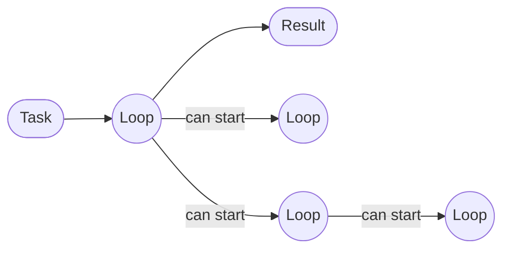

# Building with Loops

Loop Engine is a Python toolkit for building work as loops.

**Everything is a loop.**

Each loop is a node with three run modes: deterministic, hybrid, and
non-deterministic.

A loop receives a task, runs its steps, and then stops or runs again. It can
also start child loops. Each child returns its result to the loop that started
it.



Every circle is a loop node. A child can start more loops, so the same simple
structure works for a small task or a large solution.

## What each loop has

Each loop has:

- a task
- allowed run modes
- a set of steps
- a budget
- a stop condition
- a log of what happened

The same controls apply to a parent loop and its children. A child can use a
different run mode when its parent allows it.

## Each loop has three modes

| Mode | How it works |
|---|---|
| **Deterministic** | Uses regular code, rules, calculation, and search. It does not call a language model. |
| **Hybrid** | Uses code for most work. It can call a language model for a specific step. |
| **Non-deterministic** | A language model leads the work. The loop still controls tools, limits, child loops, and logging. |

The loop configuration says which modes are allowed. Each step records the
mode it used. The steps answer a different question: what process will this
loop follow?

A practitioner step plan with nine steps is available. It is one process, not
the definition of a loop. You can also use a shorter plan or define your own
steps.

## Start here

From the repository root, install the complete package once:

```bash
python -m pip install .
```

This one command installs the loop runtime and support for tables, Kaggle,
SQL, and learned search. There are no separate task-specific install commands
in this README.

Run the smallest example:

```bash
python examples/01_hello_loop.py
```

Python 3.10 or newer is required.

## Run a loop in Python

```python
from loop_engine import LoopLedger
from loop_engine.loop.encapsulate import as_practitioner_loop

ledger = LoopLedger()
result = as_practitioner_loop(
    "estimate delivery time",
    lambda: "4 days",
    ledger=ledger,
)

result["value"]        # "4 days"
result["model_calls"]  # 0 for this deterministic run
ledger.events          # the event log
```

The Python import name is `loop_engine`. The command-line program and Python
distribution are both named `loop-engine`.

## Configuration, contracts, logs, and reports

These words describe different parts of a run:

| Record | What it contains |
|---|---|
| **Configuration** | The task, allowed modes, steps, budget, and stop condition. |
| **Contract** | The expected input, output, and allowed effects. |
| **Log** | The steps, child loops, model calls, errors, and other events that occurred. |
| **Report** | A readable view of the completed run. Reports can be text, Markdown, HTML, or JSON. |

Run the report example:

```bash
python examples/04_reports.py
```

## Intelligence is one part

Intelligence helps a loop decide what to do. It is not the whole system.

Before a model call, a loop can search four sources:

| Source | What it can provide |
|---|---|
| Saved text | Questions, notes, methods, and instructions. |
| Reusable code | A tested function or other executable tool. |
| Previous runs | Earlier solutions, results, and failures. |
| User guidance | Advice saved for a task, project, or organization. |

A deterministic loop can work without a model. Hybrid and non-deterministic
loops need a working model provider for the steps that use one. Provider setup
and checks are described in [Providers and keys](docs/guides/providers-and-keys.md).

## Examples

| Example | What it shows |
|---|---|
| [01 hello loop](examples/01_hello_loop.py) | Run a small loop without a model. |
| [02 solve a problem](examples/02_solve_a_problem.py) | Give the engine a table and a goal. |
| [03 bring your own model](examples/03_bring_your_own_model.py) | Connect a provider and report its use. |
| [04 reports](examples/04_reports.py) | Create text, Markdown, HTML, and structured report data. |
| [05 Kaggle competition](examples/05_kaggle_competition.py) | Download and solve a competition task. Submission is optional. Kaggle credentials and competition access are required. |
| [06 your own loop](examples/06_your_own_loop.py) | Use your own steps for invoice reconciliation. |

## Clear failure states

The engine keeps failure states visible. A failed model provider is reported
as unavailable. An empty run stays empty.

## Verify the installation

```bash
python -m loop_engine --self-test
python -m loop_engine --conformance
python -m loop_engine --map
```

The self-test runs the built-in test suite. It does not need a provider key,
but it may read a public provider catalog when network access is available.
The conformance command checks the architecture rules. The map command shows
the package map and the nine-step kernel.

## Documentation

- [Getting started](docs/getting-started.md)
- [Loops and modes](docs/guides/loops-and-modes.md)
- [Providers and keys](docs/guides/providers-and-keys.md)
- [Custom endpoints](docs/guides/custom-endpoints.md)
- [Reports](docs/guides/reports.md)
- [Architecture](docs/architecture/)
- [Reference](docs/reference/)

## Status

This project is alpha software. The loop runtime, provider checks, knowledge
loading, reports, and architecture checks have automated tests. Results are
recorded per task. One successful task is not reported as a general success
rate.

Run records and test results, including failures, are in
[`docs/evidence/`](docs/evidence/).

## License

MIT. See [LICENSE](LICENSE).
