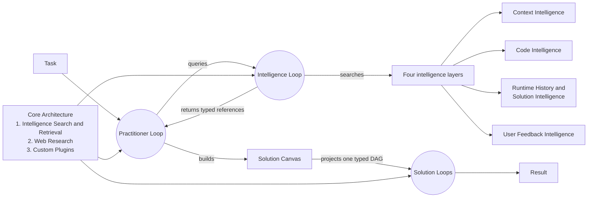

# Building with Loops

Loop Engine turns a task into a typed graph of loops. Every executable graph
vertex is a `Loop`. Practitioner, Intelligence, and Solution describe what a
Loop does. They do not create separate runtimes.

Each Loop carries an immutable `LoopDefinition` with a semantic version and a
content digest. The definition binds the role profile, mode support, typed
input and output roles, step profile, loop condition, exit condition,
permissions, effects, and required capabilities.

## Get started on Linux

These commands change files only inside `~/loop-engine-quickstart` and its
virtual environment.

Using another system? See the separate
[Windows guide](docs/guides/install-windows/) or
[macOS guide](docs/guides/install-macos/).

Python 3.10 or newer, Git, and Python's `venv` module are required.

```bash
mkdir -p ~/loop-engine-quickstart
cd ~/loop-engine-quickstart
python3 --version
git --version
python3 -m venv .venv
source .venv/bin/activate
python -m pip install --quiet \
  "git+https://github.com/alisonjieli-png/loop-engine.git@main"
python -m pip check
loop-engine doctor
loop-engine --demo five-step --runs-dir ./loop-engine-runs
loop-engine --studio --port 0 --runs-dir ./loop-engine-runs
```

The first installation downloads Loop Engine's current data, modeling, storage,
and integration dependencies, so it can take several minutes. `--quiet` hides
the dependency list; remove it when troubleshooting an installation failure.
Loop Engine does not start until you run `loop-engine doctor`.

The no-key demonstration uses code and rules. It does not contact a model
provider. It keeps the original request, builds a structured task, runs and
verifies a real Solution graph, saves Run History, and stages a learning
candidate. Staging is not promotion. Independent review and a separate
promotion decision are still required.

Studio prints the free local address selected by `--port 0` and keeps running.
Open that address, then press `Ctrl+C` in the terminal to stop Studio.

Run `deactivate` when you are finished with the virtual environment.

### What each command proves

| Command | Meaning |
|---|---|
| `pip install` | Downloads and installs the package and its declared dependencies. It does not run Loop Engine. |
| `pip check` | Confirms that installed Python package requirements are consistent. |
| `loop-engine doctor` | Checks the installation and configuration without contacting a provider. |
| `loop-engine --demo five-step` | Builds one local task, runs its Solution, verifies it, saves Run History, and stages a candidate. |
| `loop-engine --studio --port 0` | Opens the saved run in a local browser interface on a free port. |
| `loop-engine models inventory` | Lists provider definitions and routes. It does not test credentials or model quality. |

Inspect configured model routes without making a provider call:

```bash
loop-engine models inventory
```

The inventory lists available provider definitions and routes. It does not
contact a provider or prove that a key works.

Ollama Cloud is not a local Ollama server. Local Ollama, vLLM, SGLang, LM
Studio, llama.cpp, and similar servers use a custom endpoint entry. See
[Providers and keys](docs/guides/providers-and-keys.md) and the checked-in
[`loop-engine.settings.example.yaml`](loop-engine.settings.example.yaml).

### Build a modeling task

Use `--file` for a longer request. The task stays readable in the README and in
your shell:

```bash
cat > flagship-modeling-task.txt <<'EOF'
Download an authorized public dataset.
Train a linear model, tree model, boosted-tree model, and MLP to predict the
target variable. Use identical validation folds for every model. Compare the
results honestly and produce verified PDF and HTML reports.
EOF

loop-engine task build \
  --ollama-api-key 'YOUR_OLLAMA_API_KEY' \
  --interaction-mode autonomous \
  --file flagship-modeling-task.txt
```

Replace `YOUR_OLLAMA_API_KEY` with your Ollama Cloud key. This command turns the
complete file into a structured task and uses one Ollama call to review how
Loop Engine understood it. It does not run the modeling Solution. Use `--text`
for a short one-line request.

To build the task without a model or an API key, omit the provider option:

```bash
loop-engine task build --file flagship-modeling-task.txt
```

Leaving the dataset open is allowed. Loop Engine records it as a choice the
Solution may make instead of stopping to ask which dataset you prefer. This
command stops after building and reviewing the task, so it does not choose or
download the dataset.

`task build` returns a structured task. It does not pretend that the task was
solved. Run the five-step demo above to see a supported Solution execute from
start to finish. The four-model modeling Solution is not available in this
release.

### Choose how to provide a model key

The modeling command passes the key directly for a quick local test. You can
instead export it once and omit the value:

```bash
export OLLAMA_API_KEY='YOUR_OLLAMA_API_KEY'

loop-engine task build \
  --ollama-api-key \
  --interaction-mode autonomous \
  --file flagship-modeling-task.txt
```

When no value or environment variable exists, `--ollama-api-key` opens a
hidden prompt. The same forms work with OpenRouter and OpenCode Go:

```bash
loop-engine task build \
  --openrouter-api-key 'YOUR_OPENROUTER_API_KEY' \
  --interaction-mode autonomous \
  --file flagship-modeling-task.txt

loop-engine task build \
  --opencode-go-api-key 'YOUR_OPENCODE_GO_API_KEY' \
  --interaction-mode autonomous \
  --file flagship-modeling-task.txt
```

The shortcut authorizes one review call. The model may suggest how Loop Engine
understood the task and what should happen next. It does not run the Solution
or change the original request. The result includes the provider, model, token
usage, and selected next action. Use `--format json` for the complete record.

Direct values are convenient for local testing, but they can appear in shell
history and process listings. Use the environment-variable or hidden-prompt
form for shared machines and CI.

Loop Engine does not invent a round token limit for this review. It derives
the ceiling from the selected model's registered output maximum and the
assembled prompt. You may set `--max-total-tokens` as a stricter limit. The
command stops before contacting the provider if that limit is too small or the
model's maximum is unknown. Advanced route, model, and budget options are in
[Providers and keys](docs/guides/providers-and-keys.md).

Use autonomous interaction mode when the run must not pause for questions:

```bash
loop-engine task build \
  --interaction-mode autonomous \
  --text \
  "Train and compare several supervised prediction models."
```

Autonomous mode does not pause for optional preferences. It uses a registered
safe choice when one exists. If a required fact cannot be chosen safely, the
task stops with `abstain_required`. This mode does not add network, model,
spending, or file permissions.

Feedback is optional. Supply a registered slot only when you care about that
choice:

```bash
loop-engine task build --interaction-mode autonomous \
  --task-feedback task.preference.dataset_source=openml:61 \
  --text "Train and compare several supervised prediction models."
```

Without that feedback, the Solution may choose a suitable dataset later. See
[five text-only task-building examples](examples/20_compile_text_tasks/) for
ready, clarification, and stop behavior. The same five public task files run
through one bounded Ollama Cloud review after trusted pushes to `main`. That
review does not run the five requested Solutions.

## System at a glance



Self-improvement uses the same Practitioner role. A self-improvement task
reviews a bounded set of saved runs and intelligence, then stages candidates
for independent review. It is not a separate architecture system and cannot
approve its own candidates.

## One Loop contract

```text
Loop
├── LoopDefinition
│   ├── definition ID, semantic version, and content digest
│   ├── exact registered role profile and version
│   ├── typed input and output roles
│   ├── supported modes and installed mode executors
│   ├── step profile
│   ├── loop condition and exit condition
│   ├── configuration facts
│   └── permissions, effects, and required capabilities
├── LoopRuntimeContext
│   ├── Intelligence Search and Retrieval port
│   ├── Web Research port
│   ├── Custom Plugins port
│   └── internal runtime mechanics
├── one relationship to the active graph
└── ordered Run History events
```

`LoopStartRequest` supplies the goal, complete definition, relationship,
least-authority runtime context, and event log in one object. A Loop refuses
to start when its definition is invalid, its digest changed, its profile is
not registered, or its required capabilities, permissions, or executors are
missing.

## Roles, profiles, and relationships

Role, profile, relationship, and mode are independent fields.

```text
Registered role profiles
├── Practitioner
│   ├── practitioner.reference_nine_step
│   ├── practitioner.compact_five_step
│   ├── practitioner.research
│   ├── practitioner.solver
│   ├── practitioner.verifier
│   ├── practitioner.self_improvement
│   └── practitioner.code_execution
├── Intelligence
│   ├── intelligence.search
│   ├── intelligence.materialize
│   ├── Context Intelligence
│   │   ├── intelligence.context.serve
│   │   ├── intelligence.context.search
│   │   └── intelligence.context.frame
│   ├── Code Intelligence
│   │   ├── intelligence.code.resolve
│   │   ├── intelligence.code.invoke
│   │   └── intelligence.code.package
│   ├── Runtime History and Solution Intelligence
│   │   ├── intelligence.runtime_history_solution.search
│   │   ├── intelligence.runtime_history_solution.replay
│   │   └── intelligence.runtime_history_solution.compare
│   └── User Feedback Intelligence
│       ├── intelligence.user_feedback.serve
│       ├── intelligence.user_feedback.scope
│       └── intelligence.user_feedback.interpret
└── Solution
    ├── solution.atomic_component
    ├── solution.pipeline
    ├── solution.router_fallback
    ├── solution.ensemble
    └── solution.validator
```

The active relationship says how a Loop entered a graph:

- `STARTING`: no incoming Loop relationship.
- `SPAWNED_BY`: another Loop created bounded work dynamically.
- `QUERIED_BY`: another Loop sent an Intelligence query.
- `RETRIEVED_BY`: an Intelligence query selected this item.
- `CONNECTED_FROM`: a typed DAG edge supplied input from another Loop.

A deterministic Practitioner may spawn a non-deterministic Practitioner. A
non-deterministic Practitioner may spawn a deterministic verifier. Each Loop
selects its own permitted mode and receives its own restricted runtime context.

## Three run modes

| Mode | How the Loop runs |
|---|---|
| `deterministic` | Code, rules, calculations, retrieval, or execution lead the work. No language model is called. |
| `hybrid` | Code leads. A language model may resolve a bounded semantic step. |
| `non_deterministic` | A language model leads the semantic work. Loop Engine still controls tools, permissions, budgets, event logging, and verification. |

A mode label is not enough. The selected mode must have an installed executor.
The runtime fails before work when that executor is missing. Mode never grants
file, network, secret, model, spending, or external-effect permission.

## One authoritative graph

`LoopGraphDefinition` is the authoritative static DAG contract. It contains
versioned `LoopDefinition` references, explicit vertices, typed edges, graph
inputs and outputs, groups, and a graph digest. Validation rejects cycles,
unresolved definitions, digest changes, incompatible ports, undeclared
adapters, invalid relationships, and unsupported modes.

Practitioner work also forms a graph. That graph is dynamic: Run History
records Starting, Spawned by, Queried by, and Retrieved by relationships as
the work happens. A reusable Solution graph is static and validated before it
runs. Both views contain Loops as their only executable vertices.

`SolutionSpec` and `Canvas` are builders and projections. They do not define a
second runtime or a second graph authority. Every selected Canvas candidate
resolves to a complete Solution `LoopDefinition` before execution.

The in-process Solution runner uses the shared deterministic, hybrid, and
non-deterministic mode contract. Model-using leaves require an installed
gateway-backed executor and explicit model-call authority. Missing authority or
an unavailable executor produces a typed failure and never changes mode
silently.

## Intelligence is loop work

The four persistent layers are:

1. Context Intelligence
2. Code Intelligence
3. Runtime History and Solution Intelligence
4. User Feedback Intelligence

Searching, selecting, materializing, framing, invoking, replaying, comparing,
and interpreting intelligence all run through registered Intelligence Loop
profiles. Search returns small typed `LoopRef` objects. A selected item is
loaded only after its reference, digest, contract, and permissions pass.

Runtime Memory is temporary and belongs to one run. Markdown, skills,
repositories, packages, transcripts, and vector rows are source formats, not
new intelligence layers. Imported or generated items remain candidates until
an independent review accepts them.

## Core Architecture

Core Architecture exposes exactly three public capability groups:

| Group | Purpose |
|---|---|
| Intelligence Search and Retrieval | Search, rank, select, and materialize records from the four intelligence layers. |
| Web Research | Discover, fetch, inspect, and verify permitted external sources. |
| Custom Plugins | Discover and invoke registered capabilities through typed handshakes. |

Providers, model routing, settings, workspaces, approvals, stores, Runtime
Memory, event storage, reports, playback, MCP adapters, skill adapters, and
OpenTelemetry export are internal runtime mechanics. They support Loop work.
They are not extra public architecture groups or executable graph vertices.

## Install and run

The quick start installs the command without cloning the repository. Use a
source checkout when you want the numbered examples, tests, or live five-task
Ollama check:

```bash
mkdir loop-engine-source-test
cd loop-engine-source-test
git clone https://github.com/alisonjieli-png/loop-engine.git .
python3 -m venv .venv
source .venv/bin/activate
python -m pip install --quiet .
python -m pip check
loop-engine doctor
```

Run useful installed examples:

```bash
loop-engine --example support-queue
loop-engine --example intelligence-layers
loop-engine --example context-seed
```

Run repository examples:

```bash
python examples/01_prioritize_support_queue/run.py
python examples/09_search_the_intelligence_layers/run.py
python examples/10_validate_customer_import/run.py
python examples/12_wrap_a_large_codebase/run.py
python examples/20_compile_text_tasks/run.py
```

[Browse all examples](examples/README.md). Each numbered folder contains a
runnable `run.py` and a short `README.md`.

The first five-text command is model-free. To run the same five task files
through Ollama Cloud, enter the key through a hidden Bash prompt, export it to
the active virtual environment, and authorize exactly five calls:

```bash
read -rsp "Ollama API key: " OLLAMA_API_KEY
echo
export OLLAMA_API_KEY
```

Then run:

```bash
python examples/20_compile_text_tasks/run_live.py \
  --authorize-model-calls \
  --max-model-calls 5 \
  --timeout 180 \
  --evidence-out ./live-ollama-scenarios.json
```

The suite derives its ceiling from the selected model's declared maximum and
the five exact prompts. Recent accepted runs used about 3,700 to 4,100
provider-reported tokens in total.

## The five-step product demo

After installation, one command builds a task, runs its Solution, verifies the
result, saves Run History, and stages a learning candidate:

```bash
loop-engine --demo five-step --runs-dir ./loop-engine-runs
```

The full offline test and conformance scans are contributor checks. They scan
the installed package and can take about a minute. A heartbeat appears every
10 seconds so the command does not look frozen. Pressing `Ctrl+C` cancels the
scan; rerun the command to obtain a result.

```bash
loop-engine doctor
python -m loop_engine --self-test
python -m loop_engine --conformance
```

Every candidate stays staged until an independent review promotes it.

## View a run

Save and watch a local run:

```bash
loop-engine --live-demo --port 8770 --runs-dir "$HOME/.loop-engine/runs"
```

Open `http://127.0.0.1:8770`. Start the playback interface against the same
directory:

```bash
loop-engine --studio --port 0 --runs-dir "$HOME/.loop-engine/runs"
```

The interface shows the Loop graph, ordered events, model calls,
intelligence use, Solution records, and staged improvement candidates.

## Examples, case studies, and showcase

- [Architecture showcase](showcase/)
- [Case study index](case-studies/)
- [OpenML-CC18 three-task run](case-studies/openml-cc18-three-task-run.md)
- [DS-1000 four-task recorded-output correction](case-studies/ds1000-four-task-recorded-output-correction.md)
- [Benchmark registry](docs/benchmarks/)
- [Published harness evidence](docs/research/PUBLISHED-HARNESS-BENCHMARKS.md)
- [Exact Loop Engine and published-harness matching](examples/16_compare_complex_harnesses/)

The saved benchmark populations are small. They do not establish a general
success rate. The exact matcher currently finds zero fair Loop
Engine-to-harness comparisons because no published result uses the same
population, model, effort, evaluator, metric, and environment.

## Documentation

- [Contract index](docs/contracts/)
- [Taxonomy, ontology, and class map](docs/architecture/TAXONOMY-ONTOLOGY-AND-CLASS-MAP.md)
- [Architecture drift audit](docs/architecture/LOOP-ENGINE-ARCHITECTURE-DRIFT-AUDIT-2026-08-25.md)
- [Loop object](docs/components/loop-object/)
- [Loop Practitioner](docs/components/practitioner/)
- [Four intelligence layers](docs/components/intelligence-layers/)
- [Solution Canvas](docs/components/solution-canvas/)
- [Core Architecture](docs/components/core-architecture/)
- [Reports and playback](docs/guides/reports.md)
- [Semantic identity dictionary](docs/architecture/SEMANTIC-IDENTITY-DICTIONARY.md)
- [Semantic decision rules](docs/architecture/SEMANTIC-DECISION-RULES.md)
- [Ambiguity register](docs/architecture/AMBIGUITY-REGISTER.md)

## Current limits

- The alpha package currently installs data, modeling, storage, and integration
  dependencies together. The first clean install is therefore larger than the
  final slim-core target.
- Typed role names are enforced at graph connections. Full value-schema
  validation for units, shapes, encodings, and field constraints is not yet
  available at every port.
- Live provider and local-model quality remain unproven unless a saved run is
  explicitly labeled `REAL PROVIDER RUN` or `LOCAL MODEL RUN`.
- Some established constructor paths still compose a complete definition and
  restricted runtime context through an observable compatibility path.
- `LoopLedger` is the current internal event-log class name. A public rename is
  deferred to a versioned migration.

## Verify the installation

```bash
loop-engine doctor
python -m loop_engine --self-test
python -m loop_engine --conformance
python -m loop_engine --map
loop-engine --profiles
```

Loop Engine is alpha software. MIT license. See [LICENSE](LICENSE).
