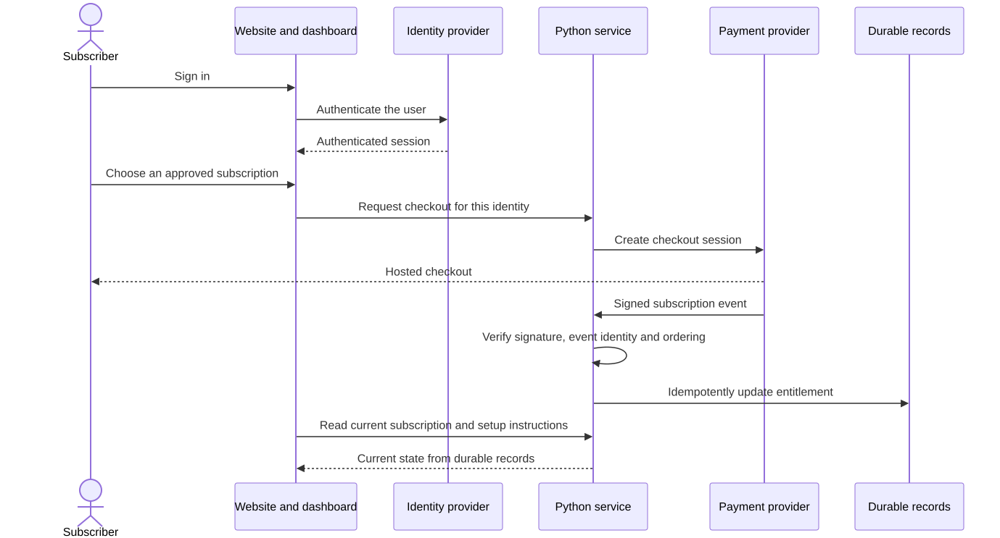
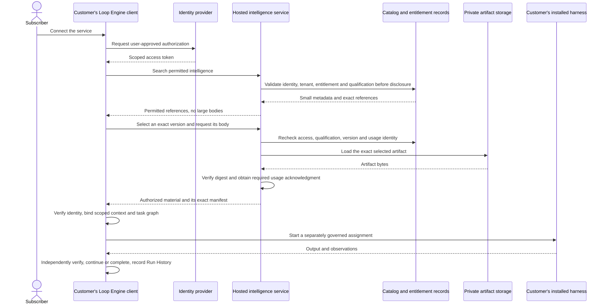

# First-release client and server architecture

Kind: proposed product architecture with implementation status.
Date: 2026-09-19.

The hosted product manages accounts, subscriptions, and access to intelligence.
The customer runs Loop Engine and the selected harnesses. A hosted intelligence
service is required; hosted execution of customer tasks is not.

The diagrams use C4-style software boundaries. A box represents a person,
application, service, or store, not an additional executable Loop vertex.

## Runtime classification

```text
Operational runtime type
└── Loop
    ├── Operational relationship
    │   ├── Starting
    │   ├── Spawned by
    │   ├── Queried by
    │   ├── Retrieved by
    │   └── Connected from
    ├── Role: Practitioner, Intelligence, or Solution
    ├── Versioned role profile
    ├── Purpose and domain categories
    ├── Run mode: deterministic, hybrid, or non-deterministic
    ├── Step profile
    ├── Typed input and output contract
    ├── Loop condition
    ├── Exit condition
    ├── Graph relationships
    ├── Budget, permissions, and effect policy
    ├── Model settings when the selected mode permits a model
    └── Run History records
```

## Container diagram

The vendor allocation is a proposed deployment profile, not an operated
service. Vercel can be evaluated for the website and the Python serving
application. A container host remains an alternative for the same Python
application. Supabase is the proposed identity, Postgres, and object-storage
provider. Read the [profile and limits](../guides/supabase-and-vercel-launch-profile.md).



The service does not receive a customer's complete task folder, prompts,
credentials, or Run History merely because the customer connects a client.
Any telemetry or submitted feedback needs an explicit data-sharing policy.
Access to a downloaded program is separate from permission to execute it.
An ordinary protocol client can retrieve material without installing the full
Loop Engine runtime. Enforced canonical task graphs and independent acceptance
require that runtime on the execution side. Connecting a native harness to
the service alone does not turn its internal steps into governed Loop Engine
work.

## Subscriber setup and payment



The checkout return page cannot grant access. Both the dashboard and the
protocol service read the same durable entitlement. Duplicate, delayed,
failed-payment, cancellation, and reactivation events need explicit tests.

## Intelligence retrieval and customer execution



The client can decompose a large task into small graphs and subgraphs while
fetching only the intelligence each assignment needs. The service supplies
material; it does not grant file, network, model, or spending authority.
The customer may use a remote model without moving harness execution into
the Loop Engine hosted product.
Paid retrieval retries retain the same usage request identity. A lost response
does not undo a committed usage record or authorize a second charge.

## Intelligence served by the same boundary

```text
Intelligence service
├── Context Intelligence
├── Code Intelligence
├── Runtime History and Solution Intelligence
├── User Feedback Intelligence
└── Provisioning views and templates over those layers
    ├── Harness Intelligence
    ├── versioned instruction and resource manifests
    └── reusable templates and packages
```

Runtime Memory remains temporary and run-scoped on the execution side.
Imported or generated intelligence stays candidate-only until its required
independent approval. Payment never promotes a candidate.

## Implementation status

| Boundary | State at this checkpoint |
|---|---|
| Canonical Loop, typed graphs, local harness mechanics, search and export | Existing implementations with repaired local contract checks. Complete native/provider qualification is not established. |
| Public solve provisioning | Current integration and verification work. Exact configuration reaches scoped assignments; preparation is not proof of native loading. |
| Tenant-safe provisioning domain | Local versioned policy and qualification binding implemented with contract checks. The qualification resolver is a trusted host callback; authoritative adapters across all four layers are not wired. Host attestation is not independent qualification. |
| Protocol transport | In-process JSON-RPC sessions, protocol `2025-11-25`, with a host-bound credential. Remote provisioning HTTP and OAuth are not implemented. |
| Authenticated template, graph, and package delivery | Required integration, not yet complete. Current provisioning has four declared resource kinds and returns text bodies; that does not establish the full typed package and graph-delivery workflow. |
| Website, dashboard, Supabase adapters and Stripe lifecycle | Proposed and planned. The diagram is not evidence that these are deployed. |
| Production database, object storage, durable billing reconciliation and recovery | Required implementation and deployment qualification remain open. |

Follow the [current system map](../../artifacts/architecture-audit-2026-09-19/architecture.html)
for source-level detail and the [continuation status](../roadmap/CONTINUATION-STATUS.md)
for required work. No account or paid resource was created to draw these
diagrams.
