# Architecture diagrams

Generated from the typed model in
`src/loop_engine/code_nodes/architecture_diagram.py`. Every code-backed
element names a module that must exist. A self-test fails if one stops
existing, so a rename breaks the diagram instead of leaving it quietly wrong.

These are renderings. The typed model is the record. A diagram language can
express things the system does not do, so each element carries an evidence
state: `implemented` has a current execution path, `partial` has a real
contract or incomplete path, `shadow` observes without changing the solve,
and `target` is planned rather than shipped.

## Loop classification

```text
Operational runtime type
└── Loop
    ├── Operational relationship
    │   ├── Starting
    │   ├── Spawned by
    │   ├── Queried by
    │   ├── Retrieved by
    │   └── Connected from
    ├── Role
    │   ├── Practitioner
    │   ├── Intelligence
    │   └── Solution
    ├── Versioned role profile
    ├── Purpose and domain categories
    ├── Run mode
    │   ├── deterministic
    │   ├── hybrid
    │   └── non-deterministic
    ├── Step profile
    ├── Typed input and output contract
    ├── Loop condition
    ├── Exit condition
    ├── Graph relationships
    ├── Budget, permissions, and effect policy
    ├── Model settings when the selected mode permits a model
    └── Run History records
```

## Loop role profiles

```text
Loop role profiles
├── Practitioner
│   ├── reference nine-step
│   ├── compact five-step
│   ├── research
│   ├── solver
│   ├── verifier
│   ├── code execution
│   └── self-improvement task
├── Intelligence
│   ├── cross-layer search and materialize
│   ├── Context Intelligence
│   │   └── serve, search, and frame
│   ├── Code Intelligence
│   │   └── resolve, invoke, and load
│   ├── Runtime History and Solution Intelligence
│   │   └── search, replay, and compare
│   └── User Feedback Intelligence
│       └── serve, scope, and interpret
└── Solution
    ├── atomic component
    ├── pipeline
    ├── router and fallback
    ├── ensemble
    └── validator
```

## Loop Engine in its setting

*context level.* What a run reaches outside itself.

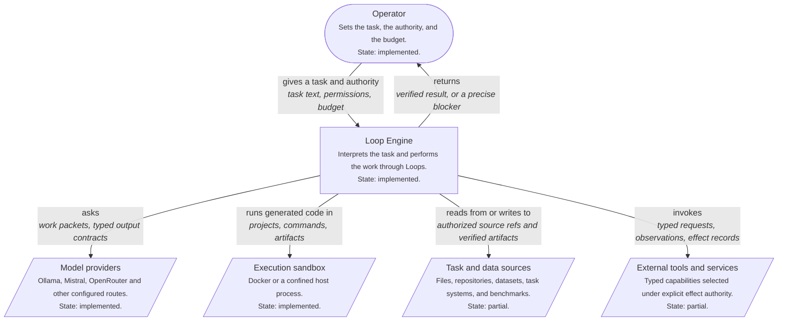

## What a task passes through

*container level.* The middle level between the setting and the components. The state label distinguishes working paths from partial and shadow contracts.

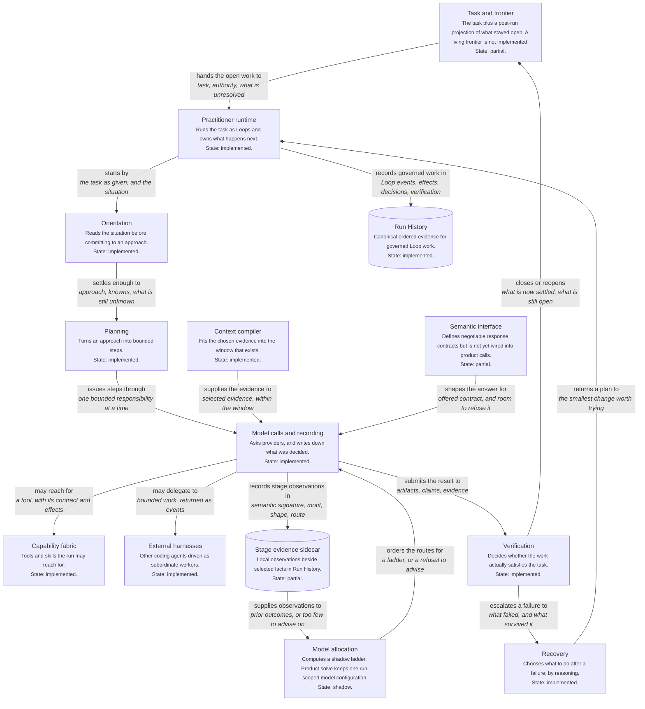

## What a run records, and what later runs read

*component level.* Default ladder advice stays shadow. An explicit offline binding can expose prior material, with mechanism-only evidence.

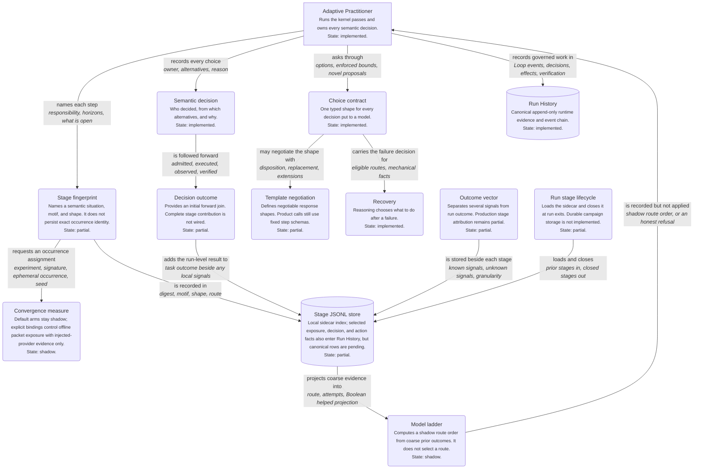

## One governed semantic responsibility

*dynamic level.* Current product sequence. Response negotiation and stage model allocation have contracts but do not yet control this path.

```mermaid
%% One governed semantic responsibility: dynamic level
%% Generated from the typed model; do not edit by hand.
flowchart TD
    request("Typed responsibility<br/><small>Goal, inputs, authority, budget, and completion condition.</small><br/><small>State: partial.</small>")
    loop["Owning Loop<br/><small>The only executable graph vertex.</small><br/><small>State: implemented.</small>"]
    context("Context selection<br/><small>Selects bounded task and intelligence material.</small><br/><small>State: implemented.</small>")
    interface("Response program<br/><small>Negotiable contract exists but is not on the product path.</small><br/><small>State: partial.</small>")
    allocation("Model allocation<br/><small>A shadow ladder is recorded; the run route stays fixed.</small><br/><small>State: shadow.</small>")
    call("Semantic model call<br/><small>Provider-neutral call through the ModelGateway.</small><br/><small>State: implemented.</small>")
    candidate("Candidate admission<br/><small>Parses and validates an untrusted response.</small><br/><small>State: implemented.</small>")
    action("Authorized action<br/><small>Executes a selected registered capability.</small><br/><small>State: implemented.</small>")
    verify("Verification<br/><small>Checks task evidence and produces a verdict.</small><br/><small>State: implemented.</small>")
    state("Trusted state transition<br/><small>Implemented for the semantic runtime, not yet for every adaptive Practitioner update.</small><br/><small>State: partial.</small>")
    outcome("Stage outcome<br/><small>One selected-action stage has a local result signal; complete stage contribution is unavailable.</small><br/><small>State: partial.</small>")
    history[("Run History<br/><small>Preserves the governed event sequence.</small><br/><small>State: implemented.</small>")]

    request -->|"starts<br/><i>typed work</i>"| loop
    loop -->|"requests<br/><i>context need</i>"| context
    context -->|"supplies<br/><i>selected references and task state</i>"| interface
    interface -->|"describes<br/><i>response and model demand</i>"| allocation
    allocation -->|"would select<br/><i>eligible model portfolio; currently shadow</i>"| call
    call -->|"returns<br/><i>untrusted model response</i>"| candidate
    candidate -->|"proposes<br/><i>validated action request</i>"| action
    action -->|"produces<br/><i>observation, artifacts, execution records</i>"| verify
    verify -->|"authorizes or refuses<br/><i>verified proposed state change</i>"| state
    state -->|"reports<br/><i>local and downstream outcome signals</i>"| outcome
    outcome -->|"records<br/><i>identity, evidence, unknowns, cost</i>"| history

%% Current product sequence. Response negotiation and stage model allocation have contracts but do not yet control this path.
```

## Identity scales and their current linkage

*component level.* Several records exist, but one linked multi-scale fingerprint lattice is not implemented. Partial labels prevent the drawing from claiming otherwise.

```mermaid
%% Identity scales and their current linkage: component level
%% Generated from the typed model; do not edit by hand.
flowchart TD
    f8("F8 Campaign<br/><small>A bounded task population and evaluation run.</small><br/><small>State: partial.</small>")
    f7("F7 Task<br/><small>Structured task identity and compatibility facts.</small><br/><small>State: implemented.</small>")
    f6("F6 Solution branch<br/><small>Independent branch identity and outcome linkage are target behavior.</small><br/><small>State: target.</small>")
    f5("F5 Structural subgraph<br/><small>Solution graphs exist; cross-run subgraph fingerprints do not.</small><br/><small>State: partial.</small>")
    f4("F4 Cognitive episode<br/><small>Reviewed episode records exist outside the production stage lattice.</small><br/><small>State: partial.</small>")
    f3("F3 State transition<br/><small>Versioned semantic transitions exist on a narrower runtime path.</small><br/><small>State: partial.</small>")
    f2("F2 Loop activation occurrence<br/><small>Product events link activation, semantic call, and attempts; canonical projection records are pending.</small><br/><small>State: partial.</small>")
    f1("F1 Logical semantic call<br/><small>One coherent semantic invocation identity.</small><br/><small>State: partial.</small>")
    f0("F0 Physical provider attempt<br/><small>Exact provider attempt and usage evidence.</small><br/><small>State: implemented.</small>")
    f9("F9 Cross-run motif<br/><small>Derived stage motif with no campaign outcome linkage.</small><br/><small>State: partial.</small>")

    f8 -->|"contains<br/><i>task references</i>"| f7
    f7 -->|"may compare<br/><i>branch identity and task objective</i>"| f6
    f6 -->|"contains<br/><i>subgraph identity and topology</i>"| f5
    f5 -->|"contains<br/><i>episode references</i>"| f4
    f4 -->|"summarizes<br/><i>ordered transition references</i>"| f3
    f3 -->|"is produced by<br/><i>exact Loop activation reference</i>"| f2
    f2 -->|"owns<br/><i>logical semantic call references</i>"| f1
    f1 -->|"may require<br/><i>one or more physical attempt references</i>"| f0
    f4 -->|"may project to<br/><i>cross-run motif candidate</i>"| f9

%% Several records exist, but one linked multi-scale fingerprint lattice is not implemented. Partial labels prevent the drawing from claiming otherwise.
```

## Candidate paired stage assistance path

*dynamic level.* The evidence contracts and rebuildable projection are implemented as a partial foundation. The public offline solve path executes both arms with injected responses and hydrated advisory material. Its control manifest says mechanism-only; live benefit is unproven.

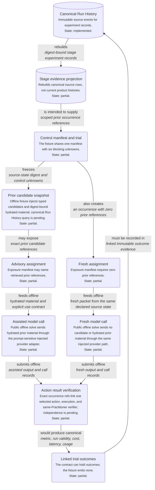

## Learning evidence deployment boundary

*container level.* Current runs and Run History are local. The SQLite stage evidence projection is a rebuildable index, not a shared authority. A multi-tenant learning service remains a target.

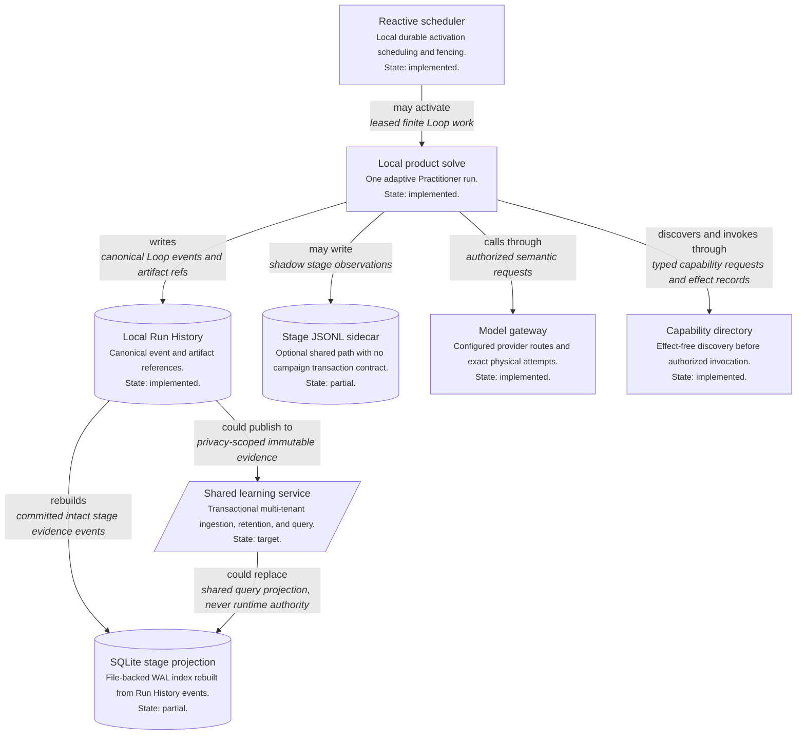

## Typed record access and distinct storage authorities

*component level.* Store and artifact boxes are internal mechanics, not executable Loop graph vertices. Managed notes use a tool; committed Run History has a separate immutable owner. PostgreSQL remains a target.

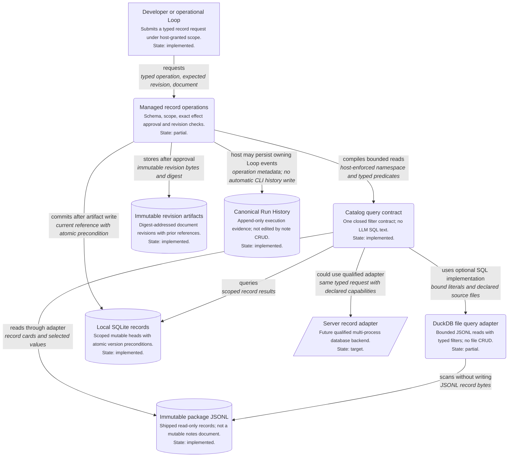

## The same models as C4-PlantUML

Generated using C4-PlantUML standard-library macros. These blocks are not Structurizr DSL. Pin and verify the rendering tool before publication.

### Loop Engine in its setting (DSL)

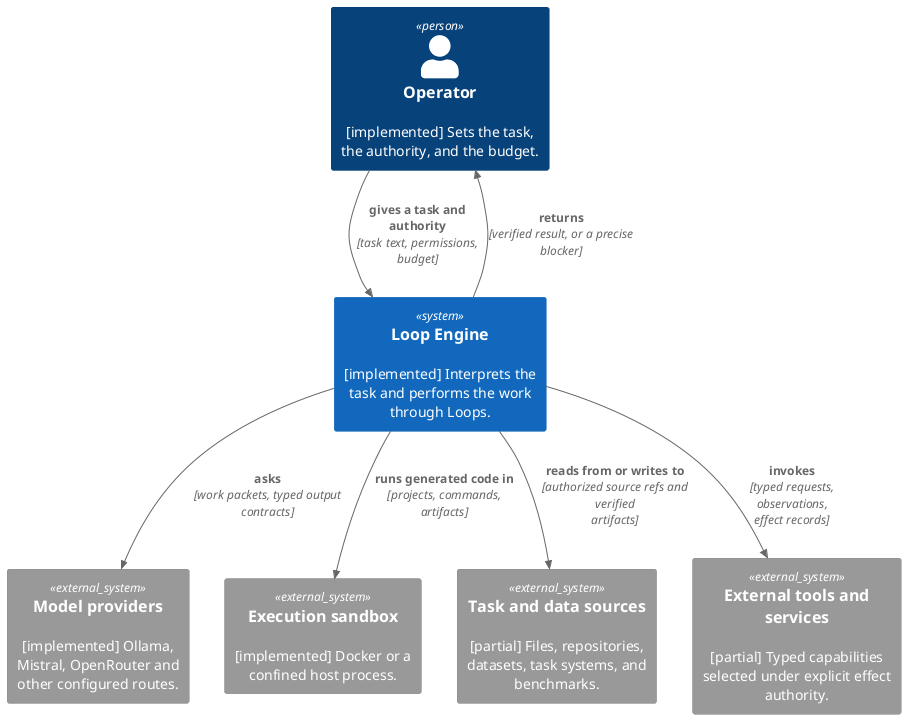

### What a task passes through (DSL)

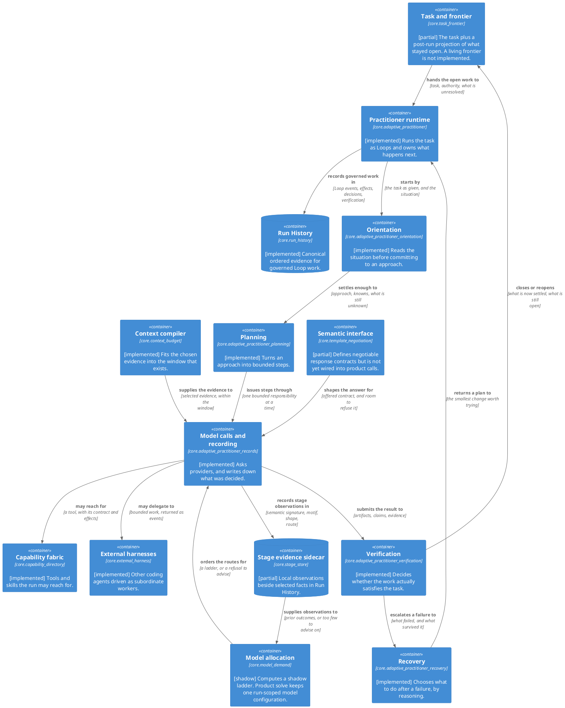

### What a run records, and what later runs read (DSL)

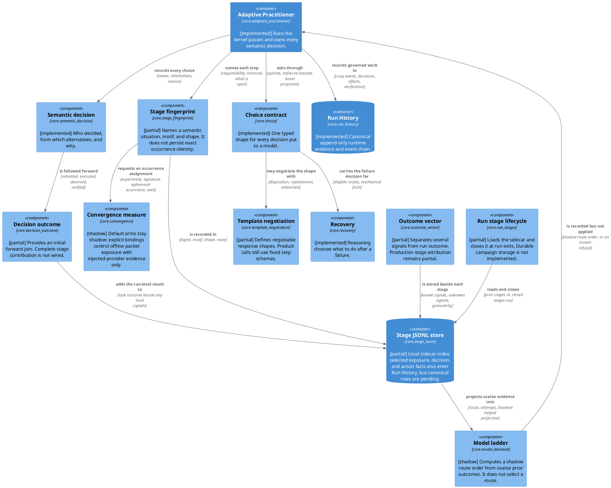

### One governed semantic responsibility (DSL)

```plantuml
@startuml
!include <C4/C4_Component>
' Generated from the typed model; do not edit by hand.
Component(element_0, "Typed responsibility", "core.task_frontier", "[partial] Goal, inputs, authority, budget, and completion condition.")
Container(element_1, "Owning Loop", "loop.recursive_loop", "[implemented] The only executable graph vertex.")
Component(element_2, "Context selection", "core.practitioner_context", "[implemented] Selects bounded task and intelligence material.")
Component(element_3, "Response program", "core.template_negotiation", "[partial] Negotiable contract exists but is not on the product path.")
Component(element_4, "Model allocation", "core.model_demand", "[shadow] A shadow ladder is recorded; the run route stays fixed.")
Component(element_5, "Semantic model call", "core.model_gateway", "[implemented] Provider-neutral call through the ModelGateway.")
Component(element_6, "Candidate admission", "core.model_response_admission", "[implemented] Parses and validates an untrusted response.")
Component(element_7, "Authorized action", "core.adaptive_practitioner_capabilities", "[implemented] Executes a selected registered capability.")
Component(element_8, "Verification", "core.adaptive_practitioner_verification", "[implemented] Checks task evidence and produces a verdict.")
Component(element_9, "Trusted state transition", "core.semantic_state", "[partial] Implemented for the semantic runtime, not yet for every adaptive Practitioner update.")
Component(element_10, "Stage outcome", "core.outcome_vector", "[partial] One selected-action stage has a local result signal; complete stage contribution is unavailable.")
ContainerDb(element_11, "Run History", "core.run_history", "[implemented] Preserves the governed event sequence.")

Rel(element_0, element_1, "starts", "typed work")
Rel(element_1, element_2, "requests", "context need")
Rel(element_2, element_3, "supplies", "selected references and task state")
Rel(element_3, element_4, "describes", "response and model demand")
Rel(element_4, element_5, "would select", "eligible model portfolio; currently shadow")
Rel(element_5, element_6, "returns", "untrusted model response")
Rel(element_6, element_7, "proposes", "validated action request")
Rel(element_7, element_8, "produces", "observation, artifacts, execution records")
Rel(element_8, element_9, "authorizes or refuses", "verified proposed state change")
Rel(element_9, element_10, "reports", "local and downstream outcome signals")
Rel(element_10, element_11, "records", "identity, evidence, unknowns, cost")
@enduml
```

### Identity scales and their current linkage (DSL)

```plantuml
@startuml
!include <C4/C4_Component>
' Generated from the typed model; do not edit by hand.
Component(element_0, "F8 Campaign", "code_nodes.campaign_runner", "[partial] A bounded task population and evaluation run.")
Component(element_1, "F7 Task", "core.task_fingerprint", "[implemented] Structured task identity and compatibility facts.")
Component(element_2, "F6 Solution branch", "unspecified", "[target] Independent branch identity and outcome linkage are target behavior.")
Component(element_3, "F5 Structural subgraph", "code_nodes.solution_graph", "[partial] Solution graphs exist; cross-run subgraph fingerprints do not.")
Component(element_4, "F4 Cognitive episode", "memory.episodic.record", "[partial] Reviewed episode records exist outside the production stage lattice.")
Component(element_5, "F3 State transition", "core.semantic_state", "[partial] Versioned semantic transitions exist on a narrower runtime path.")
Component(element_6, "F2 Loop activation occurrence", "loop.recursive_loop", "[partial] Product events link activation, semantic call, and attempts; canonical projection records are pending.")
Component(element_7, "F1 Logical semantic call", "core.semantic_runtime_records", "[partial] One coherent semantic invocation identity.")
Component(element_8, "F0 Physical provider attempt", "core.model_gateway", "[implemented] Exact provider attempt and usage evidence.")
Component(element_9, "F9 Cross-run motif", "core.stage_fingerprint", "[partial] Derived stage motif with no campaign outcome linkage.")

Rel(element_0, element_1, "contains", "task references")
Rel(element_1, element_2, "may compare", "branch identity and task objective")
Rel(element_2, element_3, "contains", "subgraph identity and topology")
Rel(element_3, element_4, "contains", "episode references")
Rel(element_4, element_5, "summarizes", "ordered transition references")
Rel(element_5, element_6, "is produced by", "exact Loop activation reference")
Rel(element_6, element_7, "owns", "logical semantic call references")
Rel(element_7, element_8, "may require", "one or more physical attempt references")
Rel(element_4, element_9, "may project to", "cross-run motif candidate")
@enduml
```

### Candidate paired stage assistance path (DSL)

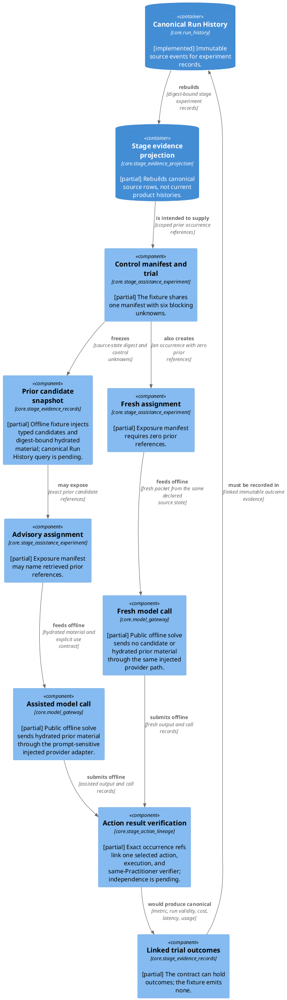

### Learning evidence deployment boundary (DSL)

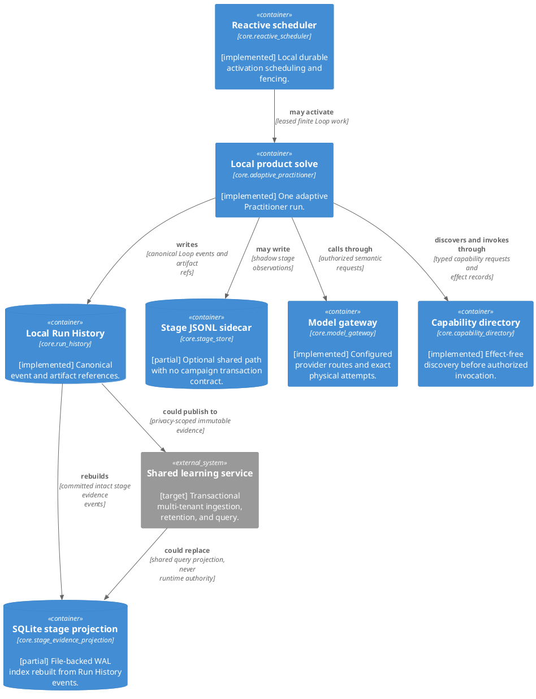

### Typed record access and distinct storage authorities (DSL)

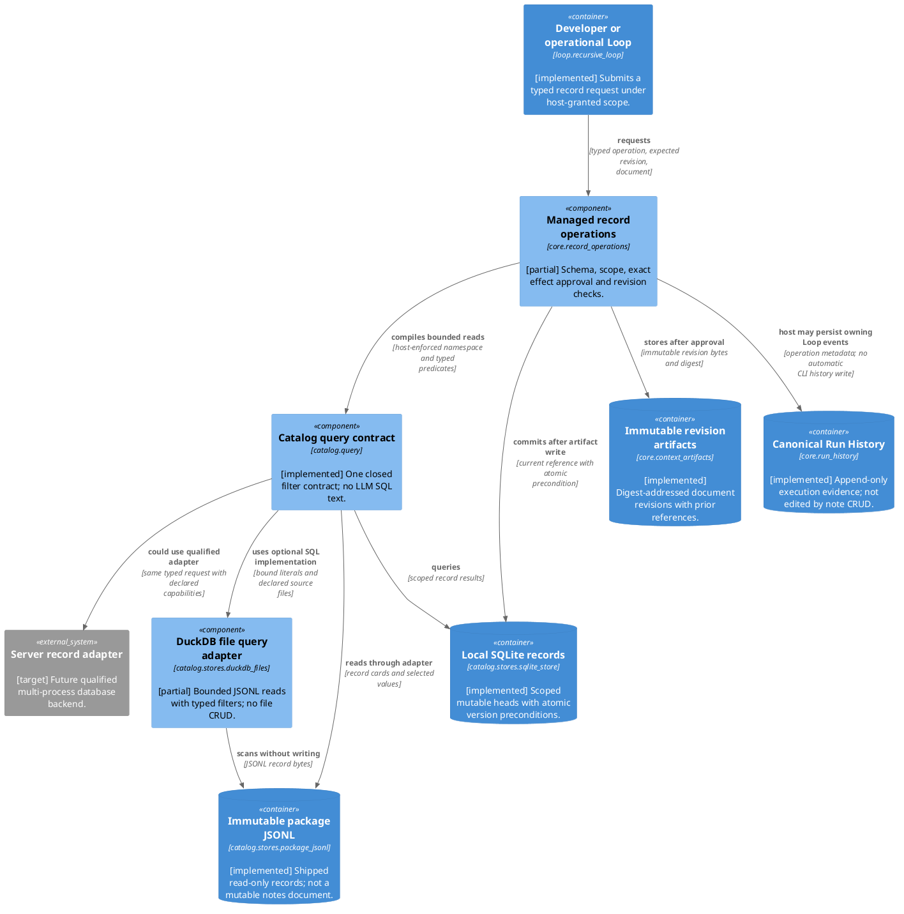
