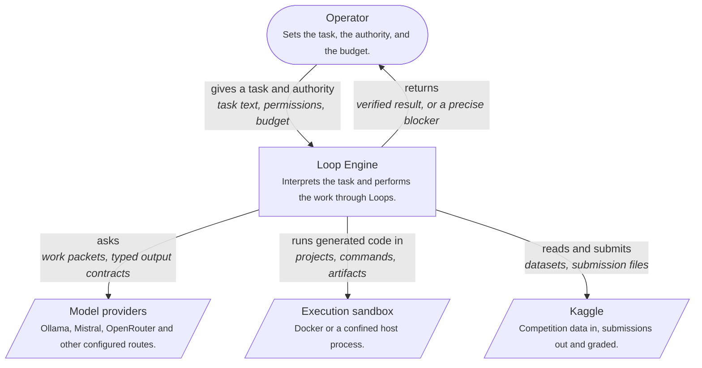
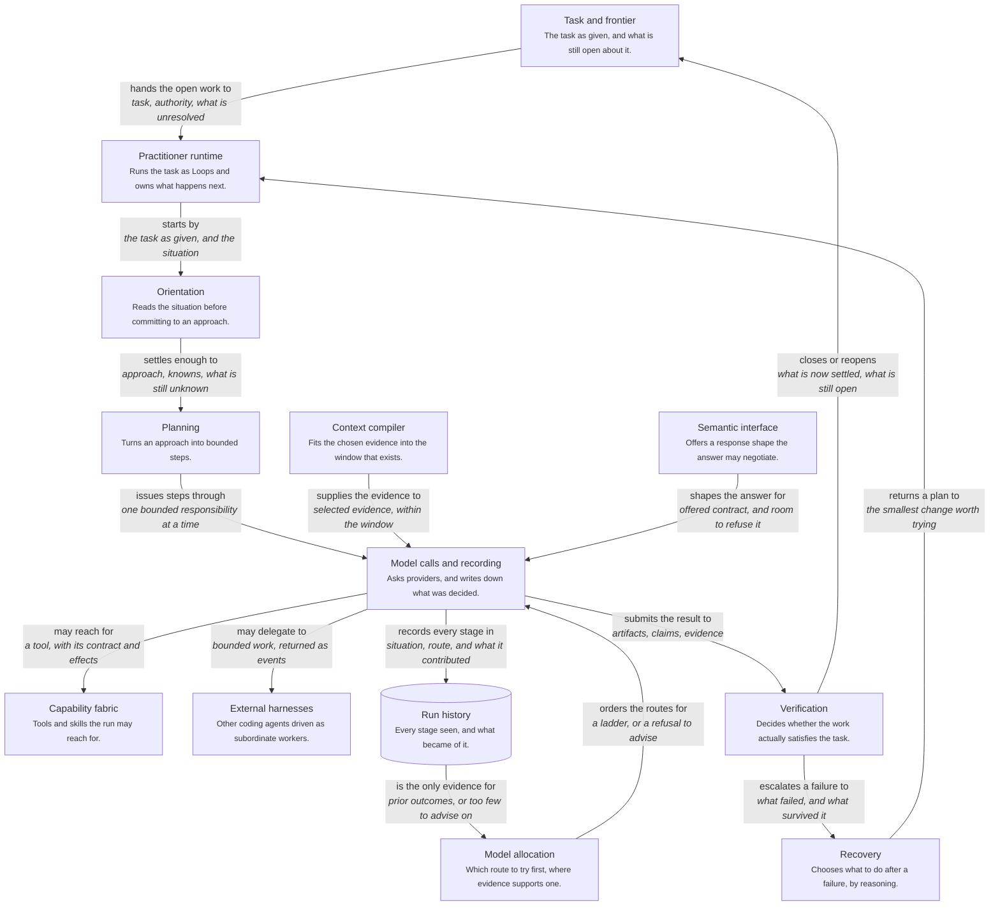
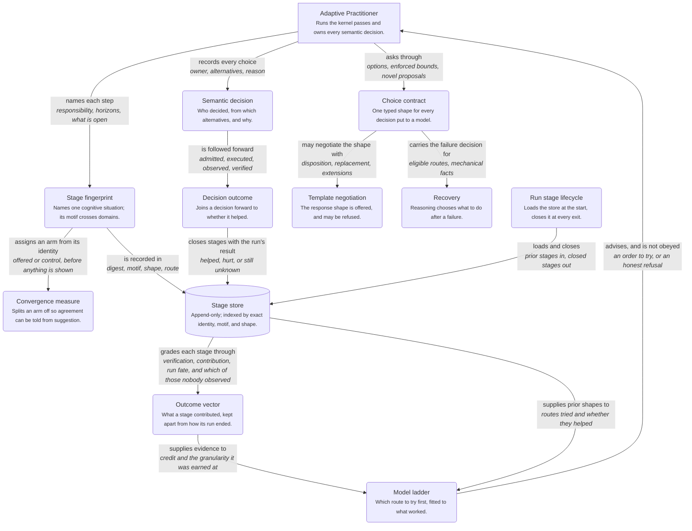

# Architecture diagrams

Generated from the typed model in
`src/loop_engine/code_nodes/architecture_diagram.py`. Every element
names a module that must exist; a self-test fails if one stops
existing, so a rename breaks the diagram loudly rather than leaving
it quietly wrong.

These are renderings. The typed model is the record — a diagram
language can express things the system does not do, and once the
picture is authoritative those inventions become requirements
nobody agreed to.

## Loop Engine in its setting

*context level.* What a run reaches outside itself.



## What a task passes through

*container level.* The middle level, between the setting and the components. Each box is a responsibility with a module behind it, not a plane this repository intends to build.



## What a run records, and what later runs read

*component level.* The loop that makes the engine self-observing. Advice flows out of the store and is recorded rather than obeyed.



## The same models as C4 DSL

Rendered for a Structurizr-style tool.

### Loop Engine in its setting (DSL)

```text
# Loop Engine in its setting
# level: context
# Generated from the typed model; do not edit by hand.
workspace {
    model {
        operator = person "Operator" "Sets the task, the authority, and the budget."
        engine = system "Loop Engine" "Interprets the task and performs the work through Loops."
        providers = system_ext "Model providers" "Ollama, Mistral, OpenRouter and other configured routes."
        sandbox = system_ext "Execution sandbox" "Docker or a confined host process."
        kaggle = system_ext "Kaggle" "Competition data in, submissions out and graded."

        operator -> engine "gives a task and authority"
        engine -> providers "asks"
        engine -> sandbox "runs generated code in"
        engine -> kaggle "reads and submits"
        engine -> operator "returns"
    }
}
```

### What a task passes through (DSL)

```text
# What a task passes through
# level: container
# Generated from the typed model; do not edit by hand.
workspace {
    model {
        frontier = container "Task and frontier" "The task as given, and what is still open about it."
        practitioner = container "Practitioner runtime" "Runs the task as Loops and owns what happens next."
        orientation = container "Orientation" "Reads the situation before committing to an approach."
        planning = container "Planning" "Turns an approach into bounded steps."
        context = container "Context compiler" "Fits the chosen evidence into the window that exists."
        interface = container "Semantic interface" "Offers a response shape the answer may negotiate."
        calls = container "Model calls and recording" "Asks providers, and writes down what was decided."
        allocation = container "Model allocation" "Which route to try first, where evidence supports one."
        capabilities = container "Capability fabric" "Tools and skills the run may reach for."
        harness = container "External harnesses" "Other coding agents driven as subordinate workers."
        verification = container "Verification" "Decides whether the work actually satisfies the task."
        recovery = container "Recovery" "Chooses what to do after a failure, by reasoning."
        history = containerdb "Run history" "Every stage seen, and what became of it."

        frontier -> practitioner "hands the open work to"
        practitioner -> orientation "starts by"
        orientation -> planning "settles enough to"
        planning -> calls "issues steps through"
        context -> calls "supplies the evidence to"
        interface -> calls "shapes the answer for"
        allocation -> calls "orders the routes for"
        calls -> capabilities "may reach for"
        calls -> harness "may delegate to"
        calls -> verification "submits the result to"
        verification -> recovery "escalates a failure to"
        recovery -> practitioner "returns a plan to"
        calls -> history "records every stage in"
        history -> allocation "is the only evidence for"
        verification -> frontier "closes or reopens"
    }
}
```

### What a run records, and what later runs read (DSL)

```text
# What a run records, and what later runs read
# level: component
# Generated from the typed model; do not edit by hand.
workspace {
    model {
        practitioner = container "Adaptive Practitioner" "Runs the kernel passes and owns every semantic decision."
        stage = component "Stage fingerprint" "Names one cognitive situation; its motif crosses domains."
        decision = component "Semantic decision" "Who decided, from which alternatives, and why."
        outcome = component "Decision outcome" "Joins a decision forward to whether it helped."
        choice = component "Choice contract" "One typed shape for every decision put to a model."
        template = component "Template negotiation" "The response shape is offered, and may be refused."
        recovery = component "Recovery" "Reasoning chooses what to do after a failure."
        ladder = component "Model ladder" "Which route to try first, fitted to what worked."
        convergence = component "Convergence measure" "Splits an arm off so agreement can be told from suggestion."
        credit = component "Outcome vector" "What a stage contributed, kept apart from how its run ended."
        store = containerdb "Stage store" "Append-only; indexed by exact identity, motif, and shape."
        lifecycle = component "Run stage lifecycle" "Loads the store at the start, closes it at every exit."

        store -> credit "grades each stage through"
        credit -> ladder "supplies evidence to"
        practitioner -> stage "names each step"
        practitioner -> decision "records every choice"
        decision -> outcome "is followed forward"
        practitioner -> choice "asks through"
        choice -> template "may negotiate the shape with"
        choice -> recovery "carries the failure decision for"
        stage -> convergence "assigns an arm from its identity"
        lifecycle -> store "loads and closes"
        stage -> store "is recorded in"
        store -> ladder "supplies prior shapes to"
        ladder -> practitioner "advises, and is not obeyed"
        outcome -> store "closes stages with the run's result"
    }
}
```
