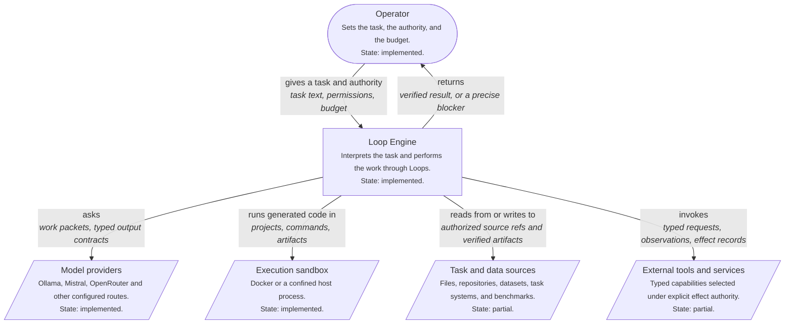
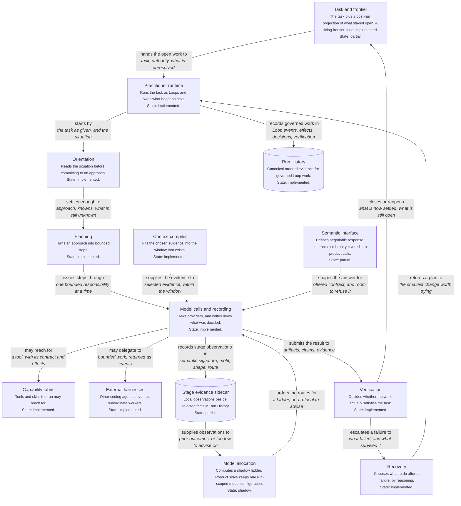
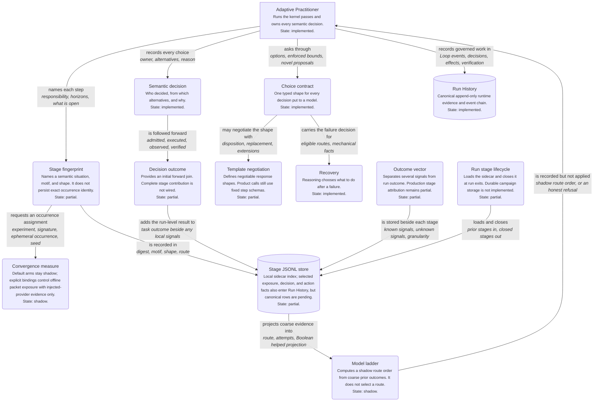
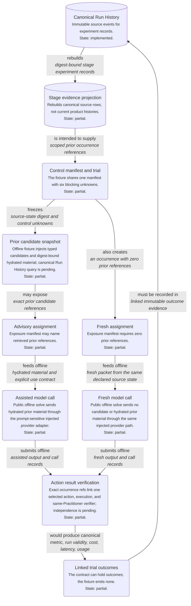
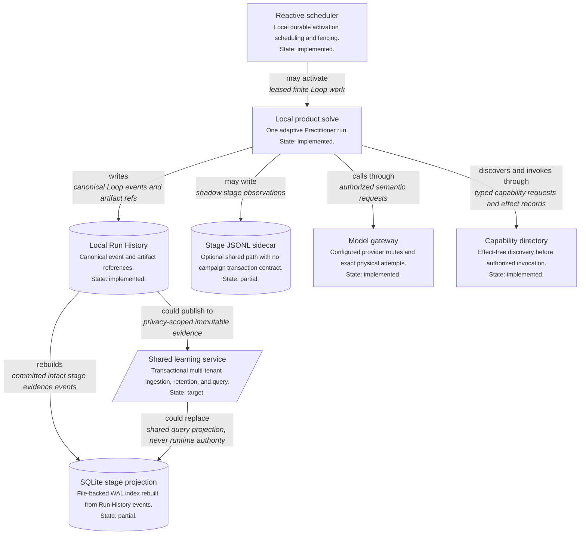

# Architecture diagrams

Generated from the typed model in
`src/loop_engine/code_nodes/architecture_diagram.py`. Every code-backed
element names a module that must exist. A self-test fails if one stops
existing, so a rename breaks the diagram instead of leaving it quietly wrong.

These are renderings. The typed model is the record. A diagram language can
express things the system does not do, so each element carries an evidence
state: `implemented` has a current execution path, `partial` has a real
contract or incomplete path, `shadow` observes without changing the solve,
and `target` is planned rather than shipped.

## Loop classification

```text
Operational runtime type
└── Loop
    ├── Operational relationship
    │   ├── Starting
    │   ├── Spawned by
    │   ├── Queried by
    │   ├── Retrieved by
    │   └── Connected from
    ├── Role
    │   ├── Practitioner
    │   ├── Intelligence
    │   └── Solution
    ├── Versioned role profile
    ├── Purpose and domain categories
    ├── Run mode
    │   ├── deterministic
    │   ├── hybrid
    │   └── non-deterministic
    ├── Step profile
    ├── Typed input and output contract
    ├── Loop condition
    ├── Exit condition
    ├── Graph relationships
    ├── Budget, permissions, and effect policy
    ├── Model settings when the selected mode permits a model
    └── Run History records
```

## Loop role profiles

```text
Loop role profiles
├── Practitioner
│   ├── reference nine-step
│   ├── compact five-step
│   ├── research
│   ├── solver
│   ├── verifier
│   ├── code execution
│   └── self-improvement task
├── Intelligence
│   ├── cross-layer search and materialize
│   ├── Context Intelligence
│   │   └── serve, search, and frame
│   ├── Code Intelligence
│   │   └── resolve, invoke, and load
│   ├── Runtime History and Solution Intelligence
│   │   └── search, replay, and compare
│   └── User Feedback Intelligence
│       └── serve, scope, and interpret
└── Solution
    ├── atomic component
    ├── pipeline
    ├── router and fallback
    ├── ensemble
    └── validator
```

## Loop Engine in its setting

*context level.* What a run reaches outside itself.



## What a task passes through

*container level.* The middle level between the setting and the components. The state label distinguishes working paths from partial and shadow contracts.



## What a run records, and what later runs read

*component level.* Default ladder advice stays shadow. An explicit offline binding can expose prior material, with mechanism-only evidence.



## One governed semantic responsibility

*dynamic level.* Current product sequence. Response negotiation and stage model allocation have contracts but do not yet control this path.

```mermaid
%% One governed semantic responsibility: dynamic level
%% Generated from the typed model; do not edit by hand.
flowchart TD
    request("Typed responsibility<br/><small>Goal, inputs, authority, budget, and completion condition.</small><br/><small>State: partial.</small>")
    loop["Owning Loop<br/><small>The only executable graph vertex.</small><br/><small>State: implemented.</small>"]
    context("Context selection<br/><small>Selects bounded task and intelligence material.</small><br/><small>State: implemented.</small>")
    interface("Response program<br/><small>Negotiable contract exists but is not on the product path.</small><br/><small>State: partial.</small>")
    allocation("Model allocation<br/><small>A shadow ladder is recorded; the run route stays fixed.</small><br/><small>State: shadow.</small>")
    call("Semantic model call<br/><small>Provider-neutral call through the ModelGateway.</small><br/><small>State: implemented.</small>")
    candidate("Candidate admission<br/><small>Parses and validates an untrusted response.</small><br/><small>State: implemented.</small>")
    action("Authorized action<br/><small>Executes a selected registered capability.</small><br/><small>State: implemented.</small>")
    verify("Verification<br/><small>Checks task evidence and produces a verdict.</small><br/><small>State: implemented.</small>")
    state("Trusted state transition<br/><small>Implemented for the semantic runtime, not yet for every adaptive Practitioner update.</small><br/><small>State: partial.</small>")
    outcome("Stage outcome<br/><small>One selected-action stage has a local result signal; complete stage contribution is unavailable.</small><br/><small>State: partial.</small>")
    history[("Run History<br/><small>Preserves the governed event sequence.</small><br/><small>State: implemented.</small>")]

    request -->|"starts<br/><i>typed work</i>"| loop
    loop -->|"requests<br/><i>context need</i>"| context
    context -->|"supplies<br/><i>selected references and task state</i>"| interface
    interface -->|"describes<br/><i>response and model demand</i>"| allocation
    allocation -->|"would select<br/><i>eligible model portfolio; currently shadow</i>"| call
    call -->|"returns<br/><i>untrusted model response</i>"| candidate
    candidate -->|"proposes<br/><i>validated action request</i>"| action
    action -->|"produces<br/><i>observation, artifacts, execution records</i>"| verify
    verify -->|"authorizes or refuses<br/><i>verified proposed state change</i>"| state
    state -->|"reports<br/><i>local and downstream outcome signals</i>"| outcome
    outcome -->|"records<br/><i>identity, evidence, unknowns, cost</i>"| history

%% Current product sequence. Response negotiation and stage model allocation have contracts but do not yet control this path.
```

## Identity scales and their current linkage

*component level.* Several records exist, but one linked multi-scale fingerprint lattice is not implemented. Partial labels prevent the drawing from claiming otherwise.

```mermaid
%% Identity scales and their current linkage: component level
%% Generated from the typed model; do not edit by hand.
flowchart TD
    f8("F8 Campaign<br/><small>A bounded task population and evaluation run.</small><br/><small>State: partial.</small>")
    f7("F7 Task<br/><small>Structured task identity and compatibility facts.</small><br/><small>State: implemented.</small>")
    f6("F6 Solution branch<br/><small>Independent branch identity and outcome linkage are target behavior.</small><br/><small>State: target.</small>")
    f5("F5 Structural subgraph<br/><small>Solution graphs exist; cross-run subgraph fingerprints do not.</small><br/><small>State: partial.</small>")
    f4("F4 Cognitive episode<br/><small>Reviewed episode records exist outside the production stage lattice.</small><br/><small>State: partial.</small>")
    f3("F3 State transition<br/><small>Versioned semantic transitions exist on a narrower runtime path.</small><br/><small>State: partial.</small>")
    f2("F2 Loop activation occurrence<br/><small>Product events link activation, semantic call, and attempts; canonical projection records are pending.</small><br/><small>State: partial.</small>")
    f1("F1 Logical semantic call<br/><small>One coherent semantic invocation identity.</small><br/><small>State: partial.</small>")
    f0("F0 Physical provider attempt<br/><small>Exact provider attempt and usage evidence.</small><br/><small>State: implemented.</small>")
    f9("F9 Cross-run motif<br/><small>Derived stage motif with no campaign outcome linkage.</small><br/><small>State: partial.</small>")

    f8 -->|"contains<br/><i>task references</i>"| f7
    f7 -->|"may compare<br/><i>branch identity and task objective</i>"| f6
    f6 -->|"contains<br/><i>subgraph identity and topology</i>"| f5
    f5 -->|"contains<br/><i>episode references</i>"| f4
    f4 -->|"summarizes<br/><i>ordered transition references</i>"| f3
    f3 -->|"is produced by<br/><i>exact Loop activation reference</i>"| f2
    f2 -->|"owns<br/><i>logical semantic call references</i>"| f1
    f1 -->|"may require<br/><i>one or more physical attempt references</i>"| f0
    f4 -->|"may project to<br/><i>cross-run motif candidate</i>"| f9

%% Several records exist, but one linked multi-scale fingerprint lattice is not implemented. Partial labels prevent the drawing from claiming otherwise.
```



## Candidate paired stage assistance path

*dynamic level.* The evidence contracts and rebuildable projection are implemented as a partial foundation. The public offline solve path executes both arms with injected responses and hydrated advisory material. Its control manifest says mechanism-only; live benefit is unproven.



## Learning evidence deployment boundary

*container level.* Current runs and Run History are local. The SQLite stage evidence projection is a rebuildable index, not a shared authority. A multi-tenant learning service remains a target.



## The same models as C4 DSL

Rendered for a Structurizr-style tool.

### Loop Engine in its setting (DSL)

```text
# Loop Engine in its setting
# level: context
# Generated from the typed model; do not edit by hand.
workspace {
    model {
        operator = person "Operator" "[implemented] Sets the task, the authority, and the budget."
        engine = system "Loop Engine" "[implemented] Interprets the task and performs the work through Loops."
        providers = system_ext "Model providers" "[implemented] Ollama, Mistral, OpenRouter and other configured routes."
        sandbox = system_ext "Execution sandbox" "[implemented] Docker or a confined host process."
        sources = system_ext "Task and data sources" "[partial] Files, repositories, datasets, task systems, and benchmarks."
        tools = system_ext "External tools and services" "[partial] Typed capabilities selected under explicit effect authority."

        operator -> engine "gives a task and authority"
        engine -> providers "asks"
        engine -> sandbox "runs generated code in"
        engine -> sources "reads from or writes to"
        engine -> tools "invokes"
        engine -> operator "returns"
    }
}
```

### What a task passes through (DSL)

```text
# What a task passes through
# level: container
# Generated from the typed model; do not edit by hand.
workspace {
    model {
        frontier = container "Task and frontier" "[partial] The task plus a post-run projection of what stayed open. A living frontier is not implemented."
        practitioner = container "Practitioner runtime" "[implemented] Runs the task as Loops and owns what happens next."
        orientation = container "Orientation" "[implemented] Reads the situation before committing to an approach."
        planning = container "Planning" "[implemented] Turns an approach into bounded steps."
        context = container "Context compiler" "[implemented] Fits the chosen evidence into the window that exists."
        interface = container "Semantic interface" "[partial] Defines negotiable response contracts but is not yet wired into product calls."
        calls = container "Model calls and recording" "[implemented] Asks providers, and writes down what was decided."
        allocation = container "Model allocation" "[shadow] Computes a shadow ladder. Product solve keeps one run-scoped model configuration."
        capabilities = container "Capability fabric" "[implemented] Tools and skills the run may reach for."
        harness = container "External harnesses" "[implemented] Other coding agents driven as subordinate workers."
        verification = container "Verification" "[implemented] Decides whether the work actually satisfies the task."
        recovery = container "Recovery" "[implemented] Chooses what to do after a failure, by reasoning."
        stage_evidence = containerdb "Stage evidence sidecar" "[partial] Local observations beside selected facts in Run History."
        history = containerdb "Run History" "[implemented] Canonical ordered evidence for governed Loop work."

        frontier -> practitioner "hands the open work to"
        practitioner -> orientation "starts by"
        orientation -> planning "settles enough to"
        planning -> calls "issues steps through"
        context -> calls "supplies the evidence to"
        interface -> calls "shapes the answer for"
        allocation -> calls "orders the routes for"
        calls -> capabilities "may reach for"
        calls -> harness "may delegate to"
        calls -> verification "submits the result to"
        verification -> recovery "escalates a failure to"
        recovery -> practitioner "returns a plan to"
        calls -> stage_evidence "records stage observations in"
        stage_evidence -> allocation "supplies observations to"
        practitioner -> history "records governed work in"
        verification -> frontier "closes or reopens"
    }
}
```

### What a run records, and what later runs read (DSL)

```text
# What a run records, and what later runs read
# level: component
# Generated from the typed model; do not edit by hand.
workspace {
    model {
        practitioner = container "Adaptive Practitioner" "[implemented] Runs the kernel passes and owns every semantic decision."
        stage = component "Stage fingerprint" "[partial] Names a semantic situation, motif, and shape. It does not persist exact occurrence identity."
        decision = component "Semantic decision" "[implemented] Who decided, from which alternatives, and why."
        outcome = component "Decision outcome" "[partial] Provides an initial forward join. Complete stage contribution is not wired."
        choice = component "Choice contract" "[implemented] One typed shape for every decision put to a model."
        template = component "Template negotiation" "[partial] Defines negotiable response shapes. Product calls still use fixed step schemas."
        recovery = component "Recovery" "[implemented] Reasoning chooses what to do after a failure."
        ladder = component "Model ladder" "[shadow] Computes a shadow route order from coarse prior outcomes. It does not select a route."
        convergence = component "Convergence measure" "[shadow] Default arms stay shadow; explicit bindings control offline packet exposure with injected-provider evidence only."
        credit = component "Outcome vector" "[partial] Separates several signals from run outcome. Production stage attribution remains partial."
        store = containerdb "Stage JSONL store" "[partial] Local sidecar index; selected exposure, decision, and action facts also enter Run History, but canonical rows are pending."
        lifecycle = component "Run stage lifecycle" "[partial] Loads the sidecar and closes it at run exits. Durable campaign storage is not implemented."
        history = containerdb "Run History" "[implemented] Canonical append-only runtime evidence and event chain."

        credit -> store "is stored beside each stage"
        store -> ladder "projects coarse evidence into"
        practitioner -> stage "names each step"
        practitioner -> decision "records every choice"
        decision -> outcome "is followed forward"
        practitioner -> choice "asks through"
        choice -> template "may negotiate the shape with"
        choice -> recovery "carries the failure decision for"
        stage -> convergence "requests an occurrence assignment"
        lifecycle -> store "loads and closes"
        stage -> store "is recorded in"
        ladder -> practitioner "is recorded but not applied"
        outcome -> store "adds the run-level result to"
        practitioner -> history "records governed work in"
    }
}
```

### One governed semantic responsibility (DSL)

```text
# One governed semantic responsibility
# level: dynamic
# Generated from the typed model; do not edit by hand.
workspace {
    model {
        request = component "Typed responsibility" "[partial] Goal, inputs, authority, budget, and completion condition."
        loop = container "Owning Loop" "[implemented] The only executable graph vertex."
        context = component "Context selection" "[implemented] Selects bounded task and intelligence material."
        interface = component "Response program" "[partial] Negotiable contract exists but is not on the product path."
        allocation = component "Model allocation" "[shadow] A shadow ladder is recorded; the run route stays fixed."
        call = component "Semantic model call" "[implemented] Provider-neutral call through the ModelGateway."
        candidate = component "Candidate admission" "[implemented] Parses and validates an untrusted response."
        action = component "Authorized action" "[implemented] Executes a selected registered capability."
        verify = component "Verification" "[implemented] Checks task evidence and produces a verdict."
        state = component "Trusted state transition" "[partial] Implemented for the semantic runtime, not yet for every adaptive Practitioner update."
        outcome = component "Stage outcome" "[partial] One selected-action stage has a local result signal; complete stage contribution is unavailable."
        history = containerdb "Run History" "[implemented] Preserves the governed event sequence."

        request -> loop "starts"
        loop -> context "requests"
        context -> interface "supplies"
        interface -> allocation "describes"
        allocation -> call "would select"
        call -> candidate "returns"
        candidate -> action "proposes"
        action -> verify "produces"
        verify -> state "authorizes or refuses"
        state -> outcome "reports"
        outcome -> history "records"
    }
}
```

### Identity scales and their current linkage (DSL)

```text
# Identity scales and their current linkage
# level: component
# Generated from the typed model; do not edit by hand.
workspace {
    model {
        f8 = component "F8 Campaign" "[partial] A bounded task population and evaluation run."
        f7 = component "F7 Task" "[implemented] Structured task identity and compatibility facts."
        f6 = component "F6 Solution branch" "[target] Independent branch identity and outcome linkage are target behavior."
        f5 = component "F5 Structural subgraph" "[partial] Solution graphs exist; cross-run subgraph fingerprints do not."
        f4 = component "F4 Cognitive episode" "[partial] Reviewed episode records exist outside the production stage lattice."
        f3 = component "F3 State transition" "[partial] Versioned semantic transitions exist on a narrower runtime path."
        f2 = component "F2 Loop activation occurrence" "[partial] Product events link activation, semantic call, and attempts; canonical projection records are pending."
        f1 = component "F1 Logical semantic call" "[partial] One coherent semantic invocation identity."
        f0 = component "F0 Physical provider attempt" "[implemented] Exact provider attempt and usage evidence."
        f9 = component "F9 Cross-run motif" "[partial] Derived stage motif with no campaign outcome linkage."

        f8 -> f7 "contains"
        f7 -> f6 "may compare"
        f6 -> f5 "contains"
        f5 -> f4 "contains"
        f4 -> f3 "summarizes"
        f3 -> f2 "is produced by"
        f2 -> f1 "owns"
        f1 -> f0 "may require"
        f4 -> f9 "may project to"
    }
}
```

### Candidate paired stage assistance path (DSL)

```text
# Candidate paired stage assistance path
# level: dynamic
# Generated from the typed model; do not edit by hand.
workspace {
    model {
        history = containerdb "Canonical Run History" "[implemented] Immutable source events for experiment records."
        projection = containerdb "Stage evidence projection" "[partial] Rebuilds canonical source rows, not current product histories."
        trial = component "Control manifest and trial" "[partial] The fixture shares one manifest with six blocking unknowns."
        retrieval = component "Prior candidate snapshot" "[partial] Offline fixture injects typed candidates and digest-bound hydrated material; canonical Run History query is pending."
        advisory = component "Advisory assignment" "[partial] Exposure manifest may name retrieved prior references."
        fresh = component "Fresh assignment" "[partial] Exposure manifest requires zero prior references."
        assisted_call = component "Assisted model call" "[partial] Public offline solve sends hydrated prior material through the prompt-sensitive injected provider adapter."
        fresh_call = component "Fresh model call" "[partial] Public offline solve sends no candidate or hydrated prior material through the same injected provider path."
        verify = component "Action result verification" "[partial] Exact occurrence refs link one selected action, execution, and same-Practitioner verifier; independence is pending."
        outcome = component "Linked trial outcomes" "[partial] The contract can hold outcomes; the fixture emits none."

        history -> projection "rebuilds"
        projection -> trial "is intended to supply"
        trial -> retrieval "freezes"
        retrieval -> advisory "may expose"
        trial -> fresh "also creates"
        advisory -> assisted_call "feeds offline"
        fresh -> fresh_call "feeds offline"
        assisted_call -> verify "submits offline"
        fresh_call -> verify "submits offline"
        verify -> outcome "would produce canonical"
        outcome -> history "must be recorded in"
    }
}
```

### Learning evidence deployment boundary (DSL)

```text
# Learning evidence deployment boundary
# level: container
# Generated from the typed model; do not edit by hand.
workspace {
    model {
        solve = container "Local product solve" "[implemented] One adaptive Practitioner run."
        history = containerdb "Local Run History" "[implemented] Canonical event and artifact references."
        sidecar = containerdb "Stage JSONL sidecar" "[partial] Optional shared path with no campaign transaction contract."
        projection = containerdb "SQLite stage projection" "[partial] File-backed WAL index rebuilt from Run History events."
        scheduler = container "Reactive scheduler" "[implemented] Local durable activation scheduling and fencing."
        providers = container "Model gateway" "[implemented] Configured provider routes and exact physical attempts."
        tools = container "Capability directory" "[implemented] Effect-free discovery before authorized invocation."
        shared = system_ext "Shared learning service" "[target] Transactional multi-tenant ingestion, retention, and query."

        solve -> history "writes"
        solve -> sidecar "may write"
        history -> projection "rebuilds"
        scheduler -> solve "may activate"
        solve -> providers "calls through"
        solve -> tools "discovers and invokes through"
        history -> shared "could publish to"
        shared -> projection "could replace"
    }
}
```
