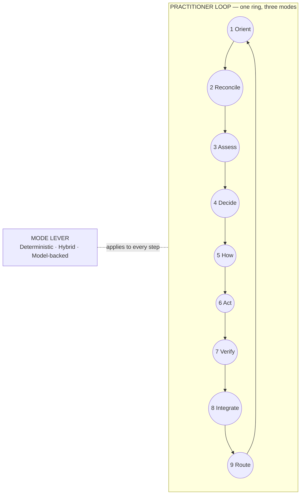
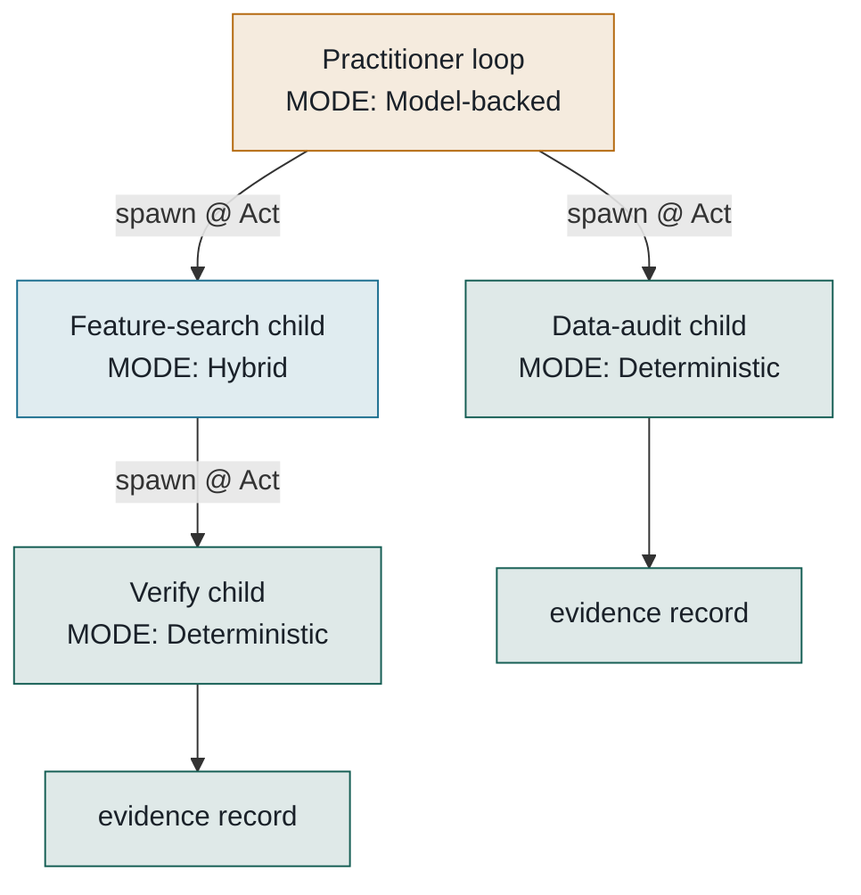
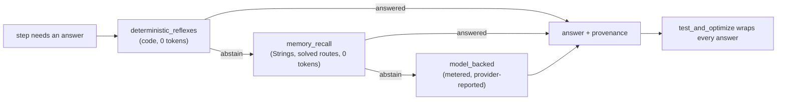
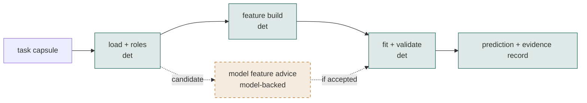
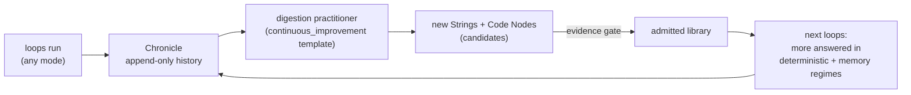

# Loop Engine design language

Status: CURRENT (registered in `conformance_report.CURRENT_DOCS`).
Audience: every harness that draws, writes, or generates anything a human
sees — Claude Code, Codex, OpenCode, Claude Design, artifact pages, the
Studio, the one-pager, pitch decks, docs. This file is the single source
of visual and naming truth. If a diagram or screen disagrees with this
file, the diagram is wrong.

---

## 1. The one idea every visual must carry

Anyone can build loops. Frontier labs publish loop- and graph-based
prompting schemes weekly, and they share one assumption: **the LLM does
all the work at every step**.

Loop Engine's difference — the thing our diagrams have so far failed to show —
is that the loop is **mode-agnostic at every step and every spawn**. The
same nine-step practitioner loop can run:

- **deterministic** — pure code, zero model calls, replayable
  byte-for-byte;
- **hybrid** — deterministic reflexes and memory first, a model only where
  cheaper layers abstain;
- **non-deterministic** — model-backed throughout, for open frontier work.

These are not three products. They are one loop with a mode lever, and a
running loop can **spin off child loops in a different mode than its own**.
The deeper reading (owner, 2026-08-24) is FRACTAL: **any node of the ring
is itself a practitioner loop.** Deliberation is a loop; research is a
loop; execution is a loop. Each node either solves deterministically in
place (drawn as a solid dot) or opens into its own ring and can spin off
further loops. The runtime realizes an opened node as a child loop whose
objective is that node's question — spawn mechanics and permission clamps
unchanged. Public copy prefers "spins off its own loops" over
"delegates". And the law behind the drawing (owner, 2026-08-24):
**everything is a PractitionerLoop** — a solid dot is not a different
kind of thing but a COLLAPSED loop, a full PractitionerLoop run with
deterministic-preferred settings that resolved in one pass.
Self-learning is the system moving work leftward on the spectrum over
time — model-discovered routes distilled into deterministic replays,
i.e. opened rings collapsing back into solid dots.

**Rule D-1: no loop may be drawn without its mode shown. No spawn may be
drawn without showing the child's mode can differ from the parent's.**

## 2. Authoritative nomenclature (drawn from code, never invented)

The names below are the ONLY names. They come from `loop/steps/`,
`loop/loop_templates.py` (`MODES`, `FRAMEWORKS`, `TEMPLATE_LIBRARY`),
`loop/regimes/`, and `architecture_map.py`. A visual that renames them —
"Think", "Plan", "Reflect", "Agent 1" — is nonconforming.

**The nine steps** (frameworks: `nine_step` reference; `five_step`
compact; `custom`; `open`):

| # | Step | One-line meaning (from the step module docstrings) |
|---|------|-----|
| 1 | **Orient** | Reconstruct the latest accepted problem state; assemble context |
| 2 | **Reconcile** | Reconcile ultimate goal, active checkpoint, working blueprint |
| 3 | **Assess** | Is the coming decision supported? Prepare more if not |
| 4 | **Decide** | Generate, challenge, select the most valuable next action |
| 5 | **How** | Find, adapt, compose, or design the method |
| 6 | **Act** | Execute the method, build/run the task graph, or delegate (spawn) |
| 7 | **Verify** | Independently interrogate inputs, outputs, process |
| 8 | **Integrate** | Fold accepted results in; commit + distill |
| 9 | **Route** | Continue / branch / reset / close / finish |

**The three modes** (`MODES`): `deterministic`, `hybrid`,
`non_deterministic`. Public labels: **Deterministic**, **Hybrid**,
**Model-backed** (say "Model-backed", never "AI mode" or "LLM mode", in
customer-facing surfaces; `non_deterministic` stays the internal token).

**The four in-step regimes** (`loop/regimes/` — the waterfall INSIDE a
step, cheapest first): `deterministic_reflexes` → `memory_recall` →
`model_backed`, with `test_and_optimize` wrapping execution. This is the
information-first waterfall made visible.

**The twelve loop templates** (`TEMPLATE_LIBRARY`): reference_nine_step,
compact_five_beat, research_intensive, build_test_repair,
hypothesis_experiment, adversarial_review, continuous_improvement,
legacy_assimilation, minimal_code_only, custom_user_supplied,
generated_candidate, mutated_experimental. The last two are ALWAYS drawn
with the candidate treatment (§3) — they cannot run until admitted.

**The two primitives and the composites**: String and Code Node are the
only primitives. Solution Asset, Portfolio, and packs are first-class
COMPOSITES (owner ruling — never draw a third primitive). The Solution
Canvas renders a Solution; the Chronicle is the append-only history every
visual is a projection of.

**The three intelligence pillars** (public names per PRODUCT-NOMENCLATURE.md: String Intelligence · Code Intelligence · **Previous Run & Solution Intelligence**, short label Run & Solution Intelligence; owner, 2026-08-24 — required in every
system diagram): **String intelligence** (questions, prompts, personas,
timeframes, template strings) · **Code intelligence** (runnable Code
Nodes, mostly deterministic — the cost story) · **Past solutions**
(previous runs as searchable starting points). Runtime memory (the
loop-to-loop note board) is drawn with an IN DEVELOPMENT tag until
built. A knowledge diagram that omits the layers is incomplete.

**Loop-by-loop, not parent-child (public copy)**: loops START loops —
a fresh instance of the same practitioner with its own mode. Say
"starts" or "spins off"; never draw an org chart. The permission clamp
stays as a technical footnote, not the headline.

**Banned in user-facing surfaces**: bare arm codes (TF/L1/D0), "receipt"
(say "evidence record" internally; on marketing surfaces say "links to
the actual run"), "primitive" (retired — say Atomic Component or Code
Node per context), invented step names, unexplained abbreviations, and
parent/child language for loops.

## 3. Design tokens

Palette — mode is the FIRST color axis everywhere (diagrams, canvas
nodes, Studio chips, telemetry rows):

> Token reconciliation 2026-08-24: the first cut of this file picked new
> faces/hexes; the shipped surfaces (landing, Studio shell, consoles)
> already used Bricolage Grotesque + IBM Plex + deep teal #155E54.
> ONE system must win — the shipped one does. Deterministic teal is
> #155E54/#4EC0AE below; faces are Bricolage Grotesque / IBM Plex.

> Palette rotation (correction directive 2026-08-24, supersedes the
> triad below's earlier values): Hybrid is now BLUE-TEAL and
> Model-backed takes AMBER; the violet is RETIRED. Amber doubles as the
> candidate/honesty color and is never decoration. Full tokens:
> DESIGN-GUIDANCE.md (the directive-mandated token authority).

| Token | Light | Dark | Meaning |
|---|---|---|---|
| `--mode-det` | #155E54 | #4EC0AE | Deterministic — deep teal: machine-certain, replayable |
| `--mode-hyb` | #1B6E8F | #4FB0D6 | Hybrid — blue-teal: code first, model on abstention |
| `--mode-mod` | #B4690E | #E8A33D | Model-backed — amber: model-guided, token-metered |
| `--ink` | #1A2129 | #E8EDF2 | Text |
| `--paper` | #FAFBF9 | #12161B | Ground (slight green-grey bias, never pure white/grey) |
| `--line` | #D5DAD6 | #2A323B | Rules, edges |
| `--accent` | #155E54 | #4EC0AE | The product accent IS the deterministic teal — the brand bet |
| `--candidate` | dashed border + 45% opacity fill | same | Anything unadmitted/unverified |
| `--verify` | #C23B3B | #E06C6C | Verification/refusal marks only — never decoration |

Type: display **Space Grotesk** is banned (AI-default). Use **Bricolage
Grotesque** for display, **IBM Plex Sans** for body, **IBM Plex Mono**
for code/data with `tabular-nums` (the faces the shipped surfaces
already use). Uppercase eyebrow labels get +0.08em tracking.

Layout (correction directive 2026-08-24 — supersedes the earlier
ring-first rule): the DEFAULT loop figure is the TWO-ROW LOOP RAIL
(1-5 across the top, 9-6 back across the bottom, connectors closing the
loop) — identical card widths, aligned labels, tooltips, keyboard
focus. A polygon is acceptable only with mathematically aligned nodes
and horizontal labels; radial text is banned. The canonical figure set
is ARCHITECTURE-VISUAL-GUIDANCE.md (V1-V6): rail, spawn tree, three
pillars + capability search, Runtime Memory rail, candidate-canvas
stack → final composition, and the RUN→REVIEW→CURATE→IMPROVE flywheel.
Canvases are left-to-right DAGs. Chronicle timelines are horizontal,
newest right. Step 5's public label is "Determine How".

## 4. The diagram set — portable Mermaid BASELINES

> The canonical figure set is now **ARCHITECTURE-VISUAL-GUIDANCE.md
> V1-V6** (two-row rail as the hero, spawn tree, four intelligence
> pillars, Runtime Memory rail, candidate→final composition, flywheel).
> The Mermaid below survives as portable approximations for docs that
> cannot render the full figures — topology and rotated tokens must
> still match; never freehand a new topology.

Each diagram exists as Mermaid here (portable baseline) and may be
re-rendered richer (SVG/animation) in artifacts and the Studio, keeping
tokens and topology identical.

### D1 — The practitioner ring (Mermaid baseline; the two-row rail V1 is the hero form)
Nine steps on a ring, mode lever beside it. Use: one-pager above fold,
README, pitch opener.

### D2 — Loop of loops, mixed modes (the differentiator)
The spawn tree with each child tinted by ITS OWN mode. Use: one-pager
fold 1b, sales, docs on spawning.

### D2f — The fractal ring (the zoom-in reading of D2; superseded as hero by the rail + spawn tree)
One large nine-node ring; most nodes are solid deterministic dots; two
or three nodes (Decide, How, Act) are OPENED into mode-tinted mini-rings
("deliberate", "research", "execute"), one mini-ring recursing one level
further. Same semantics as D2, drawn as zoom-in instead of org-tree —
prefer D2f wherever the audience is seeing the idea for the first time.
Caption (the one line): *any node is itself a practitioner loop — it
solves deterministically in place, or opens into its own loop and spins
off more.*

### D3 — Inside one step: the regime waterfall
Why "hybrid" is not "sometimes call the model": ordered regimes, model
last, abstention explicit. Use: docs, technical pitch, pricing page
(it IS the cost story).

### D4 — Solution Canvas (below the fold)
The loop's output: a typed, executable, evaluated graph with mode tints
per node and the candidate treatment on unverified nodes. Use: one-pager
fold 2, Studio solutions page.

### D5 — The self-learning flywheel
Work migrates LEFT on the mode spectrum. Use: SaaS pitch, docs on
distillation. Chronicle → digestion → Strings/Code Nodes → next loop
starts cheaper. Caption always carries the no-premature-judgment note:
distillation claims mature at tens of thousands of solutions.

### D6 — "Their loop / our loop" (positioning)
Left: generic LLM loop (every box violet, tokens on every edge). Right:
D2 in miniature. Use: landing, investor one-liner. Never name a
competitor in the graphic.

## 5. Where each surface uses what

| Surface | Above the fold | Below |
|---|---|---|
| One-pager / landing | D1 animated (step pulse ring) + D2 spawn burst | D4 canvas building itself + D5 |
| Studio | D2 as live run tree (real Chronicle) | D4 per solution; D3 in run detail |
| README / PyPI | D1 static + D3 | D4 |
| Pitch | D6 → D2 → D5 | evidence tables |

## 6. Consistency rules (machine-checkable where possible)

- D-1 mode visibility (§1) — every loop shows mode; every spawn can
  differ.
- D-2 the nine step names are verbatim from §2; five_beat surfaces show
  its real compaction, never a re-invention.
- D-3 candidates get the dashed/45% treatment EVERYWHERE (templates
  `generated_candidate`/`mutated_experimental`, unadmitted Strings/nodes,
  unverified canvas nodes).
- D-4 verification red is reserved: only Verify marks, refusals, failed
  gates.
- D-5 every chart ships with the table of the same numbers; every count
  is computed, never typed.
- D-6 loops are rings; canvases are DAGs; timelines are horizontal —
  never mix the three grammars in one figure.
- D-7 public copy says "Model-backed", internal tokens keep
  `non_deterministic`; never "AI agent swarm".
- D-8 figures are SYMMETRIC and visuals-first: balanced composition,
  node labels ≤ 2 words, one caption line per figure, explanatory prose
  lives outside the figure. A figure needing a paragraph to be understood
  is redrawn, not annotated.
- D-9 mode ORDER is always Deterministic → Hybrid → Model-backed, in
  every enumeration, legend, chip row, and animation sequence. Hover
  tooltips carry each mode's one-sentence meaning.
- D-10 BENEFITS BEFORE MECHANISM on customer surfaces: the hero sells
  outcomes (working checkable solutions, cheaper every run); the mode
  lever and loop mechanics come after, as support. The lever is a
  feature, not the headline.
- D-11 SaaS chrome on product pages: a top navigation bar (Product,
  Pricing, About, Blog, Contact, Log in, Get started) and a standard
  footer. A page without chrome reads as a demo, not a product.
- D-12 alignment discipline: numbered vertices + an ALIGNED LEGEND LIST
  beat radial labels (ragged text around a circle fails review); a
  straight-edged polygon (the nonagon) is the preferred loop form; the
  optional/full step split may use hover disclosure.
- D-13 the flywheel must visibly FEED the three intelligence layers —
  "gets cheaper" without showing where learning lands is an unsupported
  claim.
