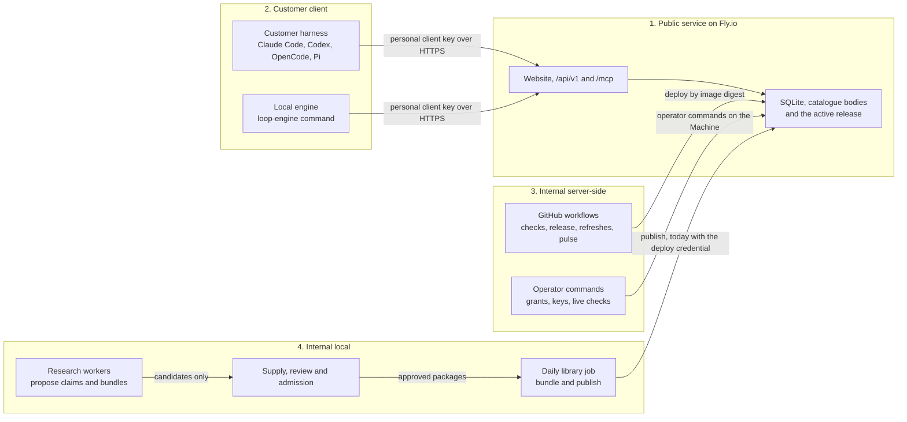

# Four-zone architecture, September 27, 2026

Kind: dated architecture record. It maps what runs today into four zones and
proposes a folder structure and boundary checks as a migration plan. Nothing
moves in this pass.

Date: 2026-09-27. Observed from the source at `origin/main` revision
`923453a4`, the workstation's cron table and user timers, the job logs and the
live service on September 27, 2026. Inferred facts are marked as inferred. The
folder layout and the checks in the last sections are proposals, not
implemented behavior.

## Why four zones

On September 27, 2026 the owner asked for "splitting the website server side
that's public that interacts with the customer and the customer's harness,
making sure that is appropriately compartmentalized, like server-side logic
that serves a customer. Then we have the client-side logic, which is the
harness and setup, etc. in the MCP between those. But then we also have
internal server-side as well as internal local components. And these internal
components are meant to be swarms of agents or dedicated pipelines or
individual agents with skills that do the work of a team of individuals. We
don't have a team of individuals, but we do have a lot of agents."

A zone is a deployment and trust boundary: where code runs, what it may
reach, which credentials it holds and which contract it uses to talk to the
next zone. A zone is not a runtime type, a role or a graph vertex. Work that
the engine runs inside any zone is still a Loop, as
[AGENTS.md](../../AGENTS.md#one-loop-runtime) requires, and a zone grants no
authority of its own. The zones answer where code lives and runs, which the
[repository layout record](REPOSITORY-LAYOUT-AND-RECORD-KINDS-2026-09-18.md)
calls the folder path question; they do not replace the classification trees.

```text
Baltor, by zone
├── 1. Public service
│   ├── Runs on: Fly.io app baltor-pilot, one Machine, one volume at /data
│   ├── Serves: the website, the account and staff pages, /api/v1/, the
│   │   Model Context Protocol endpoint /mcp and catalogue bodies
│   └── Talks to: customers' browsers and clients; Stripe, the identity
│       provider and the email provider
├── 2. Customer client
│   ├── Runs on: the customer's machine, inside their own harness
│   ├── Holds: the customer's personal client key and their own model access
│   └── Includes: quickstarts, the customer skill and plugins, protocol
│       client settings, placement of served files, the local engine
├── 3. Internal server-side
│   ├── Runs on: GitHub Actions and operator commands against the Machine
│   ├── Holds: the deploy credential, the operator keys for live checks
│   └── Includes: continuous integration, the guarded release, image
│       publication, directory refreshes, the live pulse and nightly browser
│       checks, grants and key reissue
└── 4. Internal local
    ├── Runs on: the owner's development workstation (and the owner's
    │   review server on the same network)
    ├── Holds: model access (Ollama Cloud, the review server, the Codex and
    │   Claude Code command lines) and, today, two credentials of other
    │   zones (see Crossings to narrow)
    └── Includes: the agent teams and pipelines that do the work of a staff:
        library supply, review and admission, the daily library job, the
        oracles, source discovery, research workers for maintained
        decisions and capabilities, measurement
```

## How the zones talk to each other



Each arrow is one contract. The customer client reaches the public service
only over HTTPS with a personal client key, through the versioned
`/api/v1/` requests and the Model Context Protocol endpoint. Internal zones
reach the public service through the release workflow, operator commands
on the Machine, and today also through the daily job's catalogue
publication. That last arrow is the widest one: it uses the same Fly
credential as a release (see [Crossings to narrow](#crossings-to-narrow)).

## The four zones in detail

The [current deployment](MVP-CLIENT-SERVER.md#current-deployment) section is
the statement of what runs and where. When this record differs from it,
follow that section.

### Zone 1: public service

Where it runs: the Fly.io application `baltor-pilot`, one Machine (one
shared processor, 2 GB of memory) in region `iad`, with the encrypted volume
`loop_engine_service` mounted at `/data`. The image comes from
`Dockerfile.service`; the process is `loop-engine service serve --config
/data/host.json` behind Fly's TLS proxy. Ten hostnames reach it.

What it serves: the website (48 packaged pages and the rendered pages
`/library`, `/models`, `/endpoints`, `/can-i-run`, the red team case study,
`/changelog`, `/features` and `/todo`), 27 interface routes under `/api/v1/`
(health, capabilities, sign-up, session, account access, provisioning,
download, retrieval, billing, staff administration), and the Model Context
Protocol endpoint `/mcp` with the tools `provisioning_discover`,
`provisioning_list`, `provisioning_manifest`, `provisioning_read`,
`intelligence_search` and `provisioning_report`, on protocol revisions
`2025-11-25` and `2026-07-28`.

What it may reach: `api.stripe.com` (checkout, portal, customers, and a
read-only account check), the identity provider's project (session checks,
signing keys, and the administration routes that create confirmation links
and users), and `api.resend.com` for sign-up and recovery email. No other
outbound host was found. Only seven service modules may import network
libraries, by the `network_allowed_modules` list in
`src/loop_engine/forbidden_paths.json`. The service makes no model call.

Credentials it holds, as Fly secrets named by `env:` references in the host
file: `STRIPE_API_KEY` (a restricted live key), `STRIPE_WEBHOOK_SECRET`,
`SUPABASE_PUBLISHABLE_KEY`, `BALTOR_IDENTITY_SERVICE_KEY`,
`BALTOR_MAIL_API_KEY` and `BALTOR_WAITLIST_SOURCE_SECRET`. It stores only
digests of customer keys.

State it keeps: one SQLite database on the volume (tenants, key digests,
grants, entitlements, usage, billing events, feedback, public link counts,
catalogue releases, the active release pointer and withdrawals), the
content-addressed catalogue body store `/data/catalogue-bodies`, the upload
area `/data/incoming`, and `/data/host.json`. The starter catalogue travels
read-only in the image at `/opt/baltor/catalogue`.

Boundary contract: versioned requests under `/api/v1/` and the protocol
methods above, authenticated by a personal client key (`le_` prefix,
scoped, checked again at use), a browser session, or a verified external
token where the host enables it. A body read is the one metered unit. The
service changes a catalogue only through its own `publish`, `withdraw` and
`rollback` operations, run as operator commands on the Machine.

Source: `src/loop_engine/core/service_runtime/`, 86 modules (55 production
modules, 29 check modules, one test fixture module and the package file).
At start the service imports 76 `loop_engine` modules, 44 of them from
outside its own folder. Its 71 import statements into the rest of the
package reach 22 modules; the largest are `core.provisioning_server` (23
statements), `core.harness_intelligence` (16), and the `catalog` store and
query modules. Three of those edges cross zones and are listed under
[Crossings to narrow](#crossings-to-narrow).

State on September 27, 2026: live, release 40 from `eae7946d`, rollback
release 39, all ten hostnames passing.

### Zone 2: customer client

Where it runs: the customer's own machine, inside the harness the customer
already uses, or the local engine installed with `pip install loop-engine`.

What it ships today:

- Harness connection settings for Claude Code (`.mcp.json`), Codex
  (`config.toml`), OpenCode (`opencode.json`) and Pi (`.pi/baltor.json` with
  the extension served at `/assets/pi/baltor.ts`), published as
  `web_assets/client-recipes.json` and shown by `/setup`, the quickstarts
  and the signed-in workspace. Each names the credential variable
  `BALTOR_SERVICE_TOKEN`, never its value.
- Five quickstarts served under `/docs/`: Claude Code, Codex, OpenCode, Pi
  and the Baltor Harness. The daily quickstart check exercises each against
  the live service.
- The local engine: `setup`, `doctor`, `solve`, `overnight`, `runs`,
  `report`, `studio`, task, model, extension, settings and plugin commands,
  the typed decision engines, and a generic protocol client. It has no
  built-in Baltor client yet (inferred from the source: no module reads
  `BALTOR_SERVICE_TOKEN`).
- `integrations/`: a Claude Code plugin and a Codex plugin (version 0.1.0),
  each with three thin skills that drive the local engine
  (`loop-engine-setup`, `loop-engine-run`, `loop-engine-inspect`). They drive
  the local engine, not the Baltor service, and no page links them.
- Native placement of served skills for Claude Code and Codex exists only as
  the workstation tool `tools/install_selected_material.py`, which is not in
  the wheel.

Credentials it holds: the customer's personal client key in the harness
environment, the browser session for the website, and the customer's own
model access (for example `OLLAMA_API_KEY`, `OPENROUTER_API_KEY`,
`OPENAI_API_KEY`, `GEMINI_API_KEY` or a custom local endpoint). Baltor never
receives the customer's model credentials.

Boundary contract: HTTPS to `https://baltor.ai/mcp` or `/api/v1/` with the
personal key; the harness decides what to place and run under its own local
policy. Offered, fetched, loaded, used and verified stay separate facts.

State on September 27, 2026: live for search and download in four harnesses
plus the Baltor Harness; the first-party customer skill 0.3.0 is an
unreviewed candidate that a parallel builder is integrating.

### Zone 3: internal server-side

Where it runs: GitHub Actions for the workflows, and operator commands that
act on the live service from the workstation (they belong to this zone
because of what they reach and hold, not where the shell runs).

What it may reach: the Fly API and the Machine (deploy, `machine exec`,
SFTP to `/data`), GitHub (runs, variables, commits to `main` by the two
directory refreshes), the live hostnames over HTTPS, and the payment,
identity and email providers for the named operator checks.

Credentials: the Fly deploy credential (keyring item `fly`, through
`tools/fly_operator.py`), the service administrator and diagnostic service
keys (keyring `baltor-admin` and the service-access items, reissued by
`tools/reissue_service_keys.py`), the identity provider's secret key and the
email sending key for the named operator commands, and the workflow's own
GitHub token. `tools/operator_credentials.py` resolves every named reference
in `tools/operator_credentials.json` (names only, no values) and never
prints one.

Boundary contract: a release comes only from a committed `main` revision
whose continuous integration run passed, through
`.github/workflows/fly-pilot.yml`, deployed by image digest with the previous
image kept for rollback, as the
[authority section](../../AGENTS.md#commit-push-and-release-authority)
states. Catalogue changes go through the service's own `publish`,
`withdraw` and `rollback` operations. Live checks read; the named journey
and identity checks create and remove disposable accounts.

The operator commands in `tools/`, grouped: release and live checks
(`check_fly_service_container.py`, `check_hosted_catalogue.py`,
`check_hosted_service.py`, `check_hosted_website.mjs`,
`check_live_site_for_people.mjs`, `check_live_pulse.py`,
`check_quickstarts.py`, `measure_service_latency.py`,
`check_native_client_connection.py`); accounts and keys
(`check_hosted_administrator.py`, `reissue_service_keys.py`,
`service_admin_operator.py`, `stage_service_secrets.py`,
`check_identity_customer_access.py`, `identity_qualification_host.py`,
`check_live_account_journeys.mjs` with `fresh_account_journey.mjs`,
`invite_beta_user.py` and `waitlist_operator.py`, both probably retired by
the one-way-in account model); data safety (`check_pilot_backup_restore.py`,
`promotion_codes.py`); directory refreshes (`build_mcp_directory.py` with
`mcp_directory/`, `build_model_directory.py` with `model_directory/`);
research watch (`refresh_research_sources.py`,
`research_source_watch.json`, `summarize_research_watch.py`); payments test
setup (`setup_stripe_sandbox.py`); library safety jobs that are documented
but not scheduled (`rescan_served_catalogue.py`,
`check_upstream_sources.py`); and the credential tools
(`fly_operator.py`, `operator_credentials.py`, `operator_credentials.json`).

### GitHub workflows (zone 3)

Read from `.github/workflows/` and the 30 most recent runs on September 27,
2026.

| Workflow | Triggers | Secrets and variables | What it reaches and writes | State on September 27, 2026 |
|---|---|---|---|---|
| `ci.yml` | Push to `main`, pull request, manual dispatch | `OLLAMA_API_KEY`, used only by the job that runs when `github.event_name == 'workflow_dispatch'` (the manual live Ollama orientation, up to five model calls) | GitHub runners only; no deploy | Green on every push (8 of 8, the last at 05:42 UTC). Red on both dispatched runs of the day (12:27 UTC at `a3de0186`, 13:09 UTC at `923453a4`), which the two directory refreshes started. The head of `main`, `923453a4`, therefore has no passing run, and the newest revision the release workflow accepts is `12ef6e50` |
| `fly-pilot.yml` | Manual dispatch only; the job runs only on `main` | `FLY_API_TOKEN` and seven `FLY_*` variables, including the deployment gate | Builds and deploys the service image to Fly by digest, applies grants, checks readiness | Release 40 green at 05:09 UTC; release 39's run marked failed after the image applied and was reconciled by hand |
| `publish-image.yml` | After a finished continuous integration run on `main`; manual dispatch | `GITHUB_TOKEN` | Pushes the worker image to the GitHub container registry; that image is not deployed | Green |
| `live-pulse.yml` | Every six hours at minute 17; manual dispatch | None | Read-only checks of every live hostname | Green, four runs |
| `research-watch.yml` | Daily at 07:41 UTC; manual dispatch | The workflow token, to open issues | Reads the research watchlist's sources; opens an issue with the summary | Green |
| `mcp-directory.yml` | Daily at 06:41 UTC; manual dispatch | The workflow token; `MCP_DIRECTORY_COMMIT` | Refreshes the public server directory data, commits it to `main`, then dispatches continuous integration | Green itself; the continuous integration run it dispatches fails |
| `model-directory.yml` | Daily at 07:23 UTC; manual dispatch | The workflow token; `MODEL_DIRECTORY_COMMIT` | Refreshes the public model and endpoint directory data, commits it to `main`, then dispatches continuous integration | Green itself; the continuous integration run it dispatches fails |
| `browser-nightly.yml` | Daily at 06:23 UTC; manual dispatch | The workflow token, to open issues | Runs the browser suite against local fixture services | Green |

The scheduled runs started five to six hours after their cron times on
September 27, as GitHub's scheduler allows. The trigger fault in `ci.yml`
is a parallel builder's item in this consolidation; the
[rules flexibility audit](RULES-FLEXIBILITY-AUDIT-2026-09-27.md) records
it.

### Zone 4: internal local

Where it runs: the owner's development workstation, with the owner's review
server on the same network as one model lane.

What it may reach: the local library stores (`~/baltor-library/`,
`~/baltor-bundles/`, the import store), public source hosts for imports and
discovery (read), the owner's drive inventory (read-only), model providers
within the recorded model authority, and, today, the Machine for catalogue
publication.

Credentials: model access (Ollama Cloud, the review server lane, the Codex
and Claude Code command lines), the GitHub command line login for imports,
and two credentials that belong to other zones: the Fly deploy credential
used by the daily job's publish step, and the live payment key and identity
secret key that `tools/weekly_number.py` resolves to count customers.

Boundary contract: a candidate is only a candidate until the independent
review approves it, and a producer family never approves its own work.
Every model call is recorded with its model, usage and outcome. Output
leaves this zone only as a catalogue release bundle (today) and as dated
records.

The pipeline commands in `tools/`, grouped by team: library release
(`import_licensed_harness_files.py` with `licensed_import/`,
`write_reviewed_catalogue.py`, `combine_reviewed_catalogues.py`,
`build_catalogue_release_bundle.py`, `build_host_catalogue_manifest.py`,
`carry_catalogue_approvals.py`); admission review (`candidate_review/`,
`review_catalogue_candidates.py`, `oracle_review_served.py`,
`measure_step_function_tags.py`); supply (`overnight_candidate_batch.py`,
`opencode_generation_lanes.py`, `generate_original_native_candidates.py`,
`generate_item_variations.py`, `native_proposals_from_overnight_candidates.py`,
`native_harness_candidates.py`, `prepare_harness_candidates.py`,
`stage_intelligence_candidates.py`, `ingest_outside_material.py`,
`harness_idea_matrix.py`, `build_volume_seed_ideas.py`,
`scan_local_volume.py`, `expand_occupation_inventory.py`, with the operator
guides `GENERATE-ORIGINAL-NATIVE-CANDIDATES.md`,
`INGEST-OUTSIDE-MATERIAL.md` and `PREPARE-HARNESS-CANDIDATES.md`);
measurement (`weekly_number.py`, `inventory_harness_library.py`,
`feedback_report.py`); showcase research (`red_team_decisions.py`,
`task_campaign.py`, `harness_t1_gates.py`, `audit_public_websites.mjs`);
and the early overnight tools, which nothing calls today
(`overnight.py`, `overnight_queue.py`, `session_intake.py`,
`adaptive_divide.py`, `recursive_divide.py`, `strategies.py`,
`decompose.py`, `full_solve.py`, `opencode_loop.py`, `jira_emulator.py`,
`morning_report.py`). `resources/` holds passive data for several of them.

### Development checks

Fifty-six entries of `tools/` are development checks, generators and report
builders that run in continuous integration, the pre-push script or by hand,
and belong to no product zone: the architecture report (`architecture_audit*.py`,
`architecture_report/`, `architecture_report_data.py`,
`capture_architecture_checks.py`, `check_architecture_report.mjs`,
`export_component_inventory.py`, `website_comparison.py`); generators
(`build_continuation_status.py`, `build_development_tracker.py`,
`build_documentation_index.py`, `build_public_status_pages.py`,
`build_records_index.py`, `build_showcase_page.py`, `render_deck_card.mjs`,
`make_checkpoint.py`); the browser suite (`check_service_workspace.mjs` and
its libraries `catalogue_browser_checks.mjs`, `deck_checks.mjs`,
`directory_browser_checks.mjs`, `listing_text.mjs`,
`public_wording_rules.mjs`, `showcase_page_checks.mjs`,
`signup_session_boundary_checks.mjs`, and
`model_directory_browser_checks.mjs`, which nothing imports);
other checks (`check_component_guides.py`, `check_documentation_browser.mjs`,
`check_documentation_index.py`, `check_harness_fresh_instances.py`,
`check_publish_guard.mjs`, `check_readme_quickstart.py`,
`check_rollback_key_version.py`, `check_service_documentation.py`,
`check_signup_session_boundaries.mjs`, `check_website_layout.mjs`,
`check_website_site_map.py`, `check_client_journey_in_containers.py`,
`verify_launch_slice.py`, `owner_requests_ledger.py`); measurements
(`measure_catalogue_release_scale.py`, `measure_catalogue_serving.py`,
`measure_paged_listing.py`, `capture_website_devices.mjs`,
`website_devices.json`); the test machinery (`pre_push_check.sh`,
`run_test_shard.py`, `ci_test_shards.json`, `balance_test_shards.py`,
`git-hooks/`, `create_studio_acceptance_fixture.py`); and analysis helpers
(`conformance_explain.py`, `policy_edit.py`, `refusal_census.py`,
`spectrum_score.py`, `summarize_product_proof.py`). The 120 `test_*.py`
files each follow the zone of what they test: 18 test public service code,
10 customer client code, 22 internal server-side code, 55 internal local
code and 15 development checks.

## Source packages by zone

`src/loop_engine` is one package that every zone installs, so a module's
zone is the zone of the deployable unit that runs it. The service image
installs the whole wheel; "service imports" counts the modules the service
entry path imports at start (S) and on request paths (L), measured by a real
import on September 27, 2026.

| Entry | Purpose | Zones | Service imports |
|---|---|---|---|
| `core/service_runtime/` | The public service | 1, with operator commands in 3 | S 38, L 20 |
| `catalog/` | Record store protocol and stores (SQLite, package JSONL, DuckDB, in memory) | 1 (all service state), 2, 4 | S 7 |
| `loop/` | The Loop runtime, kernel, encapsulation and profiles | All | S 10 |
| `core/` other families | Runtime services, adapters and components (below) | All | S 16, L 6 |
| `code_nodes/` | Solve runtime, validators, executors, the Solution Canvas and export | 2 (parked command paths), 4 (examples, benchmarks, devtools) | None |
| `memory/`, `ontology/`, `strings/`, `templates/`, `scheduling.py` | Memory architecture, foundational ontology, passive model-read strings, task templates | 2, mostly parked | None |
| `generation/` | Intelligence Foundry generation and composition | 4, reached only from devtools; parked | None |
| `intelligence/`, `governance/`, `skills/` | Data: the four persistent layers, candidate staging, one candidate skill | 2 and 4 | None |
| `data/` | Packaged YAML and JSON: projections of the architecture and terminology, engine slots, harness recipes, library facets, the component ontology and folder map | 1 reads `library_facets.yaml`; 2 and 3 read the rest | Read only |
| `__main__.py`, `cli_help.py`, `service_cli.py` | The `loop-engine` command and its `service` dispatch | 1 (entry), 2, 3 | S |
| `solve_cli.py`, `overnight_cli.py`, `run_history_cli.py`, `record_cli.py`, `adaptive_practitioner_cli.py`, `decision_cli.py`, `cli_operations.py` | Customer commands of the local engine | 2 (some parked) | None |
| `_conformance_scan.py`, `_conformance_test.py`, `_self_test.py`, `conformance_report.py`, `architecture_contract.py`, `architecture_map.py`, `repository_conformance.py`, `repository_structure.py`, `nomenclature_conformance.py`, `semantic_conformance.py`, `semantic_freedom_conformance.py`, `public_runtime_conformance.py`, `runtime_ontology_check.py`, `parameter_boundary*.py`, `backend_isolation.py`, `reachability_report.py`, `structure_review.py`, `forbidden_paths.json`, `architecture_conformance.json`, `ARCHITECTURE-MAP.md` | Development gates shipped in the wheel | Development checks (continuous integration and the workstation) | `_self_test` at start, by module import only |
| `campaign.py`, `kaggle_report.py`, `parallel_runner.py`, `PARKED.md` | Parked or retired plumbing | 4 | None |
| `kernel/`, `runtime/`, `node/` | Declared boundaries that hold a README or an ontology namespace only | None | None |

The flat part of `core/` (380 files beside six subpackages), by family:

| Family | Modules | Zones | Service imports |
|---|---|---|---|
| `library_ingestion/` | 47 | 4 (outside material to candidates); the service imports 4 for facet and step function tags | S 4 |
| Model gateway, routes and provider clients (`model_*`, Ollama, Mistral, OpenRouter, OpenAI Responses, OpenCode Zen, custom endpoints) | 45 | 2, 4 | L 1 |
| Intelligence, context and retrieval | 28 | 2; the service uses 7 | S 4, L 3 |
| Adaptive Practitioner (`adaptive_practitioner_*`, `adaptive_host_*`), parked | 28 | 2 | None |
| Harness process, selection, layering and semantics (`harness_*`) | 24 | 2 | None |
| Harness launch recipes (`harness_*recipe*`) | 22 | 4 (inferred; only their checks import them) | None |
| Run History and observation | 23 | 2 | None |
| `decisions/` | 21 | 2, 4 (review panel, red team) | None |
| Extensions, skills, plugins, the generic protocol client, web tools | 18 | 2 | None |
| Settings and configuration | 17 | 2 | None |
| Semantic runtime and typed decisions, `independent_*`, `stage_*`, `reusable_capability_*`, `information_*`, `task_*`, workspaces, records and Studio | 86 | 2 | None |
| Other runtime support (action vectors, recovery, prompts, step state), the capability directory and `external_harness_*` | 50 | 2; the service loads the capability directory lazily | L 2 |
| `opencode_*` | 10 | 2, 4 (generation lanes) | None |
| Provisioning server and the older worker service | 9 | 1 (`provisioning_server`, `provisioning_mcp`, `node_provisioning`), older worker (`service_api`, `saas_routes`) | S 4 |
| `practitioner_runtime/` | 4 | 1, 2 | S 2 |
| `harness_intelligence*` | 3 | 1 (the served catalogue model), 2, 4 | S 1 |
| `development_*`, `astra_*` | 10 | 4 | None |
| `reactive_*` | 6 | 4 (embodiment lab) | None |
| `engines/` | 10 | No product path imports it yet; only checks | None |
| `step_execution/` | 1 | Declared step edge only | None |

260 of the 790 modules are reached by none of the measured entry points
(service, customer commands, conformance commands, tools, devtools,
examples); most are checks collected by name or parked modules.

Other top-level folders:

| Folder | What it is | Zone |
|---|---|---|
| `integrations/` | Claude Code and Codex plugins for the local engine | 2 |
| `examples/` | 31 runnable examples; `29_intelligence_service/starter-catalogue/host-release` is copied into the service image | 2 (learning), 1 (starter catalogue), development checks |
| `docs/` | Customer guides that `tools/build_documentation_index.py` turns into `/docs` pages, plus internal records | 1 and 2 (guides), internal (the rest) |
| `devtools/` | The development assurance plane: hardcoding audit, qualification and embodiment labs | Development checks |
| `embodiments/` | Experimental harness recipes; product code may not import them | 4 |
| `benchmarks/`, `case-studies/`, `kaggle/` | Frozen task populations, measured runs, competition notebooks | 4 |
| `artifacts/`, `checkpoints/`, `graphify-out/` | Dated evidence and generated caches | 4 records of zones 1 and 3 |
| `showcase/` | The architecture presentation and its visual checks | Development checks |
| `tools/` | Commands and checks, mapped below | 3, 4 and development checks |

## Scheduled work on the workstation

Read from `crontab -l` and `systemctl --user list-timers` on September 27,
2026, and from each job's own log. Private scripts under
`~/baltor-private/tools/` are named only. Times are as the entries state
them; the cron table keeps America/New_York time.

| Schedule | What runs | Zone | Runs from | State on September 27, 2026 |
|---|---|---|---|---|
| Cron, 17 minutes past every sixth hour | The daily library job, private script `daily_library_release.sh`, with `--publish` | 4, publishing into 1 | The job checkout `~/.le-library-job`: detached at `c3db3408` of September 26 until it was moved to `12ef6e50` after 14:40 UTC on September 27 | Live with faults. Every stage ran in the 10:17 UTC slot, but the publish step logged a failure on an empty reply although the live count moved to 12,191, so the live check and counts did not run |
| Cron, hourly at minute 40 outside the slot windows | The second-look oracle, private script `oracle_review.sh`, 24 items a run | 4 | `~/.le-library-job` | Broken until 14:40 UTC on September 27: every run refused because `tools/oracle_review_served.py` was not in the job checkout at `c3db3408`. The checkout now holds the tool; the first run that can use it is due at 15:40 UTC and was not yet observed when this record was written |
| Cron, 05:50 and 17:50 | The variation oracle, private script `oracle_variations.sh`, 12 items a run | 4 | `~/.le-library-job` | Broken for both runs so far, for the same reason (`tools/generate_item_variations.py` was not in the job checkout); the next run at 17:50 machine time is the first with the tool present |
| Cron, every 10 minutes | The overnight batch watchdog, `run_lanes.py --watchdog` | 4 | The shared checkout's `.loop-engine-dev/overnight-2026-09-24/` | Idle. The batch is complete and every run logs `complete` |
| Cron, daily at 06:17 | The Ollama Cloud lane probe, `run_lanes.py --probe-ollama` | 4 | Same folder | Broken. Both runs (September 26 and 27) logged `no_key_in_environment`: the cron environment cannot see the key. The owner asked on September 25 for daily retries |
| Cron, Mondays at 06:10 UTC | The weekly number, `tools/weekly_number.py` | 4, reading 1 and the payment and identity providers | The shared checkout if it holds the tool, otherwise the agent worktree `~/.le-agent-weekly-number` | Installed, not yet run on schedule (the first Monday is September 28). The shared checkout lacks the tool, so the run would use the agent worktree. The tool reads only release 37 as latest while two release record formats exist |
| Cron, daily at 05:40 UTC | The quickstart live check, `tools/check_quickstarts.py --origin https://baltor.ai` | 4, reading 1 | The shared checkout if it holds the tool, otherwise `~/.le-agent-quickstarts` | Live. On September 27 it passed 5 of 5 from the agent worktree and wrote its record into that worktree |
| User timer `baltor-source-discovery`, 02:35, 08:35, 14:35 and 20:35 UTC | The read-only source discovery engine (private, version 5), then the metadata research dispatcher (private) | 4 | `~/baltor-private/source-discovery-2026-09-26/` | Live, eleven runs recorded. The service is sandboxed (read-only home, 384 MB memory, a quarter of one processor) with network reads and local writes only. The dispatcher's drop-in is headed "proposal only" but is active |

The workstation also runs work of two other projects: a five-minute cron job
of `roll_watch` and the `taedri-scheduler` and `taedri-watchdog` timers. They
are not Baltor zones, but they share its processor, memory and disk.

## Agent teams and pipelines

The owner's words: the internal components "are meant to be swarms of
agents or dedicated pipelines or individual agents with skills that do the
work of a team of individuals". This catalogue names each team by the job a
person would hold. Model authority is the one the
[authority section](../../AGENTS.md#commit-push-and-release-authority)
records: Ollama Cloud within the owner's subscription, the owner's review
server, and the Codex and Claude Code command lines, every call recorded,
and a producer family never approving its own work.

| Team (the job it does) | Purpose | Inputs | Outputs | Schedule | Model authority | State on September 27, 2026 |
|---|---|---|---|---|---|---|
| Library release (release manager) | Turn approved packages into a catalogue release and publish it without a redeploy | The import store, the review ledger, the host licence policy | A bundle under `~/baltor-bundles/`, a published release, a slot journal under `~/baltor-library/daily/` | Every six hours | The screening call only, by a calibrated reviewer from another family | Live; 7,611 packages approved in the week; three of the last five slots hit a stage failure |
| Admission review (reviewer) | Deterministic prechecks and one screening call against the written criteria | Exported packages | Verdicts in the review ledger | Inside each daily slot | As above; the calibration step excludes a reviewer that approves a known-wrong control | Live |
| Second look (auditor) | Re-review served items and withdraw what fails | The served catalogue | Withdrawals with notes | Hourly | A family other than the producer | Never ran until the job checkout moved on September 27; first run pending |
| Variations (editor) | Propose improved variations of served items | Served items | Candidate variations for review | Twice daily | The review server lane | Never ran until the job checkout moved on September 27; first run pending |
| Supply lanes (authors) | Generate original candidates from seeds and ideas | Seed batches, idea grids, the owner's drive inventory | Candidate files for review | On demand; the overnight batch finished | Ollama Cloud (spent until October 1), the review server, Codex and Claude Code sessions | Idle. 8,904 overnight candidates and 210 Claude-written candidates were never reviewed; seed wave 1 had all 197 candidates rejected |
| Licensed imports (sourcing) | Import licence-cleared files from public repositories | Source lists, licences | The import store (about 45,000 approvable packages left) | On demand | None for import; review as above | Idle between batches |
| Source discovery (scout) | Find new repositories, skills, servers and papers | Configured source lists and topic rotation | A review queue in the private discovery state | Four times a day | None (read-only collection) | Live |
| Metadata research (analyst) | Enrich discovered sources with metadata | Discovery runs | Private reports | After each discovery run | Recorded in its private folder | Live, labelled as a proposal |
| Knowledge radar (researcher) | Maintained decisions and capabilities: questions, snapshots, claims, tested files | The question registry, source snapshots | Candidate decision cards, data files, code and tools | Proposed, not installed | Research authority only, no publishing credential | Being built by a parallel builder; not on `main` |
| Measurement (analyst) | The weekly number, quickstart checks, the serving measurement | The live service, payment and identity counts | Dated records | Weekly and daily | None | Quickstart check live; weekly number installed |
| Release and live checks (site reliability) | Release reviewed `main`, check every hostname, reissue diagnostic keys, apply grants | A green continuous integration run | Release records, live check records | On demand | None | Live; release 40 on September 27 |
| Worktree audit (archivist) | Find unsaved work and commits missing from `main` | All worktrees and stashes | Loss reports, saved patches and bundles | On demand | None | Ran on September 25 and 27 |
| Research programmes (research staff) | Market, harness and paper research by Claude and Codex workflows | Owner questions | Dated research records | On demand, within weekly model budgets | Claude Code and Codex, until each weekly limit | Paused: Claude's weekly limit reached on September 26, Codex blocked until October 3 |
| Support drafting (support) | Draft replies and help pages | Support messages | Drafts for a person to send | Planned | A recorded provider call per draft, under the approved privacy notice | Paused line in a worktree |

## Research privileges and release privileges

On September 27, 2026 the owner endorsed the central claim of a design for a
daily research and capability release pipeline: "The central product is
therefore not a daily digest or a directory. It is a maintained library of
engineering decisions and executable capabilities: research once per
relevant task and configuration, preserve the evidence, test the
implementation, and let many harnesses reuse the result without repeating
the investigation." The owner's rule for what becomes a file: research that
takes an engineer more than about five minutes across several sources is
done once and served as a file, and a volatile fact, such as a stock price,
is served as a tool that fetches it, never as a stored value.

That pipeline reads the open internet, runs models on what it reads and
builds code. Everything it reads is untrusted. The design therefore keeps
two sets of privileges apart:

- Research privileges: read the network, snapshot sources, call models
  within the recorded model authority, write claim records and evaluation
  records, and build candidate bundles. Research workers propose. They hold
  no production publishing credential, no signing key and no authority over
  the approval rules.
- Release privileges: approve against the written criteria, sign or pin a
  bundle, publish it to the live service, withdraw an item and roll a
  release back. These sit with the independent review and the catalogue
  release path that every other package already uses.

The public service only serves the active release and records outcomes. The
customer's harness materializes a pinned release under its own local
policy. Each stage sits in one zone:

| Stage | What it holds | Zone | Privilege | Today |
|---|---|---|---|---|
| Question registry | The questions worth researching once (for example "which uptime monitor fits a single Fly Machine"), each with its fields, owner, check cadence and the configuration it applies to | 4, as a versioned data file reviewed like code | Research reads it; a change is a reviewed commit | The knowledge radar topic catalogue is being built by a parallel builder; not on `main` |
| Source snapshots | The fetched page, paper, repository or dataset, with its address, retrieval time and digest | 4, in the local library store | Research: network reads and local writes only | Source discovery keeps review queues under the private discovery state; no snapshot store for claims yet |
| Claim records | One typed claim per fact or recommendation, citing snapshot digests, with `checked_at`, `check_again_by` and a volatility class (stable facts become files; volatile facts become tools) | 4 | Research writes; nothing here is active | Missing; proposed record |
| Evaluation runs | Tests of the implementation (Python or TypeScript) in a sandbox, and with-and-without runs of a decision card on frozen tasks | 4 for model-led runs; 3 for deterministic tests in continuous integration | Research runs them in a sandbox with no production credential | Package prechecks and the failure laboratory line exist; no per-claim evaluation |
| Bundle building | Harness-native packages (decision card, data file, code, tool) with per-file digests, built deterministically | 4, the daily job's bundle stage | No model authority needed | Exists for library packages (`tools/build_catalogue_release_bundle.py`) |
| Promotion | Deterministic prechecks and one screening call by a calibrated reviewer from a family that did not produce the item, under the written criteria | 4 today; proposed to move the approval ledger check to 3 | Release: approval-rule authority; a producer never approves its own work | Exists (the decision table's approval row); the criteria files change only by reviewed commits |
| Publication | Upload of the approved bundle and a move of the active release pointer, guarded by the expected active release | 3 by design; today run from 4 with the Fly deploy credential | Release: the publishing credential | Exists; the crossing is listed below |
| Serving | Search, manifest and body delivery of the active release; outcome records (downloads, reports, feedback) | 1 | Serve and record only | Exists; expiry is not yet enforced at serving |
| Revocation | Durable withdrawal of an item version, rollback of the pointer, withdrawal on customer reports | 1 executes; 3 operators and signed-in customers trigger | Release | Exists in the service (`withdraw`, `rollback`); reaching copies already installed on customer machines is missing |
| Materialization | Placing a pinned release into the step's working directory under the customer's allowlist and effect policy | 2 | The customer's own local policy | Placement guidance and quickstarts exist for four harnesses; pinned local policy is roadmap work |

The analysis the owner shared on September 27 adds three rules that the
zones carry. Research is kept in three sharing scopes: the public scope,
pooled across customers, lives in the private registry and is served by
zone 1; an organization's private scope lives in zone 1 behind that
organization's tenant boundary once the Team plan exists; a case's private
scope stays on the customer's machine in zone 2 unless the customer sends
it. Only the public scope is pooled. Every answer that zone 1 serves states
where it stands: an approved result, a candidate, needs research, needs
local evaluation, blocked by policy, or no eligible option. Success is
measured by research reuse and by accepted-task improvement over a
harness's own browsing, never by counts of links, files or summaries.

Six behaviours show that this pipeline is ready for production. Each is a
check of behaviour, not of wording, and the
[rules flexibility audit](RULES-FLEXIBILITY-AUDIT-2026-09-27.md) proposes
them as the checks that matter here:

1. An interrupted campaign resumes from its journal without redoing
   finished stages or losing a claim.
2. A duplicate trigger does not duplicate a publication. The service's
   `publish` is already idempotent by content and refuses a moved pointer.
3. A malicious source cannot authorize an action. Text inside a snapshot is
   data: it cannot change a question, a criterion, a credential or an effect.
4. An expired claim is not served as current. Serving compares
   `check_again_by` with the clock and marks or withholds the item.
5. A release is revocable, and the withdrawal reaches the next
   synchronization of a customer who already installed it.
6. A harness can reproduce a published acceptance result from the pinned
   bundle and its evaluation record.

## Crossings to narrow

A crossing is a place where code in one zone holds a credential, imports
code or writes a store that belongs to another zone. Each one below was
observed on September 27, 2026 unless it is marked inferred. None is changed
in this pass; the migration plan names the step that narrows it.

| # | Crossing | Why it matters | Narrower form |
|---|---|---|---|
| 1 | The daily library job (zone 4) publishes catalogue releases through `tools/fly_operator.py` with the Fly organization deploy credential (keyring item `fly`); the same item backs the Fly protocol server of the development assistant | A process that also reads untrusted package text and calls models holds a credential that can deploy images and run any command on the Machine | A publication credential that the service accepts for `publish`, `withdraw` and `rollback` only, or a zone 3 workflow that receives the bundle and holds the deploy credential itself. The service's `publish` is already idempotent by content and refuses a moved pointer |
| 2 | Scheduled jobs read code from checkouts nobody maintains: `fly_operator.py` and the lane runner's imports from the shared checkout 204 commits behind `main`; the oracles from the job checkout, which stayed at `c3db3408` until it was moved to `12ef6e50` after 14:40 UTC on September 27; the weekly number and quickstart check from agent worktrees whose commits are not on `main` (their files match `main` today) | A job silently runs old or unreviewed code; the oracles refused every run for a day | One job checkout at a green `main` revision, advanced by a script after each green push and only between daily slots, named by every scheduled entry |
| 3 | `tools/operator_credentials.py` resolves any of its 18 named references for any caller, and the cron entries give unattended jobs the unlocked keyring; ten more tools read the keyring directly | A generation or review tool can obtain the live payment key by naming it | A declared allowlist of references per zone and per command, refused by the resolver outside that list |
| 4 | `tools/weekly_number.py` (zone 4) resolves the live payment key and the identity provider's secret key to count customers | Counting needs read access only; both keys can change accounts | The service's own `analytics` staff role through its administration interface, or restricted read-only provider keys |
| 5 | The public service imports local-engine code: `core.practitioner_runtime.provisioning` pulls in node provisioning, instance instructions and guardrail modules; `core.provisioning_server` imports the undeployed worker service `core.service_api`; `catalogue_attributes` imports two `library_ingestion` modules owned by the workstation import pipeline. The image installs the whole package | Code present in the service can be reached by a future import; a pipeline change can change serving | An import-closure check on the service entry point with a must-not-reach list, then moving the shared record types below both zones |
| 6 | Local pipelines import public service modules (`catalogue_bundle`, `catalogue_packages`, `catalogue_schema`, `records`, `http_entrypoint`) from their own checkout | A job checkout at another revision than the live image builds bundles with its own copy of the format (inferred risk; the service validates every bundle at publish) | The bundle format as a versioned contract module in the shared engine, and the job checkout following the released revision |
| 7 | `mcp-directory.yml` and `model-directory.yml` commit outside listing data to `main` with write permission | Outside text reaches the served website assets without a person reading it | Data-only commits held to a schema and size limits in continuous integration, or listing data served from the volume |
| 8 | Public code names private paths and one home directory: `generate_item_variations.py` defaults to the private daily job script; `oracle_review_served.py`, `weekly_number.py` and `inventory_harness_library.py` name folders under `/home/username` | Tools fail or reach the wrong place on any other machine, including a future server | Paths from settings or the environment, with the private folder optional |
| 9 | `rescan_served_catalogue.py`, `check_upstream_sources.py`, `feedback_report.py` and `promotion_codes.py` are documented to run against `/data` on the Machine, but `tools/` is not in the image and nothing schedules them | The nightly rescan and the weekly upstream check that the approval decision promises do not run | Scheduled zone 3 jobs that call service operator commands, or service commands shipped in the image |
| 10 | The daily review loads the client installer (`install_selected_material.py`, through the prechecks' rendering) and, with the review server lane, the candidate generator | Review, supply and client code share one process and one set of credentials | Separate processes for review and supply, each with its own credential allowlist |
| 11 | The Ollama Cloud lane probe runs from cron without the login environment and logs `no_key_in_environment` | The daily retry the owner asked for on September 25 never reaches the provider | The job resolves its key through `tools/operator_credentials.py` itself, never printing it |

## Repository and deployment layout

The owner, September 27, 2026 at 15:38 UTC: "do we need a seperate github
repo that is private for all of our harness files? And have a seperate
fly.io instance and deployment manage that and seperate the search and
retreival side away from our monorepo?"

Engineering's decision: yes to both, in phases, as an open-core split.
Nothing moves in this pass.

```text
Repositories, stores and deployments (target)
├── Public repository (this one)
│   ├── The open Loop Engine runtime and its contracts
│   ├── Customer client integrations and quickstarts
│   └── Public documentation
├── Private repository (new)
│   ├── Package manifests, provenance and licence records, review records
│   ├── Composition targets, the question registry and the source registry
│   ├── Research pipelines
│   └── Retrieval and ranking engines
├── Object storage (new)
│   └── Package bodies, content-addressed by digest; the release manifests
│       that name them live in the private repository
├── Fly application for the website and accounts (today's baltor-pilot)
└── Fly application for search and retrieval (new)
    ├── Its own Machine size, deploy workflow and live checks
    └── Verifies short-lived signed tokens that the web application issues;
        it holds no identity or billing data
```

Reasons:

- Durability. On September 27 the library existed only on one workstation,
  whose disk filled that day, and on the Fly volume. There was no copy off
  the workstation of the import store, the review ledgers or the release
  bundles.
- The moat and scraping. The owner's direction of September 22, 2026, as
  engineering's notes record it, keeps the retrieval engines private and
  shows unpaid users a limited view. Today the search code sits in the
  public repository (`core/service_runtime/catalogue_search.py`).
- Reviewable history. Manifests, provenance, licences and review records
  gain from git history and review. Git handles that metadata well but not
  millions of package bodies, which belong in content-addressed storage.
- A separate retrieval application. The serving measurement of
  September 26 says to move from 2 GB to 4 GB of memory before 50,000
  packages, and the website does not need that memory. A separate
  application also gets its own release cadence, a smaller blast radius
  and a clean split inside the public service zone.

Phases:

1. From now to the next release train: an off-workstation backup of the
   import store, the review ledgers and the release bundles, and the private
   repository holding manifests and review records.
2. A server-side worker builds release bundles from the registry and uploads
   them to object storage; the live service pulls a release instead of
   receiving an upload from the workstation. This also removes the deploy
   credential from the daily job (crossing 1).
3. The separate retrieval application, when the library passes about
   40,000 packages or needs more than 4 GB, within the 50-dollar monthly
   infrastructure allowance, checked against the current Fly spend first.

Questions engineering settles, with its reasons recorded when it does:

- The object storage provider and its monthly cost within the allowance.
- The token contract between the two applications: signing method, token
  lifetime, scopes and how a retrieval release refuses an older token
  version.
- Whether the website and account service code stays in the public
  repository once retrieval moves out.
- Which contracts stay public so that the local engine and outside
  harnesses keep one documented interface.

## Proposed folder structure

Proposed, not implemented. The folders follow where code runs and which
credentials it may hold, which is a folder path question in the sense of the
[repository layout record](REPOSITORY-LAYOUT-AND-RECORD-KINDS-2026-09-18.md).
They do not mirror a classification tree. The tree shows one repository;
under the [repository decision](#repository-and-deployment-layout),
`pipelines/research/`, the registries and the retrieval engines move to the
private repository in phases 1 and 2, and this repository keeps the shared
engine, the client, the integrations, the public service operations and the
development checks.

```text
loop-engine/
├── src/loop_engine/          Shared engine: the Loop runtime, contracts,
│   │                         intelligence layers, catalog and governance.
│   │                         Every zone imports it; it imports no zone.
│   ├── service/              Zone 1, today core/service_runtime/
│   └── client/               Zone 2 commands a customer runs: solve,
│                             overnight, placement of served files
├── integrations/             Zone 2: the customer skill and plugins for
│                             each harness (exists today)
├── operations/               Zone 3: release, grants, key reissue, live
│                             checks, catalogue publication, directory
│                             refreshes, with the workflows that call them
├── pipelines/                Zone 4: one folder for each agent team
│   ├── library_release/      export, prechecks, screen, write, combine,
│   │                         bundle
│   ├── admission/            prechecks, screening, oracles, rescans
│   ├── supply/               lanes, imports, seed waves, variations
│   ├── research/             question registry, source snapshots, claim
│   │                         records, evaluation runs
│   ├── discovery/            the public contract of source discovery; the
│   │                         engine itself stays private
│   └── measurement/          weekly number, quickstart checks, serving
│                             measurement
└── tools/                    Development checks, generators and report
                              builders only
```

`operations/` and `pipelines/` would be new top-level folders, so each needs
what [AGENTS.md](../../AGENTS.md#one-loop-runtime) requires of one: a stable
boundary (here the zone's runtime location and credentials), a reason that
attributes or records are not enough (the import closure and the packaging
decide what ships where, and a label cannot), a README and architecture
contract, import-boundary tests, an `architecture.yaml` entry and a decision
record, because the architectural model gains the zone. Keeping them outside
`src/` means neither the customer's wheel nor the service image carries
internal pipeline code.

## Boundary checks to enforce the zones

No zone concept exists in the checks today. Four mechanisms declare import
rules: the `dependency_direction_ratchet` entries in
`src/loop_engine/forbidden_paths.json`, scanned by `scan_dependency_direction`
in `src/loop_engine/_conformance_scan.py` (one entry today, `core->code_nodes`
at baseline 73 with 73 found); hand-written `tools/test_<component>_boundary.py`
tests linked from `architecture.yaml` by `import_check:` (three exist); the
per-file capability lists in `forbidden_paths.json` (network, process, dynamic
import); and provider isolation in `backend_isolation.py`. Four gaps matter for
zones: the conformance report compares the sum of all ratchet baselines with
the sum of all findings, so one rule's drop can hide another rule's new
finding; `architecture.yaml` declares `development_import_boundaries` but no
code reads it; `integrations/tests/check_integrations.py` runs in no workflow
and no test shard; and `reachability_report.py` has no service entry point
and no list of modules the service must not reach.

Each check below extends a mechanism that exists today rather than adding a
parallel one. The first row needs the ratchet compared rule by rule.

| Check | Extends | Known-wrong case it must fail |
|---|---|---|
| The service's import closure holds no model client, harness process or pipeline module | A `public_service` entry point in `reachability_report.py`, rooted at `core.service_runtime.http_entrypoint`, with a must-not-reach list, and zero-baseline `dependency_direction_ratchet` entries for the direct edges | A copy of a service module that imports `loop_engine.core.ollama_client` |
| The ratchet is compared rule by rule | `conformance_report.py` and `_conformance_scan.py` | One rule drops by one finding while a zero-baseline rule gains one |
| Code in `src/` imports nothing from `operations/` or `pipelines/` | `FORBIDDEN_IMPORT_ROOTS` in `src/loop_engine/repository_conformance.py`, which already refuses `devtools`, `examples` and the other development roots; read from `architecture.yaml` `development_import_boundaries`, so the declared list and the enforced list are one | A planted `import pipelines.admission` in a source module |
| Each folder declares its zone and the zones it may depend on | `component_folder_map.yaml`, as a new record version `component_folder_map/v2` with `deployment_zone` and `may_depend_on_zones`, read by `component_contracts.py`, so the ratchet rules are derived from one declaration | A folder that declares zone 1 and depends on zone 4 |
| A zone names only its own credentials | A string scan per zone for keyring entry and environment variable names, with an allowlist per zone | A pipeline module that names the live payment keyring entry |
| Research workers hold no release privilege | A check over the research pipeline's settings and imports: no publishing credential, no signing key, no write to the approval criteria | A research stage that imports the catalogue publication command |
| The wheel and the service image carry no internal pipeline | A packaging test over the built wheel's file list | A wheel that lists a `pipelines/` path |

## Migration plan

Each tranche is one commit that changes no behavior, moves the files and every
string that names them together, and passes the standing chain (the
conformance gates on an exported tree, the hardcoding delta, the
documentation lint, the tools tests, the self-test and the examples), as the
[flat core record](FOLDER-DEPTH-AND-THE-FLAT-CORE-2026-09-18.md) requires.
A tranche that cannot pass is reverted whole.

1. This record: the map, the crossings and the proposal. Nothing moves.
2. Compare the ratchet rule by rule, then add the checks above with today's
   state: zero where the edge is absent today, a recorded baseline that may
   only fall where it is not.
3. One job checkout for every scheduled entry, advanced by a script after
   each green push and only between daily slots; the cron fallbacks to agent
   worktrees removed.
4. Repository phase 1: an off-workstation backup of the import store, the
   review ledgers and the release bundles, and the private repository with
   manifests and review records.
5. Publication narrowed. Until repository phase 2, a publication credential
   that the service accepts for `publish`, `withdraw` and `rollback` only,
   in its own record version, released and checked live; the daily job then
   stops using the deploy credential. In phase 2 a server-side worker builds
   bundles into object storage and the service pulls them.
6. Research privileges separated: research workers run without a
   publishing credential, signing key or approval-rule authority and hand
   bundles to the library release team.
7. `core/service_runtime/` moves to `src/loop_engine/service/` under the flat
   core rules.
8. Zone 3 commands move from `tools/` to `operations/`, with the workflows
   and the private scripts that call them updated in the same change by the
   session that owns them.
9. Zone 4 commands move from `tools/` to `pipelines/<team>/`, with the cron
   entries updated in the same change; the research pipelines and registries
   go to the private repository instead.
10. The customer commands move to `src/loop_engine/client/`.
11. Repository phase 3: the separate search and retrieval application, at
    about 40,000 packages or when it needs more than 4 GB.

## Sources and method

- The source at `origin/main` revision `923453a4`: every import of the 790
  modules of `src/loop_engine` parsed, and the service entry path imported
  for real (`python -B`), which loaded the 76 modules the static reading
  predicted. Imports inside functions were followed statically.
- Every entry of `tools/` (139 top-level entries, 120 tests and the files of
  its eight folders) read for its purpose, the hosts it reaches, the
  credential names it resolves and its callers, including the cron table,
  the workflows and the private scripts, which are named here and not
  described.
- `crontab -l`, `systemctl --user list-timers` and each job's log on the
  workstation; the reflog of the job checkout.
- `.github/workflows/` and the 30 most recent runs read with `gh run list`.
- `fly.toml`, `Dockerfile.service`, and the
  [current deployment](MVP-CLIENT-SERVER.md#current-deployment) section.
- The owner's messages of September 27, 2026, quoted from the session
  record.

No provider, Fly command or live secret was read. The live host file and the
Fly secret list were not read; the secret names come from the host file
references in the source, the release records and the guides.
