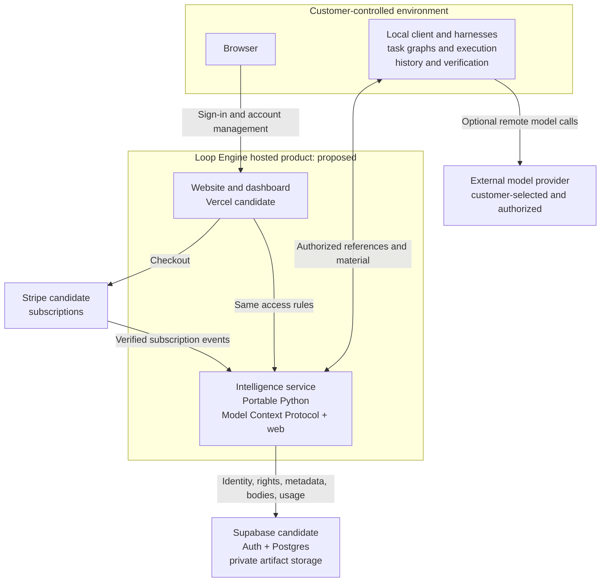
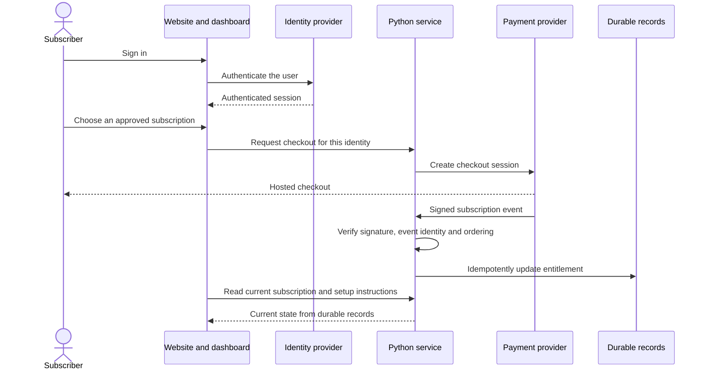
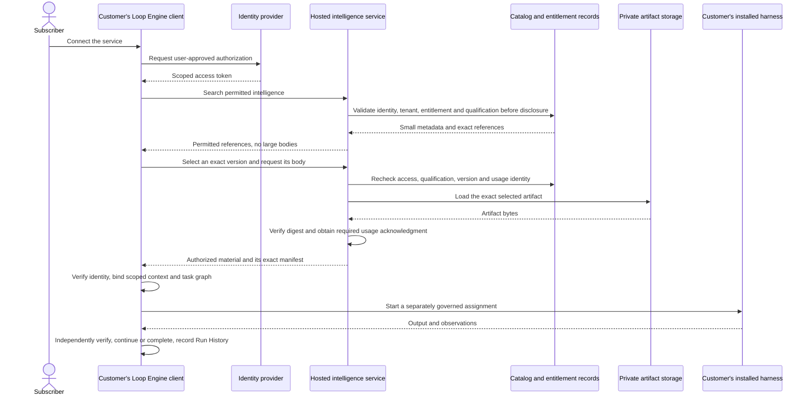

# First-release client and server architecture

Kind: product architecture with measured local implementation and proposed hosting.
Date: 2026-09-19. The [current deployment](#current-deployment) section was
added on 2026-09-20 and last checked on 2026-09-22, after Fly release 12.

The hosted product manages accounts, subscriptions, and access to intelligence.
The customer runs Loop Engine and the selected harnesses. A hosted intelligence
service is required; hosted execution of customer tasks is not. The public
brand of the hosted product is Baltor. Loop Engine remains the repository, the
Python package and the technical name.

The diagrams use C4-style software boundaries. A box represents a person,
application, service, or store, not an additional executable Loop vertex.

## Runtime classification

```text
Operational runtime type
└── Loop
    ├── Operational relationship
    │   ├── Starting
    │   ├── Spawned by
    │   ├── Queried by
    │   ├── Retrieved by
    │   └── Connected from
    ├── Role: Practitioner, Intelligence, or Solution
    ├── Versioned role profile
    ├── Purpose and domain categories
    ├── Run mode: deterministic, hybrid, or non-deterministic
    ├── Step profile
    ├── Typed input and output contract
    ├── Loop condition
    ├── Exit condition
    ├── Graph relationships
    ├── Budget, permissions, and effect policy
    ├── Model settings when the selected mode permits a model
    └── Run History records
```

## Current deployment

This section is the current statement of what runs and where. Other documents
may summarize these facts. When another document differs from this section,
follow this section and correct the other document. When this section differs
from the newest release record, follow the release record and correct this
section. Update this section in the same change that records a new release.
It describes a private pilot. It does not describe a qualified paid service.

The latest deployment was checked on September 25, 2026 after Fly release 26
at 08:46 UTC. Its exact source, image, rollback target, successful workflow
and live checks are recorded in
[`pilot-release-26.json`](../../artifacts/architecture-audit-2026-09-19/pilot-release-26.json),
with the reports in
[the release 26 evidence](../../artifacts/release-26-2026-09-25/README.md).
Release 25 of September 24, 2026 is recorded in
[`pilot-release-25.json`](../../artifacts/architecture-audit-2026-09-19/pilot-release-25.json).
Release 24 of the same day, which opened public registration at 13:00 UTC, is
recorded in
[`pilot-release-24.json`](../../artifacts/architecture-audit-2026-09-19/pilot-release-24.json),
and release 23 in
[`pilot-release-23.json`](../../artifacts/architecture-audit-2026-09-19/pilot-release-23.json).
Fly release 22 of September 23, 2026 is recorded in
[the release 22 handoff](../../artifacts/codex-release-22-handoff-2026-09-23/README.md).
The older release records remain historical evidence. A fact whose only
source is the September 20 takeover checkpoint was not remeasured by this
release check. Public registration is open, through Baltor's own sign-up only.

| Subject | Current fact | Where to check it |
|---|---|---|
| Public brand | Baltor. Loop Engine remains the repository, the Python package, the `loop-engine` command and the technical name. The public capabilities record reports the display name `Baltor`. | [terminology.yaml](../../terminology.yaml), explained by [the developer language guide](../guides/developer-language.md) |
| Host | Fly.io release 26 is complete on the existing single-Machine deployment. Exact image `sha256:863bec3ef5294949c9a3567046d6cb2238a54d1ae85e13e7e6c4839a2b8b3a80`, checked main `f371ef2c47ea99337c0a1b931288992120cfb7a6`, continuous integration run 36112660683, deployment run 36114550607. The rollback target is release 25, image `sha256:f129ea56bb45aa2eceea39b3e3b691299e87560fbd84c45e1226ed412e3e1d7b`. Since release 26 the deploy workflow releases any checked revision on main, even after main moves on. | [`pilot-release-26.json`](../../artifacts/architecture-audit-2026-09-19/pilot-release-26.json) |
| Hostnames | All nine hostnames returned 200 for fifteen public addresses (135 of 135) and identical capabilities after release 26: `baltor.ai`, `www.baltor.ai`, `app.baltor.ai`, `baltor-pilot.fly.dev`, `demo.baltor.ai`, `examples.baltor.ai`, `docs.baltor.ai`, `status.baltor.ai` and `deck.baltor.ai`. The check of what a person sees found no problem on any built page at desktop or phone width, in light or dark. | [the release 26 evidence](../../artifacts/release-26-2026-09-25/README.md) |
| Host configuration | The file `/data/host.json` on the volume switches features on and off without a new image. It is not in the repository. On September 22, 2026 it gained `http.request_limits` with the client address read from the `Fly-Client-IP` header, after a backup to `/data/host.json.before-request-limits-20260922T181740`, and the Machine restarted at 18:17 UTC. Releases built after revision `e505eca` refuse a public binding without that setting. Every hostname above is listed in its `allowed_hosts` and `allowed_origins`; a hostname missing from those lists answers 421. On September 23, 2026 at 01:39 UTC, just before Fly release 15, it was backed up to `/data/host.json.before-release-15-20260923T013913` and its `http` block moved to the record `service_http_configuration/v2` with `protocol_versions` `2025-11-25` and `2026-07-28` (release 15 refuses the version 1 record and release 14 refuses version 2), and a `waitlist` block was added that names the Fly secret `BALTOR_WAITLIST_SOURCE_SECRET`, which keys the flood guard's source digest. Fly release 16 needed no host file change. On September 23 at 06:17 UTC, after a backup to `/data/host.json.before-catalogue-20260923T061642`, it gained a `catalogue` section (`service_catalogue_source/v1`, body store `/data/catalogue-bodies`), whose source moved from `image` to `store` at 06:20 UTC after the first catalogue release was published. | The release record, and the [September 21 handoff](../context/SESSION-HANDOFF-2026-09-21.md) for the hostname lists |
| Product service | The command `loop-engine service serve`, from `src/loop_engine/core/service_runtime/`, built by [`Dockerfile.service`](../../Dockerfile.service). One process serves the website, the workspace, the `/api/v1/` interface and the Model Context Protocol endpoint `/mcp` from one origin. | [Two service commands](#two-service-commands) |
| Durable records | One SQLite database and the served files on the encrypted 1 GB Fly volume `vol_r7yg7go3n15mgqnr`, mounted at `/data`, with daily snapshots kept for five days. The snapshot `vs_pw1B1OwvpOjwizMBMYZVYPbb` was requested before release 12. No managed database is in use. The Supabase project exists and holds no tables, migrations or buckets. | The Machine status for the volume. The release record for the snapshot request. The takeover checkpoint for the snapshot schedule and the empty Supabase project. [Durable records today and planned](#durable-records-today-and-planned) |
| Protocol version | The service serves Model Context Protocol revisions `2025-11-25`, through the `initialize` handshake, and `2026-07-28`, which names its version in every request, through version 2.2.0 of the protocol library; the service chooses the version of each request before any effect and refuses an unserved one with the list it serves. The public capabilities record lists both, with `handshake_versions` `2025-11-25` and `per_request_versions` `2026-07-28`. After the release the hosted service check passed 19 of 19, with the official protocol client connecting both ways over real HTTPS. | The `protocol_versions` field of the host record and the checks in [`protocol_checks.py`](../../src/loop_engine/core/service_runtime/protocol_checks.py), `tools/check_hosted_service.py`, and the release record |
| Access | Public registration is open since September 24, 2026 at 13:00 UTC, through Baltor's own sign-up only: the address, then the emailed link from `accounts@mail.baltor.ai`, then the password. An account that Baltor's sign-up did not create is refused at sign-in and replaced when the owner of its address signs up. The first 10 accounts hold Baltor Pro free each month. Staff roles are superadmin, developer and analytics, fixed in code; the host file names the owner's two addresses as superadmin. Until release 24 the record read as follows: public registration was closed, and the public capabilities record reported `registration_available` false, `browser_identity_available` true, `client_access_available` true, `access_administration_available` true and `promotion_redemption_available` false, with the access profile `operator_provisioned`, and lists `host_key` as its only authentication mode. The waiting list is on: `waitlist_available` is true, and after Fly release 18 one request was recorded once (releases 19 and 20 did not change the waiting list), a second request from the same address was refused as already listed, and the operator tool erased it. The billing webhook reports true and uses the live payment account. Checkout and the customer portal report true again since Fly release 16: the release re-applied the payment session policy, now `service_billing_session_policy/v2`, on the Machine after the grants, and while account creation is closed the public pricing view says to create the account first, then subscribe from the account page. Checkout and the portal were proven on September 21, 2026 with nobody charged. Expired sign-out revocations and waiting list source records are removed after each sign-out and every 600 seconds, as the privacy notice promises; the health check `retention_sweep_current` reports the sweep. The failed-attempt limit for each client address is active: 30 refused attempts in 60 seconds, counted in the memory of the one service process. Thirty-two requests with a wrong key, each with a different forged `Fly-Client-IP` and `X-Forwarded-For` header, answered 401 thirty times and then 429 `failed_attempt_limit_reached`, because the Fly proxy overwrites that header. The diagnostic keys `pilot-owner` and `pilot-boundary` that the live checks use expire on September 29, 2026 at 18:02 UTC; `tools/reissue_service_keys.py` reissues them without printing them. The service makes no model call. | The public capabilities record at `/api/v1/capabilities` on any hostname, the release record, and the [live payments record](../../artifacts/architecture-audit-2026-09-19/live-payments-enabled-1.json) |
| Catalogue | 43 approved starter items are registered. The pilot owner is offered 34 of them; 9 are withheld because they declare effects that the requesting step holds no authority for. No rejected item is reachable. The items reach a tenant only after `loop-engine service apply-grants --config /data/host.json` runs on the Machine: before that step on September 22, 2026 the library offered no item. Since Fly release 14 the guarded workflow runs that step on the Machine after every deploy and checks readiness again; after Fly release 20 the catalogue check passed 6 of 6. Release 17 anchored the starter catalogue to `40fce69`, which changes only the anchor line of each body and so each body's digest. Release 17 also carries catalogue releases without a redeploy (a body store, releases with an active pointer, durable withdrawals and an attribute schema); since 06:20 UTC on September 23, 2026 the service serves its catalogue from the store, published from bundles without a redeploy, and health reports it under `catalogue_release`. The second catalogue release, `c824a1d2e222` (43 items, anchored to `565e133`), was served from 09:31 UTC on September 23, 2026. Fly release 22 served catalogue release `74d3c075b044`, the same 43 approvals carried to source `390643ef`. Since release 24 the service serves catalogue release `69da7ead21f9`, the same 43 approvals anchored to `db188909`, published to the body store because that anchor changes every body digest; the catalogue check passed 7 of 7 with its new homepage digest check, with 34 items offered and 9 withheld. Only `pilot-owner` follows the release; after the runbook's first `--all-tenants` step briefly granted every account all items, Fly release 19 added `stop-following-catalogue-release` and the five diagnostic and administration accounts now hold empty snapshots, with the isolation check passing 19 of 19 (see the [activation record](../../artifacts/architecture-audit-2026-09-19/catalogue-release-activation-1.json) and the release record). Fly release 16 and older refuse this host file. | The release record and `tools/check_hosted_catalogue.py` |

### Two service commands

The repository contains two commands that serve tenants over HTTP. Only the
first one is the product service.

| Subject | Product service | Older worker service |
|---|---|---|
| Command | `loop-engine service serve --config PATH` | `loop-engine serve api --tenants PATH` |
| Source | `src/loop_engine/core/service_runtime/` | `src/loop_engine/core/service_api.py` |
| Image | `Dockerfile.service` | The worker image from `Dockerfile`, used by example 28 |
| What it serves | The Baltor website, the workspace, the account and administrator interface, authorized search, body delivery with a digest check, and the `/mcp` endpoint | Health, text conformance, evaluation, usage, and shared memory read and write under `/v1` |
| Credential | A bearer key that begins with `le_`. Only its digest is stored. Scope, expiry and revocation are checked again at use. | A tenant key in the request header `X-Loop-Engine-Key`. Only its digest is stored. |
| Metered unit | One `provisioned_item` for each body read. Listing authorized items, a manifest with digests and sizes, a refusal before metering, and reading the tenant's own usage are never metered. | The ledger declares four units: verified completions, avoided model calls, optimize hours and judgment depth. The text conformance handler records avoided model calls and the evaluation handler records optimize hours. No handler records the other two units yet. |
| State | Deployed as the private pilot | Not deployed. It has local checks only. |

Use `loop-engine service serve` for every Baltor customer path. It meters
body reads because that is the one unit the service observes directly while
customers run their own harnesses and models.

The older command `loop-engine serve api` is a worker surface for hosted
deterministic work. A worker runs text conformance and evaluation for its
tenants, so it can observe the units of that work directly. The
[packaging guide](../guides/packaging-tiers-and-hosted-service.md) defines the
four units, and the
[hosting shape record](HOSTING-SHAPE-AND-THE-FIRST-RELEASE-2026-09-18.md#what-this-changes-about-metering)
explains why a verified completion is not an honest unit while customers run
the execution. The older command remains available for a self-hosted worker
and for a later hosted execution shape. Do not describe its units as the
metering of the pilot.

### Durable records today and planned

Current behavior: the pilot keeps tenants, key digests, grants, usage and
billing state in one SQLite database through the existing catalogue adapter.
This profile allows one writer and one Machine. A copy of the volume on a
second Machine would become a second, diverging authority. The private beta
stays on this profile. PostgreSQL is not needed for the private beta.

Planned behavior, not implemented: roadmap package D-05 adds a PostgreSQL
adapter behind the existing catalogue transaction contract, with read-set
guards and unknown-commit reconciliation, and private file storage. Supabase
is the proposed provider for both. This work is required before a paid public
launch and before a second serving instance. It needs a migration rehearsal, a
cutover plan and a rollback before it replaces the SQLite authority.

The [hosting shape record](HOSTING-SHAPE-AND-THE-FIRST-RELEASE-2026-09-18.md)
said on September 19 that the first release does not need a managed database.
That statement matches the pilot and the private beta. It does not describe
the paid public launch.

## Container diagram

This diagram shows the proposed target profile for a paid release. It is not
the [current deployment](#current-deployment). Vercel can be evaluated for the
website and the Python serving application. A container host remains an
alternative for the same Python application, and the pilot already runs that
application on Fly.io. Supabase is the proposed identity, Postgres, and
object-storage provider. Read the [profile and limits](../guides/supabase-and-vercel-launch-profile.md).



The service does not receive a customer's complete task folder, prompts,
credentials, or Run History merely because the customer connects a client.
Any telemetry or submitted feedback needs an explicit data-sharing policy.
Access to a downloaded program is separate from permission to execute it.
An ordinary protocol client can retrieve material without installing the full
Loop Engine runtime. Enforced canonical task graphs and independent acceptance
require that runtime on the execution side. Connecting a native harness to
the service alone does not turn its internal steps into governed Loop Engine
work.

## Subscriber setup and payment



The checkout return page cannot grant access. Both the dashboard and the
protocol service read the same durable entitlement. Duplicate, delayed,
failed-payment, cancellation, and reactivation events need explicit tests.

## Intelligence retrieval and customer execution



The client can decompose a large task into small graphs and subgraphs while
fetching only the intelligence each assignment needs. The service supplies
material; it does not grant file, network, model, or spending authority.
The customer may use a remote model without moving harness execution into
the Loop Engine hosted product.
Paid retrieval retries retain the same usage request identity. A lost response
does not undo a committed usage record or authorize a second charge.

## Intelligence served by the same boundary

```text
Intelligence service
├── Context Intelligence
├── Code Intelligence
├── Runtime History and Solution Intelligence
├── User Feedback Intelligence
└── Provisioning views and templates over those layers
    ├── Harness Intelligence
    ├── versioned instruction and resource manifests
    └── reusable templates and packages
```

Runtime Memory remains temporary and run-scoped on the execution side.
Imported or generated intelligence stays candidate-only until its required
independent approval. Payment never promotes a candidate.

## Implementation status

This table describes the state of the implementation on September 19, 2026.
What is deployed is recorded in [current deployment](#current-deployment).

| Boundary | State at this checkpoint |
|---|---|
| Canonical Loop, typed graphs, local harness mechanics, search and export | Existing implementations with repaired local contract checks. Complete native/provider qualification is not established. |
| Public solve provisioning | Current integration and verification work. Exact configuration reaches scoped assignments; preparation is not proof of native loading. |
| Tenant-safe provisioning domain | Local versioned policy and qualification binding implemented with contract checks. The qualification resolver is a trusted host callback; authoritative adapters across all four layers are not wired. Host attestation is not independent qualification. |
| Protocol transport | Real local HTTP and Streamable HTTP requests use protocol `2025-11-25` through the `initialize` handshake and `2026-07-28` with the version on every request, through `mcp==2.2.0`. The official client exercises discovery, metadata retrieval, exact body delivery and idempotent usage at both versions. Live end-user OAuth is not qualified. An `initialize` that asks for an unserved version is answered with `2025-11-25`, as the 2025-11-25 lifecycle requires, and any other request that names an unserved version is refused before any effect with the error that lists the served versions. The deployed release is described under [current deployment](#current-deployment). |
| Authenticated template, graph, and package delivery | Required integration, not yet complete. Current provisioning has four declared resource kinds and returns text bodies; that does not establish the full typed package and graph-delivery workflow. |
| Identity and billing domain | Durable tenants, key and subject revocation, scoped grants, signed Stripe events and current-state reconciliation have local checks. Website sign-in and real provider accounts remain unqualified. Checkout and portal adapters are a separate integration slice. |
| Website, dashboard and Supabase adapters | Updated on September 20, 2026: the website, the token-based workspace and the administrator dashboard run in the pilot. Release 7 carried the browser identity and account-activation code, switched off by host configuration. The personal client key code first shipped in release 8 and is also switched off. The public capabilities record of release 8 reports `browser_identity_available` false and `client_access_available` false. The takeover checkpoint records that the account and personal key code was checked against the real identity provider. The release record states that release 8 qualifies no customer journey. Supabase database and storage adapters remain open work. The diagram is not deployment evidence. |
| Durable storage and recovery | SQLite atomic batches, restart, duplicate requests and unknown-commit recovery have local checks. Shared hosted Postgres, private object storage and complete restore qualification remain open. |

Follow the [single-file system map](../../artifacts/architecture-audit-2026-09-19/mvp-client-server.html)
for source-level detail and the [continuation status](../roadmap/CONTINUATION-STATUS.md)
for required work. No account or paid resource was created to draw these
diagrams.
