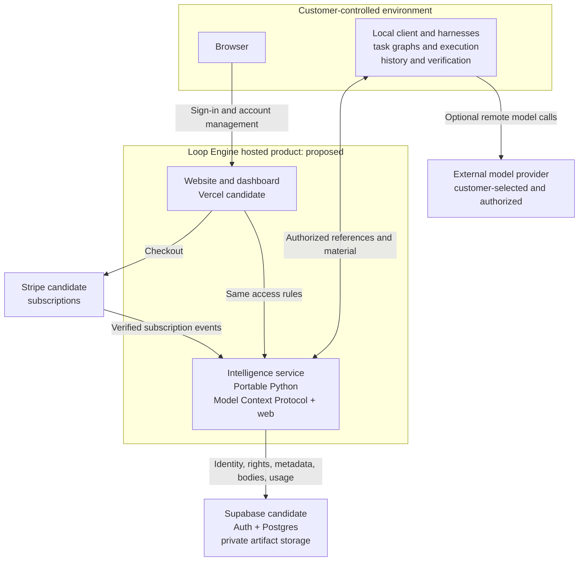
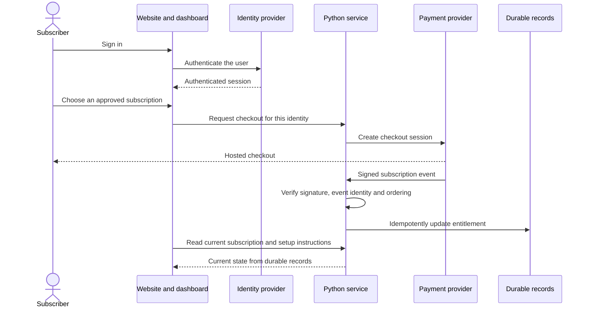
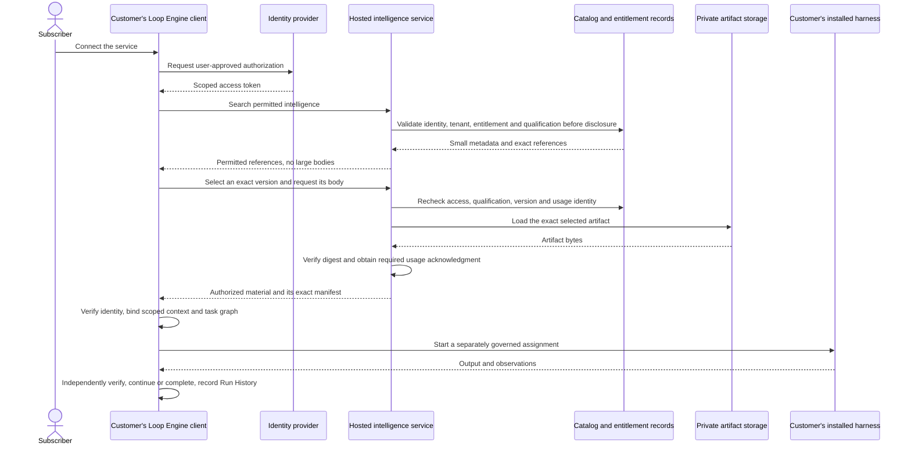

# First-release client and server architecture

Kind: product architecture with measured local implementation and proposed hosting.
Date: 2026-09-19. The [current deployment](#current-deployment) section was
added on 2026-09-20 and checked again on the same day after release 8.

The hosted product manages accounts, subscriptions, and access to intelligence.
The customer runs Loop Engine and the selected harnesses. A hosted intelligence
service is required; hosted execution of customer tasks is not. The public
brand of the hosted product is Baltor. Loop Engine remains the repository, the
Python package and the technical name.

The diagrams use C4-style software boundaries. A box represents a person,
application, service, or store, not an additional executable Loop vertex.

## Runtime classification

```text
Operational runtime type
└── Loop
    ├── Operational relationship
    │   ├── Starting
    │   ├── Spawned by
    │   ├── Queried by
    │   ├── Retrieved by
    │   └── Connected from
    ├── Role: Practitioner, Intelligence, or Solution
    ├── Versioned role profile
    ├── Purpose and domain categories
    ├── Run mode: deterministic, hybrid, or non-deterministic
    ├── Step profile
    ├── Typed input and output contract
    ├── Loop condition
    ├── Exit condition
    ├── Graph relationships
    ├── Budget, permissions, and effect policy
    ├── Model settings when the selected mode permits a model
    └── Run History records
```

## Current deployment

This section is the current statement of what runs and where. Other documents
may summarize these facts. When another document differs from this section,
follow this section and correct the other document. When this section differs
from the newest release record, follow the release record and correct this
section. Update this section in the same change that records a new release.
It describes a private pilot. It does not describe a qualified paid service.

The facts were checked on September 20, 2026, after release 8 was deployed.
The check used three sources. The first source is the release record
`artifacts/architecture-audit-2026-09-19/pilot-release-8.json`. The second
source is the source file named in each row. The third source is one read of
the public capabilities record `/api/v1/capabilities` on each of the four
hostnames, without credentials, at 21:48 UTC, and one public lookup of the
domain name records. No provider account was queried for this check. A fact
that names only the
[takeover checkpoint](../context/TAKEOVER-CHECKPOINT-2026-09-20.md) as its
place to check was observed at the takeover on the same day and was not read
again.

| Subject | Current fact | Where to check it |
|---|---|---|
| Public brand | Baltor. Loop Engine remains the repository, the Python package, the `loop-engine` command and the technical name. The public capabilities record reports the display name `Baltor`. | [terminology.yaml](../../terminology.yaml), explained by [the developer language guide](../guides/developer-language.md) |
| Host | Fly.io. One Machine in region `iad`, with one shared processor and 2 GB of memory, runs release 8. The guarded release workflow built release 8 from the committed revision `e63f614`, after the continuous integration run for that revision passed, and deployed it by image digest. It is the first release that can be rebuilt from the repository. Release 7 is kept for rollback. The owner prefers Fly.io for compute and delegated the region, spending and infrastructure choices of the pilot on September 19, 2026. The pilot was deployed on Fly.io under that authority. No other hosting profile has been deployed. | The release record `artifacts/architecture-audit-2026-09-19/pilot-release-8.json` for the release number, the revision, the image digest and the release kept for rollback. The [deployment authority record](../../artifacts/architecture-audit-2026-09-19/pilot-deployment-authority.json) and the field `hosting_preference` in [roadmap.yaml](../roadmap/roadmap.yaml) for the owner's preference and delegation. The [Fly profile](../../fly.toml) and the [current host note](../guides/hosting-and-deployment-procedures.md#current-host). |
| Hostnames | `baltor.ai`, `www.baltor.ai`, `app.baltor.ai` and `baltor-pilot.fly.dev` serve the same release. Each one has a valid certificate, each one returned the same public capabilities record, and each one passed 46 of 46 hosted website checks after release 8. Cloudflare answers the domain zone and does not proxy the records: every name resolves to the address of the Fly application. The launch setup runbook records that the host configuration still names the Fly hostname as the canonical protocol and account origin. The host configuration was not read for this check. | The release record, the four hosted website check reports that it names, and the [launch setup runbook](../guides/launch-setup-runbook.md#recommended-starting-setup) |
| Product service | The command `loop-engine service serve`, from `src/loop_engine/core/service_runtime/`, built by [`Dockerfile.service`](../../Dockerfile.service). One process serves the website, the workspace, the `/api/v1/` interface and the Model Context Protocol endpoint `/mcp` from one origin. | [Two service commands](#two-service-commands) |
| Durable records | One SQLite database and the served files on one encrypted 1 GB Fly volume, with daily snapshots kept for five days. A snapshot of the volume was requested before release 8. No managed database is in use. The Supabase project exists and holds no tables, migrations or buckets. | The takeover checkpoint for the volume, the snapshots and the empty Supabase project. The release record for the snapshot request. [Durable records today and planned](#durable-records-today-and-planned) |
| Protocol version | The service accepts exactly Model Context Protocol version `2025-11-25`. It refuses every other version with the error code `unsupported_protocol_version`. This includes the newer published version `2026-07-28`. The public capabilities record lists `2025-11-25` as the only version. | `PROTOCOL_VERSION` in [`provisioning_mcp.py`](../../src/loop_engine/core/provisioning_mcp.py) and the check `remote_protocol_refuses_unqualified_versions_without_silent_negotiation` in [`http_checks.py`](../../src/loop_engine/core/service_runtime/http_checks.py) |
| Access | Keys issued by the operator only. The public capabilities record lists `host_key` as the only authentication mode. It reports `browser_identity_available`, `registration_available` and `client_access_available` as false, and the billing webhook, checkout and the customer portal as off. The code for browser sign-in, personal client keys, registration and billing is in the image of release 8 and is switched off by host configuration. The service makes no model call. | The release record, and the public capabilities record at `/api/v1/capabilities` on any of the four hostnames |
| Catalogue | One diagnostic record. It is not a starter catalogue for real tasks. | The release record and the takeover checkpoint |

### Two service commands

The repository contains two commands that serve tenants over HTTP. Only the
first one is the product service.

| Subject | Product service | Older worker service |
|---|---|---|
| Command | `loop-engine service serve --config PATH` | `loop-engine serve api --tenants PATH` |
| Source | `src/loop_engine/core/service_runtime/` | `src/loop_engine/core/service_api.py` |
| Image | `Dockerfile.service` | The worker image from `Dockerfile`, used by example 28 |
| What it serves | The Baltor website, the workspace, the account and administrator interface, authorized search, body delivery with a digest check, and the `/mcp` endpoint | Health, text conformance, evaluation, usage, and shared memory read and write under `/v1` |
| Credential | A bearer key that begins with `le_`. Only its digest is stored. Scope, expiry and revocation are checked again at use. | A tenant key in the request header `X-Loop-Engine-Key`. Only its digest is stored. |
| Metered unit | One `provisioned_item` for each body read. Listing authorized items, a manifest with digests and sizes, a refusal before metering, and reading the tenant's own usage are never metered. | The ledger declares four units: verified completions, avoided model calls, optimize hours and judgment depth. The text conformance handler records avoided model calls and the evaluation handler records optimize hours. No handler records the other two units yet. |
| State | Deployed as the private pilot | Not deployed. It has local checks only. |

Use `loop-engine service serve` for every Baltor customer path. It meters
body reads because that is the one unit the service observes directly while
customers run their own harnesses and models.

The older command `loop-engine serve api` is a worker surface for hosted
deterministic work. A worker runs text conformance and evaluation for its
tenants, so it can observe the units of that work directly. The
[packaging guide](../guides/packaging-tiers-and-hosted-service.md) defines the
four units, and the
[hosting shape record](HOSTING-SHAPE-AND-THE-FIRST-RELEASE-2026-09-18.md#what-this-changes-about-metering)
explains why a verified completion is not an honest unit while customers run
the execution. The older command remains available for a self-hosted worker
and for a later hosted execution shape. Do not describe its units as the
metering of the pilot.

### Durable records today and planned

Current behavior: the pilot keeps tenants, key digests, grants, usage and
billing state in one SQLite database through the existing catalogue adapter.
This profile allows one writer and one Machine. A copy of the volume on a
second Machine would become a second, diverging authority. The private beta
stays on this profile. PostgreSQL is not needed for the private beta.

Planned behavior, not implemented: roadmap package D-05 adds a PostgreSQL
adapter behind the existing catalogue transaction contract, with read-set
guards and unknown-commit reconciliation, and private file storage. Supabase
is the proposed provider for both. This work is required before a paid public
launch and before a second serving instance. It needs a migration rehearsal, a
cutover plan and a rollback before it replaces the SQLite authority.

The [hosting shape record](HOSTING-SHAPE-AND-THE-FIRST-RELEASE-2026-09-18.md)
said on September 19 that the first release does not need a managed database.
That statement matches the pilot and the private beta. It does not describe
the paid public launch.

## Container diagram

This diagram shows the proposed target profile for a paid release. It is not
the [current deployment](#current-deployment). Vercel can be evaluated for the
website and the Python serving application. A container host remains an
alternative for the same Python application, and the pilot already runs that
application on Fly.io. Supabase is the proposed identity, Postgres, and
object-storage provider. Read the [profile and limits](../guides/supabase-and-vercel-launch-profile.md).



The service does not receive a customer's complete task folder, prompts,
credentials, or Run History merely because the customer connects a client.
Any telemetry or submitted feedback needs an explicit data-sharing policy.
Access to a downloaded program is separate from permission to execute it.
An ordinary protocol client can retrieve material without installing the full
Loop Engine runtime. Enforced canonical task graphs and independent acceptance
require that runtime on the execution side. Connecting a native harness to
the service alone does not turn its internal steps into governed Loop Engine
work.

## Subscriber setup and payment



The checkout return page cannot grant access. Both the dashboard and the
protocol service read the same durable entitlement. Duplicate, delayed,
failed-payment, cancellation, and reactivation events need explicit tests.

## Intelligence retrieval and customer execution



The client can decompose a large task into small graphs and subgraphs while
fetching only the intelligence each assignment needs. The service supplies
material; it does not grant file, network, model, or spending authority.
The customer may use a remote model without moving harness execution into
the Loop Engine hosted product.
Paid retrieval retries retain the same usage request identity. A lost response
does not undo a committed usage record or authorize a second charge.

## Intelligence served by the same boundary

```text
Intelligence service
├── Context Intelligence
├── Code Intelligence
├── Runtime History and Solution Intelligence
├── User Feedback Intelligence
└── Provisioning views and templates over those layers
    ├── Harness Intelligence
    ├── versioned instruction and resource manifests
    └── reusable templates and packages
```

Runtime Memory remains temporary and run-scoped on the execution side.
Imported or generated intelligence stays candidate-only until its required
independent approval. Payment never promotes a candidate.

## Implementation status

This table describes the state of the implementation on September 19, 2026.
What is deployed is recorded in [current deployment](#current-deployment).

| Boundary | State at this checkpoint |
|---|---|
| Canonical Loop, typed graphs, local harness mechanics, search and export | Existing implementations with repaired local contract checks. Complete native/provider qualification is not established. |
| Public solve provisioning | Current integration and verification work. Exact configuration reaches scoped assignments; preparation is not proof of native loading. |
| Tenant-safe provisioning domain | Local versioned policy and qualification binding implemented with contract checks. The qualification resolver is a trusted host callback; authoritative adapters across all four layers are not wired. Host attestation is not independent qualification. |
| Protocol transport | Real local HTTP and Streamable HTTP sessions use protocol `2025-11-25` and `mcp==1.29.1`. The official client exercises discovery, metadata retrieval, exact body delivery and idempotent usage. Live end-user OAuth is not qualified. An `initialize` that asks for another version, including the newer published version `2026-07-28`, is answered with `2025-11-25`, as the 2025-11-25 lifecycle requires, and a later request that names another version is refused before any effect. |
| Authenticated template, graph, and package delivery | Required integration, not yet complete. Current provisioning has four declared resource kinds and returns text bodies; that does not establish the full typed package and graph-delivery workflow. |
| Identity and billing domain | Durable tenants, key and subject revocation, scoped grants, signed Stripe events and current-state reconciliation have local checks. Website sign-in and real provider accounts remain unqualified. Checkout and portal adapters are a separate integration slice. |
| Website, dashboard and Supabase adapters | Updated on September 20, 2026: the website, the token-based workspace and the administrator dashboard run in the pilot. Release 7 carried the browser identity and account-activation code, switched off by host configuration. The personal client key code first shipped in release 8 and is also switched off. The public capabilities record of release 8 reports `browser_identity_available` false and `client_access_available` false. The takeover checkpoint records that the account and personal key code was checked against the real identity provider. The release record states that release 8 qualifies no customer journey. Supabase database and storage adapters remain open work. The diagram is not deployment evidence. |
| Durable storage and recovery | SQLite atomic batches, restart, duplicate requests and unknown-commit recovery have local checks. Shared hosted Postgres, private object storage and complete restore qualification remain open. |

Follow the [single-file system map](../../artifacts/architecture-audit-2026-09-19/mvp-client-server.html)
for source-level detail and the [continuation status](../roadmap/CONTINUATION-STATUS.md)
for required work. No account or paid resource was created to draw these
diagrams.
