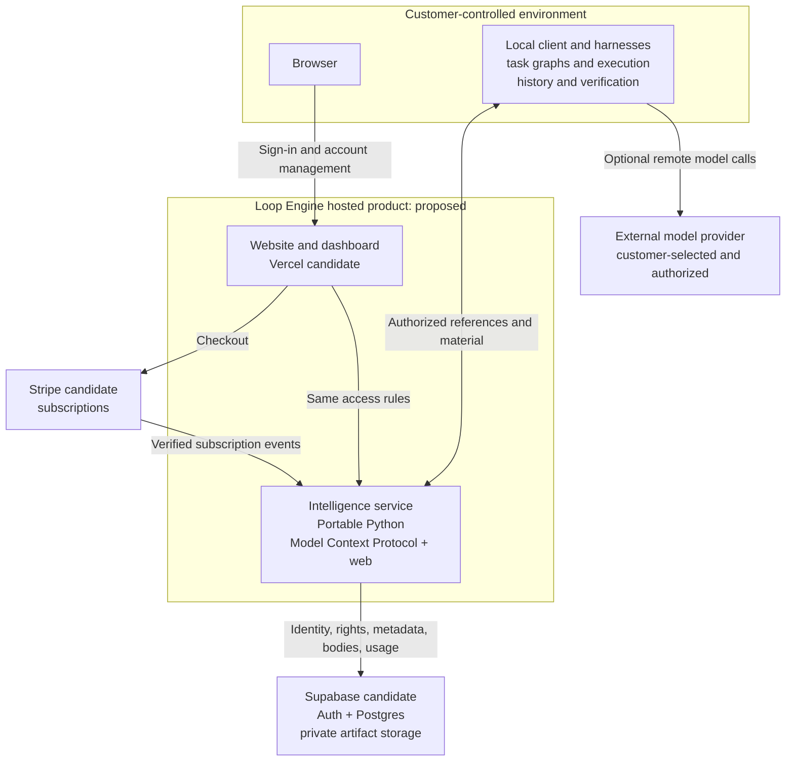
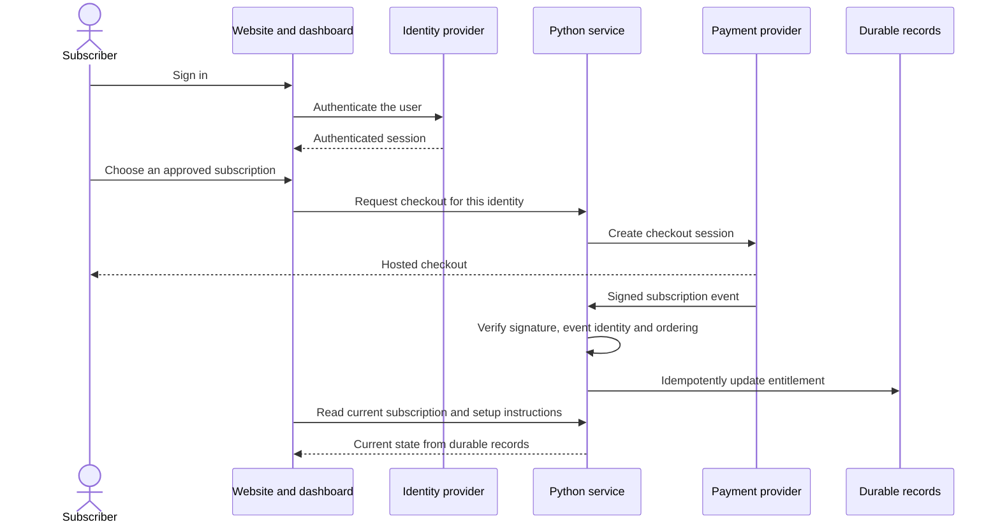
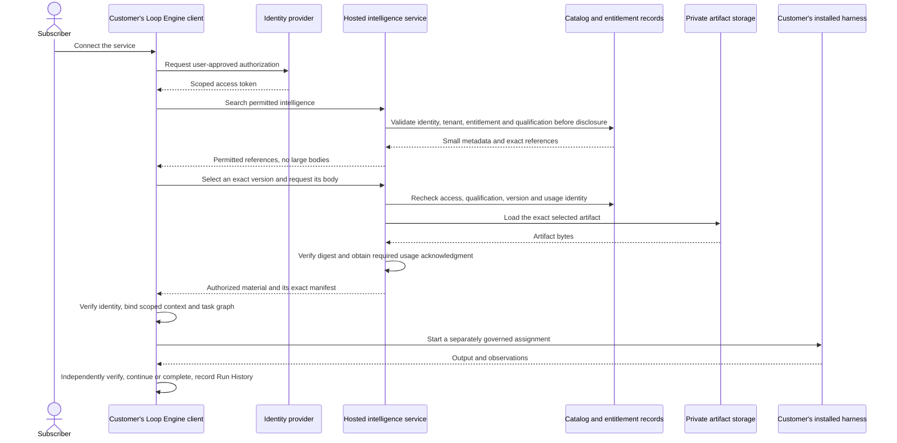

# First-release client and server architecture

Kind: product architecture with measured local implementation and proposed hosting.
Date: 2026-09-19. The [current deployment](#current-deployment) section was
added on 2026-09-20 and last checked on 2026-10-09, after Fly release 83.

The hosted product manages accounts, subscriptions, and access to intelligence.
The customer runs Loop Engine and the selected harnesses. A hosted intelligence
service is required; hosted execution of customer tasks is not. The public
brand of the hosted product is Baltor. Loop Engine remains the repository, the
Python package and the technical name.

The diagrams use C4-style software boundaries. A box represents a person,
application, service, or store, not an additional executable Loop vertex.

## Runtime classification

```text
Operational runtime type
└── Loop
    ├── Operational relationship
    │   ├── Starting
    │   ├── Spawned by
    │   ├── Queried by
    │   ├── Retrieved by
    │   └── Connected from
    ├── Role: Practitioner, Intelligence, or Solution
    ├── Versioned role profile
    ├── Purpose and domain categories
    ├── Run mode: deterministic, hybrid, or non-deterministic
    ├── Step profile
    ├── Typed input and output contract
    ├── Loop condition
    ├── Exit condition
    ├── Graph relationships
    ├── Budget, permissions, and effect policy
    ├── Model settings when the selected mode permits a model
    └── Run History records
```

## Current deployment

This section is the current statement of what runs and where. Other documents
may summarize these facts. When another document differs from this section,
follow this section and correct the other document. When this section differs
from the newest release record, follow the release record and correct this
section. Update this section in the same change that records a new release.
Public registration is enabled. The site offers the existing monthly plan;
these deployment checks alone do not establish a fully qualified paid service.

The running image is Fly release 83, from
`4a1f087966c4584f5a0fd490c87a97049ba285a2`, image
`sha256:d765fa8be32b654c44c0c9262383a4abfd57e9a2976f7bda11a1967b661f36e4`.
Exact CI `37881941313` and guarded deployment `37882543337` passed; the gate
is closed. The full local browser rerun passed 977 checks and all 197 mutants.
The live offering/layout matrix passed 483 checks. Independent read-only
review passed 426 checks across 68 desktop/phone views on all ten hosts,
including twenty unchanged Terms comparisons. The all-host pulse passed fifty
reads, with one 23.9-second capabilities response retained as a latency
finding. A fresh full public route audit passed 67 pages, 277 views and 436
links. It checks rendering and navigation, not every authenticated journey or
marketing claim; the separate overnight copy review remains follow-up work.

All nine product hostnames now serve public assets through Cloudflare and
forward dynamic requests to Fly. The technical Fly hostname remains a direct
fallback. Export `9ed7e6ba5a3f...` contains 2,544 files, all verified on
`baltor.ai` against their exact bodies and required headers. Disable proxying on the saved DNS
records to recover the direct paths; do not delete the routes or resources.

The homepage and pricing page show three distinct cards: Agent Feeds,
Harness Files and Overnight / AFK Work. Pricing sits in its own section
outside the introductory hero. The hero and library use files-first language.
Agent Feeds shows the latest owner-selected
$4.99 monthly standard price, free through December 31, 2026 Eastern, with
explicit future opt-in and no automatic charge. No new provider price or
subscription was created; the existing full-library plan remains $29.
The owner-approved flexible pricing clause is live in Terms section 6, dated
October 8; all other sections and privacy text are unchanged. It refers to
checkout terms, protects paid periods and preserves notice, consent and
cancellation. The amendment alone changes no subscription price.
Thirteen curated decision-source
collections and a live catalogue specimen are available. Local per-agent
reading profiles are implemented; hosted saved preferences, agent assignments
and personalized research delivery remain unfinished. The proposed Supervised
Runs tier is not active. The [release record](../../artifacts/architecture-audit-2026-09-19/pilot-release-83.json)
binds the application, public export, live checks and separate follow-ups.
Release 82 is the compatible image rollback, at
`sha256:6869edf6c244f5c1c0caa75017c9dcde5f8b6eaaf536c41c54e61d0bb1fffebc`.
This source includes the model-directory refresh, repaired private supply
journals, isolated constraint-case generation, bounded overnight operator and
account handoff. Available local overnight tools are labelled Preview, with
run limits, task checkpoints, morning reports and a runnable guide. Marketing
pages contain no future-feature teaser. It does not select another body store, change identity,
publish candidates or activate hosted Supervised Runs.
The default model/setup repair is deployed; one post-repair provider call
returned `usage_limit_reached`, so successful model generation is not proved.
The earlier two retired-model failures remain recorded. Release-82 attempts
retain the first browser check's stale-date failures and the initial private
probe's incorrect health path. The corrected full browser and live checks pass.

The latest repeated owner direction keeps Feeds at $4.99 rather than the
earlier $14.99 proposal. New-signup targets for the library and hosted upper
tier remain $29.99 and $49.99 monthly; checkout still uses $29. The separate
Overnight / AFK Work card states the local Preview is included without extra
charge with Harness Files and requires the customer's own worker and models.
It is not a third paid hosted plan. The flexible price clause is published;
reconcile a new-signup Price without changing existing subscriptions or grants.
Hosted Overnight / AFK Work needs actual coordination, isolation, recovery
and checkout before sale.
The separate October 8 catalogue addition now serves 218,151 entries and
1,353,029 distinct files, release `1694fb4a5b35...`. It adds 24 independently
reviewed SDG tools and 192 distinct files, preserving every previous version.
No previously found expected result was lost across 354 saved queries, and
all previous Public Good grants remain valid. The [publication record](../../artifacts/architecture-audit-2026-09-19/catalogue-original-sdg-2026-10-08.json)
separates native tests and serving. The release-78 follow-up additionally
retrieves all nine exact files of the new statistical-release-timeliness
tool as an ordinary no-plan customer, preserves paid usage and passes its
isolated declared example, schemas and calendar-oracle checks.
Volume body storage, custom SQLite search and Supabase identity remain
selected. R2 has verified the preceding 1,352,837 files and a separate
192-body delta: complete current-catalogue coverage across two scopes, not
a fresh full rerun or a body-engine switch. Public Good policy `9f0f5cfe...`
preserves 424 grants and adds the 24 SDG tools, for 448 available groups and
1,128 distinct useful files across all 17 goals. Limits are unchanged;
new grants expire October 31 at 00:00 UTC. The complete granted group remains
accessible; the useful-path list is a count/display label, not a path permission.

An existing ordinary no-plan account retrieved three exact Public Good files,
was refused staff access and a wrong digest, and ran the downloaded tool in
an isolated custom harness with separate-process checkpoint continuation.
Paid usage was unchanged. This deterministic proof made no model calls; the
strict combined-token model-stage limit remains unsupported on the current
route. It is not an OpenCode or unattended model-solving qualification.
The new SDG closure was also placed and byte-verified in a private OpenCode
project; that is not a native OpenCode loading or model-run result.

The full route-map audit found a Cloudflare-injected analytics script blocked
by the site's existing Content Security Policy. A narrow zone configuration
now disables RUM injection on the nine product hostnames. No security policy
was weakened or resource deleted. The repeat audit passed 67 pages, 277 views
and 407 links without console errors or reported layout faults. Release 78's
new checks correct the older OS-theme-only coverage by selecting and checking
the application's actual theme and sampled contrast.

### Earlier deployment observations

The paragraphs below retain the state and limits observed at earlier releases;
their prototypes and pending work do not override the current record above.

The preceding running image was Fly release 76, from
`76ff12c2918910d659267e32676ccdd5cd12b950`, image
`sha256:c963143b7ed9a054f7dee59a30c6234147a945ddd15b3a63699716997e4228bd`.
Exact CI `37710042646` and guarded deployment `37711417924` passed; the gate
is closed. All ten hosts passed 2,126 browser assertions, fifty pulse reads
passed, and the owner-account catalogue diagnostic passed eleven checks.
The documentation hostname uses Cloudflare export `6c0b81e6250d...`; all
2,501 public files passed exact body and header readback.

The initial two-offering cards are live. The owner then identified older
plan labels elsewhere on the same pages, so that check population is not
proof of complete copy consistency. The next candidate covers those labels,
shared appearance and concrete decision-support collections. The
[release record](../../artifacts/architecture-audit-2026-09-19/pilot-release-76.json)
records this limitation and the scheduler installation race separately from
the successful application deployment. Release 75 is the compatible image
rollback. The catalogue population, volume body store, custom SQLite search
and Supabase identity remain unchanged.

The preceding running image was Fly release 75, from
`bc18a19f859bf691b97cba37666ecbd2b0163ec1`, image
`sha256:5a3ba9481b479aec82b1712b4de90846faccc28fec78f7e29eb10f4b354aaf07`.
Exact CI `37701122893` and guarded deployment `37702056291` passed; the gate
is closed. All ten hosts passed 2,118 browser assertions before the first
Cloudflare production cutover. `docs.baltor.ai` now serves public pages from
Cloudflare Static Assets and forwards dynamic requests to Fly, with strict
origin TLS. All 2,501 exported files match their bytes and required headers.
The real owner-account catalogue check passes eleven checks through that
hostname, and the all-host pulse passes fifty reads after the cutover.
The [release record](../../artifacts/architecture-audit-2026-09-19/pilot-release-75.json)
records the intermediate refusals, compressed-HEAD test correction and the
overlapping two-network limiter proof.

The edge skips Cloudflare's browser-header heuristic for public reads and
the declared API/MCP paths on known Baltor hostnames. The standard Python
client previously failed before reaching the application; it now succeeds.
This rule grants no account access. Other firewall protections and the
application's authentication and client-address limits remain enforced.
R2 mirroring is supervised and incomplete. The volume body engine, custom
SQLite search and Supabase customer identity remain selected. Release 74 is
the compatible image rollback. Disable proxying on a hostname to restore its
direct origin path; retain its route and resources for reconciliation.

The preceding running image was Fly release 74, from
`69ac103c53c800e96806f5c3f690f234ed6e19b6`, image
`sha256:6dc54d00f4d41db737d176eee8de24d2da8148189bc26ef175d808b0847bcb06`.
Exact CI `37692918322` and guarded deployment `37693844836` passed.
All ten hosts passed 2,118 browser assertions in the completed recovery pass;
the first pass stopped after four hosts. Fifty pulse reads passed and the
deployment gate is closed. The release installs Cloudflare edge and D1
engines, while the custom SQLite search and volume body engine remain selected.
The [release record](../../artifacts/architecture-audit-2026-09-19/pilot-release-74.json)
keeps the deployment, interrupted checks and canary findings separate.

The Cloudflare Static Assets canary now holds 2,501 public export files.
All body digests matched, but four alias robots headers differed and need
the next source repair before production routing. The pinned R2 mirror was
resumed after reconciling its interrupted prefix, within the original request
and wall-time ceilings. It is not yet complete or selected for serving.
The live origin now uses the version-2 trusted Cloudflare forwarding profile;
thirty post-restart readiness, capabilities and catalogue reads passed.
Live refusal isolation and the production route checks remain separate gates.
Restore the saved version-1 host mapping before rolling the image back to
release 73. Customer sign-up remains on Supabase.

The preceding running image was Fly release 73, from
`61ae2bbe8b9cd5ee7f023f260d265d17785f6059`, image
`sha256:fbca37b9f5e977da19cefb3dfe5356f93e620a94be5670817fb0897e849d10d2`.
Exact CI `37685774464` and guarded deployment `37687661934` passed.
The default Community-excluded legacy listing uses the complete checked-tier
projection before the unchanged per-item authorization. All ten hostnames
passed 2,118 browser assertions and fifty health/readiness reads. The
owner-account catalogue disclosure diagnostic passed eleven checks, without
body reads or usage writes. The local browser suite passed 971 assertions and
all 197 removed-guard controls. The gate is closed. Release 72 is the image
rollback. The [release record](../../artifacts/architecture-audit-2026-09-19/pilot-release-73.json)
also retains the two unsuccessful diagnostic-account attempts. The catalogue
population and production storage selection are unchanged.

The preceding running image was Fly release 72, from
`3476032b7c00326c1e97f137ccc6dfb72bd860e5`, image
`sha256:ea62f93ec7740731b25fd899d90cc5eefa6e991a3b080445fb30c93a31ad4a00`.
Exact CI `37522202775` and guarded deployment `37523228643` passed. The
catalogue-state Feeds preview and optional R2 body adapter are installed;
production body storage has not switched to R2. The fresh October 7 pulse
passed 50 read-only requests across all ten hosts. The nightly browser suite
passed 967 of 971 assertions and all 197 removed-guard controls; four header
expectations omitted the new Feeds link and are under repair. The deployment
gate was found enabled after the completed workflow and closed on October 7.
Release 71 is the compatible image rollback. The
[release record](../../artifacts/architecture-audit-2026-09-19/pilot-release-72.json)
separates the completed deployment, fresh pulse and outstanding browser repair.

The preceding running image was Fly release 71, from
`ec1df775e1fd17077d36cb04d90b7350b07e9273`, image
`sha256:2f82e576b8207781d5a038d4ec1e679850eb02904f87af2936cf4ace8afdc42e`.
CI `37487555685` and guarded deployment `37488883326` passed. All ten hosts
pass 2,118 browser assertions. The bounded lexical candidate pool preserves
the checked verified tier alongside broad Community matches, with filters and
authorization retained. The exact before/after replay preserves all 70
previously found expectations and finds 95 with the selected policy. Explicit
component forms survive admission instead of inheriting the file format's
default. The gate is off; release 70 is the compatible image rollback.
The [release record](../../artifacts/architecture-audit-2026-09-19/pilot-release-71.json)
records the source, evidence and limitations.

The separate October 6 catalogue publication is live at
`50b666f56b043ce085d20f46efed01444f257917467199992799ad49cdb03127`, with
218,127 packages and 1,352,837 distinct files. The complete served population
and content digest match the native operation record. The final cleanup
request timed out, but subsequent readback confirms the staging folder was
removed and the original local sources and live bodies remain. No publication
was replayed. Public Good has 424 packages and 1,056 distinct useful files;
all 17 goals have material. An existing no-plan account downloaded 25 exact
new files with no paid-usage increase. The 50-request all-host pulse passed.
The older version-1 whole-library listing diagnostic timed out before release
73. Its owner-account continuation passes after the listing repair; the
boundary-account continuation is still not accepted. The [publication record](../../artifacts/architecture-audit-2026-09-19/catalogue-million-and-public-good-2026-10-06.json)
retains the failed attempts and scope. The existing Fly volume is 50 GB.
Cloudflare production serving and the Feeds/Components offering split remain incomplete.
The [active plan](../roadmap/DELIVERY-SEQUENCE.md#active-execution-plan-october-7)
states their dependencies and acceptance checks.

The preceding running image was Fly release 70, from
`e9648c896519c3480d348e2710071a2afbcf63f5`, image
`sha256:7158b6e1c135f326b20562766bfcc460cae8e00b49d46f270feed8feeaf3264e`.
CI `37478490822` and guarded deployment `37479866030` passed. All ten hosts
pass 2,118 browser assertions. Five live token quickstarts and the real Claude
Code OAuth journey pass, including exact-file readback, refresh and revocation.
Copied settings use the canonical OAuth resource on every hostname. The Stripe
reader uses the pinned API's invoice status and handles the renewal draft
interval. A sandbox renewal passed; a separate failed-renewal attempt stopped
at bank authentication and is retained as incomplete. No live charge was made.
The catalogue remains 92,973 packages and 370,994 distinct files. The gate is
off and release 69 is the compatible rollback image. The existing volume was
subsequently extended to 50 GB for staging and index headroom; the file system
reports 39 GB free without a restart. The additional provisioned storage is
$3.75 per month at the checked rate, with traffic and snapshots separate.
The [release record](../../artifacts/architecture-audit-2026-09-19/pilot-release-70.json)
states the complete checks and limits. Cloudflare migration, the large catalogue
wave and the proposed intelligence offering are not part of this release.

The preceding running image was Fly release 69, from
`8c6d8033c3f981629d3a13c11d5ad8ab62fe2d25`, image
`sha256:8f8598f7116ae30f3097d76346b6c0504ce21663a2b350ed5fbf952058fc235e`.
CI `37417517147` and guarded deployment `37418592047` passed. All ten hosts
pass 2,118 browser assertions; the previously timing-out catalogue disclosure
check passes all eleven checks. The repair narrows verified-only searches
through a checked tier projection, with authorization still required and no
change to relevance ordering. The gate is off. The
[release record](../../artifacts/architecture-audit-2026-09-19/pilot-release-69.json)
retains the timeout, repair, exact image and limits. Active catalogue `8806a997…`
holds 92,973 packages and 370,994 distinct files. Release 68 is the compatible
image rollback target. The large API wave and the private ranking experiment
remain unpublished.

The preceding running image was Fly release 68, from
`5aa146791fda952c3140446a6f2e698fb78ad21f`, image
`sha256:9663e9e6664ca7ac411d77c7c886aca42beb3f01f697e3419a00be44f7d022d8`.
CI `37410413469` and guarded deployment `37411375142` passed. The workflow
checked the exact new image and a fresh Machine probe before public readiness;
packaged grants and billing-policy application then passed. The gate is off.
All ten hosts pass 2,118 read-only browser assertions. The service retained its
prepared disk index and the unchanged 92,923-package, 370,793-file catalogue.
The [release record](../../artifacts/architecture-audit-2026-09-19/pilot-release-68.json)
keeps the exact steps, source-discovery schedule and untested boundaries.
Release 67 is the rollback image and understands catalogue state versions 1,
2 and 3. The wider-pool retrieval experiment and the large API wave remain
unpublished. No brand, domain or DNS change is part of this release.

A subsequent [segmented catalogue publication](../../artifacts/architecture-audit-2026-09-19/catalogue-segmented-first-2026-10-06.json)
added 50 qualified validation-function packages, with all existing versions
preserved and no orphaned Public Good grants. Active catalogue `8806a997…`
holds 92,973 packages and 370,994 distinct files. Eighteen files from three
representative packages matched live readback and passed their supplied tests
in the sandbox. The independent audit stopped at incomplete calibration after
two output-limit failures; no usable package decisions or independent approval
are claimed. A second reviewer passed its mixed controls but failed a
single-item negative control, so it supplied no usable package decision either.
A verified-only disclosure diagnostic timed out; release 69's separate
performance repair passed the fresh eleven-check diagnostic. The larger API
wave stays held by its recorded retrieval comparison.

The preceding running image was Fly release 67, from
`3f4714662602a5871783ff6bd9ca3aaeefada8b7`, image
`sha256:0244fa5bc9099c2782270da245e200aeb0768323be0d8d2617cf21caf9b9f2d7`.
CI `37402791077` passed. Deployment `37404412829` installed the image but
failed at the grant supervisor's deadline during a slow cold start. The
readiness gate had advanced before the replacement Machine started. Both the
web and grant processes then built an in-memory catalogue. The failure and
recovery remain separate in the
[release record](../../artifacts/architecture-audit-2026-09-19/pilot-release-67.json).

The service recovered with its original catalogue. An operator prepared and
verified the disk index, preserved the host configuration and its permissions,
then selected `sqlite_disk_index` through `service_catalogue_source/v2`.
All 32 index-file digests and the exact population matched; the prepared-index
command reopened it in 0.6 seconds. The first post-restart public probe passed.
The web process sampled 188 MiB RSS, compared with about 1.9 GiB before the
switch. These samples are not a load or peak-memory benchmark.

All ten hosts pass 2,118 read-only browser assertions. Health is ready, the
deployment gate is off, and the catalogue still holds 92,923 packages and
370,793 distinct files. Readback found the packaged grant's existing
release-following configuration intact; the uncertain operation was closed
without replay. No successful grant application is claimed for that workflow.
Release 65 is the pre-migration image rollback target, with the preserved
version 1 host file restored first. After a segmented catalogue publication,
an image rollback must understand catalogue state version 3.

An earlier image deployment was Fly release 62, completed on October 4, 2026
in the owner's time zone (October 5 UTC), from
`75e3cabde6b4f25f4a7f015312f7aead7eafd009`, image
`sha256:e95ee07238da5abe51d3a53ae4b1092d522b972da4924a34dc0a7dda8cc3ab3c`.
CI `37250819264` and deployment `37251239136` passed. The running image matches
and the gate is off. The [record](../../artifacts/architecture-audit-2026-09-19/pilot-release-62.json)
and [notes](../../artifacts/release-62-2026-10-04/README.md) describe the broader
privacy notice, private Dot reports/files/replies and refreshed public briefs.
All ten hosts pass 2,118 browser assertions and fifty Dot/access/readiness
checks; Public Good/Dot passes sixty. Twelve private component reports passed
exact readback and replay. The first signed-in browser probe had fourteen
passes and a mobile-menu test-driver timeout; its read-only continuation
passed seventeen checks. The owner's actual Dot session and continuous
renewal remain untested. No catalogue, credential or host configuration
changed. Counts remain 30,751 packages and 96,120 distinct files.
Release 61 is the rollback image.

The preceding image deployment was Fly release 61, completed on October 1, 2026
from `117d43fcab110471df983599a55911ec43252881`, image
`sha256:d0c0cd63de09440f041889cd351bd486ba2442f3c520599a3fa51c15eb987ead`.
CI `36888149782` and deployment `36889262009` passed; the gate is off.
The [release record](../../artifacts/architecture-audit-2026-09-19/pilot-release-61.json)
and [notes](../../artifacts/release-61-2026-10-01/README.md) record goal-first
Public Good browsing, unlisted public Dot briefs, feedback MCP/API/CLI routes,
protected staff feedback, client 0.4.1 and homepage state repairs. Public
Good/Dot passes sixty live checks; homepage selection passes 259; the exact
published stock client passes 75 supplied and independent tests. All ten
hostnames pass 2,118 browser assertions. The
owner-requested staff assignment is verified privately, with the plan unchanged.
The actual owner's Dot session has not been exercised here.

After deployment, an operator configuration update set mode `0600` while
retaining root ownership, preventing the service UID from reading it after
restart. The exact file's ownership and mode were repaired without changing its bytes;
the service identity read check, account-role check and fresh health checks
pass. A staged-configuration check now catches the original wrong-owner case.
Cold startup remains slow and needs measurement. The release record preserves
the incident, failures and limitations rather than reporting uninterrupted
availability. Catalogue and Public Good counts remain unchanged, and the old
scheduled publisher remains fenced. Release 60 is the rollback image.

The preceding image deployment was Fly release 60, completed on October 1, 2026
from `1c22a63fa794d4f26454dbd7bb4e3ad4e56d16b0`, image
`sha256:b8fa95d5d7ad9003d4d8f29953476c2a1dc3e1a127265ac15caa60bb2ab0b6e2`.
CI `36820388956` and deployment `36821113262` passed; the gate is off.
The [release record](../../artifacts/architecture-audit-2026-09-19/pilot-release-60.json)
and [notes](../../artifacts/release-60-2026-10-01/README.md) record the separated
128 transport threshold with unchanged eight-operation/four-account limits.
The repeated concurrent population passed: 2,118 browser assertions across
ten hosts, fifty route requests, forty-eight Public Good checks, complete
1,011-file pagination and OAuth exact-file delivery/refresh/revocation with
unchanged paid usage. Four extra concurrent pages returned 77 responses with
no server errors; documentation passed 147 assertions. Large-response
concurrency, sustained throughput and the actual owner's dot are not qualified.
The full catalogue remains 30,751 packages and 96,120 distinct files; Public
Good remains 412 packages and 1,011 useful files. All-goal supply and rearming
the fenced scheduled publisher are still unfinished.

The preceding image deployment was Fly release 59, completed on October 1, 2026
from `6b03ebba1b0b1b409ff303c6ecf76e041d5bb5c6`, image
`sha256:68da8354ccfba49a2b6966102e1c1b25dbe6859e5f365cd1ae487834edd1fc44`.
CI `36815833584` and deployment `36816354979` passed; the gate is off.
The [release record](../../artifacts/architecture-audit-2026-09-19/pilot-release-59.json)
and [notes](../../artifacts/release-59-2026-10-01/README.md) document the live
individual-file browser, exact download links, login-refresh retention and
scoped policy maintenance. All ten hosts passed pulse and file-metadata
checks; all 1,011 useful digests were paginated. Forty-eight final Public Good
checks and a separate live OAuth/exact-file probe passed. A concurrent probe
population exposed a 32-connection/task transport limit: its general browser
matrix is incomplete, and the failed OAuth consent request is preserved.
The immediate repair separates bounded transport capacity from the unchanged
eight expensive-operation workers. Lower-load success does not close that
finding. Catalogue `9ed0fcd7…` and free policy `548011d4…` remain unchanged:
30,751 total packages, 96,120 distinct files; 412 free packages and 1,011
useful Public Good files. All-SDG coverage and actual dot connection remain open.

The preceding image deployment was Fly release 58, completed on September 30, 2026
in the owner's timezone, from `0926cdb90c45137b7f577970bd1143f7d9fe41cf`, image
`sha256:1a8fd1e22b79047a67a7a4188122c4a18d9ca3fbd53c88a7334cd42d7aa556ff`.
CI `36806897008` and deployment `36807534138` passed; the `pilot` gate is off.
The [release record](../../artifacts/architecture-audit-2026-09-19/pilot-release-58.json)
and [notes](../../artifacts/release-58-2026-09-30/README.md) retain 2,118 final
browser checks over ten hosts, 50 pulse checks, 147 documentation checks and
57 Public Good checks, with failed attempts and subsequent corrections.
The main header now links `/public-good`; the initial exact-version policy
makes ten packages and fourteen useful files free with an enabled account.
Anonymous file downloads remain refused. OAuth authorization code with S256
proof keys, explicit consent and resource-bound scopes is live at `/mcp`.
A live engineering customer completed the flow, downloaded one hash-verified
instruction file, refreshed with narrower scopes and revoked its QA delegation.
Its paid usage stayed unchanged; its existing entitlement means this is not
an unpaid production-account proof. The actual owner's dot is not connected.
The catalogue is unchanged at 30,746 packages and 96,064 distinct files.
The subsequent [October 1 catalogue and policy update](../../artifacts/public-good-release-2026-10-01/README.md)
published five original packages while preserving every prior row/version.
Active catalogue `9ed0fcd7a70ed541411ec564949c8ab2e74336f847c10388f8bdde023ce9855d`
now contains 30,751 packages and 96,120 distinct files. Policy
`548011d4931e48c085aea26b6394dcad` selects 412 packages and 1,011 distinct
useful files for account-required free access. Individual-file browsing,
all-SDG coverage and two-way dot uploads remain follow-up work.

The preceding image deployment was Fly release 57, completed on September 30, 2026
in the owner's timezone, from `24bd2482b594730b866158b736cefb53c8ecc1e3`, image
`sha256:85bd47c156ebab40470361f2a59070bfe363ebde2b3b9bd02f6d0fdc44489917`.
CI `36794461488` and deployment `36795042426` passed; the gate is off.
The [release record](../../artifacts/architecture-audit-2026-09-19/pilot-release-57.json)
and [notes](../../artifacts/release-57-2026-09-30/README.md) record 2,118 browser
checks over ten hosts, 50 pulse checks, 11 catalogue checks and seven customer
delivery checks. Recorded demo references are now explicitly bound to their
snapshot. Read contention retains typed failures, and failed service callbacks
are not silently replayed. Grant confirmation took 52.737 seconds and billing
0.72 seconds, with no changed policy or ended paid access. The separate live
documentation suite passed 146/147: the desktop index height remains over its
bound. The catalogue is unchanged at 30,746 packages and 96,064 distinct files.
The next product priority is the owner's account-required free Public Good
collection and main-header browser; it is not available in this release.

The preceding image deployment was Fly release 56, completed on September 30, 2026,
from `e089582cb50d0bc4e5b28c915ac22edcb3f74f62`, image
`sha256:704653dc02633d3357b4ad933d861cd8b4a90e792b25dff6256279f4398d5b49`.
CI run `36785879432` and deployment run `36786587730` passed, including the
durable grant and billing confirmation. The deployment gate is off. Grant
confirmation took 46.152 seconds without constructing the unused search index;
all body and policy checks remain. The preceding observation was 213.536
seconds, not a controlled latency benchmark. Billing changed no policy and
ended no paid access. The [release record](../../artifacts/architecture-audit-2026-09-19/pilot-release-56.json)
and [notes](../../artifacts/release-56-2026-09-30/README.md) retain the rollback
image, ten-host verification, customer delivery check and a remaining gap:
older guided demos show starter-snapshot hashes while the live catalogue serves
newer versions. The client retrieved and verified the current files correctly;
the demonstration scope needs a follow-up release. The catalogue is unchanged
at 30,746 packages and 96,064 distinct files. The updated deck and language are
live. Public Good downloads, activity history, large-media streaming and
reference-video recreation remain in development.

The preceding image deployment was Fly release 55, completed on September 30, 2026,
from `5a9c6e2c5c768c1747754eca28a3101563477eca`, image
`sha256:c8778aa527226ac143e847609de6d928084d405e080e11c0cbee7b8ede59e9bd`.
CI run `36772005998` passed. Deployment run `36773368916` placed the image,
then failed on a Machines API timeout during grant confirmation. After a
process check found no earlier grant command running, a bounded detached
confirmation passed. Billing was confirmed separately with no policy change,
no ended paid access and no provider calls. The deployment gate is off.
The [release 55 record](../../artifacts/architecture-audit-2026-09-19/pilot-release-55.json)
retains that failed workflow conclusion and the successful reconciliation,
rollback image, 90 route checks over ten hostnames and 227 browser checks.
The [release notes](../../artifacts/release-55-2026-09-30/README.md) describe
the live `/demo/ashen-wilds` game, Blender export/reopen proof, `/top-mcps`,
setup changes and package-resource fixes. The catalogue remains `f817b2b3…`,
with 30,746 packages and 96,064 distinct files; this rollout published no
new catalogue packages. At that release, redundant index construction during
grant confirmation remained a deployment-reliability defect.

The preceding image deployment was Fly release 54, completed on September 30, 2026,
from `1d35f6976264ee7188a7d4179e69fa6c171d57e2`, image
`sha256:54f4c4626a8897b483572882dc0347017b3443a6d012cdc2b10a8726629d3104`.
CI run `36728313395` and deployment run `36729597142` passed, including grant
and billing-policy confirmation. The deployment setting is off. The homepage
and public library distinguish distinct files from packages; `/worker` serves
the downloadable worker instructions and Compose file. The separately
published catalogue `f817b2b3…` contains 30,746 packages and 96,064 distinct
files. All prior package payload digests were preserved. The
[release 54 record](../../artifacts/architecture-audit-2026-09-19/pilot-release-54.json)
records rollback to release 53, public verification and remaining qualification
limits. The [inventory audit](../../artifacts/library-audit-2026-09-30/README.md)
separates stored candidates, qualified packages and live files.

The preceding image deployment was Fly release 53, completed on September 30, 2026,
from `fa1696b3b09c65beba27bfdd8938d9db33efa026`, image
`sha256:c8f267b2f8998d3391fe1f628d1bbd39f85d3f7997fd58f5cd2e21eda86e1a14`.
CI run `36669688050` passed. Deployment run `36675414386` deployed the tested
image, then failed on a Machines API timeout during grant confirmation.
The original command was no longer running before bounded detached grant and
policy initialization completed successfully. No account was registered,
paid access was preserved, and no provider was called. The deployment gate
was read back as off. The [release 53 record](../../artifacts/architecture-audit-2026-09-19/pilot-release-53.json)
records rollback to release 52, 226/226 anonymous browser checks and 40/40 HTTP
checks across ten origins. The homepage now reports 88,373 distinct files
separately from 27,811 packages. These are the same approved catalogue bytes,
not newly admitted creative candidates.

The preceding image deployment was Fly release 52 on September 29, 2026,
from `6940d5158690dc85bdb238c187a5dc3e372d167a`, image
`sha256:780382cf39d002e226a139608e4e0a775f2a3da7b24a15e1268fd1ea3a7ca7d4`.
CI run `36645686094` passed. Deployment run `36646310068` deployed the tested
image and applied grants, then failed on a remote-exec timeout while confirming
the billing policy. The same idempotent command subsequently completed under
bounded detached execution: policies current, nothing changed, no provider
calls. The workflow remains recorded as failed. The deployment setting was
read back as false. The [release 52 record](../../artifacts/architecture-audit-2026-09-19/pilot-release-52.json)
records rollback to release 51's image, 218/218 anonymous live browser checks,
and 40/40 HTTP checks across ten service origins. The
[September 29 reconciliation](../context/SESSION-RECONCILIATION-2026-09-29.md)
separates the deployed application, published catalogue and unapproved original
creative seed. The separately published [catalogue record](../../artifacts/catalogue-publication-2026-09-29/programs-3910.json)
names release `b8058609…`: 27,811 packages and 88,373 distinct files. The
million-file goal and final composition/qualification gates remain open.

The preceding documented release 48
ran `39248e46a81070a78a8ea366b167ad9ff25aacc6` and carried the 58-commit supply
line: one tested client per operation of licensed OpenAPI specifications, a
JavaScript module with TypeScript declarations in every API package, pinned
program install recipes, JSON Schema components, reference data tables, function
extracts and the component form attribute. Its checks are in
[the release 48 evidence](../../artifacts/release-48-2026-09-29/README.md).
Continuous integration and deployment both succeeded; the deployment setting was
read back as false. The visitor check found no problem across 57 pages, 237
views and 353 links on nine hostnames.

The storage volume is **25 GB**, extended from 3 GB on September 29 after release
46 filled the 3 GB volume and took the site down for about twenty minutes. At the
measured 77 kilobytes a package it holds about 330,000 packages against the
23,901 packages in the observed live catalogue. Release 47 was the rollback
target recorded for release 48; a new deployment must record its actual prior
image rather than infer a rollback target from that older record.

Release 45, completed on September 28, 2026 at 23:12:55 UTC from
`3e6064bd7dd64249925c97784f1cf10e0d067d11`, carries the September 28 customer
delivery train. Its checks are in
[the release 45 evidence](../../artifacts/release-45-2026-09-28/README.md): the
visitor check found no problem across 57 pages, 237 views and 353 links on nine
hostnames, and the hosted service check passed nineteen of nineteen.
Release 44, completed on September 28, 2026 at 11:10:55 UTC from
`d4542e93c702dbb529be057ee9f480d40217691c`, remains recorded in
[`pilot-release-44.json`](../../artifacts/architecture-audit-2026-09-19/pilot-release-44.json)
and [the release 44 evidence](../../artifacts/release-44-2026-09-28/README.md).
Release 40, completed at 05:11:34 UTC the same day from
`eae7946d836805afc7f0a007eece902c66d7bde6`, remains recorded in
[`pilot-release-40.json`](../../artifacts/architecture-audit-2026-09-19/pilot-release-40.json)
and [the release 40 evidence](../../artifacts/release-40-2026-09-27/README.md).
Release 39's post-deployment command failure and successful grant/billing
reconciliation remain in
[release 39 evidence](../../artifacts/release-39-2026-09-27/README.md).
Release 38 applied the orange redesign at 01:19 UTC on September 27; see
[release 38 evidence](../../artifacts/release-38-2026-09-27/README.md).

The earlier release 37 was checked on September 26 at 13:25 UTC.
Its source, image and checks remain recorded in
[`pilot-release-37.json`](../../artifacts/architecture-audit-2026-09-19/pilot-release-37.json),
with the reports in
[the release 37 evidence](../../artifacts/release-37-2026-09-26/README.md);
the 6,398-package Community catalogue release was published at 11:55 UTC the
same day without a redeploy; see
[the sixth Community release evidence](../../artifacts/community-release-6-2026-09-26/README.md);
the 7,806-package release followed at 21:38 UTC, see
[the seventh Community release evidence](../../artifacts/community-release-7-2026-09-26/README.md).
Before it, release 36 at 23:23 UTC on September 25 is recorded in
[`pilot-release-36.json`](../../artifacts/architecture-audit-2026-09-19/pilot-release-36.json),
with the reports in
[the release 36 evidence](../../artifacts/release-36-2026-09-25/README.md);
the 1,629-package Community catalogue release was published a minute before
it, at 23:22 UTC, without a redeploy; see
[its evidence](../../artifacts/community-release-3-2026-09-25/README.md).
Release 35 of the same day is recorded in
[`pilot-release-35.json`](../../artifacts/architecture-audit-2026-09-19/pilot-release-35.json),
with the reports in
[the release 35 evidence](../../artifacts/release-35-2026-09-25/README.md);
the 316-package Community catalogue release followed it at 22:35 UTC without
a redeploy; see [its evidence](../../artifacts/community-release-2-2026-09-25/README.md).
Release 34 of the same day is recorded in
[`pilot-release-34.json`](../../artifacts/architecture-audit-2026-09-19/pilot-release-34.json),
with the reports in
[the release 34 evidence](../../artifacts/release-34-2026-09-25/README.md).
Release 33 of the same day is recorded in
[`pilot-release-33.json`](../../artifacts/architecture-audit-2026-09-19/pilot-release-33.json).
Release 32 of the same day is recorded in
[`pilot-release-32.json`](../../artifacts/architecture-audit-2026-09-19/pilot-release-32.json).
Release 31 of the same day is recorded in
[`pilot-release-31.json`](../../artifacts/architecture-audit-2026-09-19/pilot-release-31.json);
the first Community catalogue release followed it at 16:38 UTC without a
redeploy; see [its evidence](../../artifacts/community-release-2026-09-25/README.md).
Release 30 of the same day is recorded in
[`pilot-release-30.json`](../../artifacts/architecture-audit-2026-09-19/pilot-release-30.json);
two of its eight catalogue checks failed because the check asked with version 1
of the provisioning request, and the record classifies the failure. Release 29
of the same day is recorded in
[`pilot-release-29.json`](../../artifacts/architecture-audit-2026-09-19/pilot-release-29.json).
Release 27 of the same morning is recorded in
[`pilot-release-27.json`](../../artifacts/architecture-audit-2026-09-19/pilot-release-27.json).
Release 26 of the same morning is recorded in
[`pilot-release-26.json`](../../artifacts/architecture-audit-2026-09-19/pilot-release-26.json).
Release 25 of September 24, 2026 is recorded in
[`pilot-release-25.json`](../../artifacts/architecture-audit-2026-09-19/pilot-release-25.json).
Release 24 of the same day, which opened public registration at 13:00 UTC, is
recorded in
[`pilot-release-24.json`](../../artifacts/architecture-audit-2026-09-19/pilot-release-24.json),
and release 23 in
[`pilot-release-23.json`](../../artifacts/architecture-audit-2026-09-19/pilot-release-23.json).
Fly release 22 of September 23, 2026 is recorded in
[the release 22 handoff](../../artifacts/codex-release-22-handoff-2026-09-23/README.md).
The older release records remain historical evidence. A fact whose only
source is the September 20 takeover checkpoint was not remeasured by this
release check. Public registration is open, through Baltor's own sign-up only.

| Subject | Current fact | Where to check it |
|---|---|---|
| Public brand | Baltor. Loop Engine remains the repository, the Python package, the `loop-engine` command and the technical name. The public capabilities record reports the display name `Baltor`. | [terminology.yaml](../../terminology.yaml), explained by [the developer language guide](../guides/developer-language.md) |
| Host | Fly release 52 runs CI-passed source `6940d5158690dc85bdb238c187a5dc3e372d167a` on the existing one-CPU, two-GB Machine and 25-GB volume. Image `sha256:780382cf39d002e226a139608e4e0a775f2a3da7b24a15e1268fd1ea3a7ca7d4`. Deployment run `36646310068` timed out after the image and grants were applied; separate policy verification succeeded unchanged. The deployment gate is off. | [Release 52 record](../../artifacts/architecture-audit-2026-09-19/pilot-release-52.json) |
| Hostnames | Forty public HTTP checks passed across `baltor.ai`, `www.baltor.ai`, `app.baltor.ai`, `baltor-pilot.fly.dev`, `demo.baltor.ai`, `examples.baltor.ai`, `docs.baltor.ai`, `status.baltor.ai`, `deck.baltor.ai` and `redteam.baltor.ai`. They checked the home page, readiness, catalogue identity, counts and review explanation. The separate 218-check live browser run covered baltor.ai. These are not ten authenticated signup or payment journeys. | [Release 52 evidence](../../artifacts/release-52-2026-09-29/README.md) |
| Host configuration | The file `/data/host.json` on the volume switches features on and off without a new image. It is not in the repository. On September 22, 2026 it gained `http.request_limits` with the client address read from the `Fly-Client-IP` header, after a backup to `/data/host.json.before-request-limits-20260922T181740`, and the Machine restarted at 18:17 UTC. Releases built after revision `e505eca` refuse a public binding without that setting. Every hostname above is listed in its `allowed_hosts` and `allowed_origins`; a hostname missing from those lists answers 421. On September 23, 2026 at 01:39 UTC, just before Fly release 15, it was backed up to `/data/host.json.before-release-15-20260923T013913` and its `http` block moved to the record `service_http_configuration/v2` with `protocol_versions` `2025-11-25` and `2026-07-28` (release 15 refuses the version 1 record and release 14 refuses version 2), and a `waitlist` block was added that names the Fly secret `BALTOR_WAITLIST_SOURCE_SECRET`, which keys the flood guard's source digest. Fly release 16 needed no host file change. On September 23 at 06:17 UTC, after a backup to `/data/host.json.before-catalogue-20260923T061642`, it gained a `catalogue` section (`service_catalogue_source/v1`, body store `/data/catalogue-bodies`), whose source moved from `image` to `store` at 06:20 UTC after the first catalogue release was published. On September 25, 2026 at 21:43 UTC, after a backup to `/data/host.json.before-license-policy-20260925T214308`, it gained `license_policy` (`service_host_license_policy/v1`) accepting MIT, Apache-2.0, BSD-2-Clause, BSD-3-Clause, ISC, CC0-1.0 and CC-BY-4.0; the policy is read at service start and the release 35 restart at 22:22 UTC loaded it, which let the 316-package Community release with its Apache-2.0 packages be served. | The release record, and the [September 21 handoff](../context/SESSION-HANDOFF-2026-09-21.md) for the hostname lists |
| Product service | The command `loop-engine service serve`, from `src/loop_engine/core/service_runtime/`, built by [`Dockerfile.service`](../../Dockerfile.service). One process serves the website, the workspace, the `/api/v1/` interface and the Model Context Protocol endpoint `/mcp` from one origin. | [Two service commands](#two-service-commands) |
| Durable records | One SQLite database and the served files on the encrypted Fly volume `vol_r7yg7go3n15mgqnr`, mounted at `/data`, with daily snapshots kept for five days. The volume was extended from 1 GB to 3 GB at 21:55 UTC on September 26, 2026, before the library crosses 10,000 packages, as the serving measurement recommends (artifacts/serving-measurement-2026-09-26); the filesystem grew online to 3.0 GB with 2.5 GB free and no restart. A partial upload of the 16:17 UTC slot's archive is kept set aside under `/data/incoming`. The snapshot `vs_pw1B1OwvpOjwizMBMYZVYPbb` was requested before release 12. No managed database is in use. The Supabase project exists and holds no tables, migrations or buckets. | The Machine status for the volume. The release record for the snapshot request. The takeover checkpoint for the snapshot schedule and the empty Supabase project. [Durable records today and planned](#durable-records-today-and-planned) |
| Protocol version | The service serves Model Context Protocol revisions `2025-11-25`, through the `initialize` handshake, and `2026-07-28`, which names its version in every request, through version 2.2.0 of the protocol library; the service chooses the version of each request before any effect and refuses an unserved one with the list it serves. The public capabilities record lists both, with `handshake_versions` `2025-11-25` and `per_request_versions` `2026-07-28`. After the release the hosted service check passed 19 of 19, with the official protocol client connecting both ways over real HTTPS. | The `protocol_versions` field of the host record and the checks in [`protocol_checks.py`](../../src/loop_engine/core/service_runtime/protocol_checks.py), `tools/check_hosted_service.py`, and the release record |
| Access | Public registration is open since September 24, 2026 at 13:00 UTC, through Baltor's own sign-up only: the address, then the emailed link from `accounts@mail.baltor.ai`, then the password. An account that Baltor's sign-up did not create is refused at sign-in and replaced when the owner of its address signs up. The first 10 accounts hold Baltor Pro free each month. Staff roles are superadmin, developer and analytics, fixed in code; the host file names the owner's two addresses as superadmin. Until release 24 the record read as follows: public registration was closed, and the public capabilities record reported `registration_available` false, `browser_identity_available` true, `client_access_available` true, `access_administration_available` true and `promotion_redemption_available` false, with the access profile `operator_provisioned`, and lists `host_key` as its only authentication mode. The waiting list is on: `waitlist_available` is true, and after Fly release 18 one request was recorded once (releases 19 and 20 did not change the waiting list), a second request from the same address was refused as already listed, and the operator tool erased it. The billing webhook reports true and uses the live payment account. Checkout and the customer portal report true again since Fly release 16: the release re-applied the payment session policy, now `service_billing_session_policy/v2`, on the Machine after the grants, and while account creation is closed the public pricing view says to create the account first, then subscribe from the account page. Checkout and the portal were proven on September 21, 2026 with nobody charged. Expired sign-out revocations and waiting list source records are removed after each sign-out and every 600 seconds, as the privacy notice promises; the health check `retention_sweep_current` reports the sweep. The failed-attempt limit for each client address is active: 30 refused attempts in 60 seconds, counted in the memory of the one service process. Thirty-two requests with a wrong key, each with a different forged `Fly-Client-IP` and `X-Forwarded-For` header, answered 401 thirty times and then 429 `failed_attempt_limit_reached`, because the Fly proxy overwrites that header. The diagnostic keys `pilot-owner` and `pilot-boundary` that the live checks use expired on September 29, 2026 at 18:02 UTC and nothing renewed them until October 5, so the nightly quickstart check failed six nights at connected. Since October 5 the systemd user timer `baltor-diagnostic-keys.timer` on the development machine renews them at 05:10 UTC with `tools/reissue_service_keys.py --renew-within`, which keeps a key only in the keyring, replaces it when fewer than four days are left and revokes the key it replaced; it signs with the administrator key, which expires on October 20, 2026. The service makes no model call. | The public capabilities record at `/api/v1/capabilities` on any hostname, the release record, and the [live payments record](../../artifacts/architecture-audit-2026-09-19/live-payments-enabled-1.json) |
| Catalogue | Since 21:38 UTC on September 26, 2026 the service serves catalogue release `add925433546`, published without a redeploy by the daily job's 16:17 UTC slot, the first release drawn in the balanced kind mix and the first whose rows carry the `harness_kind` and `step_functions` attributes: 7,806 items, 42 Verified and 7,764 Community (1,408 more imported licensed packages: 597 skills, 214 subagents, 208 commands, 127 rules, 108 instruction files, 81 hooks, 71 plugin manifests, 27 protocol server configurations, 26 marketplaces, 18 code modules and 3 contract schemas), checked 6 of 6 as a customer after two publish retries (see [the seventh Community release evidence](../../artifacts/community-release-7-2026-09-26/README.md)). At 16:59 UTC the same day the host's `http.maximum_response_bytes` was raised from 262,144 to 16,777,216 (backup `/data/host.json.before-response-cap-20260926T165923Z`) and the Machine restarted, because the signed-in library table's single list answer of about 6.75 MB was refused with 413. Before it, from 11:55 UTC on September 26, 2026 the service served catalogue release `856bff51fac2`, published without a redeploy by the daily job's 10:17 UTC slot, the first slot that cron started and ran through every stage itself: 6,398 items, the 42 Verified items and 6,356 Community items (1,586 more imported licensed packages, reviewed by the Tactical reviewer under the written imported criteria), checked 6 of 6 as a customer (see [the sixth Community release evidence](../../artifacts/community-release-6-2026-09-26/README.md)). Before it, from 06:19 UTC the same day, the service served catalogue release `a7451e0688c0`, published at 06:18 UTC without a redeploy by the daily job's 04 slot, the first run with an unattended export: 4,812 items, the 42 first-catalogue items labelled Verified with the exception the meaning of Verified states and 4,770 Community items, of which 4,719 are imported licensed packages reviewed by the Tactical reviewer under the written imported criteria (223 from the September 25 pilot, 1,313 from the rest of import batch 1, 1,647 from import batch 2, 1,536 from the 04 slot's export) and 51 are the original candidates of the first Community release; the phone-number skill stays withdrawn durably. An imported package is served as its file inventory, each file with its own digest. The customer retrieval check passed 6 of 6 after the swap (see [the fifth Community release evidence](../../artifacts/community-release-5-2026-09-26/README.md)); the daily job runs every six hours from cron with a run of its own for each slot. Before it, release `04a69e0b18d3` served 3,276 items from 01:00 UTC, the job's first run on batch 2 (see [the fourth Community release evidence](../../artifacts/community-release-4-2026-09-26/README.md)). Before it, release `11a2974d9550` served 1,629 items from 23:22 UTC on September 25 (see [the third Community release evidence](../../artifacts/community-release-3-2026-09-25/README.md)). From 22:35 UTC the same day the service had served release `c7208dc813ab` with 316 items (223 imported), checked 6 of 6 after three attempts the record keeps (see [the second Community release evidence](../../artifacts/community-release-2-2026-09-25/README.md)). From 16:38 UTC the same day the service had served release `2e23bfaa4ab3`: 93 items, the 42 Verified items and 51 Community items; its retrieval check passed 6 of 6 and the catalogue check 9 of 9 (see [the first Community release evidence](../../artifacts/community-release-2026-09-25/README.md)). A version 2 search and download receive Community items as the account's library setting allows; a version 1 request receives Verified items only. The text below records how the catalogue reached that point. 43 approved starter items were registered before that release. The pilot owner is offered 34 of them; 9 are withheld because they declare effects that the requesting step holds no authority for. No rejected item is reachable. The items reach a tenant only after `loop-engine service apply-grants --config /data/host.json` runs on the Machine: before that step on September 22, 2026 the library offered no item. Since Fly release 14 the guarded workflow runs that step on the Machine after every deploy and checks readiness again; after Fly release 20 the catalogue check passed 6 of 6. Release 17 anchored the starter catalogue to `40fce69`, which changes only the anchor line of each body and so each body's digest. Release 17 also carries catalogue releases without a redeploy (a body store, releases with an active pointer, durable withdrawals and an attribute schema); since 06:20 UTC on September 23, 2026 the service serves its catalogue from the store, published from bundles without a redeploy, and health reports it under `catalogue_release`. The second catalogue release, `c824a1d2e222` (43 items, anchored to `565e133`), was served from 09:31 UTC on September 23, 2026. Fly release 22 served catalogue release `74d3c075b044`, the same 43 approvals carried to source `390643ef`. Since release 24 the service serves catalogue release `69da7ead21f9`, the same 43 approvals anchored to `db188909`, published to the body store because that anchor changes every body digest; the catalogue check passed 7 of 7 with its new homepage digest check, with 34 items offered and 9 withheld. Only `pilot-owner` follows the release; after the runbook's first `--all-tenants` step briefly granted every account all items, Fly release 19 added `stop-following-catalogue-release` and the five diagnostic and administration accounts now hold empty snapshots, with the isolation check passing 19 of 19 (see the [activation record](../../artifacts/architecture-audit-2026-09-19/catalogue-release-activation-1.json) and the release record). Fly release 16 and older refuse this host file. Since September 25, 2026 at 09:04 UTC every customer account follows the catalogue release: the host file sets `catalogue.new_accounts_follow_release` to true with no fixed starter list, and the seven existing customer accounts were moved; the diagnostic, billing-check and administration accounts keep fixed lists, and isolation passed 19 of 19 afterwards. | The release record and `tools/check_hosted_catalogue.py` |

### Two service commands

The repository contains two commands that serve tenants over HTTP. Only the
first one is the product service.

| Subject | Product service | Older worker service |
|---|---|---|
| Command | `loop-engine service serve --config PATH` | `loop-engine serve api --tenants PATH` |
| Source | `src/loop_engine/core/service_runtime/` | `src/loop_engine/core/service_api.py` |
| Image | `Dockerfile.service` | The worker image from `Dockerfile`, used by example 28 |
| What it serves | The Baltor website, the workspace, the account and administrator interface, authorized search, body delivery with a digest check, and the `/mcp` endpoint | Health, text conformance, evaluation, usage, and shared memory read and write under `/v1` |
| Credential | A bearer key that begins with `le_`. Only its digest is stored. Scope, expiry and revocation are checked again at use. | A tenant key in the request header `X-Loop-Engine-Key`. Only its digest is stored. |
| Metered unit | One `provisioned_item` for each body read. Listing authorized items, a manifest with digests and sizes, a refusal before metering, and reading the tenant's own usage are never metered. | The ledger declares four units: verified completions, avoided model calls, optimize hours and judgment depth. The text conformance handler records avoided model calls and the evaluation handler records optimize hours. No handler records the other two units yet. |
| State | Deployed as the private pilot | Not deployed. It has local checks only. |

Use `loop-engine service serve` for every Baltor customer path. It meters
body reads because that is the one unit the service observes directly while
customers run their own harnesses and models.

The older command `loop-engine serve api` is a worker surface for hosted
deterministic work. A worker runs text conformance and evaluation for its
tenants, so it can observe the units of that work directly. The
[packaging guide](../guides/packaging-tiers-and-hosted-service.md) defines the
four units, and the
[hosting shape record](HOSTING-SHAPE-AND-THE-FIRST-RELEASE-2026-09-18.md#what-this-changes-about-metering)
explains why a verified completion is not an honest unit while customers run
the execution. The older command remains available for a self-hosted worker
and for a later hosted execution shape. Do not describe its units as the
metering of the pilot.

### Durable records today and planned

Current behavior: the pilot keeps tenants, key digests, grants, usage and
billing state in one SQLite database through the existing catalogue adapter.
This profile allows one writer and one Machine. A copy of the volume on a
second Machine would become a second, diverging authority. The private beta
stays on this profile. PostgreSQL is not needed for the private beta.

Planned behavior, not implemented: roadmap package D-05 adds a PostgreSQL
adapter behind the existing catalogue transaction contract, with read-set
guards and unknown-commit reconciliation, and private file storage. Supabase
is the proposed provider for both. This work is required before a paid public
launch and before a second serving instance. It needs a migration rehearsal, a
cutover plan and a rollback before it replaces the SQLite authority.

The [hosting shape record](HOSTING-SHAPE-AND-THE-FIRST-RELEASE-2026-09-18.md)
said on September 19 that the first release does not need a managed database.
That statement matches the pilot and the private beta. It does not describe
the paid public launch.

## Container diagram

This diagram shows the proposed target profile for a paid release. It is not
the [current deployment](#current-deployment). Vercel can be evaluated for the
website and the Python serving application. A container host remains an
alternative for the same Python application, and the pilot already runs that
application on Fly.io. Supabase is the proposed identity, Postgres, and
object-storage provider. Read the [profile and limits](../guides/supabase-and-vercel-launch-profile.md).


```mermaid
flowchart TB
    subgraph customer["Customer-controlled environment"]
        direction LR
        browser["Browser"]
        client["Local client and harnesses<br/>task graphs and execution<br/>history and verification"]
    end
    subgraph product["Loop Engine hosted product: proposed"]
        direction LR
        website["Website and dashboard<br/>Vercel candidate"]
        service["Intelligence service<br/>Portable Python<br/>Model Context Protocol + web"]
    end
    platform["Supabase candidate<br/>Auth + Postgres<br/>private artifact storage"]
    payments["Stripe candidate<br/>subscriptions"]
    remoteprovider["External model provider<br/>customer-selected and authorized"]
    browser -->|"Sign-in and account management"| website
    client <-->|"Authorized references and material"| service
    website -->|"Same access rules"| service
    service -->|"Identity, rights, metadata, bodies, usage"| platform
    website -->|"Checkout"| payments
    payments -->|"Verified subscription events"| service
    client -->|"Optional remote model calls"| remoteprovider
```

The service does not receive a customer's complete task folder, prompts,
credentials, or Run History merely because the customer connects a client.
Any telemetry or submitted feedback needs an explicit data-sharing policy.
Access to a downloaded program is separate from permission to execute it.
An ordinary protocol client can retrieve material without installing the full
Loop Engine runtime. Enforced canonical task graphs and independent acceptance
require that runtime on the execution side. Connecting a native harness to
the service alone does not turn its internal steps into governed Loop Engine
work.

## Subscriber setup and payment


```mermaid
sequenceDiagram
    actor Subscriber
    participant Website as Website and dashboard
    participant Identity as Identity provider
    participant Service as Python service
    participant Payment as Payment provider
    participant Records as Durable records
    Subscriber->>Website: Sign in
    Website->>Identity: Authenticate the user
    Identity-->>Website: Authenticated session
    Subscriber->>Website: Choose an approved subscription
    Website->>Service: Request checkout for this identity
    Service->>Payment: Create checkout session
    Payment-->>Subscriber: Hosted checkout
    Payment->>Service: Signed subscription event
    Service->>Service: Verify signature, event identity and ordering
    Service->>Records: Idempotently update entitlement
    Website->>Service: Read current subscription and setup instructions
    Service-->>Website: Current state from durable records
```

The checkout return page cannot grant access. Both the dashboard and the
protocol service read the same durable entitlement. Duplicate, delayed,
failed-payment, cancellation, and reactivation events need explicit tests.

## Intelligence retrieval and customer execution


```mermaid
sequenceDiagram
    actor Subscriber
    participant Client as Customer's Loop Engine client
    participant Identity as Identity provider
    participant Service as Hosted intelligence service
    participant Records as Catalog and entitlement records
    participant Bodies as Private artifact storage
    participant Harness as Customer's installed harness
    Subscriber->>Client: Connect the service
    Client->>Identity: Request user-approved authorization
    Identity-->>Client: Scoped access token
    Client->>Service: Search permitted intelligence
    Service->>Records: Validate identity, tenant, entitlement and qualification before disclosure
    Records-->>Service: Small metadata and exact references
    Service-->>Client: Permitted references, no large bodies
    Client->>Service: Select an exact version and request its body
    Service->>Records: Recheck access, qualification, version and usage identity
    Service->>Bodies: Load the exact selected artifact
    Bodies-->>Service: Artifact bytes
    Service->>Service: Verify digest and obtain required usage acknowledgment
    Service-->>Client: Authorized material and its exact manifest
    Client->>Client: Verify identity, bind scoped context and task graph
    Client->>Harness: Start a separately governed assignment
    Harness-->>Client: Output and observations
    Client->>Client: Independently verify, continue or complete, record Run History
```

The client can decompose a large task into small graphs and subgraphs while
fetching only the intelligence each assignment needs. The service supplies
material; it does not grant file, network, model, or spending authority.
The customer may use a remote model without moving harness execution into
the Loop Engine hosted product.
Paid retrieval retries retain the same usage request identity. A lost response
does not undo a committed usage record or authorize a second charge.

## Intelligence served by the same boundary

```text
Intelligence service
├── Context Intelligence
├── Code Intelligence
├── Runtime History and Solution Intelligence
├── User Feedback Intelligence
└── Provisioning views and templates over those layers
    ├── Harness Intelligence
    ├── versioned instruction and resource manifests
    └── reusable templates and packages
```

Runtime Memory remains temporary and run-scoped on the execution side.
Imported or generated intelligence stays candidate-only until its required
independent approval. Payment never promotes a candidate.

## Implementation status

This table describes the state of the implementation on September 19, 2026.
What is deployed is recorded in [current deployment](#current-deployment).

| Boundary | State at this checkpoint |
|---|---|
| Canonical Loop, typed graphs, local harness mechanics, search and export | Existing implementations with repaired local contract checks. Complete native/provider qualification is not established. |
| Public solve provisioning | Current integration and verification work. Exact configuration reaches scoped assignments; preparation is not proof of native loading. |
| Tenant-safe provisioning domain | Local versioned policy and qualification binding implemented with contract checks. The qualification resolver is a trusted host callback; authoritative adapters across all four layers are not wired. Host attestation is not independent qualification. |
| Protocol transport | Real local HTTP and Streamable HTTP requests use protocol `2025-11-25` through the `initialize` handshake and `2026-07-28` with the version on every request, through `mcp==2.2.0`. The official client exercises discovery, metadata retrieval, exact body delivery and idempotent usage at both versions. Release 58 also passed a live customer OAuth code/PKCE, consent, MCP retrieval, refresh and revocation probe; the owner's actual dot remains unqualified. An `initialize` that asks for an unserved version is answered with `2025-11-25`, as the 2025-11-25 lifecycle requires, and any other request that names an unserved version is refused before any effect with the error that lists the served versions. The deployed release is described under [current deployment](#current-deployment). |
| Authenticated template, graph, and package delivery | Required integration, not yet complete. Current provisioning has four declared resource kinds and returns text bodies; that does not establish the full typed package and graph-delivery workflow. |
| Identity and billing domain | Durable tenants, key and subject revocation, scoped grants, signed Stripe events and current-state reconciliation have local checks. Website sign-in and real provider accounts remain unqualified. Checkout and portal adapters are a separate integration slice. |
| Website, dashboard and Supabase adapters | Updated on September 20, 2026: the website, the token-based workspace and the administrator dashboard run in the pilot. Release 7 carried the browser identity and account-activation code, switched off by host configuration. The personal client key code first shipped in release 8 and is also switched off. The public capabilities record of release 8 reports `browser_identity_available` false and `client_access_available` false. The takeover checkpoint records that the account and personal key code was checked against the real identity provider. The release record states that release 8 qualifies no customer journey. Supabase database and storage adapters remain open work. The diagram is not deployment evidence. |
| Durable storage and recovery | SQLite atomic batches, restart, duplicate requests and unknown-commit recovery have local checks. Shared hosted Postgres, private object storage and complete restore qualification remain open. |

Follow the [single-file system map](../../artifacts/architecture-audit-2026-09-19/mvp-client-server.html)
for source-level detail and the [continuation status](../roadmap/CONTINUATION-STATUS.md)
for required work. No account or paid resource was created to draw these
diagrams.
