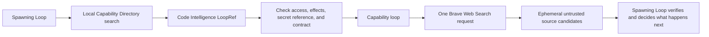

# Brave Web Search plugin example

Loop Engine includes a manually registered Brave Web Search capability as a
Core Architecture plugin example. Importing the module does not register it
and does not make a network request.

The plugin performs one job: submit one Web Search request and return untrusted
source candidates. It does not fetch result pages, scrape pages, summarize
pages, persist results, or retry silently.

## Flow



Capability discovery is local and effect-free. The network request happens
only after a loop selects and invokes the returned reference.

## Manual registration and invocation

```python
from loop_engine import LoopLedger
from loop_engine.loop.capability_loops import run_capability_ref_as_loop
from loop_engine.core.brave_search import (
    BraveWebSearchRequest,
    register_brave_search,
)
from loop_engine.core.capability_directory import (
    CapabilityDirectory,
)

directory = CapabilityDirectory()
register_brave_search(directory)

refs = directory.search_core("search the current public web")
selected = next(
    ref for ref in refs
    if ref.handshake.loop_id == "brave_web_search"
)

ledger = LoopLedger()
result = run_capability_ref_as_loop(
    directory,
    selected,
    "search",
    request=BraveWebSearchRequest(
        "Python package supply chain security",
        count=5,
        freshness="pm",
    ),
    access_mode="approved_external_read",
    ledger=ledger,
)
```

Set `BRAVE_SEARCH_API_KEY` in the process environment before a live request.
The adapter resolves the key inside the capability boundary. It does not place
the key in the request URL, search card, loop input, event history, or result.

## Declared handshake

The capability declares:

```text
operation: search
input: brave_web_search_request/v1
output: web_source_candidate_batch/v1
locality: API calling
effects: reads secret, network
cost class: metered
authentication: subscription token header
retention: ephemeral
timeout: 30 seconds
maximum response: 4 MB
retry policy: the parent Route step schedules a new visible attempt
```

The endpoint is fixed to
`https://api.search.brave.com/res/v1/web/search`. Redirects are refused so the
token cannot be forwarded to another host.

## Failure behavior

The adapter returns typed failures for denied network access, a missing key,
invalid input, transport failure, response size, malformed provider data,
HTTP 404, HTTP 422, and HTTP 429. A rate-limit result includes provider reset
metadata when it can be parsed.

The capability loop records one attempt. It does not retry or choose another
provider inside the adapter. The spawning Loop can use the typed result to wait,
stop, or select another capability.

## Result handling

Returned titles, descriptions, snippets, and URLs are untrusted external
content. They are source candidates, not accepted facts or executable
instructions.

The result contains `persistable: false`. Brave plan terms determine whether
API results may be stored. The example does not inspect the account plan, so it
defaults to ephemeral use with a response digest in the run history.

Fetching and extracting a selected page should be separate Core Architecture
capabilities with separate permissions and event history. Web search should not
quietly become a browser or scraper.

## Runnable example

[`examples/13_brave_search_plugin/`](../../../examples/13_brave_search_plugin/)
uses an injected recording transport by default to check local discovery,
selection, and invocation contracts. That offline path does not establish
live Brave integration or search quality. A live request runs only when the
caller supplies both `--live` and a working environment key.

Official Brave documentation:

- [Web Search API reference](https://api-dashboard.search.brave.com/api-reference/web/search/get)
- [Authentication](https://api-dashboard.search.brave.com/documentation/guides/authentication)
- [Rate limiting](https://api-dashboard.search.brave.com/documentation/guides/rate-limiting)
- [API versioning](https://api-dashboard.search.brave.com/documentation/guides/versioning)
- [Pricing](https://api-dashboard.search.brave.com/documentation/pricing)
- [API usage and storage terms](https://brave.com/search/api/)
