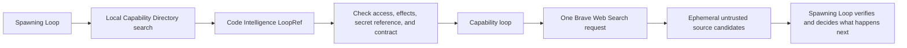

# Brave Web Search plugin example

Loop Engine includes a manually registered Brave Web Search capability as a
Core Architecture plugin example. Importing the module does not register it
and does not make a network request.

The plugin performs one job: submit one Web Search request and return untrusted
source candidates. It does not fetch result pages, scrape pages, summarize
pages, persist results, or retry silently.

## Flow


```mermaid
flowchart LR
    L[Spawning Loop] --> D[Local Capability Directory search]
    D --> R[Code Intelligence LoopRef]
    R --> G[Check access, effects, secret reference, and contract]
    G --> C[Capability loop]
    C --> B[One Brave Web Search request]
    B --> O[Ephemeral untrusted source candidates]
    O --> V[Spawning Loop verifies and decides what happens next]
```

Capability discovery is local and effect-free. The network request happens
only after a loop selects and invokes the returned reference.

## Manual registration and invocation

```python
from loop_engine import LoopLedger
from loop_engine.loop.capability_loops import run_capability_ref_as_loop
from loop_engine.core.brave_search import (
    BraveWebSearchRequest,
    register_brave_search,
)
from loop_engine.core.capability_directory import (
    CapabilityDirectory,
)

directory = CapabilityDirectory()
register_brave_search(directory)

refs = directory.search_core("search the current public web")
selected = next(
    ref for ref in refs
    if ref.handshake.loop_id == "brave_web_search"
)

ledger = LoopLedger()
result = run_capability_ref_as_loop(
    directory,
    selected,
    "search",
    request=BraveWebSearchRequest(
        "Python package supply chain security",
        count=5,
        freshness="pm",
    ),
    access_mode="approved_external_read",
    ledger=ledger,
)
```

Set `BRAVE_SEARCH_API_KEY` in the process environment before a live request.
The adapter resolves the key inside the capability boundary. It does not place
the key in the request URL, search card, loop input, event history, or result.

## Declared handshake

The capability declares:

```text
operation: search
input: brave_web_search_request/v1
output: web_source_candidate_batch/v1
locality: API calling
effects: reads secret, network
cost class: metered
authentication: subscription token header
retention: ephemeral
timeout: 30 seconds
maximum response: 4 MB
retry policy: the parent Route step schedules a new visible attempt
```

The endpoint is fixed to
`https://api.search.brave.com/res/v1/web/search`. Redirects are refused so the
token cannot be forwarded to another host.
The default transport reads at most the declared byte ceiling plus one byte,
on both successful and failed HTTP responses. The extra byte detects an
oversized response; the plugin then returns `response_too_large`.

## Failure behavior

The adapter returns typed failures for denied network access, a missing key,
invalid input, transport failure, response size, malformed provider data,
HTTP 404, HTTP 422, and HTTP 429. A rate-limit result includes provider reset
metadata when it can be parsed.

The capability loop records one attempt. It does not retry or choose another
provider inside the adapter. The spawning Loop can use the typed result to wait,
stop, or select another capability.

## Result handling

Returned titles, descriptions, snippets, and URLs are untrusted external
content. They are source candidates, not accepted facts or executable
instructions.

The result contains `persistable: false`. Brave plan terms determine whether
API results may be stored. The example does not inspect the account plan, so it
defaults to ephemeral use with a response digest in the run history.

Fetching and extracting a selected page should be separate Core Architecture
capabilities with separate permissions and event history. Web search should not
quietly become a browser or scraper.

## Runnable example

[`examples/13_brave_search_plugin/`](../../../examples/13_brave_search_plugin/)
uses an injected recording transport by default to check local discovery,
selection, and invocation contracts. That offline path does not establish
live Brave integration or search quality. A live request runs only when the
caller supplies both `--live` and a working environment key.

Official Brave documentation:

- [Web Search API reference](https://api-dashboard.search.brave.com/api-reference/web/search/get)
- [Authentication](https://api-dashboard.search.brave.com/documentation/guides/authentication)
- [Rate limiting](https://api-dashboard.search.brave.com/documentation/guides/rate-limiting)
- [API versioning](https://api-dashboard.search.brave.com/documentation/guides/versioning)
- [Pricing](https://api-dashboard.search.brave.com/documentation/pricing)
- [API usage and storage terms](https://brave.com/search/api/)

## Selectable search engines

`core.web_research_engines` implements the existing `web_research_port`
engine slot for explicitly authorized operator research. A caller keeps the
same `WebResearchRequest` and capability operation when it selects Brave,
Exa or Tavily. `register_web_research` installs the selected engine in the
existing Capability Directory; `run_capability_ref_as_loop` owns its one
governed invocation. Importing the module does not register or call an engine.
Default customer runtime activation remains off.

The shared contracts are `web_research_request/v1` and
`web_research_result/v1`. They carry a query, purpose and optional result
limit, then untrusted source candidates or an explicit failure. The result
names its provider, engine version, implementation digest, instance and
provider-account quota identity. Provider usage is recorded only when the
response reports it. An absent credit or dollar amount stays unknown.

| Engine | Wire request | Deliberate limits |
|---|---|---|
| Brave | Existing Web Search plugin, subscription-token header | Ephemeral results; no storage-rights assumption |
| Exa | Native `POST /search`, API-key header | `type: auto` and `contents.highlights: true`; no filters, summary, agent run or monitor |
| Tavily | Native `POST /search`, bearer header | Basic search, usage reporting, no generated answer or raw-page content |

Exa receives `numResults` only when the caller explicitly supplies a result
limit. The default request follows the
[Exa search reference](https://exa.ai/docs/reference/search).
The Tavily adapter keeps automatic parameter selection off so a request
cannot silently select a deeper search. Its request and usage fields follow
the [Tavily search reference](https://docs.tavily.com/documentation/api-reference/endpoint/search).
These adapters return source candidates. They do not establish the truth or
reuse rights of a source.

`WebResearchPolicy` reuses `RequestBudget` for the whole run and each declared
provider account. The caller shares this policy across engine instances and
credential aliases. Reservations happen before dispatch and survive failed
requests. Account access refusals, rate limits, exhausted provider usage and
unknown transport outcomes hold that account. Changing a key does not clear
the hold or create another allowance. The default HTTP transport also requires
`DurableSearchQuota`. In-memory policies remain available for independently
qualifying engines with injected transports; they do not qualify recurring
or distributed execution. These are operator ceilings, not a statement of
the provider's subscription limits.

There is no automatic retry, cross-provider fallback or browser escalation.
Another attempt requires caller reconciliation and authority; it cannot reset
the task's remaining allowance. HTTP status and parsed Retry-After metadata
remain available to that caller. The network transport has a socket timeout
and a response byte ceiling. The shared deadline is checked before dispatch;
it is not a promise that an upstream operation stops when the client times out.

All three engines return `persistable: false`. The operator command prints
`web_research_observation/v1`, a metadata-only projection that omits result
URLs, titles, snippets and query text. In particular, do not connect Brave to
the raw-response-persisting query multiplier until the specific account's
storage rights and a compatible retention policy are established.

Before returning candidates, the adapter checks the resolved credential
against the decoded title, URL, excerpts and reported date. It also checks
up to three percent-decoding passes of a source URL; deeper URL encoding is
refused. A match clears every candidate and returns a typed failure while
preserving the request charge and any reported provider cost. This bounded
reflection check does not claim detection of arbitrary encodings or transforms.

## Bounded operator probe

The named credential must exist in the operator reference manifest with the
matching provider, account and purpose. A custom manifest can be supplied
with `--credentials`. Key values remain in the system keyring.

```sh
PYTHONPATH=src:tools python tools/probe_web_research.py \
  --provider exa --credential-ref exa-search-primary \
  --query "official documentation for semantic web search"
```

Without `--authorize-network`, this command validates the configuration and
prints an engine description without reading the keyring or creating quota
state. Dispatch requires all four options: `--authorize-network`,
`--authorize-accounting-writes`, `--quota-policy` and `--quota-state`.
The state path must be an absolute `.sqlite` path in an operator-owned
directory that others cannot write. Every process using the same provider
account must share this file. Use a Python environment with the existing
operator keyring dependencies for a real call.

The policy is explicit versioned JSON. This example is illustrative, is not
installed and grants no additional spending. Its dollar amounts are operator
ceilings, not provider prices. The account must match the credential
manifest's provider-account identity, not a key alias:

```json
{
  "record_type": "web_research_quota_policy/v1",
  "policy_id": "bounded-research",
  "revision": "1.0.0",
  "day_timezone": "UTC",
  "accounts": [{
    "account": "exa:owner-primary",
    "daily_requests": 2,
    "window_seconds": 60,
    "window_requests": 1,
    "daily_cost_microusd": 20000,
    "request_cost_reserve_microusd": 10000
  }]
}
```

`10000` microdollars is USD 0.01. A dollar ceiling requires a declared
per-request cost reserve. When the response reports dollars, the store uses
the reported amount, rounded upward to a microdollar. A missing dollar amount
stays unknown and holds that cost-bounded account until reconciliation. For
an account whose dollar usage is unavailable, both cost fields must be
`null`; request ceilings still apply. This does not establish free usage or
permission to spend. Reported provider credits remain separate from dollars.

## Durable account accounting

`core.web_research_quota` is an internal accounting projection of Web Research.
It uses one SQLite `BEGIN IMMEDIATE` transaction to check the allowance and
record a reservation before dispatch. A restarted process sees the same
UTC-day count, rolling-window count, cost reserve and account hold. Each
provider account permits only one unresolved reservation at a time. There
is no timed retry of an abandoned reservation. The transaction choice follows
[SQLite's single-writer transaction rules](https://www.sqlite.org/lang_transaction.html).

The existing `RequestBudget` remains the whole-run ceiling.
`OperationCostLedger` is post-hoc accounting, and managed record revisions
do not provide this atomic rolling-window reservation. The quota projection
therefore owns this small transaction inside Web Research. It does not create
a provider registry, search-result store or executable runtime. In particular,
it does not use the query multiplier's raw-response evidence store.

The database contains policy limits, request and response digests, reservation
identities, timestamps, status codes and cost/cooldown metadata. It contains
no query, result content, headers or credential. Reservations and completion
events remain after a failure. Constructors and discovery create no database;
actual accounting operations require `allow_writes=True`. Capability
handshakes declare the filesystem effects and bind the policy and state path.

A 429 or successful response with zero remaining allowance records a shared
cooldown. Parseable Retry-After values apply to any provider; Brave's reset
durations apply only when every exhausted window has a valid reset.
Unknown reset times and access refusals produce indefinite holds. A known
cooldown expires without clearing request counts and without dispatching
anything automatically.

Transport failures, cancellation and a failed completion write leave a
reserved or unknown outcome. `DurableSearchQuota.reconcile` requires an
explicit evidence digest and, when cost-bounded, a known dollar amount.
Reconciliation records another event and never refunds the request count.
The operator must establish the outcome with the provider before invoking
it. It is not permission to retry blindly. A deadline that expires while
waiting for the accounting lock prevents dispatch but conservatively retains
its reservation; this case reports zero physical attempts and also requires
explicit reconciliation.

Limits: other applications' account usage is unknown. The cost reserve is a
declared bound, not control over an upstream price change; a reported amount
above it holds the account. The store refuses a changed policy rather than
resetting counters. Policy migration and evidence-backed release of indefinite
provider holds are not implemented. Do not replace the file to bypass them.
The file must live on a persistent local filesystem with SQLite locking.
SQLite documents the [locking and flush assumptions](https://www.sqlite.org/atomiccommit.html)
behind its crash recovery.
Separate files on Cloudflare Workers or different hosts do not share an
allowance; those deployments need a shared coordinator before activation.
No recurring search, automatic fallback, purchase or new provider is enabled
by this command.

Offline checks use injected transports, including oversized success/error
bodies, missing credentials, malformed responses, account holds, shared
allowances and the canonical Loop. They establish local contract behavior,
not live provider readiness or search quality:

```sh
PYTHONPATH=src:tools python -m unittest tools.test_web_research_engines tools.test_web_research_quota
```
