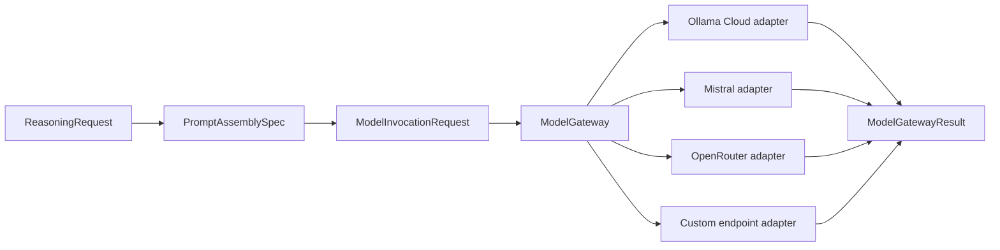

# Model gateway and provider configuration

`ModelGateway` is the provider-neutral model invocation boundary. It resolves
provider and model routes, checks route policy, gives every physical provider
attempt its own model loop, validates output, applies call and token limits,
and returns one common result.

## Call flow



The gateway tries one route at a time. Each attempt has its own loop identity,
provider, model, split token usage, validation result, elapsed time, and error
classification. Total failure remains a model failure.

## Standard objects

| Object | Responsibility |
|---|---|
| `ProviderAdapter` | Common executable protocol: chat, verify, and list models. |
| `ProviderSpec` | Provider ID, adapter type, credential reference, locality, wire format, capabilities, and token-accounting posture. |
| `ModelProviderCapabilities` | Declared provider capabilities such as locality, context size, structured output, tools, and provider-reported tokens. |
| `ModelRoute` | One provider and model combination for a declared purpose. |
| `RouteRegistry` | The routes available to a run. It can be replaced as a unit. |
| `RoutePolicy` | Which local or cloud routes are permitted for each purpose. |
| `ModelRouteAttemptSpec` | One route, model thinking power, and timeout. |
| `ModelOutputCapability` | The provider-declared or endpoint-observed maximum output size and its source. |
| `ProviderPinnedRequest` | One typed request for a comparison arm that must use one provider and model. |
| `ModelGatewayConfig` | Ordered attempt plan, allowed models and localities, failover policy, tier escalation policy, and total token ceiling. |
| `ModelGatewayRequest` | Prompt, system text, temperature, output contract, trace identity, and gateway configuration. |
| `GatewayAttempt` | One physical provider attempt and its model-loop identity. |
| `ModelGatewayResult` | Selected provider, model, route, output, split usage, all attempts, and failure state. |
| `ReasoningRequest` | The semantic question, task state, allowed tools, models, routes, and output schema. |
| `PromptAssemblySpec` | The named prompt blocks, layout policy, and seeds. |
| `ModelInvocationRequest` | The assembled prompt, route chain, model chain, parameters, and digests. |
| `OperatingProfile` | High-level access, reasoning, construction, effort, optimization, and resource limits. |
| `SolverConfig` | Enforced internet, model, authoring, budget, and reuse settings. |
| `RuntimeSettings` | One composed object for loop defaults, search, providers, model tiers, operating policy, and history. |

These objects keep provider configuration separate from the task, loop mode,
prompt layout, and operating authority.

## Built-in providers

The built-in provider specifications are:

| Provider ID | Connection |
|---|---|
| `ollama_cloud` | Ollama hosted API using `OLLAMA_API_KEY`. |
| `mistral` | Mistral hosted API using `MISTRAL_API_KEY`. |
| `openrouter` | OpenRouter API using `OPENROUTER_API_KEY`. |

`ollama_cloud` means the hosted Ollama service. A local Ollama server is a
custom endpoint with `wire="ollama"` and `locality="local"`.

## Configure and verify providers

```python
from loop_engine import configure

access = configure()
print(access.explain())
```

`configure()` checks configured providers by use and builds `ModelAccess` plus
a discovered `ModelRoster`. It reports deterministic mode even when no model
provider works. It reports hybrid and non-deterministic modes only when at
least one provider answers.

Provider checks make small live model calls. Run them only when those calls are
authorized.

Every generation asks for the selected route's source-backed maximum output.
Loop Engine does not substitute a convenient lower limit. A route with an
unknown maximum stays unavailable until provider discovery or explicit custom
endpoint configuration supplies the exact value.

## Run an ordered failover request

```python
from loop_engine import (
    ModelGateway,
    ModelGatewayConfig,
    ModelGatewayRequest,
)

gateway = ModelGateway()
result = gateway.invoke(ModelGatewayRequest(
    "Return the safest next action as one JSON object.",
    ModelGatewayConfig(
        route_names=(
            "cloud.default",
            "cloud.mistral",
            "cloud.openrouter",
        ),
        max_route_attempts=3,
        max_total_tokens=4000,
    ),
))

print(result.provider)
print(result.model)
print(result.attempts)
```

The first successful and valid route wins. A failed Ollama attempt followed by
a successful Mistral attempt produces two distinct model loops and keeps both
attempt records.

## Select model thinking power

Model thinking power is separate from loop effort. A model-using loop can
request `small`, `medium`, `high`, `max`, or `specialized`. User settings map
each value to named routes and per-attempt limits.

```python
from loop_engine import (
    ModelPolicyRequest,
    ModelTask,
    load_runtime_settings,
)

settings = load_runtime_settings().settings
gateway = settings.build_gateway()
request = settings.model_request(ModelTask(
    prompt="Return one valid JSON object.",
    policy=ModelPolicyRequest(
        thinking_power="small",
        allow_escalation=True,
        max_total_tokens=4000,
    ),
))
result = gateway.invoke(request)
```

Provider failover tries another provider or model route in the same tier.
Power escalation moves to another tier after an allowed typed failure. The
gateway records these as separate decisions. Authentication failure does not
trigger a stronger model because a stronger model cannot repair a rejected
credential. A registered evaluator's verdict about an admitted answer
(`semantic_response_rejected` or `response_evaluation_inconclusive`) is
recorded on the attempt and ends the invocation on that route; it moves to
another route only when `allow_evaluator_route_failover` is set, which is a
separate permission from `allow_failover`.

Read [Runtime settings and model tiers](../../guides/settings.md).

## Pin one provider for a comparison

Provider comparison arms should not use cross-provider failover. Pin one route
and disable failover:

```python
config = ModelGatewayConfig(
    route_names=("cloud.mistral",),
    allow_failover=False,
    max_route_attempts=1,
    max_total_tokens=4000,
)
```

This ensures that a Mistral arm either uses Mistral or fails as a Mistral arm.
It cannot quietly become an OpenRouter arm.

## Add a custom endpoint without changing the gateway

```python
from loop_engine import (
    CustomEndpoint,
    ModelGateway,
    ModelRoute,
    RoutePolicy,
    provider_spec_from_endpoint,
)

endpoint = CustomEndpoint(
    name="local_ollama",
    base_url="http://127.0.0.1:11434",
    model="qwen2.5:7b",
    wire="ollama",
    locality="local",
)

provider = provider_spec_from_endpoint(endpoint)
route = ModelRoute(
    "local.review",
    provider.provider_id,
    endpoint.model,
    locality="local",
    purposes=("decide_label",),
)

gateway = ModelGateway(
    providers=(provider,),
    routes=(route,),
    policy=RoutePolicy(allow_local_decide_label=True),
)
```

The provider description stores a credential reference and connection facts.
It does not serialize the key.

## Modes and providers are separate

A loop mode describes how the loop performs its work. A provider route
describes where a model call goes. Do not combine them.

- Deterministic mode contacts no provider.
- Hybrid mode performs code work first and may start a model loop through the
  gateway.
- Non-deterministic mode uses a model loop for the main semantic step.
- Any of those loops may start another loop with different mode settings when
  its delegation policy permits that mode.

## Classify a provider failure

Every attempt carries one `error_code` from a closed vocabulary, and a
worker reads the code's class from `core/provider_failure_classes.py`
rather than the code alone. An adapter puts the HTTP status at the front of
its error text (`HTTP 429 (retry after 120s): ...`), and the status settles
the class before any word in the body can, so a reference id inside a body
cannot read as a status.

| Class | Codes | What a worker does |
|---|---|---|
| outage | `network_unreachable`, `provider_unavailable`, `gateway_timeout`, `timeout`, `invalid_response_body` | wait for recovery, within a stated ceiling |
| allowance | `rate_limited` (a throttle that clears in seconds), `usage_limit_reached` (a spent weekly limit, quota, or spending cap that resets on the provider's calendar), `payment_required` | wait for the allowance, within a stated ceiling |
| configuration | `missing_credential`, `authentication_failed`, `model_not_found`, `invalid_request`, `provider_not_configured`, `no_eligible_route`, `unknown_model_output_limit` | stop the route; no retry of the same configuration can pass |
| request | `context_window_exceeded`, `output_limit_reached`, `output_validation_failed`, `unsupported_tool_call`, `empty_response`, the evaluator verdicts | fail this cell; the route stays |
| contract | `provider_attempt_contract_violated`, `model_output_limit_mismatch`, `model_identity_mismatch`, `token_accounting_unavailable` | stop the route and review |
| unclassified | `provider_failed`, `incomplete_response`, `model_gateway_failed` | fail the cell; the code says a failure happened and nothing about its kind |

The attempt record also carries `retry_after_seconds` when the provider
stated a wait, `delivered_by_stream` when a streamed request answered, and
`provider_physical_requests` when the adapter opened more than one request
for the attempt (`auto` streaming after a proxy timeout) or none (a refusal
before sending). The Practitioner retries outage and throttle codes inside a
step and never a spent allowance; a campaign worker decides per cell with
`provider_failure_classes.decide`.

## Current limits

- The gateway enforces attempt and provider-reported token ceilings. A complete
  cost ceiling still needs versioned provider price records.
- Provider discovery and custom endpoint registration still use the existing
  process provider table. A later change should make every configured gateway
  fully instance-scoped.
- Low-level provider client functions remain public for compatibility. New
  runtime paths should call `ModelGateway`.
- OpenCode external-agent execution has a separate authorization and accounting
  path. It is not a model provider adapter.
