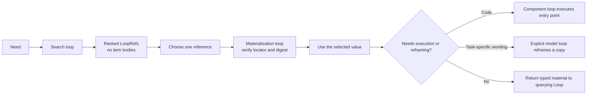

# Intelligence is returned through loops

An intelligence search does not hand every stored body to the caller. It runs
a search loop and returns ranked `LoopRef` objects. A `LoopRef` contains enough
information to choose an item: identity, layer, supported modes, contracts,
effects, cost class, version, score, locator, and digest.

The selected item is then loaded through its own intelligence loop.



This applies to all four persistent intelligence layers.

| Layer | Search returns | Selected access |
|---|---|---|
| Context Intelligence | A reference to a question, method, warning, template, or source note. | A Context loop returns the stored value. |
| Code Intelligence | A reference to a function, package, repository, service, workflow, or subsystem. | A Code Intelligence loop loads the selected body. A component loop executes the chosen entry point. |
| Runtime History and Solution Intelligence | A reference to a saved run, decision, failure, measurement, or solution. | A History loop returns the verified selected record. |
| User Feedback Intelligence | A reference to scoped user guidance. | A User Feedback Intelligence loop returns the guidance. An optional model loop may reframe a copy for the current task. |

Runtime Memory uses the same loop boundary for reads and writes, but it remains
temporary and run-scoped. It is not a fifth persistent layer.

## Search and load one item

```python
from loop_engine import LoopLedger
from loop_engine.loop.loop_capsule import LoopRef
from loop_engine.static_architecture.intelligence_layers import (
    build_intelligence_catalog,
    materialize_intelligence_ref,
    query_intelligence,
)

ledger = LoopLedger()
catalog = build_intelligence_catalog()

search = query_intelligence(
    "check a customer import for invalid country codes",
    catalog,
    mode="lexical",
    top_n=3,
    ledger=ledger,
)

selected = LoopRef.from_dict(search["loop_refs"][0])
loaded = materialize_intelligence_ref(selected, catalog, ledger=ledger)

print(search["query_loop"]["loop_id"])
print(selected.loop_ref)
print(loaded["loop_id"])
print(loaded["value"])
```

The search loop and access loop have different identities. Searching does not
load all candidates. Only `selected` is materialized.

## Optional user-guidance reframing

A normal User Feedback Intelligence access is deterministic. Some applications may
want an authorized language model to restate the guidance for a specific task.
That is a second loop, not hidden behavior inside retrieval.

```python
from loop_engine.loop.loop_capsule import reframe_ref_with_model

result = reframe_ref_with_model(
    selected_user_ref,
    resolver=resolve_selected_guidance,
    task="review the failed nightly import",
    reframe=authorized_model_adapter,
    ledger=ledger,
)

assert result["source_unchanged"] is True
assert result["access_loop_id"] != result["reframe_loop_id"]
```

The source guidance remains unchanged. The model output is a task-specific
result with its own loop identity.

## Custom Plugins use the same selection rule

The Capability Directory searches local Custom Plugin handshake cards. This is
effect-free. It returns Code Intelligence `LoopRef` objects for registered
capabilities.

```python
from loop_engine.loop.capability_loops import run_capability_ref_as_loop
from loop_engine.static_architecture.capability_directory import (
    CapabilityDirectory,
)

directory = CapabilityDirectory()
register_my_plugin(directory)

refs = directory.search_static_architecture("search the current public web")
selected = refs[0]

result = run_capability_ref_as_loop(
    directory,
    selected,
    "search",
    request=request,
    access_mode="approved_external_read",
    ledger=ledger,
)
```

Discovery never calls the network endpoint. Invocation verifies that the
selected handshake has not changed, then starts an effect-bearing capability
loop.

## Large bodies stay outside the search index

A `LoopRef` may point to a file, package, repository, object-store object,
container, dataset, or service. The index stores the locator, digest, size,
media type, contracts, entry points, and search metadata. It does not need the
whole body.

The resolver must return the loaded value with the digest it observed. A
missing, changed, or swapped digest fails before execution.

This sequence keeps the universal rule practical:

```text
search loop
select one LoopRef
materialization loop
optional execution or reframe loop
return typed material to the querying Loop
```
