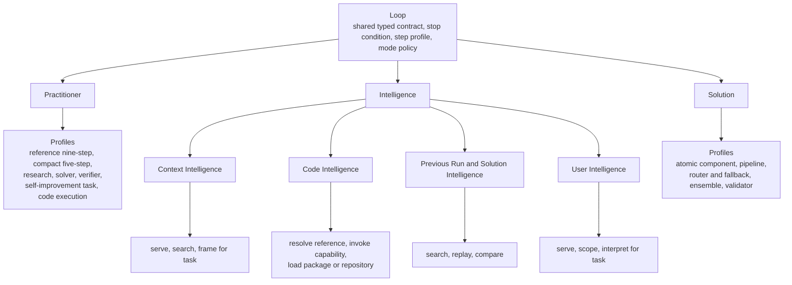

# Loop profile ontology

Loop Engine has one runtime class: `Loop`. A loop profile is immutable data
that configures that class for a specific kind of work. Profiles do not create
new runtimes and do not use a deep Python class hierarchy.

Each profile names its parent, version, step template, allowed modes, allowed
logical kinds, required fields, and required capabilities. A child may add
requirements or narrow permissions. It cannot expand the permissions of its
parent.

The code keeps data and behavior separate. `loop_profile_catalog.py` contains
the immutable built-in definitions. `loop_profile_ontology.py` resolves
parents, validates the tree, binds profiles, and checks version compatibility.

## The profile tree



The three top branches answer different questions:

| Branch | Question |
|---|---|
| Practitioner | What work is the system doing to understand, build, test, or improve something? |
| Intelligence | What intelligence item is being searched, served, framed, loaded, replayed, or compared? |
| Solution | What finished component or composition runs for a new input? |

Self-improvement belongs under Practitioner. It is a task given to the Loop
Practitioner. It is not a fourth runtime role and it cannot approve its own
candidates.

The current Solution Canvas runner executes deterministic component loops.
For that reason, the registered atomic component, pipeline, router and
fallback, ensemble, and validator profiles are deterministic-only. A future
profile version may allow hybrid or non-deterministic execution after those
Canvas adapters exist and pass their own tests.

## Terms that stay separate

These settings describe different parts of a loop. Combining them under one
name makes configuration harder to check.

| Setting | Meaning |
|---|---|
| Loop profile | The loop's purpose and required interface. |
| Step profile | The number, order, and repetition of steps. |
| Run mode | Deterministic, hybrid, or non-deterministic execution. |
| Logical kind | Execution, task-semantic work, or search-improvement work. |
| Effort | Limits for iterations, retrieval, and model calls. |
| LLM thinking power | The configured model tier for a hybrid or non-deterministic loop. |

An LLM thinking power value is invalid on a deterministic-only loop. A profile
binding that selects hybrid or non-deterministic mode must provide a thinking
power value. The current levels are `small`, `medium`, `high`, `max`, and
`specialized`.

## Profile requirements

Every profile inherits these requirements from the root:

1. A `LoopContract` with typed input and output roles.
2. A stop condition.
3. A registered step profile.
4. A mode policy.

Specialized profiles add only what they need. For example, a Context search
profile adds a query and the Context search capability. A code package profile
adds an artifact manifest, an entry point, and an artifact loader. A Solution
ensemble adds member loops, a combination rule, and the ensemble capability.

The ontology checks requirements before a loop starts. It does not treat a
field name as proof that a provider, store, package, or operation works. The
runtime still verifies the selected capability and records the run.

## Bind a profile to the current runtime

Pass one typed request to `bind_profile`. The result contains the resolved
profile, the original typed contract, and the existing `LoopConfig`.

```python
from loop_engine.loop.loop_contract import LoopContract
from loop_engine.loop.loop_profile_ontology import (
    LoopProfileBindingRequest,
    LoopProfileRef,
    bind_profile,
)

request = LoopProfileBindingRequest(
    profile=LoopProfileRef("practitioner.solver", "1.0.0"),
    goal="repair a failed customer import",
    contract=LoopContract(
        name="repair-customer-import",
        execution_mode="hybrid",
        input_roles=("import_failure/v1",),
        output_roles=("repair_patch/v1",),
    ),
    available_fields=("acceptance_test",),
    capabilities=(
        "loop_spawn",
        "chronicle_write",
        "solution_build",
        "independent_verification",
    ),
    modes=("deterministic", "hybrid"),
    preferred_modes=("deterministic", "hybrid"),
    llm_thinking_power="high",
)

bound = bind_profile(request)
bound.config.framework       # "custom"
bound.config.custom_steps    # build, test, diagnose, and repair steps
bound.config.allowable_modes # ("deterministic", "hybrid")
```

The profile points to the existing `build_test_repair` Loop Template. The
binding does not copy that step sequence into another runtime.

## Version handshake

Every profile reference includes an exact semantic version. A consumer can
accept a profile branch and a compatible major version. A more specific child
profile satisfies the branch requirement when its ancestry and version match.

```python
from loop_engine.loop.loop_profile_ontology import (
    LoopProfileRef,
    LoopProfileRequirement,
    profile_handshake,
)

result = profile_handshake(
    LoopProfileRef("intelligence.context.search", "1.0.0"),
    LoopProfileRequirement(
        "intelligence.context",
        minimum_version="1.0.0",
        compatible_major=1,
    ),
)

assert result.compatible
```

The handshake fails if the provided profile belongs to another branch, uses an
unsupported major version, is older than the required version, or is not in the
registered ontology.

Profile compatibility does not prove that two loop ports connect. Use
`LoopConnectionSpec` and `validate_loop_connection()` for the separate typed
input and output check.

## Validation rules

`validate_profile_ontology()` checks the full tree without running a loop. It
fails when:

- the root or any top branch is missing;
- an intelligence layer branch is missing;
- a parent reference is missing or cyclic;
- a child expands its parent's run modes or logical kinds;
- a runnable profile points to a missing, invalid, or candidate Loop Template;
- a deterministic-only profile accepts LLM thinking power;
- a runnable profile has no stop condition or step template.

Run the focused deterministic test with:

```bash
PYTHONPATH=src python -c \
  'from loop_engine.loop.loop_profile_ontology import self_test; print(self_test())'
```

Print the complete serializable catalog:

```bash
loop-engine --profiles
```
