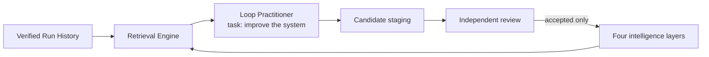

# Self-improvement as a Practitioner task

Self-improvement is a task given to the Loop Practitioner. It is not a separate
runtime role, service layer, or architectural peer. The Practitioner uses
ordinary loops to inspect past work and the current Intelligence Library, then
propose useful changes.

It is not a separate Core Architecture group. It may use Intelligence Search
and Retrieval like any other permitted Practitioner task. Run History, stores,
and validation are internal runtime mechanics.

## Current flow

Task-local repair can use feedback generated by the engine itself. The public
solve path requires a separate verifier Loop to create and execute checks for
generated projects before acceptance. Failed observations reach the next
Practitioner pass without user feedback. Read the
[independent task feedback decision](../../architecture/ADR-INDEPENDENT-TASK-FEEDBACK.md).
This does not make persistent qualification, promotion, or engine source
modification automatic; the boundaries below still apply.



The Practitioner workflow has no direct path to active intelligence. It can
observe, analyze, recommend, compare, and stage. It cannot promote its own
candidate.

## Review saved runs

`run_self_improvement()` performs a bounded review:

1. Select an exact population from the saved-runs directory: every
   directory holding a manifest, which is a saved run or an append-only
   checkpoint store. A sibling without a manifest, such as the artifact
   directory beside its run, is reported under `ignored_directories` and
   takes no place in the run limit.
2. Load each Run History record (a checkpoint store loads as its latest
   checkpoint) and verify its event chain.
3. Exclude and report broken or unreadable runs, and every later copy of
   an event content already loaded. One ledger projected twice under two
   run ids is one observation: the exclusion names the run it repeats.
4. Search current intelligence through the Retrieval Engine.
5. Audit missing classifications and broad `other` categories.
6. Find repeated failures, repeated model decisions, and repeated model
   fallbacks.
7. Rank the improvement opportunities.
8. Stage in-memory candidates for independent review.

```python
from loop_engine import run_self_improvement

report = run_self_improvement(
    runs_dir="./example-output/runs",
    run_limit=100,
    trigger_class="manual",
)

report.run_population
report.n_runs_reviewed
report.excluded_runs
report.ignored_directories
report.retrieval_hits
report.candidates
```

The current function does not schedule itself and does not write candidate
files. Callers decide when to run it and where reviewed candidate records
belong.

## Other self-improvement tasks

The optional [recovery-learning assignment](../practitioner/COGNITIVE-ACT-RECOVERY.md)
uses the configured model session to retain a conditional lesson in the
existing artifact store. It records either a task-local disposition or an
unvalidated `LearningBundle`. It does not update active intelligence or
replace independent review.

The same Loop Practitioner can receive other bounded goals and step profiles:

- compare retrieval methods on a fixed query set;
- improve category tags and hierarchy coverage;
- expand a weak question or professional-role category;
- test a Context candidate on real tasks;
- nominate repeated Context decisions for Context-to-Code distillation;
- run a hypothesis and experiment profile; and
- review negative transfer when retrieved context made a result worse.

Each self-improvement task still ends at candidate staging unless a separate review authority
accepts the result.

Configuration search is another Practitioner task. It can compare added
cognitive steps, action methods, prompt portfolios, questions, intelligence
sources, and fallback policies, as well as compact alternatives. Read the
[flexible composition direction](../../architecture/FLEXIBLE-COGNITIVE-AND-ACTION-COMPOSITION.md)
and [grid search protocol](../../guides/configuration-grid-search-and-optimization.md).
Enumeration, task execution, evaluation, acceptance, and promotion remain
separate operations. An experiment can stage a useful configuration; it
cannot approve its own finding for persistent reuse.

## Seed a new domain

Domain Context seeding is one self-improvement task. The
`context_intelligence_seed` step template uses these steps under the
`practitioner.self_improvement` role profile:

```text
scope domain
audit coverage
map roles and work
define research questions
generate context
classify
deduplicate
verify
stage
report
```

`run_context_seed()` samples declared job roles, project types, task types, and
question patterns into deterministic candidate Context records. The sampler is
balanced across every feasible axis before it repeats one. It plans the bounded
set once, partitions work across role loops, restores the global order, keeps
candidate IDs stable, and creates a manifest over the exact set.

The Context ontology supplies controlled question families, thinking methods,
speech acts, response shapes, list structures, serialization formats, evidence
states, and typed relationships. Job title, industry, domain, and key phrases
remain open fields. A seed can add a new role without changing a closed package
enumeration.

Built-in seeding does not browse the web. It creates explicit questions for a
separate source-aware research loop, including questions about important
people, organizations, standards, datasets, regulations, failures, and
existing software. This prevents the seed loop from inventing domain facts.

See [seed space Context Intelligence](../../../examples/11_seed_space_context/)
for a runnable example.

## Candidate boundary

Context seeds and generated Foundry records use the `experimental` tier and
candidate lifecycle. Normal retrieval excludes them. A caller must set
`include_candidates=True` to review them.

Foundry staging writes to
`~/.loop-engine/intelligence/candidates/context.jsonl` by default. Set
`LOOP_ENGINE_CONTEXT_CANDIDATES` to choose another user-data path. The packaged
candidate snapshot is read-only at runtime.

Independent promotion still needs source support, an unchanged evaluator,
useful outcomes, and the required authority. The Practitioner workflow does
not provide that authority.
