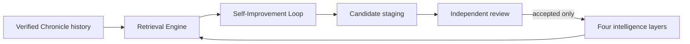

# Self-improvement and domain seeding

The Self-Improvement Loop is a role of the shared `Loop` runtime. Its task is
to inspect past work and the current Intelligence Library, then propose useful
changes.

It is separate from Static Architecture. Static Architecture supplies the
Retrieval Engine, Chronicle, stores, and validation services that the loop
uses.

## Current flow



The Self-Improvement Loop has no direct path to active intelligence. It can
observe, analyze, recommend, compare, and stage. It cannot promote its own
candidate.

## Review saved runs

`run_self_improvement()` performs a bounded review:

1. Select an exact population from the saved-runs directory.
2. Load each Chronicle and verify its event chain.
3. Exclude and report broken or unreadable runs.
4. Search current intelligence through the Retrieval Engine.
5. Audit missing classifications and broad `other` categories.
6. Find repeated failures, repeated model decisions, and repeated model
   fallbacks.
7. Rank the improvement opportunities.
8. Stage in-memory candidates for independent review.

```python
from loop_engine import run_self_improvement

report = run_self_improvement(
    runs_dir="./example-output/runs",
    run_limit=100,
    trigger_class="manual",
)

report.n_runs_reviewed
report.excluded_runs
report.retrieval_hits
report.candidates
```

The current function does not schedule itself and does not write candidate
files. Callers decide when to run it and where reviewed candidate records
belong.

## Other Self-Improvement tasks

The same Loop role can receive other bounded goals and step profiles:

- compare retrieval methods on a fixed query set;
- improve category tags and hierarchy coverage;
- expand a weak question or professional-role category;
- test a Context candidate on real tasks;
- nominate repeated Context decisions for Context-to-Code distillation;
- run a hypothesis and experiment profile; and
- review negative transfer when retrieved context made a result worse.

Each task still ends at candidate staging unless a separate review authority
accepts the result.

## Seed a new domain

Domain Context seeding is one Self-Improvement task. The registered
`context_intelligence_seed` profile uses these steps:

```text
scope domain
audit coverage
map roles and work
define research questions
generate context
classify
deduplicate
verify
stage
report
```

`run_context_seed()` multiplies declared job roles, project types, task types,
and thinking styles into deterministic candidate Context records. It starts one
loop for each role, keeps candidate IDs stable, and creates a manifest over the
exact candidate set.

Built-in seeding does not browse the web. It creates explicit questions for a
separate source-aware research loop, including questions about important
people, organizations, standards, datasets, regulations, failures, and
existing software. This prevents the seed loop from inventing domain facts.

See [seed space Context Intelligence](../../../examples/11_seed_space_context/)
for a runnable example.

## Candidate boundary

Context seeds and generated Foundry records use the `experimental` tier and
candidate lifecycle. Normal retrieval excludes them. A caller must set
`include_candidates=True` to review them.

Foundry staging writes to
`~/.loop-engine/intelligence/candidates/context.jsonl` by default. Set
`LOOP_ENGINE_CONTEXT_CANDIDATES` to choose another user-data path. The packaged
candidate snapshot is read-only at runtime.

Independent promotion still needs source support, an unchanged evaluator,
useful outcomes, and the required authority. The Self-Improvement Loop does
not provide that authority.
