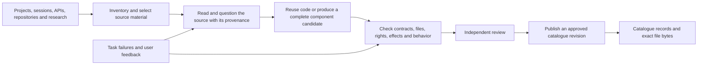
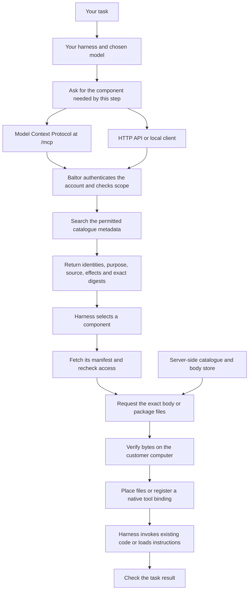

# How a harness gets reusable components from Baltor

Source inspection: commit `eae7946d836805afc7f0a007eece902c66d7bde6`,
September 27, 2026 UTC. Release 40 runs this source revision. Endpoint
behavior below comes from the server implementation and the recorded
customer download. The live public sample now shows its title and keeps its
terminal source appendix under Source details; its original body digest is
unchanged. The sections on the Baltor library skill, the install tool's
package compiler and where downloaded files go describe source that changed
after that revision, and release 40 does not include it.

## Three different paths

The three `src/loop_engine/...` names in the sample skill, **Check for
existing work before building**, identify its original source. A customer does
not need to create those folders or load the Baltor repository to follow that
written procedure.

| Path | Meaning | Example |
|---|---|---|
| Original source | Where the component was derived from; used for attribution and review | A source file at a pinned repository revision |
| Package member | A file actually supplied with the selected component | `scripts/clip_captions.py` |
| Installed path | Where a particular harness reads or registers the component | A qualified skill folder, tool-wrapper folder, or an explicit read-file argument |

A reference to source code is not a bundled implementation. If the component
needs that code at execution time, its package or dependency contract must
supply it. A source citation alone does not satisfy that requirement.

## How material enters the catalogue



The installed discovery collector supplies source observations. Candidate
generation, independent admission and publication have their own records.
The broader internal research teams and fully automatic source-interrogation
workflow are still being assembled; this diagram does not claim they already
run unattended end to end. A new catalogue release can change available
components without changing the website image.

## The client and service path

This is a map of component ownership and network traffic. It is not an
executable Loop graph.



The service searches and serves reviewed material. The customer runs their
harness and models. Retrieving a Python program does not execute it on the
Baltor server. The separate internal research programme produces research and
candidate improvements; it is not on this customer request path.

## How the harness knows to use Baltor

There are two ways in. The first connects the customer's protocol client to
the Baltor Model Context Protocol endpoint, with the entry that the setup page
gives for that client, and checks that the client lists the search and
provisioning tools. The [onboarding guide](harness-service-onboarding.md)
describes the account and connection checks, and the
[Baltor Harness quickstart](quickstart-baltor-harness.md) records the manual
search and download steps for that engine.

The second is the first-party
[Baltor library skill](../../integrations/baltor-library/README.md), version
0.3.0, for Claude Code, Codex, OpenCode and Pi. It needs no protocol client:
its standard library Python client searches, checks versions and digests, and
stages a selected item in a new folder. It reads the token from the
environment variable that the customer's configuration file names.

Either way, the harness also needs an instruction to search for reusable
material when a task needs it. A connected tool or an installed skill is
available; the task instruction, the model or the calling program still has
to select and invoke it.

Search uses the task and the required behavior to find relevant records.
Paginated catalogue browsing can enumerate the entries an account is allowed
to see. Neither operation requires downloading every component. The harness
selects a record, reads its requirements, and requests the exact files only
when they fit the task and the customer's permissions.

## What responds to each request

| Step | Model Context Protocol tool | Direct HTTP path | Response |
|---|---|---|---|
| Capabilities | Protocol initialization and tool listing; `provisioning_discover` for provisioning details | `GET /api/v1/capabilities` | Supported operations, versions and limits |
| Search | `intelligence_search` | `POST /api/v1/retrieval` | Small references and metadata; `bodies_loaded` is false |
| Browse | `provisioning_list` | `POST /api/v1/provisioning` with `operation: list` | Permitted catalogue entries, with pagination |
| Inspect | `provisioning_manifest` | The same provisioning path with `operation: manifest` | Exact identity, digest, licence, review and access information |
| Read text | `provisioning_read` | Provisioning with `operation: read` | Authorized text body, within inline limits |
| Download bytes | Use the HTTP download route from a client when exact package-file bytes are needed | `POST /api/v1/download` with `operation: read` and optional package `path` | Raw bytes and `X-Content-SHA256` |
| Report a problem | `provisioning_report` | Provisioning with `operation: report` | Recorded or withdrawn state and review handling |

The current HTTP request versions are `service_retrieval_request/v2` and
`service_provisioning_request/v2`. JSON success responses use
`service_http_result/v1`; downloads return bytes instead of that JSON wrapper.
The client supplies the selected item identity and expected item digest.
Package-file downloads also name the exact member path, then validate that
member's own returned digest. A single request identity is reused across the
same package transfer and an exact retry. A missing response does not mean
usage was never recorded.

On the server, `ServiceHttpApplication` dispatches the HTTP and protocol
operations. Authentication, effective scopes and catalogue permissions are
checked before disclosure, and access is revalidated. `authorized_hits`
searches one catalogue view. `ProvisioningServer` governs manifest/body
disclosure and metering. `CatalogueView.read_package_file` resolves declared
members; `VolumeBodyStore` retrieves and checks their content-addressed bytes.
Catalogue records and files use the service's persistent storage. Downloads
do not depend on a customer finding the original `src` paths on their machine.

## Where downloaded files go

The client chooses the local destination. In the manual HTTP path, this is
the output file selected by the download command. The Baltor library skill
stages a download in a new folder that the customer names, outside the
harness's own skill and configuration folders. The server supplies the
declared bytes; it does not choose a folder on the customer's computer.

The install tool places a one-file skill in the native skill folder of
OpenCode, Claude Code, Codex or Pi. Its package compiler candidate writes a
complete tool package into a new private staging folder under a root that the
caller chooses, for an OpenCode project tool or a Pi project extension. No
registered client profile enables that compiler, and staging never activates
anything. The [loading guide](native-client-material-loading.md) lists what
each path checks and refuses.

## Placement and native execution

The Harness Working Directory Compiler is the intended shared boundary for
rendering and placement. Current installation support is narrower than that
complete design. A file downloaded successfully is not automatically an
installed or invoked tool.

Examples already examined in this research:

- OpenCode can load a TypeScript or JavaScript tool definition which invokes
  an existing Python program. The Python file alone is not the tool definition.
- Pi extensions can register tools and event handlers with its native runtime.
- Aider can receive a downloaded instruction through an explicit read-file
  setting. This differs from an automatically discovered skill directory.

The compiler profile needs both the file layout and the activation recipe:
registration, dependencies, permissions, tool identity, restart or reload
behavior, and a native check. Bindings for SDK calls, subprocesses, binaries,
HTTP, Model Context Protocol and other supported runtimes can reuse the same
underlying operation when they satisfy its contract.

## Shorter source displays and smaller context

Recommended presentation:

```text
Source: Baltor · Reuse existing work · revision db18890 · MIT
Source details: repository files, exact revisions, digests and review records
```

Keep the complete provenance available in component details and a structured
package reference. Put concise, actionable guidance in the normal instruction
file. Load supporting documents or source files only when the task needs them.

| Material | Normal use |
|---|---|
| Search result | Small purpose, identity and compatibility record used to select a component |
| Instructions and input and output contract | Context used to decide when and how to invoke the selected component |
| Python, TypeScript or a binary | Files installed with declared dependencies and invoked through a supported tool or command binding |
| Examples, source history and full reference documents | Supporting material retrieved when interpretation, review or troubleshooting needs it |
| Result | Checked output or an artifact reference returned to the task |

For example, a caption tool can expose its input and output contract to the
model while its wrapper runs the packaged Python implementation. The model
does not need to reproduce that implementation in its response. A textual
skill has a different use: the harness reads the instructions and performs
the procedure using its available tools.

Changing the displayed label does not change downloaded bytes. Moving a source
appendix out of a downloaded instruction does change them; it must produce a
new, reviewed component revision or an explicitly bound compact variant.
Existing hashes and review records must continue to identify their original
bytes. A shortened file that silently drops an exception or condition is not
an equivalent compact edition.

The largest opportunity for reducing generated code is to invoke an existing
implementation and return its result or a short artifact reference. It does
not require inserting the full implementation into model context. Actual token
or cost savings still need a comparison on the target model and task.

## Evidence and current limits

One fresh customer completed signup, searched the library and downloaded
`find_duplicate_records_with_blocking_keys`. Aider subsequently loaded the
exact 2,722-byte body through its explicit read mechanism. A worked example
used the named existing implementation on synthetic rows and checked its
result. These observations are separate from a model-driven autonomous task.

OpenCode and Pi native executable binding checks are recorded in
`/home/username/baltor-private/native-code-bindings-20260927-v1`.
Private compiler qualification runs on September 27, 2026 also invoked a
caption tool compiled for OpenCode 1.17.9 and Pi 0.73.1 in fresh clients with
the network switched off, and both matched an independent output oracle.

The first-party customer skill is in
[integrations/baltor-library](../../integrations/baltor-library/README.md).
Continuous integration checks its pinned bytes, runs its offline tests and
runs it against the service application in the same process. On September 27,
2026 Claude Code 2.1.283, Codex 0.155.1, OpenCode 1.18.32 and Pi 0.73.1 each
installed or listed it with the network switched off and no model call, as
[the discovery record](../../artifacts/baltor-library-integration-2026-09-27/native-discovery-v1.json)
shows. The same bytes are catalogue candidate `baltor_library_client`, which
waits for independent review, so the skill is not in the catalogue. No model
has chosen it during a customer task yet, and it has not downloaded from the
live service.
