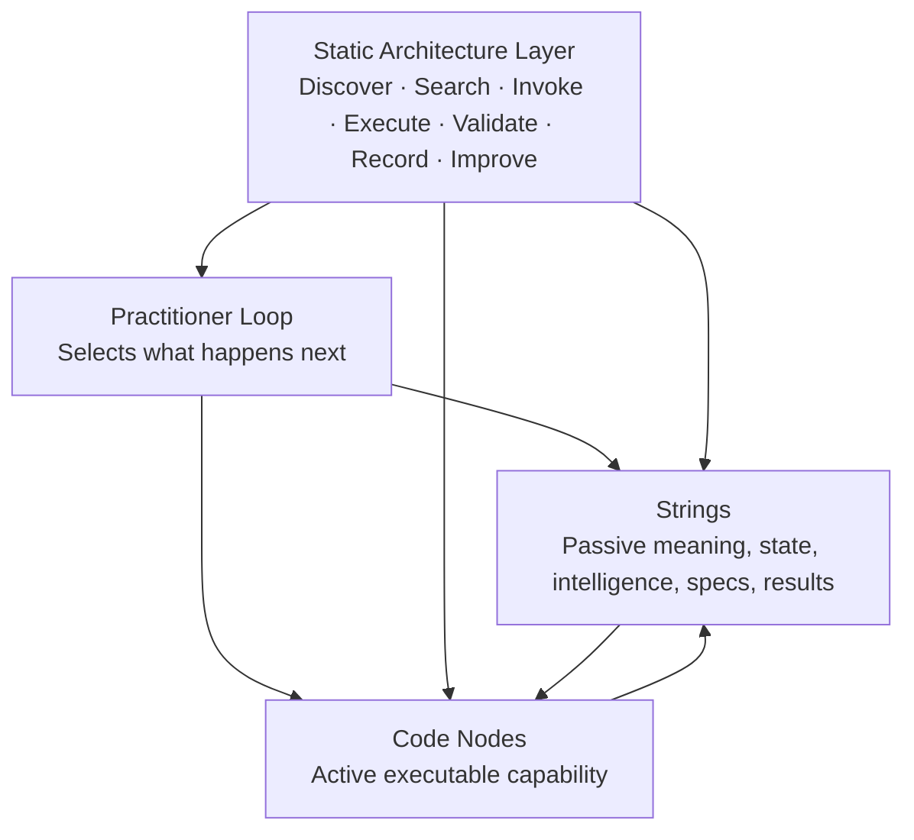
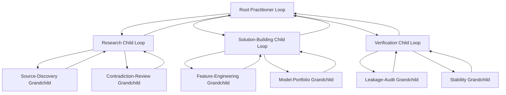
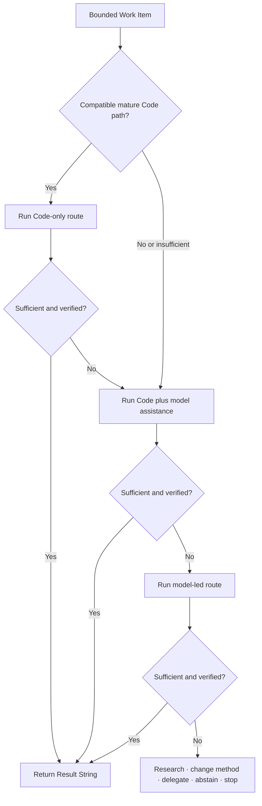
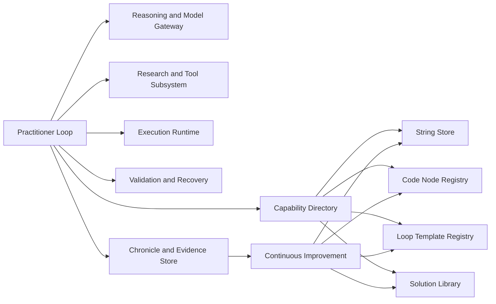
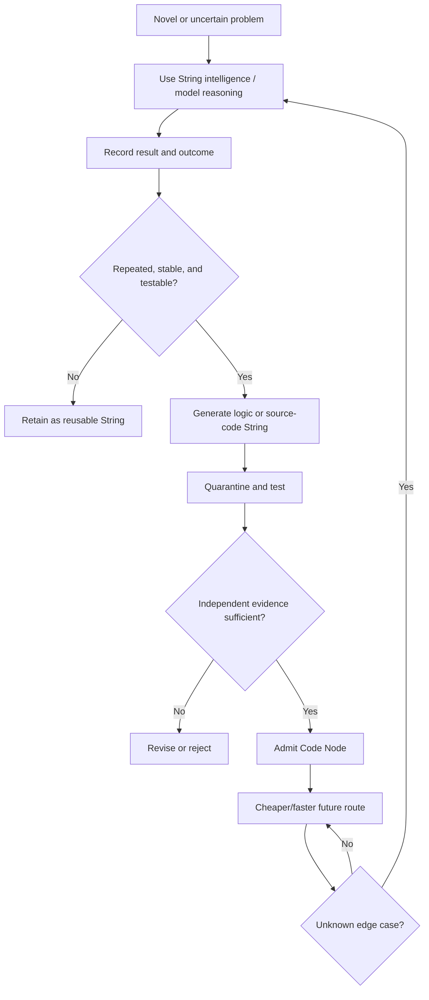
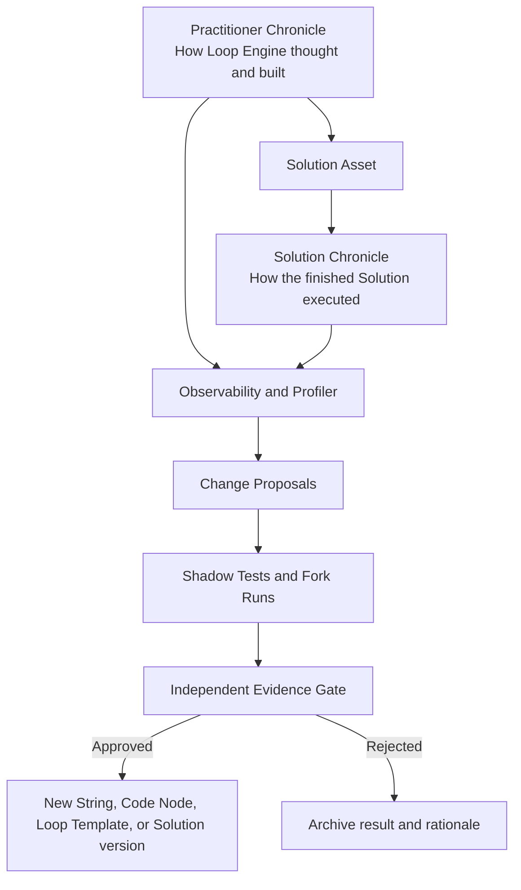
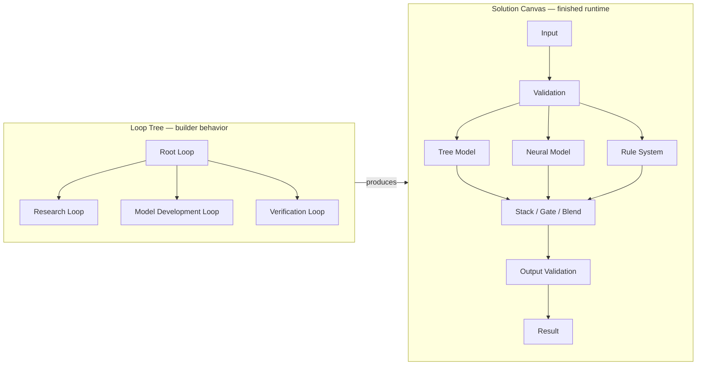

# Loop Engine master specification

> Historical consolidated specification from 2026-08-23. It contains useful
> design lineage and open ideas, but it is not the current product contract.
> Use the root README and focused component pages for current behavior.
## Master Architecture, Telemetry, Build Directive, Solution Model, Observability Standard, and Product Roadmap

**Status:** Historical consolidated specification
**Date:** 2026-08-23
**Scope:** Local MVP, open-source Python package, recursive Practitioner runtime, String and Code Node intelligence, finished Solutions, continuous improvement, playback/telemetry, packaging, and future SaaS distribution
**Evidence posture:** Current Kaggle-style results are smoke evidence for plumbing, reuse, and self-improvement mechanics. They are not broad benchmark evidence.

## How to read this file

- Sections **0–6** define the core architecture and recursive loop runtime.
- Sections **7–16** define guidance, long-horizon continuity, intelligence, capability, research, recovery, and self-improvement.
- Sections **17–20** define finished Solutions, Chronicle playback, telemetry, and the user interface.
- Sections **21–25** define storage, packaging, software-engineering standards, conformance, and testing.
- Section **26** preserves the current live telemetry and receipt-backed smoke evidence.
- Sections **27–29** define the roadmap, superseded alternatives, and governing doctrine.
- **Appendix A** provides canonical diagrams; **Appendix B** provides an implementation acceptance checklist.
- **Appendix C** (repository addendum) reconciles this snapshot against the live tree.

The terms **MUST**, **MUST NOT**, **SHOULD**, and **MAY** are normative when used in capital letters. Architecture examples and illustrative schemas may be adapted as long as the governing invariants remain enforceable and fully receipted.

---

# 0. Executive Summary

Loop Engine is a universal recursive problem-solving system organized around one question:

> **What is the single most valuable thing to do next?**

The fundamental executable object is not a fixed nine-stage pipeline, a canvas of every possible solution, or a collection of unrelated agents. It is a configurable, resumable, recursive **Practitioner Loop** initialized by Strings. A loop may execute atomic Code Nodes, initialize child Practitioner Loops, compare several approaches, pause at model boundaries, recover from errors, and return fully traced output Strings to its parent or caller.

The architecture has four top-level concepts:

1. **Practitioner Loop** — the recursive orchestration object.
2. **String** — every passive, serializable asset the system can store, retrieve, read, configure, interpret, reference, or remember.
3. **Code Node** — every active executable capability the machine can run. A Code Node reads Strings and produces new Strings.
4. **Static Architecture Layer** — the stable infrastructure that discovers, searches, invokes, executes, validates, stores, traces, and improves loops, Strings, and Code Nodes.

The architecture has only two foundational reusable asset forms:

```text
STRING
or
CODE NODE
```

A prompt, blueprint, question, runtime result, receipt, schema, graph specification, source-code candidate, model reference, prior-solution manifest, or memory item is a String. A validator, search function, model gateway, API connector, model runner, graph compiler, graph executor, recovery operation, or Practitioner Loop is a Code Node.

A finished **Solution** is not a third primitive. It is a first-class composite asset made from:

```text
Solution specifications and evidence   = Strings
Executable solution components         = Code Nodes
Compiled finished Solution             = Composite Code Node
```

The nine-step Practitioner sequence remains valuable, but it is a **reference Loop Template**, not the universal law. Other loops may research repeatedly before deciding, build before researching, use scientific hypothesis cycles, run build-test-repair sequences, or use customer-authored and LLM-generated templates. Any step may itself initialize another loop. This creates a recursively composable **loop of loops**.

The system becomes smarter through two compounding libraries:

- **String intelligence:** questions, prompts, context, warnings, heuristics, best practices, failure patterns, blueprints, evaluation methods, analogies, and prior results.
- **Code intelligence:** logic, validators, adapters, probes, models, tools, nodes, subgraphs, finished Solutions, recovery routes, and deterministic shortcuts.

The Continuous Improvement Plane studies runtime history and turns repeated expensive behavior into better Strings, better Code Nodes, better Loop Templates, better routing, and better finished Solutions. It uses the same Practitioner Loop as direct solutioning; only the Goal Strings, permissions, and Work Items differ.

A canonical **Chronicle** records every loop, child loop, iteration, String, Code Node, model call, tool call, prompt, token, cost, result, failure, confidence, decision, and learning disposition. Playback, profiling, comparison, and visualization are derived from this append-only event history. A Loop Tree explains how Loop Engine thought; a Solution Canvas explains what Loop Engine built.

---

# 1. Current Proof, Current Limits, and Honest Interpretation

## 1.1 Current live telemetry

The current smoke evidence reports:

| Metric | Current value |
|---|---:|
| Loops run | 4 |
| Total steps | 24 |
| Semantic model calls | 2 |
| Provider-reported tokens | 1,736 |
| S6E8 public score | 0.95663 AUC |
| Titanic public score | 0.76794 |
| S6E8 local validation | 0.8908 accuracy |
| Titanic local validation | 0.8316 accuracy |
| Package suite | 693 / 693 passing |

The most important demonstrated behavior is the cold-to-warm substitution:

```text
Cold run:
One semantic call retrieves/generates useful task advice.

Warm run:
The same useful advice is served from the store.

Result:
Model-call count falls from 1 to 0 while local validation quality remains equal.
```

This is evidence that the reuse and promotion mechanics work on the demonstrated smoke tasks. It is not proof that the system is generally superior, that the chosen model is optimal, or that every added call improves quality.

## 1.2 Calls versus quality

The current Titanic directional comparison shows:

| Comparison | Extra calls | Score delta | Honest interpretation |
|---|---:|---:|---|
| Deterministic-only → hybrid | 1 | +0.0000 | The added call bought no measurable quality in this single comparison. |
| Hybrid → model-led | 0 | +0.0045 | The score changed without another call; this does not establish a causal model-call benefit. |

These are one-run directional observations, not statistical estimates. Loop Engine must treat call utility as an empirical question and compare matched arms whenever possible.

## 1.3 What is already demonstrated

- One visible semantic call can be recorded and attributed.
- A later related run can reuse promoted intelligence and use zero calls.
- Runtime candidates can be mined, scored, deduplicated, ranked, and linked to exact originating runs.
- A recurring LLM decision can become a Code Node proposal.
- A proposal can be independently evidenced and promoted through an evidence gate.
- A later run can retrieve the promoted resource.
- Loop telemetry can be rendered from receipts.
- Cold and warm runs can be compared honestly.

## 1.4 What is not yet demonstrated by these runs

- General benchmark superiority.
- Statistical significance of prompt, loop-template, or mode choices.
- Reliable gains from additional calls.
- Broad recursive child-loop performance on difficult live work.
- Robust automatic generation of high-quality Code Nodes across domains.
- Stable multi-tenant SaaS operation.
- Optimal search over large String and Code Node libraries.
- Causal attribution of which String, Code Node, or model call produced a gain.

The system must continue to distinguish **plumbing proof**, **mechanism proof**, **task performance**, and **general benchmark evidence**.

---

# 2. Canonical Doctrine

## 2.1 The universal transformation

```text
INPUT STRINGS
      ↓
CODE NODE OR PRACTITIONER LOOP
      ↓
OUTPUT STRINGS
```

## 2.2 The strongest one-sentence definition

> **A Practitioner Loop is a configurable, resumable composite Code Node initialized by Strings, capable of executing Code Nodes or initializing additional Practitioner Loops, and required to return fully traced output Strings to its parent or caller.**

## 2.3 The four top-level abstractions

```text
1. PRACTITIONER LOOP
   The recurring engine that selects and performs what should happen next.

2. STRINGS
   Everything passive that can be stored, retrieved, read, interpreted,
   referenced, configured, versioned, or remembered.

3. CODE NODES
   Everything active that a machine can run.

4. STATIC ARCHITECTURE LAYER
   The stable infrastructure for discovery, search, reasoning calls,
   research, execution, validation, memory, telemetry, and improvement.
```

## 2.4 Roles are not primitives

The following are roles, configurations, or compositions—not new foundational asset types:

```text
contract
logic
validator
adapter
detector
router
capability
memory
receipt
evidence
solution
subgraph
graph
prompt
question
blueprint
model
failure
policy
```

Examples:

```text
Required-column specification       = String, role=constraint
Required-column validator           = Code Node, role=validate
Graph specification                 = String, role=graph_spec
Compiled executable graph           = Composite Code Node
Generated Python source             = String until admitted
Admitted Python implementation      = Code Node
Prior Solution manifest             = String, role=solution_manifest
Executable prior Solution           = Composite Code Node
```

## 2.5 Cross-cutting rails

These rails apply to every loop and every finished Solution:

```text
Every loop has declared input and expected output.
Every loop has a stop, abstention, failure, or budget-exhaustion condition.
Every iteration is recorded.
Every child has a parent, bounded authority, bounded budget, and return destination.
Child authority never exceeds parent authority.
Every capability search flows through the Capability Directory.
Every semantic model call is visible, budgeted, and receipted.
Generated source remains a String until admitted as a Code Node.
Runtime-generated intelligence remains provisional until evidence permits promotion.
Improvement loops stage candidates and never self-promote.
Consequential outputs require independent verification.
MAX power remains bounded and never grants new permissions.
Secrets never enter ordinary Strings, prompts, logs, or receipts.
Trivial known Code Nodes should not be wrapped in autonomous loops.
```

---

# 3. The Universal Recursive Practitioner Loop

## 3.1 The loop is a class of configurable objects

Conceptually:

```python
loop = PractitionerLoop.initialize(loop_spec)

while not loop.is_terminal:
    loop.run_next_iteration()

result = loop.result()
```

A convenience method may run to completion:

```python
result = PractitionerLoop.run_to_completion(loop_spec)
```

Internally, the loop remains resumable and checkpointed one bounded iteration at a time.

## 3.2 Fixed runtime envelope, variable semantic behavior

Every loop shares a fixed runtime envelope:

```text
Validate initialization
Freeze identity, policies, permissions, and budgets
Obtain a versioned Capability Snapshot
Create immutable initial state
Select one bounded Work Item
Resolve available Strings and Code Nodes
Execute one bounded iteration
Record all consumed and produced resources
Manage child loops
Evaluate stop and failure conditions
Commit the next immutable state
Return or continue
```

The Loop Template determines the semantic ordering and repetition.

## 3.3 Minimum loop configuration

A loop should be initialized from a `LoopSpec` String that can express:

```yaml
loop_id: loop.example.001
objective: "Solve the declared problem."
input_refs: []
output_expectation:
  role: validated_result
  required_fields: []
loop_template_ref: loop:reference-nine-step
adaptation_allowed: true
allowed_modes:
  - code_only
  - hybrid
  - model_led
preferred_mode_waterfall:
  - code_only
  - hybrid
  - model_led
power_profile: standard
allowed_model_routes: []
research_permissions: {}
child_policy:
  allowed: true
  max_depth: 3
  max_parallel: 4
limits:
  max_iterations: 100
  max_semantic_calls: 30
  max_wall_seconds: 14400
stopping:
  success_conditions: []
  abstention_conditions: []
  failure_conditions: []
```

## 3.4 Parent and child loops

A loop can initialize another loop to satisfy a bounded subproblem:

```text
Parent Loop
    ↓ identifies missing evidence
Research Child Loop
    ↓ identifies source conflict
Contradiction-Review Grandchild Loop
    ↓ returns reviewed evidence
Research Child integrates the result
    ↓ returns research package
Parent Loop validates and continues
```

Every `ChildLoopInvocation` must record:

- parent loop and iteration;
- spawn reason;
- bounded child objective;
- input String references;
- expected output role;
- selected Loop Template;
- allowed modes and waterfall;
- power profile;
- inherited or reduced permissions;
- allocated budget;
- maximum child depth;
- return destination.

Every child result remains provisional until the parent validates or routes it through independent verification.

## 3.5 Loops of loops replace rigid branches

Code-only, hybrid, and model-led behavior should not be three permanently duplicated subtrees under every step. They are resolution strategies that a loop can select, test, abandon, or reorder.

```text
Resolution Child Loop
    ↓
Try compatible Code Nodes
    ↓ sufficient?
    ├── yes → return
    └── no
          ↓
Try Code plus model assistance
          ↓ sufficient?
          ├── yes → return
          └── no
                ↓
Try model-led reasoning
                ↓
Research, change method, delegate, abstain, or stop
```

A creative loop may start model-led. An offline loop may allow only Code. A quality-first loop may compare all modes in separate, fully receipted child runs.

## 3.6 Do not wrap trivial work in loops

Use a direct Code Node when:

- the operation is already known;
- inputs and outputs are clear;
- no selection or adaptation is needed;
- no open-ended research or deliberation is required;
- failure behavior is understood.

Use a Practitioner Loop when work requires:

- selection among approaches;
- uncertainty reduction;
- research;
- adaptation;
- experimentation;
- recursive decomposition;
- recovery;
- deliberation;
- creation of missing capability.

---

# 4. Loop Templates

## 4.1 Reference nine-step template

The reference template remains a strong default:

1. **Reconstruct the latest accepted state.**
2. **Reconcile the current work with the ultimate goal and blueprint.**
3. **Assess whether more context, evidence, or preparation is required.**
4. **Decide the single most valuable next action.**
5. **Determine the best way to perform the action.**
6. **Perform the action, run a graph, or delegate a bounded subproblem.**
7. **Verify that the result is valid, useful, supported, and non-degenerate.**
8. **Capture reusable learning.**
9. **Commit the new state and decide whether to continue, branch, retry, reset, close, or finish.**

The nine steps may collapse into five explanatory beats:

```text
GROUND → CHOOSE → ACT → CHECK → COMMIT
```

## 4.2 Compact five-beat template

```text
Load current state
Choose the next Work Item and method
Perform one bounded action
Check the result
Commit, learn, and route
```

## 4.3 Research-intensive template

```text
Clarify the research question
Retrieve existing intelligence
Research
Compare evidence
Identify gaps
Research again
Challenge the emerging conclusion
Research an unrelated domain when useful
Synthesize
Return evidence and limitations
```

## 4.4 Build-test-repair template

```text
Understand the minimum requirement
Build a thin prototype
Run it
Inspect the failure or result
Research only the blocker
Repair or replace
Rerun
Generalize the successful implementation
Capture reusable capability
```

## 4.5 Hypothesis-and-experiment template

```text
Observe
Generate hypotheses
Design cheap discriminating experiments
Run competing tests
Analyze results
Eliminate weak hypotheses
Expand promising hypotheses
Repeat until evidence or budget resolves the question
```

## 4.6 Adversarial-review template

```text
State the current conclusion
Identify its strongest assumptions
Generate falsification questions
Search contrary evidence
Run deterministic probes
Compare alternative explanations
Quantify unresolved risk
Recommend accept, repair, research, or reject
```

## 4.7 Improvement and legacy templates

Continuous-improvement and legacy-assimilation loops use the same runtime with different Goal Strings and job families.

## 4.8 Custom and generated templates

Custom loops may repeat, skip, reorder, or introduce operations:

```text
orient → research → research → compare → research → decide → act → verify
```

```text
prototype → run → diagnose → research_failure → repair → rerun
```

```text
observe → hypothesize → experiment → analyze → revise → repeat
```

A generated Loop Template begins as a candidate String. It must be validated for bounded recursion, valid actions, terminal paths, permissions, model-call visibility, return destinations, and orphan-free closure before use.

---

# 5. Work Items and Practitioner Action Ontology

## 5.1 One bounded Work Item per iteration

Use one unifying object instead of overlapping concepts such as Agenda Item, follow-up obligation, recovery item, or next-action proposal.

```text
WorkItem String
├── objective
├── rationale
├── parent goal/checkpoint references
├── required inputs
├── expected outputs
├── priority
├── completion test
├── permissions
├── budget
├── fallback guidance
└── status
```

## 5.2 Multi-axis action classification

A practitioner action should be classified across independent axes.

### Control role

```text
orient
reconcile
prepare
decide
design
act
verify
learn
route
```

### Practitioner operation

```text
clarify
rephrase
retrieve
research
observe
profile
analyze
compare
hypothesize
analogize
decompose
prioritize
plan
design
prototype
build
configure
execute
experiment
test
validate
evaluate
diagnose
repair
refactor
integrate
document
delegate
communicate
distill
archive
stop
```

### Target

```text
goal
requirement
assumption
context
knowledge
data
column
feature
label
model
prediction
residual
code
node
graph
tool
artifact
runtime
failure
process
repository
research literature
```

### Method

```text
code_only
hybrid
model_led
research
external_tool
human_input
```

### Strategic purpose

```text
explore
exploit
reduce_uncertainty
increase_quality
reduce_cost
increase_reliability
recover
falsify
generate_novelty
close
```

This ontology supports analysis of what human engineers, coding agents, and Practitioner Loops actually do without forcing all behavior into the nine reference labels.

---

# 6. Resolution Modes, Waterfalls, Portfolios, and Power

## 6.1 Resolution modes

### Code-only

May use:

- exact retrieval;
- rules and safe logic;
- calculations and statistics;
- lexical or embedding search;
- cached results;
- deterministic or seeded algorithms;
- trained specialist models;
- existing Code Nodes, subgraphs, and loops.

No semantic LLM call is permitted.

### Hybrid

Code performs retrieval, calculation, validation, or initial resolution; a visible model call may interpret, repair, complete, or redesign a missing piece.

### Model-led

An LLM provides the primary semantic answer. Code still selects context, compiles prompts, enforces policies, invokes the model, validates the result, records evidence, and controls state changes.

## 6.2 Preferred waterfall

Each loop can declare:

```text
allowed modes
preferred mode order
fallback triggers
maximum attempts
whether to compare modes as a portfolio
terminal abstention behavior
```

Common profiles:

```text
Code-first:
code_only → hybrid → model_led

Creative-first:
model_led → hybrid → code_only

Offline:
code_only → abstain

Quality portfolio:
run code_only, hybrid, and model_led as separate candidates and compare
```

## 6.3 One semantic model call per iteration

One loop iteration may perform at most one semantic model invocation.

If a graph reaches a model boundary:

```text
Graph emits ModelActionRequest String
Current graph execution pauses
Iteration commits a resume token
Next iteration performs the model call
Later iteration resumes the graph
```

A changed prompt, context, model, critique, repair generation, or semantic fallback requires another iteration.

## 6.4 Power profiles

Expose a simple user-facing control:

```text
LIGHT
STANDARD
DEEP
MAX
```

Power changes effort, not permissions.

| Profile | Typical behavior |
|---|---|
| **Light** | Narrow retrieval, reuse-first, minimal children, low call budget, shallow verification. |
| **Standard** | Balanced default, bounded diversity, limited research, normal learning capture. |
| **Deep** | Broader String intelligence, multiple child loops, adversarial review, ablations, experiments. |
| **Max** | Largest authorized bounded campaign, parallel swarms, prompt portfolios, loop-template experiments, extensive verification. |

Advanced controls include recursion, parallelism, String retrieval budget, category diversity, model routes, prompt variants, experiment count, time, financial cost, memory, CPU, and GPU budgets.

## 6.5 Builder mode versus finished-Solution mode

The Practitioner's reasoning mode and the finished Solution's runtime mode are separate.

```text
Deep model-led Practitioner
        ↓ builds
Fully deterministic finished Solution
```

```text
Code-first Practitioner
        ↓ builds
Hybrid finished Solution with model fallback
```

Both need explicit policy Strings.

---

# 7. Guidance Ledger and Required Before/After Considerations

## 7.1 Purpose

A semi-persistent Guidance Ledger prevents an unconstrained "What is next?" call from jumping directly to implementation without adequate research, planning, evaluation, reuse, or learning.

Guidance does not force one topology. It creates due considerations that can be satisfied, deferred, skipped with evidence, marked not applicable, or reopened later.

## 7.2 Default bootstrap guidance for nontrivial work

1. Define the ultimate goal, outputs, constraints, non-goals, and completion criteria.
2. Assess whether relevant context and evidence are sufficient.
3. Retrieve, generate, or research missing context, questions, terminology, experts, entities, dates, and history.
4. Create or retrieve a high-level Outcome Blueprint.
5. Expand the active checkpoint into bounded work.
6. Identify common mistakes, uncommon mistakes, hidden assumptions, risks, and failure modes.
7. Identify best practices, alternatives, simplifications, decomposition opportunities, specialist components, and ensemble opportunities.
8. Define how success, failure, progress, quality, cost, reliability, and completion will be measured.
9. Search for reusable Strings, Code Nodes, loops, finished Solutions, tools, and prior outcomes.
10. Capture what was learned as standardized resource candidates.
11. Confirm readiness before composing or running a major Solution.

These are required considerations, not necessarily separate model calls. An existing artifact, deterministic check, cached answer, child loop, or one model call may satisfy an item.

## 7.3 Before-and-after pairs

| Before work | After work |
|---|---|
| Gather context | Identify new gaps and contradictions |
| Create a blueprint | Reconcile the result with the blueprint |
| Predict risks | Identify realized and unexpected failures |
| Identify best practices | Measure whether they helped |
| Define success | Evaluate the actual result |
| Search reusable capability | Store newly created reusable capability |
| Consider deterministic methods | Distill repeated reasoning |
| Plan an experiment | Record outcomes and update priors |
| Select a method | Compare it with alternatives |
| State assumptions | Validate or invalidate assumptions |

## 7.4 Guidance states

```text
not_considered
due
in_progress
satisfied_provisional
satisfied_validated
deferred
blocked
not_applicable
skipped_with_reason
superseded
reopened
```

A binary `done` flag is insufficient.

## 7.5 Skip and defer receipts

Every skip or deferral records:

- exact Guidance Item;
- run, loop, and iteration;
- reason code and rationale;
- supporting evidence;
- expected risk;
- cost avoided;
- selected alternative;
- revisit condition;
- expiration or review trigger;
- eventual outcome.

## 7.6 Guidance debt

Deferred considerations remain visible as Guidance Debt until they are satisfied, carried forward, accepted as risk, or marked not applicable.

## 7.7 Evidence-adjustable biases

Non-hard preferences should declare:

- trigger;
- rationale;
- adversarial alternative;
- applicability;
- evidence count;
- outcome history;
- status.

Examples:

```text
research-first versus direct-build
blueprint-first versus immediate execution
reuse-first versus build-new
code-first versus model-first
diagnose-before-repair versus immediate-repair
simple-first versus elaborate-first
single champion versus ensemble
reference-nine-step versus custom loop
```

Biases should support paired evaluation, append-only evidence, an honest insufficient-evidence state, and evidence-based demotion.

---

# 8. Long-Horizon Continuity, Goals, Blueprints, and Context

## 8.1 Why "What is next?" is not enough by itself

On hundred-step or ten-thousand-step work, a model can forget the ultimate goal, collapse a detailed plan into a premature shortcut, repeat completed work, or drift toward whatever is easiest to finish.

Every strategically important iteration should therefore be grounded in:

```text
Ultimate Goal
Active Checkpoint
Active Blueprint Path
Current accepted state
Open obligations
Relevant prior decisions
Known risks and failures
Current budget and authority
```

## 8.2 Progressive blueprint depth

```text
Level 0 — Ultimate goal and completion contract
Level 1 — Major phases and outcome areas
Level 2 — Checkpoints and major dependencies
Level 3 — Work packages in active and near-term checkpoints
Level 4 — Atomic practitioner actions
Level 5 — Concrete Code Nodes, graph edges, and parameters
```

The entire program should be broad at Levels 1–2, while only the active horizon is expanded deeply. This avoids both context loss and speculative ten-thousand-step overplanning.

## 8.3 Long-Horizon Anchor String

A compact anchor should include:

- ultimate goal and non-goals;
- final success criteria;
- active checkpoint and exit criteria;
- current blueprint revision;
- active path;
- ready and blocked frontier;
- completed progress;
- critical dependencies;
- active assumptions and decisions;
- blockers, risks, and open questions;
- remaining budget;
- drift and plan-health indicators.

## 8.4 Work packets and decision boundaries

A ten-thousand-operation task should not require ten thousand LLM decisions. A loop can execute a bounded Work Packet through a graph until it reaches a real decision boundary:

- branch requiring judgment;
- missing dependency;
- material new evidence;
- unrecoverable failure;
- irreversible effect;
- budget threshold;
- checkpoint closure;
- required blueprint revision.

## 8.5 Context is a projection, not the whole memory store

Each model or Code Node receives a purpose-specific Context View assembled from exact String references. Large artifacts are referenced rather than copied into every prompt.

Context policies may include:

```text
full context
minimal context
primary evidence only
incumbent solution hidden
history blind
failure focused
hierarchical summary
masked hypothesis
contrarian frame
randomized evidence order
fresh start
```

Context selection, ordering, masking, and compression are experimentable and fully receipted.

---

# 9. Strings

## 9.1 Definition

A String is every passive serializable asset used by the system. "String" describes architectural passivity, not necessarily literal inline text. Large datasets, images, models, and binaries may be represented by immutable reference Strings.

## 9.2 Common String roles

```text
goal
state
checkpoint
work_item
loop_spec
loop_template
blueprint
question
prompt
context
guidance
bias
heuristic
warning
best_practice
failure_pattern
research_finding
knowledge_claim
evidence
configuration
schema
constraint
logic_spec
graph_spec
source_code
model_ref
data_ref
artifact_ref
solution_spec
solution_manifest
result
failure
evaluation
receipt
memory
note
capability_handshake
capability_snapshot
capability_query
change_proposal
```

## 9.3 Canonical String envelope

```text
StringAsset
├── string_id
├── role
├── version
├── digest
├── content or artifact reference
├── format
├── title and description
├── domain
├── category and subcategory
├── task family
├── job position or expertise lens
├── thinking operator
├── target
├── lifecycle stage
├── applicability
├── contraindications
├── scope
├── maturity
├── provenance
├── generator lineage
├── relationships
├── tags
├── valid time / freshness
├── permissions and access policy
├── confidence
├── utility history
├── failure history
├── possible Code Node target
└── lifecycle status
```

## 9.4 Scope

```text
run
project
organization
community
core
```

## 9.5 Maturity

```text
runtime_raw
normalized_candidate
registered
preferred
deprecated
retired
rejected
```

Runtime-generated intelligence and database intelligence are not different primitives. They are the same String form at different scopes and maturity states.

## 9.6 Packs and programs

Collections remain Strings:

- Question Packs;
- Context Packs;
- Prompt Packs;
- Blueprint Packs;
- Keyword Packs;
- Entity Packs;
- Date/Event Packs;
- Failure Packs;
- Profession/Job Intelligence Packs;
- Domain Intelligence Packs;
- Loop Template Packs;
- Evaluation Packs;
- Solution component packs.

A multi-call prompt program should schedule visible loop iterations rather than hide multiple semantic calls inside one Code Node.

## 9.7 Open-ended output capture

Every open-ended model result is saved raw and receives a learning disposition:

```text
no_new_learning
ephemeral_task_only
reusable_candidates_extracted
requires_additional_structuring
requires_additional_research
requires_validation
rejected_or_unreliable
```

Useful content should be decomposed into candidate Strings such as questions, claims, risks, best practices, blueprint fragments, metrics, logic opportunities, Code Node opportunities, and unresolved research needs.

---

# 10. Code Nodes

## 10.1 Definition

A Code Node is every active executable capability.

Examples:

```text
search
retrieval
ranking
logic
validation
detection
adaptation
transformation
routing
prompt compilation
LLM invocation
API invocation
repository access
file loading
database access
model training
model inference
graph compilation
graph execution
loop execution
review
recovery
memory writing
distillation
promotion gating
```

## 10.2 Canonical Code Node manifest

```text
CodeNodeManifest
├── node_id
├── version
├── implementation_digest
├── entrypoint
├── roles
├── semantic capabilities
├── accepted String roles
├── produced String roles
├── parameter schema
├── runtime location
├── execution mode
├── determinism class
├── network requirements
├── external resource requirements
├── permissions
├── effects
├── reversibility
├── authentication or secret classes
├── CPU/GPU/memory requirements
├── expected cost and latency
├── idempotency
├── retry behavior
├── abstention behavior
├── failure taxonomy
├── fallback references
├── fixtures
├── tests
├── provenance
├── maturity
├── historical utility
└── known limitations
```

## 10.3 Search and blocking facets

### Runtime location

```text
in_process
subprocess
container
local_service
local_machine
remote_worker
remote_api
external_plugin
model_gateway
```

### Execution mode

```text
code_only
hybrid
model_led
```

### Determinism

```text
deterministic
seeded
recorded_stochastic
nondeterministic
model_backed
```

### Network/effects

```text
none
internal_read
internal_write
external_read
external_write

pure
reads_fs
writes_fs
network
spawns_process
reversible_external_effect
irreversible_effect
```

### Maturity/trust

```text
source_candidate
quarantined
tested
registered
preferred
deprecated
retired
```

These facets are first-class require/prefer/exclude keys in capability search.

## 10.4 Local and API-backed Code Nodes

A Code Node may run on the user's machine, in a subprocess, in a container, on a remote worker, or by invoking an approved API. Remote behavior must not be hidden inside an unclassified helper.

## 10.5 Generated source lifecycle

```text
Generated source String
    ↓
static analysis
    ↓
dependency/effect review
    ↓
sandboxed tests
    ↓
fixtures and counterexamples
    ↓
behavioral verification
    ↓
registered Code Node
```

Parsing successfully is not admission.

## 10.6 Composite Code Nodes

A graph specification is a String. A compiled graph is a composite Code Node. A finished Solution is also a composite Code Node with a Solution manifest and evidence Strings.

---

# 11. Static Architecture Layer

The Static Architecture Layer is the stable infrastructure container. "Static" means stable responsibilities and interfaces, not frozen implementations.

## 11.1 Capability Directory

The Practitioner should know one directory, not every backend.

Every searchable or invokable surface publishes a versioned Capability Handshake String describing:

- supported operations;
- searchable asset forms and roles;
- query modes;
- input/output formats;
- namespaces;
- permissions and effects;
- authentication;
- cost and latency;
- limits and pagination;
- health and availability;
- fallback surfaces;
- receipt support.

The directory creates a compact Capability Snapshot for each loop or iteration. The snapshot tells the Practitioner what is available without loading the full catalog.

## 11.2 Search by need

The Practitioner expresses a semantic need:

```text
Assess feature redundancy.
Accept dataset and model-family references.
Return findings and recommended next actions.
No external network.
Prefer mature local Code Nodes.
```

The directory searches:

- Strings;
- Code Nodes;
- Loop Templates;
- prior Solutions;
- prior runs;
- failure memory;
- models;
- tools;
- packages;
- research capabilities.

Search proceeds through compatible modes:

```text
exact identity
metadata and role filtering
lexical search
semantic/embedding search
relationship search
historical-performance search
deterministic enumeration
```

Search nominates candidates. Validation and admission decide whether a candidate can be used.

## 11.3 Fallback layers

### Search-mode fallback

Use another search method for the same semantic request.

### Surface fallback

Use another backend that provides the same class of capability.

### Semantic fallback

Use a materially different method, such as composing nodes, asking an LLM, researching, spawning a child loop, generating capability, deferring, or abstaining. Semantic fallbacks should be explicit Work Items or iterations.

## 11.4 String store

Support exact, lexical, semantic, metadata, relationship, and prior-outcome search; namespaces; maturity; pagination; staging; and independent promotion.

## 11.5 Code Node registry

Support exact identity, capability search, hard permission/effect filtering, runtime-location filtering, input/output compatibility, historical performance, failure history, fallback discovery, and exact digest retrieval.

## 11.6 Loop Template registry

Search and rank Loop Templates by task family, operating style, prior outcomes, power profile, model usage, recursion behavior, and applicability.

## 11.7 Reasoning and model gateway

All model calls flow through:

```text
ReasoningRequest String
        ↓
PromptAssemblySpec String
        ↓
Prompt Compiler Code Node
        ↓
ModelInvocationRequest String
        ↓
Model Gateway Code Node
        ↓
Model Result String
        ↓
Validation Code Nodes
```

## 11.8 Research and tools

Generic research infrastructure includes:

- research-need intake;
- tool discovery;
- web/document/repository/package/API retrieval;
- source capture;
- claim extraction;
- contradiction detection;
- source-quality review;
- synthesis;
- provenance.

Specialized research processes are Code Nodes, composite Code Nodes, or Loop Templates discovered through the same directory.

## 11.9 Execution

Support atomic nodes, composite graphs, loops, local and remote execution, sandboxing, checkpoints, pause/resume, retries, effects, resource limits, and receipts.

## 11.10 Validation, review, and recovery

Support:

- schema and allowed-value checks;
- output-shape checks;
- baseline comparison;
- degeneracy detection;
- evidence review;
- independent evaluation;
- failure classification;
- diagnosis;
- repair;
- rollback;
- closure audit.

## 11.11 Evidence, memory, and learning

Persist immutable or append-only records for loop specs, state, iterations, Strings, Code Nodes, capability snapshots, model/tool calls, costs, failures, evaluations, learning candidates, and final dispositions.

---

# 12. Prompt and Model-Call Standardization

## 12.1 Standard request objects

```text
ReasoningRequest
PromptAssemblySpec
ModelInvocationRequest
ModelInvocationResult
```

## 12.2 Canonical prompt block order

A stable default order is:

1. Authority, safety, privacy, and data-use boundaries.
2. The exact loop/iteration contract: complete only one bounded obligation.
3. Ultimate goal and completion criteria.
4. Active checkpoint and blueprint path.
5. Current Work Item.
6. Hard constraints, budgets, available tools, and prohibited effects.
7. Accepted state and verified evidence.
8. Selected context and domain information.
9. Prior attempts, failures, contradictions, and unresolved gaps.
10. Selected question patterns, reasoning operators, warnings, analogies, and perspectives.
11. Candidate alternatives, demonstrations, or capability manifests.
12. Required output shape, confidence, evidence, citation, and abstention requirements.
13. Final atomic instruction.

Authority blocks cannot be moved below lower-priority content.

## 12.3 Prompt Layout Policies

Alternative layouts are versioned Strings and can be tested:

```text
goal_first
evidence_first
question_last
minimal_context
primary_evidence_only
incumbent_hidden
failure_history_first
hierarchical_blueprint
randomized_evidence_order
answer_then_critique
```

## 12.4 Seeds and variation

Separate:

```text
campaign_seed
variant_seed
provider_seed
context_selection_seed
context_order_seed
demonstration_seed
lexical_variant_id
cache_key_salt
```

A cache salt should not inject arbitrary prompt noise.

## 12.5 Provider neutrality

Loop Strings reference approved route IDs. Secrets stay in the Static Architecture Layer. Local Ollama, Ollama Cloud, and other approved providers can be supported through adapters without changing loop logic.

---

# 13. Question-and-Probe Foundry

## 13.1 Purpose

The Question-and-Probe Foundry continuously generates, diversifies, tests, organizes, and improves the questions, deliberation strategies, diagnostic probes, tests, and reusable solution patterns available to the Practitioner.

Its reusable outputs are always:

```text
better Strings
or
better Code Nodes
```

## 13.2 Why questions are a competitive advantage

A basic system can build a conventional model. A stronger system asks:

```text
What structure remains unexplained?
What would prove the solution wrong?
What is hidden by the aggregate metric?
Can the residuals be predicted?
Are failures concentrated in latent subgroups?
Is the apparent gain caused by the evaluation design?
Is the solution on a stable plateau or a sharp optimum?
Would a different discipline suggest a different architecture?
Can repeated judgment become a deterministic probe?
What expensive work is being repeated because earlier learning was not retained?
```

A useful question may remain a String or become a Code Node.

## 13.3 Question-generation grammar

```text
QUESTION
=
THINKING OPERATOR
× TARGET
× EVIDENCE VIEW
× CONTRAST
× LIFECYCLE STAGE
× REQUESTED OUTPUT
```

### Thinking operators

```text
observe
detect
explain
decompose
compare
rank
eliminate
falsify
invert
contradict
perturb
ablate
cluster
simulate
counterfactually change
analogize
transfer
triangulate
stress-test
combine
ensemble
compress
generalize
localize
trace
predict
audit
```

### Targets

```text
goal
assumption
raw data
labels
missingness
splits
features
representation
model
hyperparameters
predictions
residuals
uncertainty
subgroups
metric
evaluator
pipeline
code
graph
runtime
cost
failure
recovery
human process
commit history
research literature
```

### Contrasts

```text
best versus worst
expected versus observed
common versus rare
stable versus unstable
general versus subgroup
fast versus accurate
cheap versus expensive
current method versus prohibited method
current assumption versus reversed assumption
champion versus intentionally diverse alternative
```

## 13.4 High-value String categories

1. Goal and problem framing.
2. Context, research, and domain understanding.
3. Blueprinting and decomposition.
4. Data and measurement quality.
5. Split integrity and leakage.
6. Features and representation.
7. Model and objective selection.
8. Optimization and regularization.
9. Residuals and error structure.
10. Hidden subgroups and latent regimes.
11. Noise, stability, and sensitivity.
12. Uncertainty, calibration, and abstention.
13. Distribution shift and robustness.
14. Ensembles, portfolios, and specialist models.
15. Evaluation and success measurement.
16. Failure diagnosis and recovery.
17. Runtime efficiency and cost compression.
18. Cross-domain analogies and novelty.
19. Distillation and deterministic replacement.
20. Organizational process and legacy-system learning.

## 13.5 ML interrogation examples

### Residual structure

```text
Can an out-of-fold secondary model predict residual sign or magnitude?
Do residuals cluster in raw or learned feature space?
Are residuals correlated with time, geography, source, batch, annotator, or missingness?
Are high-confidence errors structurally different from low-confidence errors?
Does residual structure persist across folds, seeds, periods, and sources?
```

### Errors of errors

```text
Can we predict when the primary model will fail?
Can we predict when the failure-prediction model will fail?
Do meta-residuals reveal another subgroup or omitted variable?
Does another error layer produce stable held-out information or only fit noise?
```

### Hidden subgroups

```text
Are coherent clusters materially underperforming?
Are rare subgroups hidden by the aggregate metric?
Would different clusters benefit from specialist models or losses?
Are clusters stable or artifacts of the current representation?
```

### Noise and stability

```text
Does performance remain strong across a broad neighborhood of settings?
Is the selected solution on a thick plateau or a fragile optimum?
How much ranking variation is caused by folds, seeds, or sampling?
Is label or measurement noise imposing a ceiling?
```

### Data and split forensics

```text
Can train membership be predicted?
Can fold membership be predicted?
Are duplicate entities crossing split boundaries?
Are future or revised values entering features?
Do row order, source, batch, or ID predict the target?
```

### Negative controls

```text
What happens when the target is shuffled?
What happens when a random feature is added?
Can an ID-only or source-only model perform suspiciously well?
Does a simple baseline nearly match the complex system?
Do tests detect injected leakage or transformation faults?
```

### Ensembles and specialist components

```text
Do candidate models make meaningfully different errors?
What is the oracle upper bound of selecting the best model per case?
Would a learned gate outperform a fixed blend?
Are there stable regimes that justify specialist models?
Would bagging, boosting, stacking, blending, or mixture-of-experts routing help?
```

## 13.6 Question-to-Code promotion

| Question String | Candidate Code Node or graph |
|---|---|
| Are residuals predictable? | Cross-fitted residual-predictability probe |
| Are errors clustered? | Error-aware slice-discovery graph |
| Is train different from test? | Domain classifier and shift analyzer |
| Is the optimum fragile? | Plateau and perturbation mapper |
| Are models complementary? | Error-diversity and oracle-ensemble analyzer |
| Is there temporal leakage? | Point-in-time split audit |
| Are outputs invariant under safe changes? | Metamorphic-test runner |
| Can tests detect faults? | Mutation-testing node |
| Is uncertainty meaningful? | Calibration and selective-risk evaluator |
| Can we predict model failure? | Cross-fitted failure-prediction model |

## 13.7 Foundry presets

```text
string_gap_audit
string_quality_review
question_expansion
question_evolution
question_contrast
cross_domain_analogy
research_refresh
runtime_string_mining
string_to_code_distillation
code_gap_mining
probe_generation
node_composition_mining
failure_detector_generation
recovery_node_generation
specialist_model_mining
test_generation
adversarial_solution_postmortem
top_and_bottom_ten
assumption_reversal
forbidden_method
random_sprout
quality_diversity_campaign
research_swarm
legacy_and_employee_process_mining
```

## 13.8 Promotion evidence

A clever-sounding question is not enough. Compare matched control and treatment runs and measure:

- defect discovery;
- information gain;
- downstream quality;
- decision change;
- robustness;
- rework avoided;
- reusable Code created;
- tokens, cost, and latency;
- generalizability.

Retain a diversity archive rather than collapsing all questions toward one obvious style.

---

# 14. Failure Recovery as Loops

## 14.1 An error is an observation, not a diagnosis

```text
Observation:
A TypeError occurred.

Hypothesis:
An input type may be incompatible.

Decision:
Run a contract comparison or insert an adapter.
```

Do not rewrite everything based on the first plausible explanation.

## 14.2 Default recovery guidance

1. Preserve failed state, inputs, outputs, logs, environment, and exact versions.
2. Classify the failure before a broad change.
3. Search known failure patterns and successful repairs.
4. Prefer the smallest reversible repair when the cause is supported.
5. Research when the gap is informational.
6. Change method after repeated failure without meaningful information gain.
7. Independently verify the repair.
8. Capture the failure and successful recovery as reusable intelligence.

## 14.3 Recovery action families

```text
diagnose
apply_known_repair
research_unknown_cause
retry_transient
resume_from_checkpoint
modify_current_method
replace_current_method
simplify_the_problem
build_minimal_reproduction
spawn_specialist_loop
rollback
abandon_branch
request_authority
stop_safely
```

## 14.4 Failure-class routing

| Failure class | Preferred first response |
|---|---|
| Contract/schema violation | Compare expected and actual; use explicit adapter when safe |
| Deterministic exception | Reproduce smallest failing case; patch narrowly |
| Dependency mismatch | Inspect exact environment; pin, isolate, adapt, or replace |
| Transient provider/network failure | Bounded retry or explicit fallback |
| Unknown external behavior | Research current documentation and observations |
| Poor-quality valid output | Analyze errors and baselines; tune, decompose, or change method |
| Degenerate output | Run deterministic degeneracy diagnostics; reject or replace |
| Repeated no-progress state | Compare attempts; branch, simplify, reset, or use fresh loop |
| Permission failure | Stop action; request authority or choose permitted route |
| Irreversible-effect failure | Preserve evidence and escalate; do not automatically retry |

## 14.5 Reusable recovery flywheel

```text
Runtime failure
    ↓
Failure Record String
    ↓
Reusable Failure Pattern String
    ↓
Detector Code Node
    ↓
Repair Code Node
    ↓
Recovery subgraph
    ↓
Preferred shortcut for future matching failures
```

---

# 15. Continuous Improvement Plane

## 15.1 Same loop, different Goal Strings

```text
Direct solutioning:
"Solve this external problem."

Continuous improvement:
"Study these runs and improve the available Strings, Code Nodes,
Loop Templates, routing, and Solutions."

Legacy assimilation:
"Analyze these repositories and stage useful Strings and Code Nodes."
```

There is no separate improvement engine.

## 15.2 Job families

```text
runtime_housekeeping
capability_mining
capability_engineering
legacy_assimilation
question_and_probe_foundry
loop_template_mining
solution_mining
```

## 15.3 Cost tiers

```text
housekeeping_scan
opportunity_mining
capability_engineering
```

Cheap deterministic scans reduce large logs to a small set of high-value opportunities before expensive model calls are used.

## 15.4 Trigger classes

```text
scheduled
event
threshold
manual
post_run
```

## 15.5 Housekeeping responsibilities

- verify digests, lineage, and completeness;
- normalize formats and identifiers;
- classify runtime Strings and Code Node executions;
- deduplicate equivalent records;
- identify orphans, missing links, stale references, and unresolved children;
- rebuild indexes;
- produce improvement triggers.

## 15.6 Mining opportunities

Detect:

- repeated questions;
- repeated context assembly;
- repeated model calls;
- repeated failures and repairs;
- repeated Code Node generation;
- repeated subgraphs or Loop Template sequences;
- repeated search misses;
- recurring fallback patterns;
- slow or dominated nodes;
- weak String-category coverage;
- useful legacy functions;
- solutions repeatedly rebuilt from scratch.

## 15.7 Improvement candidate lifecycle

```text
runtime observation
    ↓
improvement finding
    ↓
candidate String or source String
    ↓
normalization and deduplication
    ↓
quarantine
    ↓
fixtures, counterexamples, tests
    ↓
shadow evaluation
    ↓
comparison with control
    ↓
promote, revise, retain experimentally, reject, or retire
```

## 15.8 Safeguards

Improvement loops may:

```text
observe
analyze
recommend
generate_candidate
stage_candidate
run_quarantined_test
compare
```

They may not independently:

```text
promote
overwrite accepted resources
delete evidence
modify production
execute untrusted code without isolation
infer authorization
count duplicates as independent evidence
rewrite history
```

## 15.9 Opportunity ranking

Rank with separate visible dimensions such as:

```text
frequency
current cost
expected reuse
failure severity
stability confidence
expected quality gain
expected cost reduction
ease of validation
reversibility
```

A composite score may help triage but must not conceal its ingredients.

---

# 16. Legacy System Assimilation

## 16.1 Inputs

Customers may provide:

- GitHub URLs;
- local repositories;
- packages;
- API specifications;
- notebooks;
- scripts;
- SQL repositories;
- legacy DAGs;
- tests;
- documentation.

## 16.2 Assimilation flow

```text
Resolve access, license, authority, and scope
Snapshot exact versions
Inventory files, languages, packages, entrypoints, and tests
Extract documentation, configuration, comments, and business rules
Map dependencies, calls, data flows, and effects
Identify semantic capabilities
Search existing Strings, Code Nodes, loops, and Solutions
Choose modernization disposition
Generate candidate Strings, manifests, wrappers, or graph specs
Test in quarantine
Compare against legacy controls
Produce modernization blueprint
```

## 16.3 Modernization dispositions

```text
wrap
adapt
compose
reimplement
replace
extract_intelligence_only
quarantine
retire
```

Legacy source remains a String until admitted. Repository access is not authorization to execute or publish it.

## 16.4 Learning from engineering behavior

Authorized commit and review history can be classified into practitioner operations such as diagnose, repair, refactor, test, optimize, document, and integrate. Repeated successful sequences can become candidate Loop Templates, question Strings, failure patterns, or Code Nodes.

---

# 17. Finished Solutions and the Solution Canvas

## 17.1 Solution is a first-class composite object, not a third primitive

A `SolutionAsset` contains:

```text
SolutionSpec String
SolutionPackageManifest String
CompiledSolution composite Code Node
Component Strings and Code Nodes
Input/output descriptions
Task fingerprint
Applicability boundaries
Evaluation evidence
Runtime characteristics
Failure history
Provenance and lineage
Similar-Solution relationships
Lifecycle and maturity
```

## 17.2 Builder policy versus Solution execution policy

The Practitioner configuration determines how Loop Engine builds and improves. The Solution configuration determines how the finished artifact operates.

```text
LoopSpec / builder policy
    research, deliberation, modes, power, child loops, experiments

SolutionSpec / execution policy
    deterministic, hybrid, model-led components, fallbacks, effects,
    runtime limits, verification, output behavior
```

## 17.3 Minimum SolutionSpec

```text
SolutionSpec
├── solution_id and version
├── objective
├── task fingerprint
├── input roles
├── output roles
├── component graph
├── node-level execution modes
├── composition strategy
├── fallbacks
├── permissions and effects
├── runtime requirements
├── model routes
├── evaluation requirements
├── abstention behavior
├── failure behavior
├── provenance
└── expected evidence
```

## 17.4 Solutions of Solutions

A final Solution may combine several candidate Solutions by:

```text
select best
ordered fallback
weighted average
majority vote
bagging
boosting or residual correction
stacking
gating router
mixture of experts
Pareto portfolio
```

The system may explore multiple candidates, but it should compile one explicit final composition rather than leave an unstructured set of outputs.

## 17.5 Node-level modes

Each Solution component can independently be:

```text
code_only
hybrid
model_led
```

Each component declares its own fallback, authority, cost, latency, verification, and abstention behavior.

## 17.6 Solution Library

Prior Solutions are first-class searchable composite resources exposed through the Capability Directory.

Search by:

- exact task identity;
- task fingerprint;
- input/output shape;
- domain and modality;
- metric;
- data characteristics;
- topology;
- component capabilities;
- execution modes;
- cost and latency;
- historical performance;
- failure similarity;
- semantic similarity.

A prior Solution is a starting point and evidence-bearing prior, not proof that it transfers.

## 17.7 Loop Tree versus Solution Canvas

```text
Loop Tree:
How the Practitioner researched, reasoned, built, tested, and improved.

Solution Canvas:
How the finished Solution executes when used.
```

The two views must remain separate but linked through lineage.

---

# 18. Loop Engine Chronicle: Playback, Replay, Profiling, and Intervention

## 18.1 Purpose

The Chronicle is the canonical event history, playback, visualization, profiling, comparison, and intervention system for Practitioner Loops and finished Solutions.

It has two linked views:

```text
Practitioner Chronicle
How the system researched, reasoned, spawned loops, selected capabilities,
built, tested, failed, recovered, and learned.

Solution Chronicle
How the finished Solution processed inputs, selected routes, executed
components, used fallbacks, and produced outputs.
```

## 18.2 Canonical event hierarchy

```text
Project
└── Practitioner Run
    ├── Root Loop
    │   ├── Iteration
    │   │   ├── Work Item
    │   │   ├── Code Intelligence Search
    │   │   ├── String Retrieval
    │   │   ├── Code Node Execution
    │   │   ├── Model Invocation
    │   │   ├── Tool Invocation
    │   │   ├── Result
    │   │   ├── Evaluation
    │   │   └── State Transition
    │   └── Child Loops
    └── Built Solution Asset
        └── Solution Runs
            ├── Component executions
            ├── Routing decisions
            ├── Fallbacks
            ├── Model calls
            ├── Results
            └── Evaluations
```

## 18.3 Append-only ChronicleEvent

```text
ChronicleEvent
├── event_id and type
├── timestamp and sequence number
├── trace/span identifiers
├── run, loop, parent-loop, iteration, and Work Item identifiers
├── solution and solution-run identifiers
├── actor or Code Node identity
├── consumed and produced String references
├── Code Node references
├── input and output artifact references
├── capability snapshot reference
├── model and tool information
├── token, cost, and timing data
├── reported and evaluated confidence
├── state-before and state-after references
├── status
├── failure information
├── provenance
└── digest
```

## 18.4 Playback, replay, and re-execution

### Playback

Read recorded history and visually reproduce what happened. Do not call models, APIs, tools, or external effects.

### Deterministic replay

Re-execute eligible Code Nodes with exact versions, inputs, parameters, and environment references; compare outputs.

### Recorded-output replay

Re-run surrounding orchestration while substituting recorded outputs for nondeterministic calls.

### Re-execution

Invoke the nondeterministic model or external service again. This is a new experiment, not a replay of the original run.

### Fork replay

Start a new run from a historical point with changed Strings, Code Nodes, model routes, Loop Templates, power profiles, or Solution components.

History is immutable.

## 18.5 OpenTelemetry-compatible export

Map:

```text
Practitioner Run      → trace
Loop                  → span
Iteration             → span
Work Item             → span
Code Intelligence Search     → span
Code Node Execution   → span
Model Invocation      → GenAI span
Tool Invocation       → tool span
Evaluation            → span
Child Loop            → child span tree
```

Loop Engine's Chronicle remains canonical. OpenTelemetry, MLflow, Langfuse, Phoenix, or other systems are adapters and observability projections.

## 18.6 Lineage

Track:

- String lineage;
- Code Node lineage;
- Loop lineage;
- Solution lineage;
- artifact lineage;
- decision lineage;
- promotion lineage.

Tracing explains what executed. Lineage explains what was derived from what.

---

# 19. Telemetry and Quantization Standard

## 19.1 Required top-level metrics

Every run should expose:

```text
loop count
iteration/step count
semantic model-call count
provider-reported input/output/total tokens
financial model cost
wall time
CPU/GPU/memory use where available
child-loop count
maximum recursion depth
String retrieval count
Code Node search and reuse count
fallback count
failure count
recovery count
quality metrics
learning candidates
registered/promoted resources
undigested learning count
```

## 19.2 Pain-ranked loops

A loop may be troublesome because it is expensive, slow, repeatedly failing, stuck, or producing little usable learning.

Keep separate visible dimensions and optionally compute:

```text
LoopHotspotScore
=
cost contribution
+ token contribution
+ latency contribution
+ failure contribution
+ retry contribution
+ repeated-state contribution
+ unresolved-learning contribution
- validated quality contribution
- reuse contribution
```

Do not hide the component metrics behind one number.

## 19.3 Model-call contribution

Every semantic call should have a before-and-after contribution record:

```text
ModelCallContribution
├── objective
├── quality_before
├── quality_after
├── quality_delta
├── uncertainty
├── downstream decision changed
├── defect discovered
├── reusable learning created
├── tokens
├── cost
├── latency
└── attribution confidence
```

Useful ratios:

```text
quality gain per call
quality gain per 1,000 tokens
quality gain per dollar
defects discovered per call
useful decisions changed per call
reusable resources produced per call
calls with no measurable downstream effect
calls whose outputs were discarded
calls duplicating existing intelligence
```

Attribution is descriptive unless matched controls or ablations support a causal claim.

## 19.4 Stuckness analysis

Signals include:

- repeated equivalent Work Items;
- repeated prompts or responses;
- repeated state digests;
- repeated failure signatures;
- repeated Code → hybrid → model escalation;
- increasing tokens without quality gain;
- child loops with equivalent objectives;
- no reduction in open obligations;
- oscillation between states;
- no accepted learning after many calls.

Produce a `StucknessReport` with evidence and suggested interventions.

## 19.5 Learning digestibility

Measure whether a result can become reusable intelligence:

```text
structured output valid
provenance complete
categories assigned
applicability defined
confidence present
evidence linked
reusable question extracted
reusable heuristic extracted
possible Code target identified
deduplication complete
validation requirements known
```

A low score may schedule a structuring child loop.

## 19.6 Warm-versus-cold metrics

Compare:

- quality;
- semantic calls;
- tokens;
- cost;
- wall time;
- search hit rate;
- Code Node reuse;
- String reuse;
- failures avoided;
- loop count and depth;
- learning created;
- negative transfer.

---

# 20. User Interface and Visualization

## 20.1 Core pages

1. Runs.
2. Loop Tree.
3. Playback Timeline.
4. Loop Profiler.
5. Solution Canvas.
6. Run Comparison.
7. Learning Digestion.
8. Solution Library.
9. Change Proposals.

## 20.2 Run Command Center

Show objective, status, current loop, Work Item, time, tokens, cost, quality, child count, depth, stuckness, failures, and undigested learning.

## 20.3 Loop Tree Explorer

A collapsible recursive tree with node size selectable by tokens, cost, time, or events and color selectable by quality gain, status, failure severity, or digestibility.

Each loop card shows:

```text
status
template
mode
power
iterations
children
tokens
calls
cost
time
quality gain
learning captured
failures
```

## 20.4 Timeline playback

Provide play, pause, scrub, speed, jump-to-failure, jump-to-model-call, inspect-before/after-state, inspect-prompt, inspect-Strings, and inspect-Code-Node functions.

## 20.5 Profiler views

- Treemap: size by tokens/cost/time; color by gain/failure/stuckness.
- Flame graph: width by time/tokens/cost; depth by recursive loop depth.
- Hotspot table.
- Sankey diagram from String categories to loops, Code Nodes, results, and accepted learning.

## 20.6 Solution Canvas

Show finished execution topology, component modes, fallbacks, cost, latency, quality evidence, permissions, effects, and similar prior components.

## 20.7 Learning funnel

Example:

```text
Raw outputs
    ↓
Parsed
    ↓
Reusable candidates
    ↓
Deduplicated
    ↓
Validated
    ↓
Registered Strings
    ↓
Code Node proposals
    ↓
Admitted Code Nodes
    ↓
Successfully reused later
```

## 20.8 Chat and intervention

Users may chat with a run, loop, iteration, Work Item, model call, Solution component, hotspot, or learning candidate.

Suggestions create a versioned `ChangeProposal` String containing target, diff, rationale, evidence, risk, expected effect, and test plan. Applying a proposal creates a new version and a new run. History is never edited.

## 20.9 One-click improvement workflow

```text
View proposal
View evidence
Simulate
Run shadow test
Apply to draft
Reject
Defer
```

Possible proposals include reducing repeated context, replacing an LLM call with Code, changing a Loop Template, adding verification, merging redundant loops, splitting overloaded loops, caching exact results, changing mode waterfall, or retrieving an existing Solution.

---

# 21. Storage Architecture

## 21.1 Three layers

```text
Authoritative content
Git, wheels, packages, immutable object blobs, OCI artifacts

Searchable catalog
Metadata, facets, manifests, embeddings, provenance, performance,
relationships, and artifact references

Runtime materialization cache
Verified local copies used for execution
```

## 21.2 Code storage rule

The database normally indexes and references Code Nodes. It does not become the mutable source-code repository.

Candidate generated source may be stored as a String in a database or file catalog, but execution requires materialization, digest verification, quarantine, testing, admission, and registration.

## 21.3 String storage

Strings may be stored as:

- package resources;
- Markdown, JSON, JSONL, YAML, or Parquet files;
- DuckDB tables/views;
- PostgreSQL rows;
- object-store blobs;
- content-addressed artifacts.

The search interface must be independent of physical storage.

## 21.4 Local MVP

A practical local layout:

```text
.loop_engine/
├── catalog.duckdb
├── strings/
├── code_nodes/
├── loop_templates/
├── solutions/
├── artifacts/
├── cache/
├── runs/
│   └── <run_id>/
│       ├── manifest.json
│       ├── events.jsonl
│       ├── strings.parquet
│       ├── spans.parquet
│       ├── metrics.parquet
│       ├── lineage.parquet
│       ├── artifacts/
│       └── reports/
└── config/
```

DuckDB can query JSON, JSONL, and Parquet directly and provide local analytical views. It should not be misrepresented as the final multi-process transactional SaaS control plane.

## 21.5 Materialization flow

```text
Search returns manifest/reference
    ↓
Resolve authoritative artifact
    ↓
Download or locate exact digest
    ↓
Verify integrity and dependencies
    ↓
Materialize into runtime cache
    ↓
Admit and execute through standardized runtime
```

## 21.6 SaaS storage evolution

```text
Transactional metadata store
Append-only event ingestion
Object storage for artifacts
Columnar analytics store
Vector/semantic search
Queue and worker system
Secrets manager
Tenant-aware authorization
OTLP export
Live SSE/WebSocket updates
```

---

# 22. Packaging, Plugins, Distribution, and Product Forms

## 22.1 Python package

Use a canonical installable `src/loop_engine/` package, `pyproject.toml`, tested wheels/sdists, and one public import root.

## 22.2 Plugin entry points

Potential groups:

```text
loop_engine.string_packs
loop_engine.code_nodes
loop_engine.loop_templates
loop_engine.solution_components
loop_engine.capability_surfaces
loop_engine.model_routes
loop_engine.storage_backends
```

## 22.3 Distribution forms

| Form | Use |
|---|---|
| Wheel/sdist | Python-native nodes and bundled Strings |
| OCI/ORAS artifact | Cross-language nodes, containers, binaries, models, large packs |
| Object-store artifact | Large models, datasets, run artifacts |
| Remote endpoint manifest | API-backed Code Nodes |
| Git repository | Authored source, tests, docs, schemas, manifests |

## 22.4 Pack types

```text
String Pack
Code Node Pack
Loop Template Pack
Solution Component Pack
Solution Pack
Evaluation Pack
Domain Pack
Failure/Recovery Pack
```

All packs have manifests, versions, digests, provenance, dependencies, permissions, tests/evidence where applicable, and compatibility metadata.

## 22.5 Product forms

```text
Local open-source package
Self-hosted API and worker deployment
Cloud image / marketplace deployment
Multi-tenant SaaS
Private organization intelligence and capability marketplace
```

A future hosted form may launch with an image, UI, model-route configuration, storage backend, and approved keys while preserving the same local package semantics.

---

# 23. Repository and Code Engineering Standards

## 23.1 Canonical package structure

A target projection:

```text
src/loop_engine/
├── loop/
├── strings/
├── code_nodes/
├── static_architecture/
│   ├── capability_directory/
│   ├── reasoning/
│   ├── models/
│   ├── research/
│   ├── tools/
│   ├── execution/
│   ├── validation/
│   ├── recovery/
│   ├── memory/
│   ├── telemetry/
│   ├── improvement/
│   └── legacy/
├── guidance/
├── solutions/
├── templates/
├── reports/
├── cli/
└── schemas/
```

Use this as a consolidation target, not a mandate to create empty directories or hundreds of one-function files.

## 23.2 File-size policy

Project defaults:

```text
Target cohesive module:             100–400 lines
Architectural review:               over 500 lines
Split or justify:                   over 800 lines
Conformance failure by default:     over 1,000 lines
```

Exceptions require an explicit justification. Do not mechanically split cohesive code into fragmentary files.

## 23.3 Function and class design

- Prefer small public interfaces.
- Avoid passing long parameter lists; use immutable spec/config/request objects.
- Avoid God classes and catch-all utility modules.
- Keep side effects explicit.
- Use strict typing.
- Avoid global mutable state.
- Use dependency injection for stores, gateways, and runtimes.
- Use stable error taxonomies.
- Fail closed.
- Never use unrestricted `eval` or `exec` for distilled logic.
- Keep generated and legacy code isolated until admitted.

## 23.4 Required module header

Every hand-authored module should explain:

```text
Purpose
Architectural role
What it owns
What it explicitly does not own
Public entry points
Inputs and outputs
Side effects and authority
Key invariants
Related modules
Focused verification command
```

## 23.5 Dependency direction

Core String/Code Node models should not import provider adapters or UI. Static Architecture adapters depend inward on stable interfaces. CLI and UI depend on public application services, not internal implementation modules.

## 23.6 Harness portability

The implementation directive should detect Claude Code/Fable, Codex, OpenCode, and generic harnesses; read repository instructions and accessible prior-session artifacts; and use scoped subagents or cross-harness councils only for bounded independent work with one integration owner and isolated edits.

---

# 24. Conformance and No-Bypass Requirements

## 24.1 Live behavior, not naming

Moving a file, adding a wrapper, registering a class, or updating a diagram does not establish conformance. A component must be reachable from the canonical runtime, classified, searchable, invoked through the directory, receipted, and adversarially tested.

## 24.2 Zero-tolerance violations

The reset fails if any of these remain on live paths:

```text
unclassified assets
parallel legacy practitioner runtimes
legacy imports and compatibility shims
direct model calls outside the gateway
direct search/tool calls outside Static Architecture
direct accepted-state writes outside commit authority
direct promotion outside the evidence gate
unregistered live Code Nodes
hidden semantic model calls
unreceipted external effects
child permission escalation
orphaned loops or outputs
accepted runtime_raw intelligence
self-promoted candidates
unisolated generated/legacy code
secrets in git, prompts, Strings, or receipts
empty placeholder modules
stale current architecture documents
skipped mandatory conformance tests
```

## 24.3 Automated conformance scanner

Scan for:

- prohibited imports;
- direct provider/network/subprocess calls;
- bypassed search, state, and promotion paths;
- unregistered capabilities;
- missing manifests/facets/lifecycle metadata;
- unrestricted dynamic execution;
- secrets;
- stale aliases;
- placeholders;
- contradictory documentation.

Each detector needs an intentionally invalid fixture proving that it can fail.

## 24.4 Runtime guards

Fail closed for:

- missing input/output/stop conditions;
- unbounded custom loops;
- child without parent or return destination;
- permission escalation;
- more than one semantic call per iteration;
- stale/missing capability snapshot;
- digest mismatch;
- unreceipted model/tool/effect;
- self-promotion;
- closure with active children or unresolved outputs.

## 24.5 No test gaming

Do not shrink the suite, weaken assertions, broadly skip/xfail, swallow errors, mock away canonical paths, or delete tests without replacing their architectural guarantees.

Every core invariant needs:

1. a positive valid-path test; and
2. an adversarial test attempting to violate it.

---

# 25. Testing and Kaggle Proving Program

## 25.1 Test layers

```text
unit tests
property-based tests
stateful tests
integration tests
adversarial tests
packaging tests
performance tests
end-to-end canaries
```

## 25.2 Required recursive canary

```text
Root loop
    ↓
Research child
    ↓
Source-review grandchild
    ↓
Grandchild returns
    ↓
Child integrates and returns
    ↓
Root validates and continues
```

Verify exact budgets, permissions, lineage, inputs, outputs, cancellation, failures, and closure.

## 25.3 Custom-loop canary

Run at least one valid custom template whose order materially differs from the nine-step reference and prove the runtime did not silently lower it back to the reference order.

## 25.4 Mode canaries

- Code-only with zero model calls.
- Hybrid with one visible model call.
- Model-led through the gateway.
- Explicit fallback and abstention behavior.

## 25.5 Kaggle/ML smoke ladder

### Level 0 — synthetic deterministic fixture

Prove initialization, loading, baseline, validation, receipt, and result return.

### Level 1 — archived Playground-style task

Prove task inspection, String retrieval, Code Node search, training, CV, format validation, error analysis, and learning capture.

### Level 2 — current accessible Playground task

Use approved APIs, build a baseline, validate output, and submit only with explicit authority.

### Level 3 — advanced task

Add multiple models, feature engineering, residual/slice analysis, ensembles, stability testing, child loops, and template experiments.

### Level 4 — repeated warm run

Prove reuse, fewer calls, lower cost or time, preserved/improved quality, failure avoidance, and reduced duplication.

## 25.6 Required measurements

```text
accepted solution quality
cross-validation quality
public score when actually submitted
semantic calls
tokens and cost
wall time
child loops and depth
String search hit rate
Code Node reuse
new candidates and admissions
repeated-decision distillation
failures avoided
search misses
duplicate resources
warm-versus-cold delta
reference-template-versus-custom-template delta
```

Do not claim intelligence growth merely because the database contains more records.

---

# 26. Current Loop Telemetry Report

## 26.1 Headline

**What the practitioner actually did — replayed, quantized, and pain-ranked from the live receipts of 2026-08-23.**

| Metric | Value |
|---|---:|
| Loops run | 4 |
| Steps | 24 |
| Semantic calls | 2 |
| Provider tokens | 1,736 |
| S6E8 public score | 0.95663 AUC |
| Titanic public score | 0.76794 |

> Smoke evidence: these runs prove the plumbing and reuse mechanics on playground tasks. None of this is broad benchmark evidence. Every number should remain traceable to the named receipts.

## 26.2 Did more calls buy quality?

Same Titanic task, same oracle, one run per arm—directional, not statistics.

| Arm | Extra calls | Score delta | Verdict |
|---|---:|---:|---|
| deterministic-only → hybrid | 1 | +0.0000 | The call bought nothing measurable in this single comparison. |
| hybrid → model-led | 0 | +0.0045 | The score changed without an additional call. |

## 26.3 Run: S6E8 cold — one visible call

```text
1 loop
6 steps
1 semantic call
54 input + 666 output provider tokens
local accuracy 0.8908
wall time 77.3 seconds
pain score 3.0
stuck signals: none
```

Transcript:

```text
[loop1] INIT depth=0 custom/deep — goal: playground s6e8 (cold): predict addicted_label
[loop1] orient (deterministic) conf=0.95 — rows=691369 target=addicted_label problem=classification id=id
[loop1] research (hybrid) conf=0.75 — Use LightGBM (or XGBoost) with early stopping; handles 691k rows...
[loop1] decide (deterministic) conf=0.85 — keys=lightgbm|xgboost|engineered features...
[loop1] act (deterministic) conf=0.90 — cv_accuracy=0.89075 est=lightgbm
[loop1] verify (deterministic) conf=0.90 — shape_ok=True beats_majority=True
[loop1] commit (deterministic) conf=0.90 — committed
[loop1] TERMINAL: done
```

## 26.4 Run: S6E8 warm — store-served, zero calls

```text
1 loop
6 steps
0 semantic calls
0 tokens
local accuracy 0.8908
wall time 116.0 seconds
pain score 0.0
stuck signals: none
```

Transcript:

```text
[loop1] INIT depth=0 custom/deep — goal: playground s6e8 (warm): predict addicted_label
[loop1] orient (deterministic) conf=0.95 — rows=691369 target=addicted_label problem=classification id=id
[loop1] research (deterministic) conf=0.85 — Use LightGBM (or XGBoost) with early stopping; handles 691k rows...
[loop1] decide (deterministic) conf=0.85 — keys=lightgbm|xgboost|engineered features...
[loop1] act (deterministic) conf=0.90 — cv_accuracy=0.89075 est=lightgbm
[loop1] verify (deterministic) conf=0.90 — shape_ok=True beats_majority=True
[loop1] commit (deterministic) conf=0.90 — committed
[loop1] TERMINAL: done
```

## 26.5 Run: Titanic cold

```text
1 loop
6 steps
1 semantic call
55 input + 961 output provider tokens
local accuracy 0.8316
wall time 10.4 seconds
pain score 3.0
stuck signals: none
```

Transcript:

```text
[loop1] INIT depth=0 custom/deep — goal: titanic smoke (cold): survive prediction
[loop1] orient (deterministic) conf=0.95 — rows=891 target=Survived problem=classification id=PassengerId
[loop1] research (hybrid) conf=0.75 — Estimator: GradientBoosting (XGBoost/LightGBM). Feature 1: FamilySize...
[loop1] decide (deterministic) conf=0.85 — keys=lightgbm|xgboost|FamilySize...
[loop1] act (deterministic) conf=0.90 — cv_accuracy=0.83165 est=lightgbm
[loop1] verify (deterministic) conf=0.90 — shape_ok=True beats_majority=True
[loop1] commit (deterministic) conf=0.90 — committed
```

## 26.6 Run: Titanic warm

```text
1 loop
6 steps
0 semantic calls
0 tokens
local accuracy 0.8316
wall time 0.4 seconds
pain score 0.0
stuck signals: none
```

Transcript:

```text
[loop1] INIT depth=0 custom/deep — goal: titanic smoke (warm): survive prediction
[loop1] orient (deterministic) conf=0.95 — rows=891 target=Survived problem=classification id=PassengerId
[loop1] research (deterministic) conf=0.85 — Estimator: GradientBoosting (XGBoost/LightGBM). Feature 1: FamilySize...
[loop1] decide (deterministic) conf=0.85 — keys=lightgbm|xgboost|FamilySize...
[loop1] act (deterministic) conf=0.90 — cv_accuracy=0.83165 est=lightgbm
[loop1] verify (deterministic) conf=0.90 — shape_ok=True beats_majority=True
[loop1] commit (deterministic) conf=0.90 — committed
```

## 26.7 Proposed edits

Staged candidates—never self-applied:

```text
Code Node proposal:
Serve this loop's semantic step from a Code Node or advice store.
Evidence: one model call in S6E8 cold, later substituted in warm run.

Code Node proposal:
Serve this loop's semantic step from a Code Node or advice store.
Evidence: one model call in Titanic cold, later substituted in warm run.
```

## 26.8 Flywheel verification

```text
✓ candidates mined, scored, deduplicated, and ranked
✓ provenance points to exact originating runs
✓ recurring LLM decision became a Code Node proposal
✓ proposal implemented and independently evidenced
✓ promotion occurred only through the evidence gate
✓ later related run retrieved the promoted resource
```

Observed substitution:

```text
model calls: 1 → 0
local validation quality: unchanged
```

## 26.9 Receipt sources

```text
src/loop_engine/evidence/
├── smoke-playground-s6e8-20260823.json
├── smoke-titanic-loop-20260823.json
├── mode-portfolio-titanic-20260823.json
└── flywheel-promotion-20260823.json
```

Rendered by:

```text
code_nodes/run_analytics.py
code_nodes/run_playback.py
```

Suite at time of report:

```text
693 / 693 passing
```

---

# 27. Immediate Roadmap

## 27.1 Highest-value next implementation work

1. **Canonical Chronicle event schema** and append-only event writer.
2. **Loop Tree and timeline playback** built entirely from Chronicle events.
3. **Solution Library and Solution similarity search** through the Capability Directory.
4. **Solution Canvas** linked to the Practitioner Chronicle.
5. **Model-call contribution records** and matched call/no-call experiments.
6. **Loop hotspot, stuckness, and learning-digestibility analyzers.**
7. **Guidance Ledger live wiring** so research, blueprinting, review, evaluation, reuse, and learning are actually selected in production runs.
8. **ModelActionRequest pause/resume** for every hidden model boundary.
9. **Recursive parent/child/grandchild canary** through the live runtime.
10. **Custom Loop Template canary** that materially differs from the reference nine-step template.
11. **Question-and-Probe Foundry** with residual, hidden-slice, shift, stability, and ensemble probes.
12. **Finished-Solution model** with deterministic/hybrid/model-led component settings and explicit composition.
13. **Cold-versus-warm repeated runs** on additional Kaggle-style tasks.
14. **Local package and DuckDB catalog** with one search interface across files and database-backed resources.
15. **React-based UI MVP** for Runs, Loop Tree, Playback, Profiler, Solution Canvas, Learning Digestion, and Change Proposals.

## 27.2 Proof gates

The next major milestone should not be another architecture diagram. It should prove:

```text
A nontrivial root loop spawns research and verification children.
All capability access flows through handshakes and the directory.
A finished Solution is built and visualized on the Solution Canvas.
Every semantic call is visible and attributable.
The Chronicle can play the run without re-execution.
A hotspot proposal is created, shadow-tested, and versioned.
A later related run reuses prior Strings, Code Nodes, or Solution components.
Quality is preserved or improved while cost, calls, latency, or failures decrease.
```

---

# 28. Superseded Alternatives and Clarifications

The following earlier ideas are retained only as lower-level roles or views:

## 28.1 The nine-step loop is not the universal law

It is a reference Loop Template. The universal object is the configurable recursive Practitioner Loop.

## 28.2 Solutions are not a third primitive

Solutions are first-class composite assets built from Strings and Code Nodes.

## 28.3 Memory is not a third primitive

Memory is persisted Strings managed by Code Nodes.

## 28.4 Contracts are not a third primitive

A contract or constraint is a String role; validators and adapters are Code Nodes.

## 28.5 Hybrid is not a third asset rail

Hybrid behavior is a composition of String-using and Code-executing nodes inside a graph or loop.

## 28.6 Continuous improvement is not a separate engine

It is the same Practitioner Loop with an improvement Goal String, evidence window, permissions, and job-family Strings.

## 28.7 Research is not a mandatory fixed node

Research is a Work Item, Code Node, composite graph, or child Loop selected when evidence or guidance requires it.

## 28.8 Playback is not re-execution

Playback reads history. Re-execution creates a new run.

---

# 29. Final Governing Doctrine

```text
ONE UNIVERSAL RECURSIVE PRACTITIONER LOOP CLASS

MANY LOOP TEMPLATE STRINGS

EVERY DECISIONFUL STEP MAY INITIALIZE ANOTHER LOOP

ATOMIC WORK IS PERFORMED BY CODE NODES

EVERY PASSIVE ASSET IS A STRING

EVERY ACTIVE ASSET IS A CODE NODE

ONE STATIC ARCHITECTURE LAYER DISCOVERS,
SEARCHES, INVOKES, EXECUTES, RECORDS, AND IMPROVES THEM

ONE SOLUTION MODEL DEFINES WHAT THE PRACTITIONER BUILT

ONE CHRONICLE RECORDS WHAT THE PRACTITIONER AND SOLUTION DID

EVERYTHING IS VERSIONED, SEARCHABLE, RECEIPTED, REPLAYABLE,
PROFILED, COMPARABLE, AND TESTED

NO HIDDEN MODEL CALLS

NO LEGACY PARALLEL PATHS

NO SELF-PROMOTION

NO ORPHANED LOOPS, OUTPUTS, OR EFFECTS

NO CLAIM OF INTELLIGENCE GROWTH WITHOUT MEASURABLE EVIDENCE

BETTER RUNTIME HISTORY MUST PRODUCE AT LEAST ONE OF:
BETTER STRINGS
BETTER CODE NODES
BETTER LOOP TEMPLATES
BETTER ROUTING
BETTER SOLUTIONS
LOWER COST
FASTER EXECUTION
FEWER FAILURES
OR STRONGER VERIFIED QUALITY
```

The shortest complete description is:

> **Loop Engine repeatedly initializes loops that decide what should happen next, uses searchable Strings and executable Code Nodes to perform the work, compiles the results into reusable Solutions, records every action in the Chronicle, and continuously converts expensive novel reasoning into cheaper reusable intelligence and capability.**

---

# Appendix A. Canonical Diagrams

## A.1 Four top-level abstractions



## A.2 Recursive loops of loops



## A.3 Resolution waterfall



## A.4 Static Architecture Layer



## A.5 String-to-Code flywheel



## A.6 Practitioner Chronicle and Solution Chronicle



## A.7 Loop Tree and Solution Canvas separation



---

# Appendix B. Implementation Acceptance Checklist

## B.1 Recursive-loop runtime

- [ ] One canonical `PractitionerLoop` implementation exists.
- [ ] Loops initialize from strict, versioned Strings.
- [ ] The nine-step sequence is a registered template, not hard-coded universal order.
- [ ] A custom template executes a materially different sequence.
- [ ] Parent → child → grandchild recursion works end to end.
- [ ] Children cannot exceed parent permissions or unallocated budget.
- [ ] Cancellation, partial failure, pause, resume, and closure are tested.
- [ ] Equivalent child invocations are deduplicated or explicitly repeated.

## B.2 Strings and Code Nodes

- [ ] Every reusable asset is classified as String or Code Node.
- [ ] Every registered String has identity, version, digest, provenance, role, scope, maturity, and searchable facets.
- [ ] Every live Code Node has a manifest, exact implementation digest, permissions, effects, inputs, outputs, tests, failure behavior, and abstention behavior.
- [ ] Generated source remains a String until independent admission.
- [ ] Local, subprocess, container, remote-worker, API, plugin, model, and composite nodes are distinguishable by facets.

## B.3 Static Architecture

- [ ] Every surface publishes a versioned Capability Handshake.
- [ ] Each loop receives a compact Capability Snapshot.
- [ ] Search by semantic need can return Strings, Code Nodes, Loop Templates, prior Solutions, and prior episodes.
- [ ] Require/prefer/exclude filters work for mode, locality, effects, authority, cost, and maturity.
- [ ] Search-mode, surface, and semantic fallbacks are explicit and receipted.
- [ ] No direct model, search, tool, state-write, promotion, or external-effect bypass remains.

## B.4 Model calls and prompts

- [ ] One semantic model call per iteration is enforced.
- [ ] Graphs pause and emit a `ModelActionRequest` at model boundaries.
- [ ] Prompt block ordering, context policies, model route, seed, tokens, cost, latency, input, and output are recorded.
- [ ] Changed prompts, contexts, models, critiques, and semantic repairs create new iterations.
- [ ] Secrets remain outside ordinary Strings and prompts.

## B.5 Guidance and long-horizon grounding

- [ ] Guidance Ledger states, skips, deferrals, reopen rules, and debt are implemented.
- [ ] Research/context, blueprint, risk, evaluation, reuse, review, and learning considerations can be selected through the live loop.
- [ ] Ultimate goal, checkpoint, active blueprint path, state, and pending obligations ground long-horizon decisions.
- [ ] Blueprint depth is progressive rather than fully expanded prematurely.

## B.6 Continuous improvement

- [ ] Runtime housekeeping, mining, engineering, legacy assimilation, Foundry work, template mining, and Solution mining use the same loop runtime.
- [ ] Improvement stages candidates and cannot self-promote.
- [ ] Repeated model calls, failures, repairs, graph fragments, search misses, and solution rebuilds are detectable.
- [ ] At least one repeated semantic decision becomes a candidate Code Node.
- [ ] Shadow evaluation and independent promotion are enforced.
- [ ] Negative transfer and history-blind exploration are retained.

## B.7 Finished Solutions

- [ ] Builder policy and finished-Solution execution policy are separate.
- [ ] A Solution may contain code-only, hybrid, and model-led components.
- [ ] Ordered fallbacks, blends, ensembles, gates, and Solution portfolios are representable.
- [ ] Prior Solutions are searchable without becoming a third primitive.
- [ ] Solution packaging, versioning, evidence, applicability, and failure history are retained.

## B.8 Chronicle and UI

- [ ] Chronicle events are append-only, ordered, versioned, and linked by trace and lineage identifiers.
- [ ] Playback does not re-execute operations.
- [ ] Deterministic replay, recorded-output replay, re-execution, and fork replay are clearly separated.
- [ ] Loop Tree, timeline, profiler, Solution Canvas, comparison, learning funnel, Solution Library, and proposal views derive from Chronicle events.
- [ ] Tokens, calls, cost, time, depth, failures, quality, learning, stuckness, and digestibility are quantized.
- [ ] Human edits create versioned proposals and new runs rather than changing history.

## B.9 Packaging and storage

- [ ] One canonical installable Python package and import root exist.
- [ ] Core String packs can ship as package resources.
- [ ] Code is authoritative in source/packages/artifacts; databases primarily index and reference it.
- [ ] File-backed and database-backed resource access use the same search interfaces.
- [ ] DuckDB or equivalent supports the local MVP without becoming a false SaaS control-plane claim.
- [ ] Wheels, plugins, packs, OCI artifacts, remote endpoint manifests, and object-store artifacts have explicit roles.

## B.10 Smoke and benchmark discipline

- [ ] Synthetic and Playground smoke runs prove plumbing only.
- [ ] Public and local scores remain distinguishable.
- [ ] Cold and warm runs are compared on quality, calls, tokens, cost, time, reuse, failures, and learning.
- [ ] Added calls are compared with matched no-call or alternative-call baselines where practical.
- [ ] No broad superiority claim is made without appropriate benchmark evidence.

---

# Appendix C. Repository Reconciliation Addendum (2026-08-23, same day)

This addendum keeps the specification honest against the live tree without
editing the owner's consolidated text above. Section 26 is a DATED SNAPSHOT;
the tree moved the same day. Deltas, each verifiable:

1. **Suite count:** §26.9 says 693/693. The live suite is **711/711**
   (Chronicle, run_quality, solution_library, change_proposals, and OpenML
   additions landed after the snapshot). Recompute:
   `PYTHONPATH=. python3 -m loop_engine --self-test`.
2. **The s6e8 "local accuracy 0.8908" line is a superseded proxy quote.**
   The submission was probabilities all along (the template's constant-float
   column steered the lane); the official metric is ROC-AUC; the honest local
   number is **OOF ROC-AUC 0.9559** and the lane now quotes the graded
   metric. A byte-identical resubmission (public 0.95663 again) falsified
   the hard-labels hypothesis and proved end-to-end determinism. See
   `evidence/smoke-playground-s6e8-20260823.json` (`metric_finding`).
3. **Real-data evidence exists beyond the playgrounds:** OpenML adult
   (sealed-holdout 0.87491; CV≈sealed — no overfit gap) and covertype
   (7-class, 464,809 train, 0.79791 — an honest modest baseline), both
   labeled LOCALLY GRADED REPLICA.
   `evidence/openml-real-data-20260823.json`.
4. **§18 Chronicle core is IMPLEMENTED** (`static_architecture/chronicle.py`):
   append-only hash-chained events, `runs/<id>/` persistence, playback ≠
   deterministic replay ≠ recorded-output replay ≠ re-execution ≠ fork,
   OTLP/GenAI export projection. Eight real chronicles persisted under
   `evidence/runs/`, chains verified.
5. **§19 quality trio implemented** (`code_nodes/run_quality.py`);
   **§17 Solution system implemented** (`solution_canvas.py`,
   `solution_compiler.py`, `static_architecture/solution_library.py`);
   **§20.8 proposals-not-edits implemented** (`code_nodes/change_proposals.py`).
6. **Import root:** §22.1 names `src/loop_engine/`; the import root `loop_engine` is
   TAKEN by the client SDK in this monorepo, so the product ships as
   **`loop-engine` / import root `loop_engine`** (clean-wheel canary green).
   The `src/` cut-over remains a packaging-phase decision, not done.

## C.1 Appendix B checklist — computed state (receipts, not assertions)

Marked DONE only where a test or receipt exists; open items are OPEN.

- **B.1**: all eight DONE except "equivalent child invocations deduplicated"
  (OPEN — repeats are recorded, dedup not enforced).
- **B.2**: classification/facets/generated-source-gating DONE; full
  CodeNodeManifest with per-node digests OPEN (facets are the slice).
- **B.3**: handshake/snapshot/search-by-need/facet-filters/fallbacks DONE;
  "no bypass remains" is scanner-enforced (14 zero-tolerance gates, exit 0).
- **B.4**: one-call-per-iteration + deferral DONE (loop level); in-graph
  ModelActionRequest pause OPEN; prompt-block-order standard OPEN
  (reasoning_call exists; §12.2 ordering not yet enforced).
- **B.5**: Guidance Ledger states/skip-receipts/debt — see
  `code_nodes/guidance_ledger.py` (this addendum's build); long-horizon
  anchor/blueprint depth OPEN.
- **B.6**: mining/staging/no-self-promotion/promotion-through-gate DONE
  (flywheel receipt); negative-transfer measurement OPEN.
- **B.7**: all five DONE (builder/solution separation, node modes,
  compositions, library, packaging manifests minimal).
- **B.8**: events/playback/replay-vocabulary/quantization/proposals DONE;
  the seven-view UI OPEN (telemetry artifact is the seed).
- **B.9**: package+import root+DuckDB-as-index DONE; String packs as package
  resources OPEN; OCI/plugin entry points OPEN.
- **B.10**: all five DONE as discipline (labels enforced in receipts).

## C.2 Amendment — universal encapsulation (owner law, 2026-08-24)

Owner directive, verbatim intent: "Everything is a loop, and not only
that, everything is a PractitionerLoop — even a deterministic check is
encapsulated as a PractitionerLoop, just with deterministic preferred
settings."

This SUPERSEDES the framing of §3.6 ("Do not wrap trivial work in
loops") and narrows the §2.5 rail ("Trivial known Code Nodes should not
be wrapped in autonomous loops"). The concern those rules protected —
never grant trivial work autonomy, budget, or model access — survives
intact; what changes is the default envelope. Trivial and deterministic
work IS encapsulated as a PractitionerLoop, with settings that withhold
everything §3.6 feared: deterministic-only modes, zero semantic-call
surface, no children by default, smallest power. Encapsulation is
universal; autonomy stays earned. The uniform envelope is what buys
Chronicle history, ledger evidence, closure audit, and one interface for
every unit of work — a solid dot on the fractal ring is a COLLAPSED
loop, not a different kind of thing.

Executable form: `loop/encapsulate.as_practitioner_loop(objective, fn)`
— a callable runs as a real five-beat Loop (value returned, zero model
calls asserted, failure recorded on the ledger before the error
surfaces, settings pinned). In-suite tests cover the positive wrap, the
parent-spawned child wrap, the raising-callable evidence path, and the
settings pin.

Same-day repository deltas since C.1: suite 711 → **745/745**
(retrieval engines, Chronicle-on-Loop, foundry wave 2, encapsulation);
standardized retrieval is BUILT and evidence-gated
(`static_architecture/retrieval.py` + the frozen-query tournament
receipt); the design system of record exists (`DESIGN-LANGUAGE.md`,
mode-first tokens, the fractal-ring doctrine) with the self-contained
Claude Design prompt (`CLAUDE-DESIGN-PROMPT.md`).

## C.3 The four intelligence layers

The knowledge plane has exactly four persistent intelligence layers,
each queryable by any loop through one interface
(`static_architecture/intelligence_layers.py`):

1. **String intelligence** — passive context the loop can pull in:
   questions, prompts, personas, timeframes, evaluations, and TEMPLATE
   STRINGS (template intelligence stays a String).
2. **Code intelligence** — runnable Code Nodes, deterministic and
   non-deterministic, including prompt-engineering operations and
   template executors. Deterministic nodes are the cost story.
3. **Past-run intelligence** — previous Loop Engine solutions and runs,
   searchable as starting points; a prior, never proof.
4. **User Intelligence** — scoped human advice, corrections, preferences,
   sources, packages, constraints, instructions, approvals, and vetoes.

Runtime Memory is separate. It is a run-scoped note board where loops in the
current run can write and read temporary working notes.
This does not add a primitive: the layers are views over Strings, Code
Nodes, and Solution composites. Public copy may later rename layer 1
"context intelligence"; the rename is an owner decision, not taken.
Same-day deltas: suite 745 → **752/752** (seed pack + layers);
the 1,000-seed candidate pack ships at
`strings/core_seed_intelligence_v2.jsonl` (charter §24 satisfied).

## C.4 Amendment — User Intelligence and the loop-node rule (owner, 2026-08-24)

**User Intelligence.** A person watching
a run may click any loop — stuck, erroring, lagging, or improvable —
see what it was given and what it is trying to produce, and type advice
as they would to a coworker ("check out this website", "try this
Python package"). That advice is a first-class intelligence layer,
addressable at loop, task, run, and solution-component scope
(`static_architecture/user_intelligence.py`: append-only AdviceStore;
every consultation is recorded on the store AND the loop's ledger, so
"did the loop check for guidance before deciding?" is always
answerable). Advice is guidance, never truth: it bypasses no gates, and
acting on it still passes the loop's own verification. The live demo
(`--live-demo`) carries the full round trip: POST advice → run again →
the user_guidance event appears in the live stream.

**The node rule.** Each loop is a node, and every operational node uses the
same loop runtime. A Solution component is a PractitionerLoop, usually built
deterministic and collapsing to one
pass, but always inside the loop envelope that provides fallbacks,
adjustments, and (where policy allows) model escalation. Executable
form: `loop/encapsulate.as_component_loop(objective, fn, fallback_fn=)`
— primary failure is recorded as evidence and the fallback serves from
inside the same loop, zero model calls. "Node" describes the loop's place in
a graph; it is not a second runtime type.

Same-day deltas: intelligence_layers now serves FOUR layers (a fifth
remains an owner decision); suite 759 → **765/765**.

## C.5 Amendment — the superseding charter executed (2026-08-24)

The owner's superseding cross-harness charter was received and its
in-repo deltas landed: **Runtime Memory is BUILT run-scoped**
(`static_architecture/runtime_memory.RunNoteBoard` — loop-to-loop notes
with every write/read recorded as canonical
`runtime_memory.message_written/read` ledger events; run isolation;
curation candidates never auto-promote; ambient board-less writes still
refuse). The **canonical live event vocabulary** ships as
`chronicle.to_canonical_events` — a total, lossless projection of
ledger events into the charter families (unnamed kinds pass through as
`x.*`; user-guidance events extend the vocabulary per the fourth-layer
precedence note in PROMPT-LINEAGE.md). The charter's **real-time
canary** runs in-suite: string retrieval, child spawn/return, a VISIBLE
model-backed step (handler-declared — event visibility, no provider
call), a runtime-memory note written and read, a solution-canvas
update, terminal closure, and projection parity. PROMPT-LINEAGE.md
records every historical source's disposition. Suite 765 → **770/770**; the SSE/API/container surfaces of the charter's
real-time section remain NOT RUN (the polling live demo and Studio are
the seeds).

## C.6 Amendment — the live bidirectional runtime directive (2026-08-24)

The owner's live-runtime directive confirmed the standing architecture
(User Intelligence as the fourth persistent pillar; every Solution
Canvas box is a PractitionerLoop; one canonical event stream) and its
deltas landed executable: the event vocabulary refined to the
directive's spelling (`loop.child.started`, `model.invocation.*`,
`user_intelligence.submitted/accepted/deferred/rejected`, with the
loop's guidance check projecting as `user_intelligence.read`); the
FULL User Intelligence record (eight scopes with the legacy
solution_component spelling aliased to solution_loop, ten guidance
types, six strengths, five timing policies, and the LOOP'S RESPONSE as
append-only evidence via `AdviceStore.respond`); the
UserIntelligenceSnapshot resolver running AS a thin deterministic
PractitionerLoop (`resolve_user_intelligence` — sanctioned fusion with
logical identity); and the `atomic_code_only` and
`guarded_irreversible_effect` templates registered. The three remaining
loop-standardization items graduated the same session (guarded
submission, adversarial promotion review, tournaments-as-loops), and
the tournament instrument's first real use KEPT the research backend by
measurement. Suite 772 → **777/777**. Still NOT RUN: WebSocket
bidirectional transport, the FastAPI/React Studio build, the container
profile, durable event brokers (adapter choices, per the directive).
