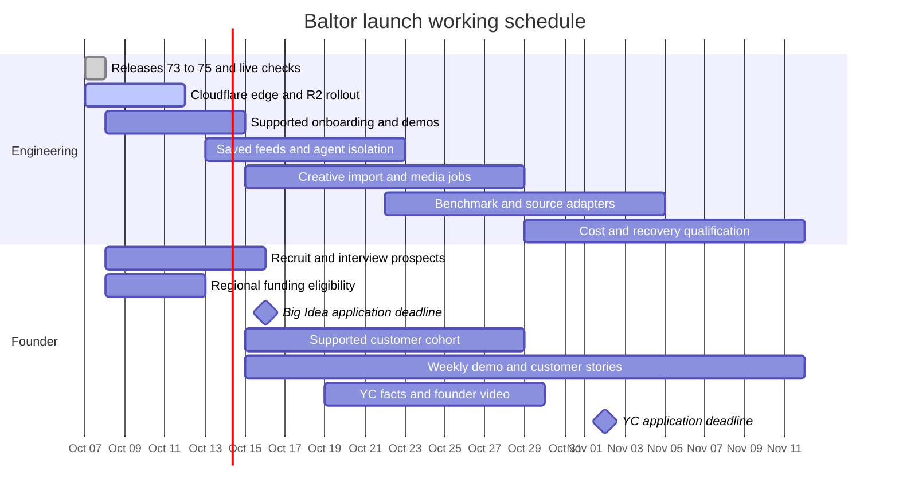

# Baltor delivery and business plan

Kind: current execution order. Updated October 8, 2026. The
[roadmap](roadmap.yaml) owns task status, the [north star](../architecture/NORTH-STAR.md)
owns product direction, and [AGENTS.md](../../AGENTS.md#commit-push-and-release-authority)
owns authority. This page orders that work and states what each stage must prove.

## Active execution plan, October 7

This section is the working view of the existing roadmap, not another task
registry. Update it after each release, publication or failed gate. The
[deployment record](../architecture/MVP-CLIENT-SERVER.md#current-deployment)
owns live application facts. The active catalogue owns served-file counts.
An implementation, a test, a deployment and a useful customer result are
separate completion conditions.

The [October 7 source and Cloudflare research](../research/REPOSITORY-INTELLIGENCE-AND-CLOUDFLARE-2026-10-07.md)
records discovery systems, current API corrections, free allowances and the
internal/customer separation behind this plan.

### Current position

Release 77 is deployed from `c43cb03c` and its gate is closed. The ten-host
browser pass has 2,126 passing assertions. All nine product hostnames now use
the existing Cloudflare Worker; the eight newly proxied hosts also passed
post-cutover browser checks. The final all-host pulse passed fifty reads,
the owner-account catalogue passed eleven checks, and all 2,529 exported
public files passed exact body/header readback.

The active offering labels, shared light/dark appearance and thirteen
decision-source collections are live. Approved Terms keep their original
wording; account identifiers, the monthly price and entitlements are unchanged.
Personalized feed delivery is still unfinished. The current detached work
covers quota-safe interchangeable search engines, a live feed specimen,
Trendshift/Kaggle research, MCP setup and an atomic supply factory. Each is
reviewed and checked on the exact integrated tree before release.

The corrected long-pass scheduler passed its full twenty-minute service run
from pinned `76ff12c2`: 282 Ollama searches returned 200 and the unit completed
successfully. The earlier timer race remains recorded separately. Some other
source lanes reached their daily ceiling or remained held, so this is not a
claim of complete daily coverage. The new installer refuses replacement while
a timer or service is active; HTTP-profile rollout follows its separate
evidence-version and unfinished-attempt checks.

| Work | State | Evidence or remaining gate |
| --- | --- | --- |
| Payment and connection repairs | Live in release 70 | Ten hosts passed 2,118 browser checks; five token quickstarts and the 15-step real Claude Code OAuth journey passed. |
| Search and intake repairs | Release 71 deployed; live checks complete | Exact source `ec1df775`; CI `37487555685`; deployment `37488883326`. The repaired search preserves all 70 previously found expectations and finds 95 in the retained before/after comparison. |
| Million-file publication | Live; owner-account listing accepted after release 73 | Exact release `50b666f5...` serves 218,127 packages and 1,352,837 distinct files, with complete population and matching content digest. It adds 981,843 distinct files and preserves all prior versions. Final staging cleanup was reconciled after its client timeout; no publication was replayed. The release-73 owner-account catalogue diagnostic passes 11 checks. Earlier failed diagnostic attempts remain recorded. |
| Storage headroom | Done | Existing Fly volume extended from 25 to 50 GB, with 39 GB free at readback and no restart. Added provisioned storage: $3.75/month; traffic and snapshots are separate. |
| Empty Public Good goals | All 17 populated and new delivery verified | Policy `118639cb...` has 424 packages / 1,056 distinct useful files. Five additions preserve all 419 prior grants and limits. The 25 fresh sandbox methods, current licence checks, 64 no-plan delivery checks and 27 desktop/mobile browser checks passed. The no-plan account downloaded 25 exact files with no paid-usage increase. |
| Cloudflare | All nine product hostnames at the edge; R2 mirror supervised | Release 77 exports 2,529 verified public files. Dynamic requests retain the Fly origin and its authorization/accounting. Mirror recovery preserves the original ceilings and verifies bytes before conditional writes. Production body and D1 selection remain pending. |
| Feeds and Components | Offering split and curated decision-source collections live | JSON Feed, RSS and Markdown describe current catalogue state; named collections expose source links and decision questions. Customer-defined feeds, agent assignments, a paid Feeds plan and push delivery remain separate work. |
| Repository reconciliation | Inventory and recovery copies complete; integration active | 190 registered worktrees, 180 existing, 72 dirty and two stashes were inspected. The shared checkout has 129 staged paths, of which 83 exactly match public main. Private history and unresolved merge stages are preserved outside public source. |
| Workstation storage | Selected transfer complete | All 29 selected files, 75,444,467,760 bytes, have independent SHA-256 readback records. All original-path links and destination sizes were checked again after the crash. The OS filesystem has about 91 GiB free at recovery. |
| Release follow-up | Release 77 verified live; wider launch audit running | Exact source `c43cb03c`, CI `37717122194`, deployment `37717967418`; complete release and post-cutover evidence is in the current deployment record. The full page-map desktop/mobile, light/dark audit is a separate running check, not yet a claimed pass. |

### Priority and phase-based Gantt view

Columns show sequence and overlap, not promised dates or equal durations.
`ACTIVE` means work is running; `NEXT` is ready after its dependency; `GATE`
requires the named acceptance checks. Keep the first two rows on the critical
path. Research and candidate work may run alongside them when it does not
delay a ready publication or exhaust memory, storage or provider allowances.

| Workstream | Prepared or verified | Current release cycle | Following cycle | Acceptance |
| --- | --- | --- | --- | --- |
| Ten-million-file supply | 1,352,837 distinct files live; listing repaired | NEXT: publish the next independently qualified family batch | Expand qualified code, data, native assets and source-backed feeds | GATE: 10,000,000 distinct served digests with preserved access and useful family coverage |
| Public Good coverage | All 17 goals and no-plan delivery verified | DONE: additive 424-package policy | Preserve access through next release | Broaden useful coverage |
| Cloudflare storage and delivery | All nine product hostnames and dynamic forwarding live | ACTIVE: complete R2 mirroring and reconcile catalogue additions | Select verified bodies and measure the D1 alternative | GATE: live integrity, authorization, failure recovery and measured cost |
| Internal repository and paper intelligence | Existing radar and query executor contracts | ACTIVE: pin sources, observations, ranking rules and worker deployment | Cloudflare acquisition, private raw storage and checked production | GATE: repeatable current-source results and recovery from duplicate delivery |
| Feeds | Catalogue-state pull preview and thirteen source collections live | ACTIVE: live specimen and shared source acquisition | Saved definitions, dated snapshots, per-agent assignments and account controls | GATE: factual source review and two customers/two agents isolated through edit and revocation |
| Two offerings and consistent design | Active copy and shared appearance live in release 77 | ACTIVE: full route-map and claim review | Separate Feeds membership from full reusable files; test both paid journeys | GATE: no retired marketing copy outside approved legal history, responsive/contrast checks, live customer journeys before pricing activation |
| Customer identity | Existing Supabase sign-up and Baltor OAuth work | Compare a Cloudflare-hosted identity engine and migration burden | Qualify email ownership, recovery, sessions and existing accounts | GATE: migrate only after equivalent security and account-recovery checks |
| OpenAI distribution | Candidate package preserved | Policy/UX findings remain | Test deployed presentation | Identity/legal/review gates |
| Remaining handoffs | Bundles and patches preserved | Small tested fixes as capacity permits | Native examples and all-goal originals | Repeat the release cycle |

### Twelve-hour atomic supply campaign, October 8

The owner requested one million additional harness component files in about
twelve hours. Starting from 1,352,837 served digests, that target is 2,352,837;
the longer-term north star remains ten million. Required net throughput is
83,333 additional files an hour, about 23.15 a second. These are target
arithmetic, not observed generation, review or publication capacity.

The planning window is October 8, 04:07–16:07 UTC (00:07–12:07 Eastern).
The factory implementation and source work are active. The twelve-hour
production supervisor is not active until its exact pilot, restart and
resource-bound checks pass. Do not describe a planned background job as running.

| Workstream | H0–2 | H2–4 | H4–8 | H8–12 | Completion evidence |
| --- | --- | --- | --- | --- | --- |
| Existing reviewed SDG material | ACTIVE: 24 admitted packages, sandbox proof, additive consequence plan | Reconcile exact base and Public Good access; coordinate with pinned R2 mirror | Publish and retrieve actual new payloads | Confirm counts and customer use | Current release plus byte-exact downloads; not an additions-only bundle |
| Atomic API contracts | ACTIVE: 100–1,000-atom representative pilot from pinned licensed specs | Check positive/known-wrong instances, semantics, dedup and restart | Bounded resumable batches, expand only from measured rates | Reconcile approved batches and report shortfall if any | Source pointers, validation coverage, net-new digests and actual publication |
| Kaggle and SDG tasks | ACTIVE: local token stored; bounded source discovery and three original private candidates | Inspect competition evidence and qualify reusable methods | Generate selected prompts, caveats, code, tests and offline configurations | Admit qualified material; keep missing rights and unsupported claims private | Exact sources, producer and review identities, observed tests |
| Search engines | ACTIVE: three search adapters and independent failure review | Durable account quota/uncertain-outcome checks, then bounded live conformance | Select engines through existing collector; keep account-wide ceilings | Verify unattended recovery, source coverage and output usefulness | Every request reserved, failures retained, no raw secret/result logging |
| Website and launch proof | ACTIVE: full route-map desktop/mobile light/dark audit | Repair visible and claim-level findings; integrate feed specimen | CI, guarded release, all-host/customer checks | One real use-case comparison and editable marketing specimen | Actual screenshots, outputs, revision/reopen and release evidence |
| Creative, OCI and long-tail material | Inventory permitted local exports and official container contracts | Qualify small examples and task-specific recipes | Add useful native/media families alongside bulk schemas | Review rights, compatibility and count units | No image-layer copies or private media counted as served payloads |

The programme continues from the same journal after this window if the target
is unmet. Report the achieved population and bottleneck; do not extend a
counter, restart an allowance or relabel raw permutations to claim completion.

#### Atom and composition grid

| Dimension | Useful examples | What makes the material specific |
| --- | --- | --- |
| Job and input | Deduplicate names; compare benchmark runs; resolve offline language resources; audit observation gaps | Stated input type, ambiguity and expected output |
| Method or instruction | Parser, formula, prompt, selection rule, planning step or narrow role instruction | A distinct decision or operation, not a renamed copy |
| Failure and caveat | Missing denominator; conflicting timestamps; unknown memory measurement; source withdrawal | A trigger, consequence and supported response |
| Persona or audience | Accessibility reviewer, statistician, operator, educator or founder | Role-specific checks and information needs, not claims of expertise |
| Constraints | Offline operation, hardware budget, supported language, locale, privacy, time or cost | Exact applicability and unknowns; incompatible combinations are recorded |
| Native form | Plain string, Markdown, JSON Schema, example, test, script, template, OCI/service card | A named consuming step and a parse, retrieval or execution check |
| Harness and engine | Supported harness settings, callable tool, model route, renderer or container | Pinned compatibility and declared effects; no extra Loop per passive file |
| Composition | Prerequisite, alternative, follow-up, repair or verification edge | Typed inputs/outputs, dependency closure and contradiction checks |

A word such as “date” can seed date parsing, timezone ambiguity, missing-date
handling and scheduling research. Those become separate candidates only when
their task and material differ. A purported “top 1,000 words” list needs its
own source and ranking definition; an original seed list must be labelled as
such. Word combinations and prompt mutations can be experiments without being
new accepted capabilities. Preserve uncertain candidates with findings rather
than losing them to a similarity filter.

#### Factory run procedure and checkpoints

1. Freeze the source manifest, generator revision, licence/notice records and
   starting served digest inventory. Search existing candidates first. Use
   approved caches before spending more source requests.
2. Enumerate lazily through the existing idea matrix and supply owners. Give
   each candidate a deterministic identity, parent source/operation, task,
   scope, payload forms and reason to retrieve it. Keep equivalent-schema
   relationships instead of copying common implementations into every package.
3. Write to a private content-addressed output with a single append-only
   accounting owner, atomic completion and resumable cursors. Retain attempted,
   failed, partial, equivalent, qualified and pending states. No worker may
   approve its own output or reset a provider allowance by changing engines.
4. Start with a stratified pilot and measure files/second, useful payload mix,
   errors, near-duplicates, bytes, memory and the slowest admission/publication
   step. Include adversarial inputs and source-schema cases the converter
   cannot interpret safely; record them without declaring valid contracts.
5. Activate bounded local generation only after the pilot and interrupted-run
   replay pass. Set a twelve-hour wall ceiling, worker/memory limits, output
   byte ceiling and minimum free disk space in the run record. Initially use
   deterministic extraction and original code; model generation or independent
   review has its own named-model, request/token ceiling and usage record.
6. Run the current admission policy on exact bytes. Retain producer family,
   approval basis and independent review coverage. Static schema/format checks
   do not establish successful live calls, task usefulness or every benchmark
   claim. Execute qualified tools only in their declared sandbox.
7. Reconcile approved additions against the complete current catalogue,
   preserve old versions and Public Good grants, check judged retrieval, and
   publish through the existing guarded operation. A supervisor may prepare
   batches; it cannot infer new publication or spending authority from output.
8. At each completed batch and at H2/H4/H8/H12, report candidates, placements,
   distinct payloads, equivalent digests, admission outcomes, served additions,
   costs and remaining source coverage. The active catalogue, not the factory
   counter or R2 mirror, supplies the public total.

#### Current concrete checkpoints

- [x] Release 77 and all nine Cloudflare website routes are live; the previous
  direct paths remain recoverable without resource deletion.
- [x] Twenty-four original SDG packages passed current admission with a named
  non-producer reviewer. All passed fresh isolated tests on two Python versions
  and a schema-instrumented pass. They remain unserved pending reconciliation.
- [x] Three additional original Kaggle-inspired candidates are prepared:
  observation gaps, locale-resource fallback and memory residency arithmetic.
  Their 25 distinct files include nine code/schema files; they are not admitted.
- [x] Seven supplied research keys are stored in the keyring and had one
  bounded transport probe each. Existing local Kaggle access is also stored;
  an empty public metadata response does not prove account identity or scope.
- [ ] Complete atomic pilot, compare its exact digests with served material,
  validate restart and activate the bounded production supervisor.
- [ ] Complete durable cross-process quotas and independent adversarial
  search-adapter review before activating supplied engines unattended.
- [ ] Complete full page-map review, claim/terminology checks, setup journeys,
  rights-cleared video/deck proof and side-by-side task comparisons.
- [ ] Retrieve newly served SDG files through the real customer boundary and
  reconcile counts; retain every failed or interrupted publication attempt.
- [ ] Finish R2 completeness and failure/revocation checks before selecting it;
  do not change its pinned inventory while its current mirror is running.

### Engine and transport programme

The October 7 owner direction reaffirms interchangeable engines for every
functional component, including search providers, model and decision routes,
backend production and Cloudflare services. The existing engine catalogue has
55 slots: 39 candidate and 16 planned. These are design and qualification
states, not 55 fully qualified production swaps. The current fixed-edge rule
remains in the [functional component standard](../architecture/FUNCTIONAL-COMPONENT-STANDARD.md).

The same direction distinguishes strategic information from tactical
materials. Feeds support initial design and periodic review: architecture,
provider selection, model and hardware constraints, cost comparisons, market
positioning and improvement opportunities. Reusable harness files carry out
the chosen work. Each decision collection should name the question, evidence,
comparison dimensions, checked date, limits and next review trigger. A source
directory is not a measured comparison or automatic opportunity detector.

| Existing component boundary | Engine choices and current work | Acceptance before selection |
| --- | --- | --- |
| `research_query_executor` and `web_research_port` | Existing specialist source adapters, Ollama search and the separate Brave capability; qualify SearXNG, exact RapidAPI products and other supplied APIs | Same source-result contract, request limits, rights and failure accounting; provider-specific fields remain explicit |
| `model_access` and `typed_decision` | Existing provider routes, standard-harness responses, Jev, Circuit, System One and text-model decisions; evaluate Cloudflare Workers AI or Clef through adapters | Exact model and endpoint, supported output capacity, recorded usage, independent task results and qualified failure behavior |
| `catalogue_search_index` | Current custom SQLite index, in-memory alternative and the D1 adapter; compare other engines only through the same search edge | The same access decisions and meaningful retrieval expectations at the full population, with measured latency and cost |
| `catalogue_body_store` and `record_store` | Volume and R2 body engines; existing embedded record engines and proposed qualified D1 record projections | Exact bytes, immediate authorization/revocation where required, concurrency, recovery and rollback |
| `web_page_delivery`, `edge_proxy` and `browser_identity_provider` | Fly pages or Cloudflare Static Assets; platform or content-network proxy; existing Supabase identity and a separately qualified Cloudflare-hosted alternative | Real customer journeys, correct client addresses, session/recovery behavior and no cached private responses |
| Existing acquisition, generation and admission owners | Deterministic extraction, model-generated candidates, native renderers and independent review; Cloudflare queues or workflows may host the dispatch | Reuse existing implementations, preserve provenance, bound effects and require the producer/reviewer independence rule |

A provider adapter is an engine. An account, API key or model deployment is
an installation or route of that engine. Twenty keys do not by themselves
create twenty independent capabilities or twenty independent quotas. Each
installation needs its endpoint contract, credential reference, source rights,
shared quota identity, cost limits and qualification record. Callers keep the
same typed request/result edge when a qualified implementation changes.

Initial choices and fallback priorities are separate. Pin a tested engine or
use declared preferences until matched evidence supports automatic selection.
Compare useful result quality, freshness, latency, reliability and cost;
refusals, empty answers and unmeasured usage remain visible. A failed request
does not reset its allowance or authorize a new recipient of private input.

The first HTTP profile implementation binds a named User-Agent/language
configuration to the governed fetch effect and result. Broader experiments
should vary browser engine/version, header identity, client hints, viewport,
device class, locale, timezone, rendering mode, session state and execution
location independently where supported. Record actual applied settings.
User-agent spoofing is a header override, not proof of a particular browser
or authenticated identity. Preserve source access policy and shared quotas
through every comparison.

Cloudflare calls its browser service Browser Run. Quick Actions and CDP
sessions support custom user agents; its crawl endpoint does not. Treat that
as an explicit capability difference at the web-research edge. Ordinary
Workers, browser sessions and native rendering environments have different
capabilities and limits. [Browser Run header contract](https://developers.cloudflare.com/browser-run/reference/automatic-request-headers/),
[limits](https://developers.cloudflare.com/browser-run/limits/)

- [ ] Inventory and qualify the additional search and model installations
  through the existing registries; store keys only through credential references.
- [ ] Complete shared conformance kits for the planned research slots before
  marking them active. Test each engine, compatible compositions and actual
  feed/component production journeys.
- [ ] Bind selected HTTP profiles to the periodic collector's execution and
  reuse identities, without resetting shared source quotas or silently
  reusing a response produced under another profile.
- [ ] Qualify Cloudflare Browser Run, Workers AI and durable job dispatch
  adapters within recorded budgets; keep native rendering as an eligible engine.
- [ ] Add matched engine comparisons for source research, feed digestion,
  file generation and package review, with independent acceptance and the
  no-extra-material baseline.

### Working procedure for every iteration

The owner on October 7 requested faster implementation, a ten-million-file
target, wider component families, customer feed customization and aggressive
Cloudflare adoption where it improves the system. Maintenance downtime is
permitted. That permission does not remove the preservation, integrity,
authorization or rollback checks.

1. Choose a bounded deliverable from the existing roadmap. Record its source,
   dependencies, acceptance checks and effects before starting it.
2. Preserve overlapping work and integrate from the current public revision.
   Distinguish already-published patches, unfinished implementations, old
   generated views and private research. Do not publish a private history as
   an incidental parent of a release.
3. Reproduce the defect or establish the current baseline. Keep the failing
   attempt and test a known-wrong control when a guard changes.
4. Implement at the existing typed boundary, using selectable engines. Run
   focused checks, owning checks and the release gates on the candidate tree.
5. Update roadmap evidence and generated views. Commit reviewed work to main,
   push it, require exact-revision CI, and deploy through the guarded workflow.
6. Read back the image, configuration, catalogue and policy identities. Check
   every affected hostname and customer path, close the deployment gate, and
   record the rollback and any remaining limitation.
7. Continue with the next dependency-ready deliverable. A failed source read,
   deployment or publication is reconciled before another attempt can repeat
   an external effect.

The phase table is the Gantt-style dependency view. Its cells are completion
gates, not invented dates or a percentage inferred from file counts.

### Immediate checklist and review comments

- [x] Inventory branches, worktrees, stashes, historical refs and unresolved
  merge stages; preserve patches, index objects and untracked work.
- [x] Reconcile release 72 and close its deployment gate.
- [x] Restore access to the existing offloaded task database.
- [x] Complete the selected byte-verified OS-to-Expansion transfers and record
  the resulting free space. Keep active databases and Unix source trees on
  a filesystem with their required semantics.
- [x] Release the narrowed legacy listing and corrected Feeds navigation
  checks, then repeat live customer retrieval.
- [x] Repair conversation mining and dimension generation. Eighteen focused
  checks cover titles, malformed records, source references, timestamps,
  sensitive-term refusals and their accounting. Release gates remain distinct.
- [x] Reconcile the interrupted release-74 verification and complete all ten
  hosts. Preserve the first attempt and the deployment's exact source.
- [x] Diagnose the unattended Ollama lane: the last scheduled run sent no
  requests because its environment lacked the existing key. Persist that
  supplied key in the system keyring and add an explicit timer reference.
  The bounded manual proof completed twelve real searches; no model was called.
- [x] Install the reviewed scheduler revision with that reference and complete
  its full service-run proof. Run `20261008T012946Z-4931a5` has 282 successful
  Ollama searches, 2,786 result items and 2,481 new private research leads.
  Other source limits and holds remain explicit; leads are not served files.
- [ ] Finish the Cloudflare source, storage and delivery acceptance below.
- [ ] Implement the customer customization checklist below before selling a
  personalized Feeds service.
- [ ] Expand supply through distinct useful implementations and qualified
  native files. Keep raw sources, query permutations, generated candidates,
  payload placements and distinct served digests separately counted.

Review comments: the old repository-map draft names two missing conformance
modules; the paired value study is an instrument, not measured benefit; the
saved Stripe challenge driver has synthetic tests but no successful new live
failed-renewal result. Preserve these streams and their remaining checks.

The recovery intake covers accessible local Codex and Claude owner messages
from October 6 at 10:34 UTC through October 7 at 22:34 UTC: 108 user-role
records, 39 context-only records and 65 unique remaining messages. The counts
are not 65 new Baltor tasks. Repeated requests, reference material, replies,
Rollwatch work and Another_Transfer work retain their current owners. The
private source mapping must retain long-message sections and explicit gaps;
the bounded keyword miner alone does not complete semantic reconciliation.

The existing discovery timer's October 7 22:08 to 22:29 UTC run found new
research leads through multiple specialist sources. Ollama's empty lane was
an operational credential-binding defect, not a provider outage. The repaired
operator path retains the existing 300-search daily ceiling. The later
one-minute proof used the existing ledger, so its twelve calls count against
the same allowance. Source leads still require rights, usefulness and
independent admission before they become served components.

### Daily options research as a feed

Reuse the separately maintained Rollwatch collector and evidence contracts.
The October 7 local service is healthy and its catalogue names 5,974 listed
optionable stocks and funds and 2,223,885 retained contracts. Those are
reference identities, not complete fresh options observations. The existing
system identifies possible rolls and records public-source business context;
its active session owns its application changes and scheduling.

Under S-6.214, prepare an adapter that exposes dated research leads with the
underlying symbol, exact contracts, observation times, source links, coverage,
candidate explanations, contradictory evidence and follow-up status. Separate
unusual activity, possible linked legs, a possible roll, direction and later
open-interest evidence. Public delayed aggregates do not prove common
ownership, opening versus closing or trade intent.

- [ ] Verify the current collector schedule and successful run populations.
- [ ] Qualify independently selectable search engines and browser reads;
  deduplicate syndicated stories and keep inaccessible sources visible.
- [ ] Research earnings, filings, corporate events and ordinary alternative
  explanations, including hedges, spreads, closing trades and data corrections.
- [ ] Freeze the day's hypotheses and revisit them after the next relevant
  open-interest update. Measure revisions and missing evidence.
- [ ] Deliver a research feed scoped to its assigned agent; preserve source
  rights and keep account-specific research private. No trade execution is
  part of this feed.

### Customer launch schedule

The [strategic feed and customer-discovery research](../research/STRATEGIC-FEEDS-AND-CUSTOMER-DISCOVERY-2026-10-07.md)
compares five adjacent products and records nine organization routes. The
initial customer questions are choosing a stack and reviewing an existing
one for cost, maintenance or capability changes. Treat these as hypotheses
to test in interviews. The private organization export binds draft facts to
existing source observations and a host suppression list; it does not scrape
contacts, establish customer interest or authorize outreach.

Start onboarding a small supported cohort before the ten-million-file target.
The schedule below is an engineering estimate, not a service promise. It
assumes one engineering lead, existing provider access, and 6 to 10 founder
hours each week. Keep one production migration in progress at a time. Review
dates every Friday against completed customer tasks, incidents and costs.



The dates allow overlapping customer work and engineering, not a hidden team
of full-time engineers. The feed beta depends on account isolation and
revocation tests. A creative campaign depends on permitted assets and a
repeatable finished result. Broader acquisition depends on measured support
capacity and retention. Shift those activities if their gates fail; funding
deadlines themselves do not move with our implementation.

| Founder task | Target and estimated effort | Done when | Engineering prepares |
| --- | --- | --- | --- |
| Pick the first customer problem through interviews | October 8 to 10; 2 hours to select 20 relevant people, then five 20-minute conversations | Five actual tasks and current workarounds recorded, with consent; no invented demand | Two demo paths: a coding harness using exact reusable files, and an editable image-to-video workflow |
| Recruit a supported first cohort | October 10 to 15; 2 hours | Five willing testers each have a task and a booked onboarding session | Setup links, a short task brief, support routing and account diagnostics |
| Watch onboarding | October 15 to 22; five 30-minute sessions | Each person signs in, connects one harness, obtains a file or feed, completes a task and repeats one task without engineering driving | Instrumented funnel and failure records; no raw customer content added to analytics |
| Publish the first evidence-backed demonstrations | Start October 15; 2 hours weekly | Two useful posts and one finished demonstration each week, with working source/package links | Editable video, images, captions, accessibility text and supported claims; the founder posts from personal accounts |
| Capture willingness to pay and return use | October 22 to 29; 2 hours | Real acceptance, refusals and seven-day return behavior recorded separately; payment only through the normal customer checkout | Existing plan flow, proposed Feeds entitlement tests and cohort report |
| Assemble funding facts | October 8 to 14; 2 to 4 hours | Legal entity, incorporation date, business location, founders, ownership, prior funding and prior credit awards verified by the founder | A concise problem/product brief, live demo, architecture/cost evidence and a claims-checked data room |
| Apply for relevant credits and funding | Regional competition before October 16 if eligible; YC by November 2 at 8 pm Pacific; 3 to 6 hours total | Founder checks declarations and submits under their own identity; confirmation saved privately | Application drafts, milestone budget, competitive analysis and demo links |
| Decide whether to widen acquisition | November 5 to 12; 1 hour | Onboarding failures, useful repeat use, support time and marginal costs reviewed; new acquisition has an explicit cap | Cohort dashboard, incident review and load/recovery results |

The first paid acquisition experiment comes after useful return use is
observed. The founder owns advertising spend. An application, a page view,
an installed harness and a successful customer task are four different events.
Record the denominator for conversion and retention, including dropouts.

### Funding shortlist and application checks

Checked October 7, 2026. These are preparation tasks, not submitted
applications or promises of funding.

- **Cloudflare for Startups:** the current program lists a $10,000 tier for
  bootstrapped companies, larger partner-funded tiers, and one-year credits.
  Verify company eligibility and prior participation. Its general eligibility
  wording also mentions recent funding, so confirm how that applies to the
  bootstrapped tier. R2 and Workers AI have separate caps; AI Gateway is
  excluded. Budget for expiry and overages. [Program and conditions](https://www.cloudflare.com/startups/)
- **Ben Franklin Central and Northern Pennsylvania:** check the actual company
  location against its county footprint. The current Big Idea announcement
  gives October 16, 2026 as the application deadline. Read the linked contest
  rules and verify revenue, funding and prior-award restrictions before
  submitting. [Current competition and eligibility](https://cnp.benfranklin.org/programs-resources/bigidea/)
  Its separate investment program typically takes three to six months and
  includes matching and payback obligations; do not describe it as an
  unrestricted grant. [Investment process](https://cnp.benfranklin.org/early-stage-funding/)
- **Y Combinator Winter 2027:** application deadline November 2 at 8 pm Pacific,
  with an on-time decision date of December 11. The January to March batch is
  in San Francisco. Prepare the founder video, actual customer evidence and
  a clear explanation of the product; verify attendance and company details
  personally. [Current application page](https://www.ycombinator.com/apply)
- **NSF America's Seed Fund:** pursue only if a specific technical hypothesis
  needs substantial research, such as demonstrated improvements from qualified
  capability selection. A content catalogue, ordinary migration or marketing
  work alone is not the research proposal. Begin with the current suitability
  assessment and Project Pitch; verify the active window and company/team
  eligibility. [Project Pitch criteria](https://seedfund.nsf.gov/apply/project-pitch/)

### Replit decision

Use Replit as an optional customer demo and remix environment. Do not migrate
the authoritative catalogue or customer database there in this release.
Its value to Baltor would be a runnable example that a prospect can open,
change and keep without configuring a local machine. Qualify one small,
public, licence-cleared sample before adding an Open in Replit action.

Replit offers Autoscale, Static, Reserved VM and Scheduled deployment types.
Autoscale suits intermittent web requests; Reserved VM suits continuous
background processes. That is another host choice, not proof that our volume,
custom index and recovery procedures will transfer unchanged.
[Deployment types](https://docs.replit.com/features/publishing/deployment-types)

The current platform documents Clerk Auth separately from Replit Auth. Neither
replaces Baltor account entitlements merely by being added to a demo. Keep
existing Baltor sign-in as the customer authority, use scoped credentials,
and never put catalogue administration or customer data in a remixed project.
[Authentication options](https://docs.replit.com/features/auth-and-identity/clerk-auth)

Run a two-hour comparison using the same small demo locally, on Cloudflare,
and in Replit if an existing account permits it. Measure time to first useful
result, reproducibility after remix, export back to Git, cold-start behavior,
credential handling and actual credits used. Adopt the integration only if
the onboarding improvement justifies another paid dependency. Current pricing
pages and the February plan announcement differ in how they show monthly and
annual prices; verify the live checkout before any purchase. No Replit
subscription or deployment is activated by this plan.
[Pricing](https://replit.com/pricing), [plan announcement](https://replit.com/blog/pro-plan)

### Creative assets and repeatable component marketing

Roadmap owners: S-6.215 and S-6.217, with the existing creative production and
customer-evidence steps. The October 7 additions are queued here under those
owners; they do not create another runtime or approval system.

- [ ] Reconcile the last 36 hours of accessible Codex and Claude owner
  requests into these tasks. Separate real requests, pasted source material,
  command output and automatic task notifications. Preserve a private
  source-to-task mapping; do not publish transcripts or treat old tool output
  as new authority. Another_Transfer's active video session owns its edits.
- [ ] Inventory local TensorArt exports and image metadata, deduplicate exact
  bytes, and preserve originals on Expansion with verified readback. Keep
  generation identity, prompt, negative prompt, seed, sampler, dimensions,
  checkpoint, LoRAs, model versions, timestamps and source links where
  available. Missing settings stay missing. A downloaded image is not proof
  that all account history was recovered.
- [ ] Prepare an account-history adapter only against a verified accessible
  interface. TensorArt's documented TAMS job API concerns generation jobs;
  it does not by itself establish access to the consumer account's complete
  gallery. Never reconstruct credentials from browser storage.
  [TAMS integration contract](https://tams-docs.tensor.art/docs/api/guide/integration-faq/)
- [ ] Import media privately before public admission. Record output rights,
  source/model restrictions, likeness concerns and sensitive material. Do not
  assume account ownership grants unrestricted commercial rights to every
  input, model or output.
- [ ] Expand useful families: masks, layered composition manifests, image
  sequences, materials, shader graphs, motion curves, typography layouts,
  captions, audio stems, camera rigs, editable Blender/GLB scenes, image-to-video
  and image-to-mesh recipes, environment locks and verification fixtures.
  Reuse unchanged files; label stylistic variants as variants.
- [ ] Check visual continuity across text, slide and layout changes. Keep
  background motion and camera state continuous unless the edit explicitly
  calls for a cut. Include the reported jumping-background failure in the
  creative acceptance examples.
- [ ] Compare browser-native and WebAssembly visualization engines for one
  identical editable scene. Measure startup, export fidelity, memory and
  device coverage before selecting an engine; retain the native renderer
  when its required features are absent in the browser.
- [ ] Add a showcase job to each eligible component or solution version. Its
  input names exact packages, a customer task, permitted assets, supported
  claims and output formats. Its outputs include editable sources, a poster,
  captions, a finished demonstration, and short excerpts labelled as excerpts.
  Begin rendering with the first 20 customer-relevant packages; keep the rest
  queued or generate on demand within cost limits.
- [ ] Drive media through existing selectable engines. Cloudflare dispatches
  and serves jobs; native FFmpeg, Blender and GPU-dependent work use qualified
  execution environments. Ordinary Workers do not run arbitrary native
  rendering processes. Use existing Ollama Cloud access for bounded briefs,
  scripts and component generation, with recorded usage. Tactical remains an
  optional separately qualified decision engine, not silent failover.
- [ ] Run the same creative task with and without Baltor, using the same
  model, input assets, allowed tools, time/cost budget and acceptance rubric.
  Preserve every attempt, failure and revision. Randomize display order for
  review and include the no-extra-material baseline. Publish measured benefits
  only after the independent evaluation, not from a hand-picked best image.
- [ ] Validate each marketing export: accurate claims, licence notices,
  working package links, captions, safe zones, readable phone-size text,
  audio and replay from the editable project. Keep public social publication
  separate from generation and review.

### Ten-million throughput checkpoints

The live baseline is 1,352,837 distinct files. The remaining gap is 8,647,163.
The following figures are arithmetic scenarios for planning, not measured
factory throughput or dates promised to customers.

The October 7 next-batch audit found 312 distinct unserved candidate bodies,
not millions of ready additions. The first proposed batch has 24 original MIT
Python tools and 192 new bodies, including 72 code/contract files. Its existing
non-producer review records match all 24 exact package bodies, but the aggregate
panel remains incomplete. Fresh qualification and source-claim review precede
any admission or publication. Six native project seeds and four session tools
follow; already-served API and explainer files are excluded from these counts.
At the current average bytes per distinct file, ten million files imply about
58.7 GB of payload alone, before indexes and headroom. That is a planning
estimate supporting R2 qualification, not a measured future storage bill.

| Sustained net admitted and served files per day | Days to close the current gap |
| --- | --- |
| 50,000 | 173 |
| 100,000 | 87 |
| 250,000 | 35 |
| 500,000 | 18 |

Measure a 48-hour supply run before selecting a target date. Report source
reads, unique inputs, generated files, duplicate files, rejected candidates,
independently admitted packages, useful family coverage, served distinct
digests, cost and customer-task success. Ten million text permutations are
not an acceptable substitute for ten million useful served files.

### Checklist 1: publish the million-file library

Roadmap owner: S-6.215. Current operation records are in the private takeover
folder named by `/home/username/START-HERE-BALTOR.md`.

- [x] Preserve Claude's work and the shared checkout's private history.
- [x] Reconcile the active release and use its complete segmented metadata.
- [x] Keep the 23 API packages outside the host licence policy excluded.
- [x] Repair API/function form labels from their qualified declarations,
  preserving package bytes, licences and approvals.
- [x] Compare the same judged queries before and after the additions. Preserve
  the failed earlier experiments as well as the passing comparison.
- [x] Build the delta with every existing version retained and all required
  local bodies verified.
- [x] Finish the publisher's dry run against the current live base.
- [x] Verify release 71, the deployment gate and the publication lock before
  starting the one publication. Do not deploy while it runs.
- [x] Complete transfer and native publication. The exact operation record names
  result `50b666f56b043ce085d20f46efed01444f257917467199992799ad49cdb03127`.
- [x] Complete publication and reconcile the final cleanup timeout against
  the native result, live serving view and absent staging folder. No replay.
- [x] Read back the active release, complete distinct-file population, package
  count, source/index state and representative exact file hashes.
- [ ] Test searches across old and new families, explicit effect declarations,
  refused reads and a normal account's download path.
- [x] Record the accepted publication result and compatible rollback bindings. Keep local sources,
  old releases and failure evidence; only the publisher's redundant successful
  staging copy is eligible for its normal cleanup.

Completion: the live service, not a local folder, reports more than one million
distinct payload digests and the named acceptance checks pass. This does not
mean one million semantic capabilities, remote APIs executed, independent
reviews completed or customer outcomes proven. Balanced supply and native-use
coverage remain separate roadmap work.

### Checklist 2: remove genuine Public Good coverage gaps

Roadmap owners: S-6.216 and S-6.217. Zero is not a rendering error when no
eligible exact version has a free grant.

- [x] Read all 17 live goal counts and the currently applied policy digest.
- [x] Select qualified public-data packages for goals 1, 2, 3, 5 and 17.
- [ ] Review the prepared original components without recreating the same
  generic helpers.
- [ ] Check each package's beneficiary task, licence, source, limitations and
  actual tests. Fetch and verify method references that were only recalled
  during preparation. Do not claim official SDG-indicator implementation.
- [ ] Publish any new package through the same catalogue path, against the
  then-current base. Do not silently insert it into an already checked bundle.
- [x] Bind free grants to exact versions and useful paths. Preserve every
  existing grant, account requirement, quota and expiry unless deliberately
  changed under the existing policy owner.
- [x] Plan and apply the policy with its expected digest and release binding.
- [x] Verify each formerly empty goal in the API and browser. The enabled
  no-plan account downloaded all 25 new useful files with exact hashes.
  Anonymous and wrong-version requests refused; paid usage stayed zero.
- [ ] Repeat a live disabled-account refusal without changing a real account
  merely to create the fixture. Existing automated refusal checks remain separate.
- [ ] Review the end-of-October grant expirations before they lapse.

Completion: all 17 goals have relevant, usable, actually free published
material. Counts remain files and packages, not impact measurements.

### Checklist 3: adopt Cloudflare where it helps

Keep every implementation behind its existing typed edge. Cloudflare can host
our own code; using it does not require adopting a vendor's search-ranking
product. Our initial choice is hybrid, with custom search and authoritative
accounting retained on Fly until an alternative passes equivalent checks.

| System | Proposed placement | Benefit and constraint |
| --- | --- | --- |
| Public pages and static assets | Cloudflare Static Assets / edge | Reduce origin work and keep public material reachable during origin maintenance. Static-asset requests have no request charge; Worker invocations are priced separately. [Static Assets](https://developers.cloudflare.com/workers/static-assets/billing-and-limitations/) |
| Immutable component bodies and feed snapshots | Private R2 | Object storage independent of a Machine volume, with no R2 egress charge. Storage and operation charges still apply. Standard storage is $0.015/GB-month before allowances, compared with Fly volumes at $0.15/GB-month; this is not a tenfold whole-system saving. [R2](https://developers.cloudflare.com/r2/pricing/), [Fly](https://docs.fly.io/about/pricing) |
| Lightweight routing and feed delivery | Workers | Run our own handlers near users. Streaming and bounded memory are required; standard Workers have a 128 MB isolate limit. Keep large index construction and native-process work outside that profile. [Workers limits](https://developers.cloudflare.com/workers/platform/limits/) |
| Feed metadata or catalogue projections | D1, if qualified | Managed SQL and read replication may help. Query cost depends on rows read, and replicated reads need a deliberate consistency/session policy. Do not assume the existing custom index is cheaper or better there. [D1 pricing](https://developers.cloudflare.com/d1/platform/pricing/), [replication](https://developers.cloudflare.com/d1/best-practices/read-replication/) |
| Public, replaceable cached metadata | KV | Useful for distributed read-heavy caches. Eventual consistency makes it unsuitable as the sole authority for immediate revocation, billing or transactional quotas. [KV consistency](https://developers.cloudflare.com/kv/concepts/how-kv-works/) |
| Feed jobs and notifications | Queues / Workflows, after qualification | Separate production from delivery and handle retries. Queues can deliver a message more than once, so event identities and duplicate suppression belong in our receiver. [Queues](https://developers.cloudflare.com/queues/reference/delivery-guarantees/) |
| Staff access | Cloudflare Access | Add an authentication layer and access policy in front of internal tools using an identity provider. This does not replace Baltor's customer account, plan, OAuth scopes or object permissions. [Access](https://developers.cloudflare.com/learning-paths/clientless-access/access-application/create-access-app/) |
| Browser abuse protection | Turnstile, if needed | Add a challenge to appropriate browser forms. It is not a customer identity system; do not place an interactive challenge in ordinary authenticated MCP traffic. [Turnstile](https://developers.cloudflare.com/turnstile/) |
| Custom search, retrieval, authoritative records and audit log | Fly initially | Retain native Python, control over indexes, transactions, process lifecycle and a durable local volume. Cloudflare Containers are another candidate, but their disk is ephemeral by default and snapshots/FUSE are not a transparent replacement for this live database. [Containers](https://developers.cloudflare.com/containers/faq/) |

Cloudflare traffic logs can supplement our observability. They do not replace
the application records that bind an authorization, catalogue version,
metered result and uncertain write outcome. Keep the approved metadata-only
diagnostic policy; no new capture of customer bodies is implied.

Migration procedure:

1. Preserve the current host configuration, image, catalogue, policies and
   rollback procedure. Inventory existing Cloudflare resources before creating
   another one.
2. Keep the integrated host-source version 3 adapter and its refusal tests
   current. The volume engine remains selectable. Qualify the real S3
   transport separately from the R2 Worker probe before a production selection.
   The six-check real S3 canary has passed. Its one original test object is
   retained; no bucket or object was deleted and no public-access setting changed.
3. Mirror immutable bodies by digest, with progress checkpoints and bounded
   requests. Verify complete membership, byte integrity, missing objects and
   interruption recovery. Preserve the source copy.
4. Test authenticated reads, revocation, quotas, oversized/missing/corrupt
   bodies and provider outages through the normal service contract. Keep the
   bucket private. Do not exchange live authorization checks for public links.
5. Update the edge-site export from a pinned release. Test public assets,
   dynamic API failures, canonical OAuth URLs, cookies, redirects, origin
   binding and client-address handling. Cache no private account response.
6. Run a canary, measure latency, errors, resource use and projected total cost,
   then change one production boundary at a time. A prototype score is not a
   cutover result. Recheck every affected hostname and harness path.
7. Keep Fly's custom search and authoritative state until any proposed
   replacement passes the same functional, concurrency, recovery and privacy
   tests. Preserve the rollback route before removing redundant infrastructure.

### Checklist 4: Feeds and Components

Roadmap owner: S-6.214 with the existing subscription and delivery owners.

**Feeds** are maintained streams of useful information: changes, comparisons,
service directories, research and task-relevant updates. They can produce
Markdown, structured data, context files and OKF outputs. **Components** are
reusable harness files: functions, code, tools, configurations, data, assets
and production material. A feed may produce a component; a file extension
does not determine an offering or grant access.

Brand decision for the first implementation: keep Baltor, with Feeds and
Components as separate offerings on the same site and account. A sister site
would add another discovery surface, not another entitlement system. Revisit
it after measuring which audience and message actually bring useful use;
do not duplicate the whole catalogue or split sign-in to create a new label.

- [ ] Define a versioned feed record: identity, source references, checked and
  published times, changes, applicability, rights, evidence state, review due
  date and correction/withdrawal links.
- [ ] Reuse the existing source-discovery and knowledge-radar work. Convert
  leads into admitted material; do not publish unverified collector output as
  a checked recommendation.
- [ ] Deliver one useful feed through the existing authenticated service,
  with a human view, a structured pull interface and exact context-file
  exports. Distinguish plain Markdown from validated OKF compatibility.
- [ ] Add daily snapshots and stable cursors. Test duplicates, missing updates,
  changed filters, stale sources, failure versus empty results and replay.
- [ ] Add opt-in task profiles and supported notification receivers. Test
  destination authorization, request bounds, retries, withdrawal and
  unsubscribe. Receiving a notification cannot execute its content.
- [ ] Implement explicit Feeds-only versus full Components membership through
  the same entitlement system. Preserve existing full access and Public Good
  exceptions. Test alternate paths, cached references and Markdown wrappers.
- [ ] Qualify both paid journeys before creating new live prices or promising
  availability. Daily delivery and near-real-time source coverage are separate
  claims. Measure useful retrieval and completed work, not notification volume.

#### Customer customization and agent assignments

Decision: customization belongs in Feeds itself, not only in the expensive
Components plan. Both offerings use one account and the same feed controls.
Components adds the entitled reusable library. Higher limits can differ by
plan; a Markdown wrapper never makes a restricted component freely readable.
These controls are designed, not implemented by the current-state preview.

The customer journey is **create a feed, preview it, assign agents, choose
delivery, then inspect delivery history**. Start with a template such as MCP
service changes, Python maintenance, public-data updates or a named project.
The customer can edit its structured settings without writing a prompt:

| Control | Meaning | Boundary |
| --- | --- | --- |
| Topics and exclusions | Named services, packages, categories, languages, runtime and project tags | Use catalogue identifiers and bounded text; do not upload a private repository or infer its contents by default. |
| Sources and evidence | Select reviewed sources, source types, licence needs and required evidence state | Public metadata, documented capability and executed behavior remain different. Unknown source status stays visible. |
| Update types | New release, breaking change, deprecation, security advisory, correction, withdrawal or comparison | Do not call every repository commit useful news, or present an unverified advisory as a confirmed exploit. |
| Freshness and delivery | On demand, daily digest or opt-in change notifications; timezone, quiet hours and item/byte limits | Show source checked time, last successful refresh and partial/stale coverage. Fast delivery cannot make a slow source real time. |
| Output | Human digest, JSON, Markdown/context and separately validated OKF | Preserve source links, evidence, version/digest and caveats in every format. Byte limits are enforced; any token estimate names its tokenizer or approximation. |
| Agent assignments | Choose which registered agent reads which saved feeds | Each agent gets an independently revocable credential and explicit read grants. No sharing the owner's account password or master API key. |
| Context policy | Maximum items, age, total bytes and whether to replace or append context | Feed text is untrusted data, never an instruction to install, run, grant access or change the harness's policy. |

For example, a coding agent can receive Python dependency changes daily while
a research agent reads public-data revisions on demand. A single feed can be
assigned to both, with separate cursors and delivery histories. Users can
pause one assignment without deleting the feed or affecting the other agent.

Implementation order and owners:

1. Extend the existing typed service contracts and durable records with a
   versioned saved feed definition, versioned agent assignment and delivery
   record. Reuse the identity, credential, entitlement, event and storage
   owners; do not build a second account or notification registry.
2. Separate selection from permission. A read requires the intersection of
   account entitlement, feed access, agent assignment and exact item access.
   A topic filter cannot grant access. A revoked agent, expired plan or
   withdrawn item is checked before every pull and delivery.
3. Add account controls to create, edit, clone, preview, pause and delete a
   saved definition or assignment. Preview explains why each item matches
   and displays exclusions, stale sources and estimated usage. It does not
   activate a subscription, upload project files or authorize a receiver.
4. Deliver pull first through authenticated HTTP and the existing MCP service.
   Bind a cursor to the feed identity, definition version, immutable snapshot,
   filter digest and order. Editing a filter starts an explicit new cursor;
   it cannot silently skip or replay an old population. Keep ETag reads cheap.
5. Build daily snapshots from a shared admitted source/event population, then
   select each customer's view. Reuse one update across assignments; do not
   regenerate research separately for every agent. Record immutable snapshots
   in private R2 when that storage route is qualified.
6. Add opt-in signed notifications only after destination verification and
   bounded egress checks. Deliver event identities, not executable commands.
   Recipients pull the content with their own credentials. Enforce host and
   redirect rules, deny private-network targets, use an outbox, idempotency
   keys, bounded retries and a dead-letter state. Recheck revocation at retry.
7. Introduce the cheaper Feeds subscription and full Components subscription
   through the existing billing owner. Existing full access stays full; free
   Public Good delivery remains independent. Set quotas from measured cost
   and usage, not the number of generated encodings. Test upgrades,
   downgrades, cancellation, renewal failure and all alternate read paths
   before new live prices are offered.

Acceptance checklist:

- [ ] Two agents assigned different feeds receive only their own allowed data.
- [ ] Cross-account identifiers, shared cursors and an unassigned feed refuse.
- [ ] Revocation, downgrade and withdrawal also close cached/exported retrieval
  paths under our control. Previously downloaded user copies are not remotely erasable.
- [ ] Empty, stale, partially searched, failed and quota-limited feeds differ.
- [ ] Filter changes, out-of-order events, retries and restart produce neither
  silent omissions nor duplicate notifications beyond the declared at-least-once contract.
- [ ] A malicious source cannot change a profile, call a tool or exfiltrate
  context. Custom source URLs receive the same bounded source admission.
- [ ] Users can pause, unsubscribe, export their settings and inspect delivery
  history; only minimum necessary preference and delivery metadata is stored.
- [ ] Personal-data retention and any new use fit the approved privacy notice,
  or remain held for owner approval before collection begins.
- [ ] Measure useful agent retrieval, cost per delivered update and unsubscribe
  or correction rates. Raw notification counts are not evidence of value.

### Release and iteration procedure

One cycle ends with a checked live outcome, a recorded failure with a changed
next action, or an explicit owner-only gate. Engineering owns ordinary fixes,
merges, tests, pushes and guarded releases. Personal identity/bank verification,
new legal commitments and spending outside the recorded allowance remain
owner decisions under AGENTS.md.

1. Read the entry pointer, coordination note, current Git state and active
   operations. Work in a detached checkout; preserve unowned changes.
2. Select one bounded failure or outcome at its existing owner. Search for
   reusable work. Write the discriminating positive and negative checks.
3. Implement, test the owning boundaries and run the applicable release gates.
   Keep all attempts. Do not turn a timeout, missing evidence or quota failure
   into a pass.
4. Push reviewed work to main. Release only an exact CI-passed main revision
   through the guarded workflow. Close the deployment gate afterward.
5. Verify all affected live paths, exact bytes and state. Record the source,
   image, data/policy versions, rollback bindings and untested boundaries.
6. Update the roadmap, this execution view and the private checkpoint. Choose
   the next bottleneck from observed failures and user outcomes.

Recurring checks: site readiness, exact-version delivery, credentials before
expiry, source freshness, Public Good expiry, storage headroom, total provider
usage, dependency changes and failed audit calibration. Existing jobs keep
their measured source pins and limits. No automatic publication follows a
source-discovery result.

### Remaining handoffs and honest completion

After the critical publication and Public Good work, reconcile Cloudflare,
OpenAI presentation/submission, the payment test-driver's repeated challenge,
value-proof runs, original SDG packages, source/idea integrations, program and
schema repairs, the disabled daily publication train and creative/native
examples. Each needs its own source, tests, rights and actual consumer check.
Do not rerun or discard a stream merely because its summary is old.

For OpenAI distribution, finish the deployed tool presentation, dedicated
review account, support route, domain challenge, walkthrough and policy checks.
Identity verification, any new legal notice and directory approval are not
engineering test passes. The retained app handoff and the distribution section
below name the specific remaining work.

The current cycle is not "all done" while the million-file candidate is only
local, an SDG has no eligible free material, Cloudflare is only a prototype,
or Feeds/Components are only marketing labels. Report those states explicitly.

## Product and revenue

Baltor helps a person's chosen harness complete useful creative and technical
work with relevant knowledge, reusable implementations and checks. Customers
should be able to keep the result, revise it and use it again. The library
includes executable programs, Python distributions, binaries, container
images and recipes, workflows, reference data, skills, assets and editable
projects. An installation method or programming language is a searchable
attribute, not a separate product.

Keep the targets of more than one million distinct served files, more than
one million useful packages, and $100,000 in monthly recurring revenue.
They are different measures. A package needs a reusable job; repeated files
and parameter permutations do not establish additional capabilities. Revenue
requires paying subscriptions, not free accounts, model calls or downloads.

Sell the existing Baltor Pro subscription through Baltor's website. Position
the offer around complete work: an editable game scene, a repaired animation,
a reusable data operation, or a production recipe that survives revision.
Measure activation, repeat use, retention, support effort and delivery cost.
Do not sell the planned higher tiers or managed execution before their
features work. Existing pricing and infrastructure allowances stay governed
by [owner decisions](../architecture/OWNER-DECISIONS.md) and AGENTS.md.

Selected Public Good components will remain free without a subscription or
proof of nonprofit status. They still require a normal enabled Baltor account.
Keep their delivery costs visible and their rate
limits clear. They are a public service and a way to demonstrate useful work;
do not count recipients as subscribers or promise a conversion rate. Paid
library access and any future hosted execution remain separate products.

The first customer paths are Engineers, Designers and AI Agents. Each needs a
specific example, a supported setup route, the exact downloadable material and
a useful first result. A newcomer should not need to understand the internal
runtime or own a machine capable of running a large model.

## Execution choices and Blender setup

Model inference, harness execution and rendering have different resource
requirements. A small computer can run a harness that calls a cloud model;
that does not establish that it can render a large 3D scene. Offer profiles
according to measured requirements:

| Profile | What it provides | Work still required |
| --- | --- | --- |
| Existing desktop tools | Detect the installed harness, Blender or game engine and connect a compatible adapter | Version, operation, permission and small-scene checks for each supported combination |
| Guided installation | A pinned official installation recipe, dependencies and a verification command | Supported operating-system instructions, restart detection and recovery after an interrupted install |
| Downloadable worker | OpenCode and the Baltor text-response harness in a container | Real task comparisons and native tool profiles beyond the installed process checks |
| Browser | Play, inspect and revise supported Three.js scenes without a local model | Device performance, export, reload, mobile input and reduced-effects checks |
| Headless render container | A pinned Blender runtime and repeatable batch rendering | Image build, CPU/GPU profiles, mounts, resource limits, cancellation and clean reopen |
| Customer-controlled remote worker | The customer's existing machine or cloud endpoint performs permitted work | Pairing, identity, scoped credentials, reconnection and result delivery |
| Baltor-managed execution | An eventual option for customers who need hosted compute | Demand and cost measurement, isolation, accounting, quotas and an explicit release; unavailable today |

Start by detecting an existing installation. Offer a native install for
interactive Blender work and a container for repeatable background rendering.
Do not require a new container for every render frame or every small step.
Container choice, harness process lifetime and model access remain separate.
The setup package should contain the capability description, supported versions,
official download or image identity, prerequisites, installation procedure,
first working example, expected output and repair instructions.

## ChatGPT and Codex distribution

Individual developers are eligible: complete individual verification to publish
under your name, or business verification for a company name. A Platform
organization/project and submission access are needed; this is not an
incorporation requirement for individual submission. The current flow uploads
a plugin ZIP, resolves scans, submits for review and publishes after approval.
Include the MCP connection in the initial package. See
[OpenAI's submission instructions](https://developers.openai.com/plugins/deploy/submission),
checked September 30, 2026. The owner's actual account eligibility and verified
publisher identity have not been inspected.

Build a plugin around the same catalogue and account entitlement. Its first
tools should search the library, inspect a component and retrieve selected
material. Keep internal research, private session history and staff operations
outside that customer interface. Plugin review and published availability
are separate from an MCP server answering a local test.

Current OpenAI rules permit existing paid accounts to access included features
through a plugin. They prohibit digital subscription sales and upgrade
promotion inside the plugin, including links that initiate checkout. Baltor's
website remains the subscription sales channel. The plugin can serve existing
subscribers; it is not a direct marketplace subscription sale or a promised
revenue-sharing programme. See the
[plugin guidelines](https://developers.openai.com/plugins/plugin-guidelines).
Use a task-focused plugin interface. Embedding the existing website's pricing
and checkout navigation would carry those sales actions into the plugin.

Optional ChatGPT plan usage has its own eligibility, authorization and
accounting. Keep it distinct from Baltor's subscription and from permission to
execute a task. The
[sign-in guidance](https://developers.openai.com/siwc/ui-ux-guidelines)
requires that distinction. Release 58 now advertises and serves the OAuth
authorization flow. A live engineering customer completed it and retrieved an
exact file. The actual OpenAI client connection, publisher verification and
submission cases remain gates before submitting an authenticated plugin.

Use an established identity provider for OAuth 2.1, with resource and issuer
metadata, authorization-code/PKCE, scoped tokens and per-request validation.
Website sign-in and a manually copied client key do not establish this flow.
See [authentication requirements](https://developers.openai.com/plugins/build/auth).

The first submission should expose Baltor's own qualified search, inspection
and download operations, with optional scoped setup skills. Keep local Blender,
arbitrary shell access, internal research and future hosted rendering out of
its initial promise. A downloadable recipe is not remote execution. Choose no
custom UI initially unless an artifact preview adds a tested customer benefit.

Prepare five positive and three negative review cases, a recorded demonstration,
production HTTPS endpoint, domain verification, precise tool annotations and
reviewer credentials. Make the review account work without an email/MFA step;
do not weaken normal customer signup to achieve that. The
[submission validation requirements](https://developers.openai.com/plugins/deploy/submission-errors)
also require accessible website, support, privacy and terms URLs. Submission
and approval are not yet established for Baltor.

Review the existing approved legal pages against the implemented plugin flow.
Explain the data received from OpenAI, its use, recipients, retention, deletion
and user controls; ordinary request metadata is still part of that review.
Do not collect API keys through chat or tool arguments. These are requirements
of the [plugin guidelines](https://developers.openai.com/plugins/plugin-guidelines),
not a claim that today's Baltor notice already covers new media or remote
execution. Draft any required changes for owner approval before publishing
them. Keep the publisher's verified identity consistent with the operator and
support information; do not invent a company or claim business verification.

Engineering owns implementation, tests, the domain challenge and submission
package. The owner completes personal identity verification and any new legal
approval or account agreement that requires them. No company formation, new
purchase, legal acceptance or public submission occurred in this review.

## Delivery order

Take the next unfinished stage, scope one usable release, implement it, test
positive and known-wrong cases, commit and push to main, wait for that revision's
continuous integration, deploy through the guarded workflow, check the live
hostnames and record the release. Then move to the next stage. Keep each
release small enough that its result and rollback are clear.

Finish the acceptance gate before presenting an outcome as available. Record
correctness, elapsed time, resource use and remaining limits on the exact
candidate. Independent source research can continue within its allowance,
but it must not delay a ready customer fix or start an unreviewed migration.

Release 56 deployed the grant-maintenance repair and website pitch update.
Its live checks also found a stale-example problem: the older guided demos
show packaged starter references, while the active catalogue has newer file
versions. Correct the visible scope and bind the snapshot before the next
feature release. Preserve a separate check of current item availability and
require a fresh search before a harness downloads. Recorded examples must not
quietly become claims about a changing live search.

The owner's latest September 30 instruction makes Public Good delivery the
next product release after the reliability correction: an account-required,
subscription-free path and a top-header page browsing the real collection
across all 17 SDGs and related initiatives. The target is at least 1,000 useful
harness file components. Count useful payloads separately from packages and
support files, and show actual coverage rather than filling missing categories
with unrelated material. This changes the immediate order; the remaining
customer-comparison, creative and retrieval gates below still apply.

Release 58 completed the first Public Good delivery and OAuth prerequisite:
the main header links the policy, ten packages are free with an account, and
a live engineering customer completed authorization-code/PKCE, explicit
consent, exact resource/scopes, retrieval, refresh and revocation. The
[release notes](../../artifacts/release-58-2026-09-30/README.md) state the
population and failed attempts. No static key belongs in chat or a prompt.
Retain supported key clients and separately verify the owner's actual dot.

Release 59 deployed individual-file browsing, exact download links and scoped
policy maintenance. Release 60 repaired the observed small-page transport
refusal and passed the repeated concurrent customer checks. Next repair the
fenced scheduled publisher under S-6.197, preserving live rows and versions
before rearming it. Then continue S-6.216: fill goal gaps and verify native
free-account use, with exact free-access selection and independent admission.
The [October 1 catalogue/access update](../../artifacts/public-good-release-2026-10-01/README.md)
now serves 1,011 useful files across 412 free packages: 996 selected existing
files and fifteen original program/schema files. Review excluded unrelated
selections and metadata-only files. The live count and a displayed goal
selector do not prove all-SDG coverage. Fill the remaining
goal gaps with sourced, useful material and record the free-account native
journey before closing the task. The sequence below resumes from its first
unfinished gate after this priority, not from another research-only reset.

The owner's October 1 continuation requires completing coverage for every
goal and wiring the connections, not increasing the headline count alone.
The current next batch targets the twelve empty goals with distinct original
tools and typed contracts. Candidate files do not fill a goal until independent
admission, exact-version access and live retrieval pass. Add goal-filtered
Public Good discovery to the existing protocol connection so harnesses can
select the same files as website visitors; retain the existing exact-file
download path and verify the complete browse-to-use journey. The dot's own
connection, two-way intake and feedback still need separate acceptance.

Track the access-grant review dates as housekeeping: the five original grants
expire on October 31 UTC and the earlier selected grants on November 1 UTC.
Review and renew eligible unchanged versions before expiry through the same
guarded operator path. Never remove expiry checks or relabel stale source
guidance as current to keep a count high.

1. **Reconcile and preserve the current work.** Account for inherited changes,
   source identities, failed checks and prior-session instructions. Correct
   stale startup links and implementation claims. Keep a coverage record for
   the conversation audit; parsing a transcript does not mean its entire
   contents received semantic review. Commit reviewed work without losing
   unrelated work.
2. **Prove the first customer journey.** Start from a new address, confirm the
   email, choose a password, sign in, create a scoped personal key, connect a
   supported harness, search, download, verify bytes and complete a small task.
   Test on desktop and a narrow layout. Record every manual step and failure.
   The September 30 sign-up, sign-in, scoped-key, search, complete download and
   byte verification passed. Automatic activation in a native harness and a
   useful accepted task remain separate gates.
   Include setup help and a clear support handoff. Recover and review the
   existing support implementation before buying or rebuilding a chat service.
   Add the customer activity view defined below through S-6.41 and S-6.51;
   keep delivery events separate from the monthly billing counter.
3. **Measure whether the material helps.** Freeze the same task, model, harness,
   input files and acceptance checks for runs with and without Baltor. Include
   setup time, retrieval, physical calls, provider-reported usage, retries,
   human intervention and accepted outputs. Keep failures and the no-extra-material
   baseline. Start with the demanding customer-task matrix below, not another
   short text-cleanup example. A single useful example is not a general savings claim.
4. **Finish complete package delivery.** Preserve scripts, resources, contracts
   and dependencies for npm/skills packages and other native formats. Support
   pinned official install recipes where they are more useful than copying an
   entire runtime. Qualify binary size, interrupted transfers and clean installs.
   These are S-6.40, S-6.81 and S-6.215 delivery work, not merely catalogue entries.
   Add the bounded Public Good download route through S-6.216, then admit and
   publish the first worker-protection package set under the policy below.
5. **Ship the first creative proof.** Finish the browser fantasy arena, inspect
   its rig and animation clips, export an editable scene, make a meaningful
   revision and reopen it in a clean supported environment. Exercise movement,
   attacks, enemies, collisions, failure and restart. Qualify Blender import and
   rendering separately. Package reusable parts after independent admission.
6. **Make retrieval diagnosable, correct and faster.** First join request,
   catalogue, engine, selected file version, download and outcome records.
   Reproduce slow, irrelevant, stale, wrong-format and missing-result cases.
   Compare relevance, permissions and cold/warm latency on a frozen population.
   Qualify caching and a selectable Rust engine independently; switch only
   when the comparison justifies it. This is S-6.32 and S-6.51. Hosted search
   currently uses SQLite FTS5 and deterministic hash vectors, not Rust or a
   learned semantic embedding model.
7. **Prove reference video to editable variation.** Accept a supported video
   upload or permitted URL, explain its shots and effects with timestamps,
   retrieve the needed tools and files, and produce an executable harness
   brief. Recreate one bounded example, revise it and reopen the editable
   project. Separate observed effects from guesses about the original tools.
   This extends S-6.116 and S-6.117; its acceptance gate is below. It is not a
   current customer capability.
8. **Activate recurring source-to-component production.** Use the existing
   knowledge radar, managed records and scheduler. Run declared API/feed reads,
   deduplicate leads, investigate the source, choose reuse or original work,
   prepare complete candidates, independently review them and publish accepted
   additions. Pin scheduled code to a reviewed revision. Report API quota,
   source coverage, failures and the count reaching each stage. This is S-6.214.
9. **Expand orchestration and execution choices.** A task can contain several
   steps, each executed by a fresh or qualified retained harness. Add observed
   session status, concurrency allocation, cancellation, restart, artifact
   handoff and independent acceptance through existing runtime and engine
   contracts. A tmux dashboard is an operating interface, not another runtime.
   Then qualify remote execution for customers who need it. This extends
   S-6.30 and S-6.42.
10. **Launch the supported acquisition paths.** Publish task-specific pages,
   reusable demos, setup guides and evidence-backed comparisons. Prepare the
   ChatGPT/Codex plugin for review with the same account access. Use the owner's
   newsletter and approved marketing work for acquisition; engineering does
   not purchase advertising. Measure first use and retention before adding
   paid features.
   Keep the website pitch deck, homepage, How it works, audience pages and
   setup documentation consistent with the same release evidence. Produce
   the short captioned videos described below from working product surfaces.
11. **Scale the parts that show value.** Expand distinct admitted capabilities,
    publication throughput and serving capacity toward S-6.215. Use observed
    customer failures, repeated tasks and successful revisions to choose the
    next components. Keep the million-file, package and revenue measures
    visible without treating one as proof of another.

## Marketing videos and the website pitch

The September 30 request adds a marketing video shorter than three minutes
and a thirty-second social advertisement. Prepare an editable short master
with captions, a landscape product walkthrough and a portrait social cut.
The first cut should show the library's purpose, a real creative demo and the
next action at baltor.ai. Use original visuals or rights-cleared assets and
leave music out until its licence and commercial reuse conditions are clear.
Keep text readable without sound and inside the platform's safe display area.

The longer walkthrough should show what a customer can actually do: choose
a harness, inspect material, download a complete package, and work with an
editable result. Label illustrations and prototypes. Show with-and-without
results only after the frozen comparison passes its evidence checks, even
when the result shows no benefit. Automatic video recreation and managed
execution stay marked planned until released. Public Good delivery is live
in release 58; show the current collection and limits, not an unserved target.

Refresh the website's existing HTML deck and key pages from current evidence,
preserving controls, mobile layouts, links and dated failed results. Keep a
copy inventory so setup instructions, the pitch and advertisements do not
make different promises. Render and inspect the actual deck and video before
publication, check duration and decoding, retain editable sources and captions,
and verify the destination link. Engineering can prepare and publish the
approved product materials; advertising purchases remain with the owner.

## Native application component programme

The owner's October 1 software direction adds a target of thousands of useful
component files for desktop applications, bots, OpenAI automations and other
orchestrators. This extends the same catalogue, qualification and release path.
First finish the current user-path repairs and SDG coverage; develop the first
application packs in parallel, then publish each accepted pack in sequence.

| Application family | First useful package jobs | Acceptance evidence |
| --- | --- | --- |
| Blender | Parametric scene builders, reusable rigs, camera paths, material checks, render and export helpers. | Native scene opens, renders and survives a parameter revision and clean reopen. |
| FreeCAD and OpenSCAD | Dimensioned parts, constraint and unit checks, assemblies, drawing/export recipes and fabrication preflight. | Boundary dimensions, topology and units checked against independent geometry; editable native source retained. |
| Godot | Scene and interaction components, procedural levels, import checks, headless build and input-driven regression fixtures. | Project imports, plays through real inputs, exports and reopens in a clean supported environment. |
| Inkscape, GIMP and Draw | Editable graphics, batch image operations, export checks, typography and accessible presentation components. | Native files and exported pixels checked; identify the exact Draw application before choosing its API. |
| Kdenlive | Editable timelines, caption/audio alignment, title and transition components, render profiles and output quality checks. | Timeline reopens; output timing, visible motion, safe areas and sound are measured from the render. |
| QGIS and ParaView | Geospatial cleanup, coordinate/units checks, map atlases, scientific visualization and reproducible export pipelines. | Results match known spatial/scientific fixtures and retain data-source provenance and transformation settings. |
| KiCad | Symbols and footprints, mechanical-clearance checks, bills of materials and fabrication handoff helpers. | Native project reopens; independent geometry and rule checks accompany the output. Engineering approval remains a separate decision. |
| 3D Slicer | Research-data import, segmentation comparison, geometry checks and reproducible visualization. | Synthetic or permitted de-identified datasets, versioned processing and expert reference checks; no clinical certification claim. |
| Mousepad, Go and Solitaire | File-editing and application-state automation, controlled interaction fixtures and repeatable UI tests. | Resolve installed application identities first. The pictured Go label is not evidence of the Go programming language. |

Each application pack can contain executable tools, plugins, native projects,
data, schemas, harness instructions, context and tests. Count distinct useful
files separately from support and repeated variants. Give each component a
defined job and contract; splitting a script or multiplying preset labels does
not create a new capability. Preserve native source, pinned dependencies,
licences, expected effects and a supported host profile. Reuse qualified
upstream engines through existing component slots before writing replacements.

Grow supply through a capability inventory, small original or licensed packs,
deterministic checks, independent admission, native task acceptance and exact
publication. Automated repair uses the same path. Public-benefit relevance
earns an explicit account-required free-access grant; an application name or
SDG tag alone does not grant it. Keep daily additions, useful-file counts,
application coverage, executed jobs and customer outcomes separate.

The attached business ideas are discovery hypotheses for the same reusable
packs: product-catalogue variants, fabrication preflight, assembly manuals,
PCB handoff, contractor map packs, plugin compatibility tests, training labs,
research reproducibility and open-source migration trials. Validate a buyer's
workflow, accepted sample, revision effort and support/compute cost before
promising a paid service. Institutional funding can support free public-good
components. This is one product programme, not a commitment to launch thirty
businesses.

Record where every application runs: the dot cloud computer, connected
computer, container, or separately authorized worker/virtual machine. Verify
installation rights, CPU/GPU, memory, display and virtualization support on
that host. A listed icon or installed hypervisor does not establish those
capabilities. Keep application compatibility and model access independent.

## Multidimensional research and component expansion

The owner's October 1 direction extends S-6.215 and S-6.216: increase useful
components across countries, industries and everyday tasks while retaining
independent review and actual customer-use checks. Extend the existing
knowledge radar, source contracts and harness idea matrix. Keep one working
queue and one authoritative record for each kind of result.

1. Reconcile the current source, live catalogue, exact file counts, pending
   candidates, test findings and active writers. Preserve contrary evidence
   and historical snapshots. Release status comes from the actual deployment.
2. Generate reproducible search combinations across country/area, language,
   SDG target, industry, occupation, audience, need, input/output format,
   software, harness, failure mode, delivery form and source type. Record
   the vocabulary revision and stable query identity. Deduplicate normalized
   queries and source origins before execution.
3. Execute rate-bounded batches through supported source adapters. Save the
   cursor, attempts, useful discoveries, empty results and access failures.
   Compare yield across dimensions and allocate later work to useful gaps.
   Search operators target legitimate public sources and published resources.
4. Inspect each promising source, its rights, version, dependencies and
   supported use. Separate code, media, dataset and model-weight permissions.
   Prepare small contract cards before loading source into generation.
5. Produce original or licensed executable packages, parameterized functions,
   native files, plugins, harness recipes, service/MCP capability references
   and worked examples. Preserve existing implementations and fixed typed
   edges; a parameter variation is not automatically a separate capability.
6. Run deterministic checks, independent review, clean installation, native
   use and relevant revision/reopen tests. Publish exact approved versions
   through guarded delta releases. Public Good eligibility has its own
   explicit purpose and free-access policy.
7. Feed observed task failures and reviewed feedback back into the same queue.
   Track planned queries, executed searches, opened sources, rights-cleared
   candidates, useful distinct files, packages and accepted results separately.

For Dot, `/dot-context` carries dated public task briefs and `/dot-feedback`
carries reviewed non-personal themes. Matching JSON views support change
detection. These URLs stay out of navigation and search indexes while remaining
fetchable. Reading them starts no job and changes no account. Dot's existing
task configuration controls the requested 10 to 60 minute check cadence;
this repository change creates no duplicate schedule. Customer submissions
use existing authenticated records; automated staff review exposes only
counts through its separately authorized route.

Start with a balanced country/SDG pilot, software-native components and
service-capability recipes. Scale based on measured source yield, correctness,
reuse and support cost. Retain accessibility, low-bandwidth and multilingual
needs alongside commercial work. Source freshness and qualified review matter
especially for migration, worker protection, health and legal material.

The owner's later clarification gives small functions their own production
lane within this programme. Begin with text and Unicode operations,
conservative email handling, explicit dictionary matching, query escaping,
line search, offset-preserving chunks, ranking fusion and citation checks.
Deliver the callable implementation, typed input/output, useful examples and
corner-case tests without requiring a larger application first. Reuse existing
qualified implementations when suitable. Ordinary functions run without a
model call; discovery or orchestration may use a model when authorized.

For each batch, report distinct jobs and useful payload digests separately
from supporting examples, tests and repeated harness files. Count a schema
as useful when it independently serves a declared validation contract. Preserve
failed candidates and reasons. Review useful examples on their actual input
domains: an email syntax check is not deliverability, dictionary matches are
not judgments about people, and a retrieval score is not a truth assessment.
The ten-million-file Public Good ambition calls for many useful independent
jobs, maintained local data and supported formats, not renamed permutations.

## Free Public Good components

The first collection draws on Taylor S. Amarel's
[DueCare repository](https://github.com/TaylorAmarelTech/duecare) and its
[Gemma 4 competition lineage](https://github.com/TaylorAmarelTech/gemma4_comp).
The DueCare README inspected September 30 describes worker-protection
guidance, reference packs, privacy controls and evaluation tools. It explicitly
separates benchmark response quality from field effectiveness. None of its
published results establishes a benefit from Baltor. Pin the source revision
and inspect each package's rights before adapting or redistributing it; a
repository licence does not settle model-weight or dataset terms.

Start with a small set: source-refresh guidance with jurisdiction and checked
dates; a data-minimization checklist; synthetic worker-support examples and
evaluation fixtures; a supported DueCare installation recipe; and a harness
brief that cites evidence, states uncertainty and routes consequential advice
to qualified human help. Do not automatically submit reports to employers or
authorities. Avoid collecting immigration status, identity documents, precise
locations or real worker narratives in default logs. This is support material,
not a determination that a worker or recruiter is involved in exploitation.

The collection has a relevant public-benefit basis in
[Sustainable Development Goal 8](https://sdgs.un.org/goals/goal8), particularly
targets 8.7 and 8.8 on forced labour and labour rights, including migrant
workers. Record the specific purpose and limitations of each package. Do not
use SDG tags as access controls, claim United Nations endorsement or describe
Baltor as a registered charity.

Implement in this order through S-6.216:

1. Add explicit, versioned free-access grants to the existing catalogue and
   entitlement boundary. Only independently admitted, rights-cleared,
   non-withdrawn versions qualify. Preserve the normal paid and private paths.
2. Use the normal account, sign-in and scoped-client-key path. Complete downloads
   need an enabled account but no paid subscription. Publish configurable request and byte limits,
   return a clear retry delay, and account for service cost without billing a
   free download. Keep free-file activity separate from paid usage accounting.
3. Test free-account success, anonymous refusal, disabled-account refusal,
   full-package integrity, withdrawal, expired or
   substituted versions, paid/private isolation, forged public-benefit tags,
   cache revocation and concurrent rate limits. Use synthetic data throughout.
4. Independently review the first package set, publish it through the existing
   release path, then test a fresh free account in a browser and a supported harness.
   A source list or downloadable prose file alone does not prove the tools work.

Keep model access customer-supplied. Free component files do not promise free
Gemma inference, cloud rendering or an expanded infrastructure allowance.
Choose cache and abuse controls within the approved privacy notice; draft
any new personal-data use for approval before enabling it. Do not require
people to disclose worker status to obtain material. Release 58 made the first
ten already-admitted packages free under exact-version policy grants. Its
synthetic unpaid-account checks cover HTTP, MCP and browser download; the live
OAuth probe used an existing entitled customer and did not test an unpaid
production account or the owner's actual dot.

The owner explicitly ruled out anonymous downloads later on September 30.
This is the current access requirement, including for harness API requests.

The first [Public Good candidate batch](../verification/PUBLIC-GOOD-CANDIDATES-2026-09-30.md)
contains nine executable packages, 93 file placements and 88 distinct files.
The coordinator reran 132 unit tests successfully. Subsequent independent
review admitted five revised packages: support-data minimization, jurisdiction
source freshness, percentage comparison, resource-directory checks and
water-meter auditing. Their native exports passed 69 layout tests. The SRT
candidate remains held after a long malformed caption exposed a runtime
problem; the other revised candidates lack independent approval. Preserve
all twelve review/calibration calls, failures and provider usage. No new call
may be hidden as a retry of this exhausted batch. The five exports
were subsequently published by the guarded full-catalogue delta path and
included in the October 1 free-access policy. Their delivery does not complete
every SDG or the free-account native-use proof.

## Customer activity and download history

The owner wants to see every time a harness downloads files, what task it was
working on and why it chose those files. This is S-6.41 and S-6.51 work. The
current `/api/v1/usage` and dashboard show metered units, one item version per
account per UTC calendar month. Repeated downloads are intentionally collapsed.
They cannot reconstruct a complete activity history or a missing task reason.

Build the account's private activity view over the existing managed record
store, alongside the unchanged billing meter:

1. Record a versioned delivery event for each logical download, with a request
   correlation identity, server time, exact item/version/digest, package files,
   bytes, outcome and client-key identity, never the key. Link retries and
   package-file transfers without charging them as new monthly units.
2. Let a supported harness supply a task/run/step reference, a short task label,
   harness/model identity and a brief selection reason through a typed,
   bounded, optional context contract. Label these as client-reported. Missing
   context says not supplied; do not infer a task from the item's description
   or fabricate an explanation after delivery. Do not collect hidden reasoning,
   whole prompts, customer code, files or credentials by default.
3. Show a searchable, paginated timeline grouped by task and package, with date,
   harness, item and outcome filters, file details, exact versions and a safe
   JSON/CSV export. State when recording began and the retention window. Older
   monthly billing records remain billing history, not invented download events.
4. Distinguish requested, server response prepared/sent, client digest-verified,
   installed, loaded, used and task accepted. Preparing an HTTP response does
   not prove that its bytes reached the client or were used successfully. Client
   confirmations are separate evidence; absent confirmations remain unknown.
5. Test cross-account isolation, forged cursors, logout during loading, retries,
   partial packages, duplicate acknowledgments, log-write failures, redaction,
   retention and export injection. Measure the extra write/latency cost and
   keep account access checks current on every page and export.

A customer's own activity history is distinct from permission to use it for
ranking, self-improvement, training or marketing. Keep those choices separate.
Review the actual new data flow against the approved privacy notice and obtain
owner approval for required notice changes before collecting new task context.
No activity log or retrospective task explanation has been launched by adding
this plan. The first customer comparison should test this trace from a real
harness to the dashboard when that path is implemented.

## Customer-task comparison programme

The September 30 owner request adds eight task families. Use a real customer
account, the shipped setup instructions, a pinned native harness and the same
Ollama Cloud model route in both arms. The with-Baltor arm must discover and
download from the live service as a customer would. Hand-pasted material and
private unapproved candidates are separately labelled experiments, not this
customer proof. If search finds nothing suitable, record abstention and let
the harness continue within its ordinary budget.

| Family | Task to freeze | Acceptance beyond a plausible answer |
| --- | --- | --- |
| Pipeline building | Join several input formats into an incremental, restartable data pipeline with schema drift and duplicate arrivals | Runnable project, correct outputs, idempotent rerun, recovery after an injected interruption and clean installation |
| Data quality | Find and handle missing values, invalid ranges, contradictory records and malformed input without silently discarding rows | Row-level issue report, explicit quarantine, conservation checks and held-out defect recall with false positives |
| Data standardization | Normalize mixed dates, units, encodings, names and addresses while retaining ambiguous values | Exact transformation provenance, locale/unit correctness, reversibility where promised and no guessed correction of valid data |
| Entity matching | Match records with misspellings, sparse identifiers, shared addresses and near-identical people or companies | Held-out pair precision/recall, cluster consistency, explicit uncertain matches and no unsupported merge |
| 3D generation | Build a scene from a multi-part brief with editable geometry, materials, camera, animation and a later structural change | Native artifact, rendered views, declared scene constraints, successful revision and clean reopen; a text description is not completion |
| Parametric generation | Produce a reusable constrained model or scene generator, then change dimensions and seed | Valid outputs across held-out parameters, reproducibility, geometric checks and honest rejection of impossible combinations |
| Advanced debugging | Repair a seeded cross-module failure in an unfamiliar codebase with misleading symptoms | Root-cause explanation, minimal patch, failing-before/passing-after regression, held-out tests and no unrelated damage |
| Kubernetes | Diagnose and repair a small deployment with configuration, readiness, resource or networking defects | Valid manifests, declared security/resource constraints, rollout and recovery in an isolated local test cluster; offline validation alone is labelled partial |

Implement one representative data pipeline first, including quality,
standardization and matching stages, then a separate creative revision task.
Release their replayable evidence before expanding the matrix. Kubernetes
tests must not touch production clusters; no cloud cluster purchase is implied.
These tasks extend D-06, D-09 and S-6.173. Keep the outside-population study
under S-6.185 as a separate check against overfitting to Baltor's own examples.

For each case, commit the inputs, declared tools, task specification, treatment,
budgets, seeds, scoring rules and known-wrong controls before counted calls.
Keep hidden acceptance cases outside the harness's workspace. Use the same
environment, model settings and capability permissions; the only intended
difference is Baltor access. Keep equal total budgets and record Baltor's
retrieval/setup overhead inside its arm. Counterbalance order, repeat trials
and distinguish cold setup from reuse. Choose tasks before seeing results;
do not keep only the cases Baltor wins.

The side-by-side view should show both actual artifacts or renders, acceptance
results, failed attempts, elapsed time, physical calls, input/output/cache
tokens, tool activity, retries and human repairs. Report monetary cost only
when it is established. Include download/install time, exact component versions,
missing material and wrong-file incidents. Lower tokens on unfinished work are
not savings. Freeze a decision rule and enough repetitions for any statistical
claim; a small pilot is a diagnostic, not a percentage-improvement headline.

## Reference-video sales demo

The first promise is narrow: **show a supported reference, get an explained
production plan, then make an editable variation**. Do not promise that Baltor
can recover the exact source project, identify every original tool or reproduce
any video. The browser arena and Blender export are building blocks, not proof
of video understanding or automatic recreation.

```text
Upload or permitted URL
  → validate and inspect media → timestamped shot/effect breakdown
  → retrieve qualified components → missing-capability and cost report
  → choose execution profile → harness steps and prompts
  → render → compare → revise → export and clean reopen
```

Deliver this as successive checked increments under S-6.116 and S-6.117:

1. **Intake and inspection.** Begin with one short, owner-supplied or
   rights-cleared clip. Record its digest, duration, codecs, resolution, frame
   rate, audio and permitted use. Bound file size, decode time and work. Reject
   unsupported or corrupt files clearly. URL intake must block private-network
   targets, recheck redirects and DNS resolution, and respect source access
   restrictions; an upload remains available when a platform cannot be read.
2. **Explain the reference.** Produce timestamped shots, camera and object
   motion, transitions, typography, composition, lighting, audio cues and
   visible effects. Label observations, uncertain interpretations and unknowns.
   Recognizing an effect does not identify the software that originally made it.
3. **Make the plan executable.** Map each operation to an existing typed
   component, exact version and engine, or name the missing capability. Include
   required files, assets, MCP/tools, dependencies, setup checks, prompts,
   resource estimates and acceptance checks. Select browser, native, container
   or remote execution; do not silently buy rendering or model access.
4. **Render and vary one example.** Start with a short motion-graphics reference
   with known source, before arbitrary live-action or complex character motion.
   Keep a shot specification and editable project. Change text, palette, timing
   and aspect ratio while preserving approved content. Pose extraction and
   retargeting are a separate qualified extension, not an assumed video feature.
5. **Accept and demonstrate.** Save the reference, breakdown, retrieved versions,
   generated instructions, rendered result, meaningful revision and clean-reopen
   evidence. Measure complete elapsed time, model usage, manual repairs and
   failures. Test a clip requiring an unavailable tool: it must report the gap,
   not invent a matching file or claim completion. Publish only cleared media.

The marketing demonstration should let a visitor inspect what Baltor understood,
what it reused and what changed. Show a successful bounded example and its
limits before offering general video recreation as a paid feature.

## Retrieval quality, tracing and speed

Use existing service observability and usage records, not a parallel logging
system. A correlation identity should connect search, filters, catalogue release,
selected engine and version, cache status, ranked item versions and digests,
fetch, installation and the customer's reported outcome. Capture stage timings
for authorization, candidate generation, ranking, serialization and transfer;
separate client network time from server work. Keep raw prompts, media, response
bodies, credentials and account email out of ordinary telemetry. Diagnostic
content needs a separate consent and retention path.

Freeze judged queries for exact identity, task phrasing, synonyms, file type,
dependencies, no suitable match, restricted access and withdrawn versions.
Measure top-k relevance, accepted no-answer decisions, wrong-file rate,
compatibility, complete delivery, p50/p95/p99 latency, memory and index refresh
time. State the sample size: six serial requests cannot establish a reliable
tail-latency target or production capacity. Keep tuning cases apart from held-out
cases. Every confirmed failure gets a small replayable regression fixture with
the expected outcome and the affected release.

Try low-cost changes first: query work, bounded candidate sets, reuse of an
immutable index, compression and cache placement. Compare Python and Rust
engines behind the same typed edge on identical inputs, machine limits and
catalogue bytes. A faster engine must preserve authorization, withdrawals,
relevance and exact file delivery; a warm-cache win must include misses,
invalidation and concurrent callers. Record the rollout and rollback decision.

## Avoid stale context

Treat freshness as a claim-level property, not the age of a whole file. Stable
algorithms, historical records, version-specific instructions and volatile
claims need different handling. A model's remembered facts and a recently
downloaded old document are not current verification.

The existing knowledge radar already records source publication, observation,
effective dates, last verification and review-after dates. Its brief builder
separates expired claims and preserves old verification dates after failed
reads. Federal regulatory listing questions exist, while cross-jurisdiction
legal obligations remain an explicit gap. This is a foundation, not proof that
every downloaded file or customer harness enforces freshness end to end.

Extend S-6.214, S-6.32 and S-6.51 with these acceptance requirements:

- A claim carries its source/revision, scope, last verification, applicable
  version or jurisdiction, effective period, review trigger and uncertainty.
  Keep observed date separate from publication and effective dates.
- Before selection and use, the harness can distinguish current-for-scope,
  historical, expired, superseded and unverified material. Cached metadata and
  installed files retain those conditions; fetching old bytes today does not
  renew a claim's verification date.
- Refresh material when its source, model, dependency, policy or applicability
  changes, as well as when its review date arrives. Stable reusable source does
  not need regeneration merely because a model was released.
- Legal claims require the relevant jurisdiction and as-of date, authoritative
  text, effective dates and subsequent changes before consequential use. A
  proposed rule is not a final rule, and a final rule may take effect later.
  GovInfo's [Federal Register guide](https://www.govinfo.gov/help/fr) explains
  those publication distinctions. Search listings and weekly polling do not
  establish current applicability or replace appropriate legal review.
- A failed refresh records a failure and its last successful check. If current
  verification is required, show the gap or stop that consequential step;
  historical material may still be used as explicitly historical context.
  Content cannot grant network access or extra spending to refresh itself.
- Test future effective dates, amendments, superseded versions, source outages,
  expired caches, wrong jurisdictions and an old local download. A removed
  freshness check must fail a known-wrong control, and the trace must identify
  which evidence supported the eventual answer.

The September 30 review also found generic benchmark wording in two legal
research questions. Their guidance was corrected: a performance result cannot
outrank legal authority. Regression checks cover the three regulatory question
records and an expired legal-listing fixture. This corrects internal research
context; it does not publish legal advice or establish worldwide legal coverage.

## Capability families to develop

These are requested families and their first acceptance targets. Their
presence here does not mean all the tooling is implemented or admitted.

| Family | Reusable components | First complete proof |
| --- | --- | --- |
| Fantasy and science-fiction games | Characters, goblins, equipment, enemies, controllers, encounters, terrain, lighting, collision and input checks | A playable browser scene, revision, export and clean reopen |
| Rigging and motion | Video pose extraction, confidence/occlusion records, skeleton mapping, rest-pose conversion, retargeting, contact cleanup and animation export | A supplied dance clip transferred onto two different rigs, with visible checks for foot sliding and timing |
| 3D modeling and printing | Parametric CAD, mesh repair, units, wall thickness, orientation, supports, slicer profiles and toolpath preview | A dimensioned model with checked geometry and a reproducible slice for a declared machine/material profile; no unrequested printer dispatch |
| Social video and 2D graphics | Explainable layouts, Ken Burns motion, comparison panels, listicles, quizzes, questionnaires, caption timing, audio mapping and render checks | A source-linked video and an editable variant with different text, timing and aspect ratio |
| Playable short formats | Skill-based arcade challenges, obstacle courses, location guesses, timers, scoring and immediate restart | A game with clear rules, tested controls and a fair, reproducible failure condition |
| Software and reference work | Executables, Python packages, API clients, maintained lists, algorithms, data schemas, n8n workflows and installation recipes | Retrieval, dependency resolution and an independently checked useful operation |
| Multi-session work | Step briefings, native harness adapters, shared artifact references, schedules, resource allocation and review | Several concurrent steps with cancellation and restart, no context or credential leakage, and an accepted combined result |

Tripo's [prompt library](https://www.tripo3d.ai/3d-prompts/categories/games)
is a source of workflow ideas. Record whether a source includes a playable
result, editable project, actual input prompt, reusable code or only a
showcase claim. The requested `nicos.gameart` identity still needs a verified
source link. Study presentation and interaction without copying assets or
claiming their results as Baltor measurements.

## More useful file forms and source coverage

Expand the package mix through S-6.214 and S-6.215. A harness should be able to
download a prompt template, a decision guide or a dataset as readily as code.
Use the current compiler and package roles; these files do not create new
runtime types or independent model calls.

| Material | What the complete package should contain |
| --- | --- |
| Prompts and prompt templates | Task and use conditions, typed parameters, model-independent instructions, versioned model-specific notes when needed, example inputs, expected output schema and failure cases |
| Best-practice and decision guides | Scope, dated primary sources, rationale, trade-offs, contraindications, alternatives and a refresh condition; distinguish advice from measured results |
| Task and harness templates | Step briefs, dependency order, selected-material references, declared effects, budgets, checkpoints, acceptance checks and recovery instructions |
| Reference and example files | Schemas, small datasets, mappings, taxonomies, fixtures, good and known-wrong outputs, source period, units, rights and quality checks |
| Executable and creative material | Functions, programs, workflows, installation recipes, shaders, scene generators, rigs, clips, CAD, renderer inputs and editable native projects with dependencies |

Every candidate records its original author or source URL, immutable revision
or observation date, licence/reuse permission, intended use, supporting files,
checks performed and known limits. A link or a post suggesting an idea does
not grant copying rights. Write original guidance from verified sources when
copying is not permitted; do not turn private session transcripts into public
templates. Keep common implementations shared instead of publishing trivial
prompt rewordings as distinct capabilities.

The evidence trail is: owner request or research lead, dated source record,
reuse decision, candidate, independent admission, published package/version,
customer use and observed result. Keep it in the existing managed records and
registries. The conversation-audit record explicitly names its unreviewed
portions. New ideas enter the owning roadmap step rather than another parallel
to-do list.

## Rights-cleared media and reference collections

The [creative sourcing integration record](../research/CREATIVE-SOURCING-INTEGRATION-2026-09-30.md)
preserves the owner's later content-studio dossiers, non-Reddit communities,
daily-acquisition design, renderer checks and episode proposals. It separates
supplied claims from primary pages inspected here. Use it to extend S-6.116,
S-6.117 and S-6.214 without counting discoveries as admitted components.

Databases, URL collections, guidance, images, video, music, sounds and complete
media files belong in the package mix under S-6.214 and S-6.215. A link index,
an original generator and a redistributed asset are different products and
need different evidence. Downloading a video does not make it newly generated
or grant rights to sell it in a library.

Start with owner-original media and verifiable public-domain or CC0 assets.
Other licences need an explicit admission decision and their obligations
carried into the package. Record the original publisher, exact source and
file identity, observed licence, permitted commercial use and redistribution,
attribution, modification/share-alike conditions, relevant releases and any
uncertainty. Music can have separate composition, recording and performance
rights. Preserve the rights evidence and recheck withdrawals or changed claims.

Include the owner's generated images and videos, including TensorArt exports,
as a candidate B-roll and asset collection. Preserve the original file, generation
date, provider, model/version and available workflow, plus input-asset rights
and the terms in force for that generation. Record commercial incorporation,
modification and standalone redistribution separately from training permission.
The [TensorArt terms](https://tensor.art/about/terms-of-service-new), inspected
September 30, disclaim platform ownership claims over generated images but also
retain user responsibilities and model-use conditions. They do not by themselves
establish a blanket redistribution licence for every file in an account.
Use an authorized export route, retain the owner's declaration and review any
contrary evidence. Do not label generated work public domain by default. No
TensorArt account or private media export was accessed in this pass.

Use YouTube as a discovery/reference source where access is permitted. A title
or description saying no copyright is not sufficient evidence. YouTube's
[API policies](https://developers.google.com/youtube/terms/developer-policies)
restrict downloading or storing audiovisual copies without its prior written
approval. Do not build bulk downloading or access-control circumvention around
those labels. Prefer an authorized original-file download supplied by the
creator or a suitable media repository; verify that route and its licence.

Candidate sources include [Wikimedia Commons](https://commons.wikimedia.org/wiki/Commons:Reusing_content_outside_Wikimedia/licenses),
whose file pages state the applicable licences, and
[Freesound](https://freesound.org/help/faq/), which includes CC0, attribution and
noncommercial licences. Neither name proves that every file is suitable for
Baltor. Exclude unverified and noncommercial-only assets from commercial bundles;
do not treat royalty-free as permission for standalone redistribution.

Package cleared assets with attribution/licence files, media metadata, checksums,
previews, usage examples and any source or generator needed for edits. Test
decoding, codecs, dimensions/duration, missing dependencies and safe file paths.

Keep one searchable catalogue for small files and large media. Build streaming
and resumable blob delivery under the existing body-store boundary, with
versioned client capabilities, exact hashes, scoped access and withdrawal checks.
Measure bytes, memory and cost before choosing the provider. The current package
limits are 8 MiB per file and 32 MiB per package; high-quality video masters need
a qualified delivery extension, not a larger in-memory response. The
[architecture](../architecture/CAPABILITY-SUPPLY-AND-RETRIEVAL.md#small-files-and-large-media)
defines preview privacy, cache invalidation, retry accounting and acceptance tests.
Use qualified large-file delivery or an authorized upstream recipe where current
transport limits are insufficient. Count files actually served by Baltor, not
every asset linked in a database. Native-use tests and independent admission
still precede publication; no YouTube media was downloaded in this review.

## New model releases, including Gemini 4

Use the existing `watch_model_releases.py` and knowledge-radar invalidation
path. Its current watched listings include models.dev, Hugging Face and the
LiteLLM retirement map; it does not establish complete coverage of vendor
announcements. Add qualified primary release-note bindings where that gap
matters, with a permitted read method, quota, validator and failed-read state.
Do not report a timer as active without checking its pinned code and run record.

On September 30, Google's [July 21 announcement](https://blog.google/innovation-and-ai/models-and-research/gemini-models/gemini-3-6-flash-3-5-flash-lite-3-5-flash-cyber/)
describes Gemini 4 as a pre-training effort. This review found no Gemini 4
entry in the [Gemini API release notes](https://ai.google.dev/gemini-api/docs/changelog).
That is a bounded source check, not a prediction of launch date or proof that
no private access exists. Gemini 4 and Gemma 4 are different model families;
the earlier Ollama trials used Gemma 4.

When a model becomes accessible, verify its exact identifier, route, supported
inputs, tool calls, structured output, context and output capacities, usage
accounting, prices and retention terms. Keep vendor claims separate from our
observed calls. Add or update the provider adapter behind the current typed
interface, then run the frozen customer-task comparisons and negative controls.
Publish the measured compatibility and decide whether to offer it, specialize
its prompts or change a declared preference. Preserve rollback and the prior
model's evidence. No speculative default switch, new paid account or extra
model purchase is authorized by a release announcement.

## Caching and retrieval costs

The September 30 live check observed `public, max-age=300` on the website's
JavaScript, an ETag on that asset, and `no-store` on the homepage and API
capabilities. The serving code also builds one index per catalogue view.
No Cloudflare KV response cache or Rust search migration was established by
this check.

First measure public asset delivery and repeated retrieval independently.
Cache public assets at the edge when their exact version and invalidation
behavior are qualified. Cache reusable ranking computation inside an immutable
catalogue view, then apply current account access and withdrawal checks before
returning results. A cache must not bypass download authorization or usage
accounting. A request for fresh results needs an explicit bypass.

Do not introduce a global cache of raw model responses or follow-up suggestions
under the assumption that hashing the prompt makes the content anonymous.
Predictable prompts can be guessed, and responses may repeat private input.
Any such future feature needs scoped ownership, retention, deletion and
privacy choices, plus keys bound to model, prompt version, material, settings
and relevant permissions. It is not part of the current hosted library.

Cloudflare KV has eventual consistency; updates can take 60 seconds or more
to appear elsewhere. It is unsuitable as the authority for immediate access
revocation, entitlements or withdrawals. See
[Cloudflare's consistency documentation](https://developers.cloudflare.com/kv/concepts/how-kv-works/)
and [cache behavior](https://developers.cloudflare.com/cache/concepts/default-cache-behavior/).
Cache eligibility and a faster Rust implementation solve different problems;
compare them against the same measured workload before changing the serving
engine or buying infrastructure.

## Source programme and housekeeping

### Faster updates and deployments

This is S-6.200, with indexing work under S-6.32 and S-6.215. Keep catalogue
publication, application deployment and model/provider configuration distinct.
Catalogue deltas already publish new and changed bodies without rebuilding the
service image; measure and preserve that path. A model announcement should not
force regenerating unchanged materials or splitting the application.

The September 30 checked revision `5a9c6e2c` completed CI in 395 seconds;
the self-test job took 391 seconds and set that run's critical path. This is
one run, not a run-history median. `Dockerfile.service` copies application
source before building dependency wheels, and the Fly workflow uses a plain
build without an explicit external cache. A source change therefore invalidates
that dependency-build layer under Docker's
[cache rules](https://docs.docker.com/build/cache/).

Release 55 also exposed a more immediate reliability problem: its image build
and container check took 122 seconds, image publication/deployment took 101
seconds, then synchronous grant confirmation timed out after 65 seconds at
the Machines API. The image was already running. Release 56 repaired the
unnecessary grant-index construction and deployed durable start/status/result
handling. Grant confirmation took 46.152 seconds, compared with the preceding
213.536-second reconciled operation. These are separate deployment observations,
not a controlled speed benchmark. Billing already used a lightweight context.
Keep confirmation, access checks and outcome reconciliation; never repeat an
operation whose outcome remains unknown.

Apply improvements in this order, measuring a cold run, a warm run and a changed
dependency or release each time:

1. Record queue wait, each CI job, image build, transfer, startup, catalogue/index
   readiness and live verification. Report the critical path and failure rate,
   not just the fastest successful run.
2. Separate pinned dependency build inputs from application source and qualify
   external BuildKit cache reuse. Bind caches to lockfiles, platform, interpreter
   and toolchain, and keep a clean uncached control. Docker's
   [GitHub Actions cache guidance](https://docs.docker.com/build/cache/backends/gha/)
   notes backend requirements, scope and cache-service limits. No credential
   belongs in an image layer or cached build argument.
3. Balance or shard the measured slow test work without dropping checks. Add a
   records-only lane only after a tested dependency classifier proves which
   checks are unaffected; a source, policy, schema or dependency change must
   still run its required gates. Do not shorten a timeout to manufacture speed.
4. Qualify incremental or prebuilt immutable search indexes tied to the exact
   catalogue release, with atomic activation, live access checks and rollback.
   Measure rebuild time, memory, stale results and interrupted activation.
5. Consider separately released static assets or a service extraction only when
   independent scaling, failure isolation or deployment cadence justifies it.
   Keep the existing typed edges and measure network overhead, operating cost,
   version skew and rollback. Rust can replace an engine without requiring a
   microservice. Do not split identity, billing or access checks merely to make
   a deployment smaller.

Compare complete release time before and after, retaining failed attempts and
all current authority and correctness gates. Image-layer reuse, catalogue
deltas, incremental indexing and selective CI are different optimizations;
none makes an untested candidate releasable.

### Source intake and repository upkeep

The [community registry](../../tools/knowledge_radar/community-sources-v1.json)
contains the owner's design, game, modeling, graphics and video sources.
Begin with DesignAndAI, aigamedev, TopologyAI, comfyui, threejs,
proceduralgeneration and StableDiffusion, then rotate the remaining sources
within the provider's actual allowance. Community posting rules from supplied
research are leads to recheck before any post. Reading through an authorized
API does not grant redistribution rights or permission to post.

The RapidAPI Reddit34 reader has made observed requests to DesignAndAI and
aigamedev. The second read returned 25 posts and produced 20 source-linked
research work orders through the existing scheduler. These are leads, not
published components. Its key lives in the system keyring. Other supplied
RapidAPI services, including reddapi, reddit3 and Searx Search API, need their
exact endpoint contracts and account allowance checked before activation.

Housekeeping accompanies each release: reconcile dirty work and its owner,
update the current deployment record, regenerate indexes from their sources,
check links and diagrams against actual constructors and settings, preserve
failed attempts, and remove stale claims from customer copy. Do not delete
old worktrees or histories merely because they are old. Inspect their state
and preserve unreconciled work first.

Use [the writing context](../../humanizer-context.md) across setup, system
messages, source comments, prompts, documentation and marketing. Keep exact
contract names in technical material and use ordinary task language in the
customer journey.

The support worktree at `/home/username/.le-support-20260924`, revision
`0769ca5e`, contains an earlier help centre and chat implementation that is
absent from current main. It also has four modified files. Its changes are
preserved; they are not evidence of a deployed chat service. Review its account
boundaries, retention, model-draft controls and approved privacy wording before
integrating it. Show automated replies honestly and base any promised response
time on observed staff coverage.
